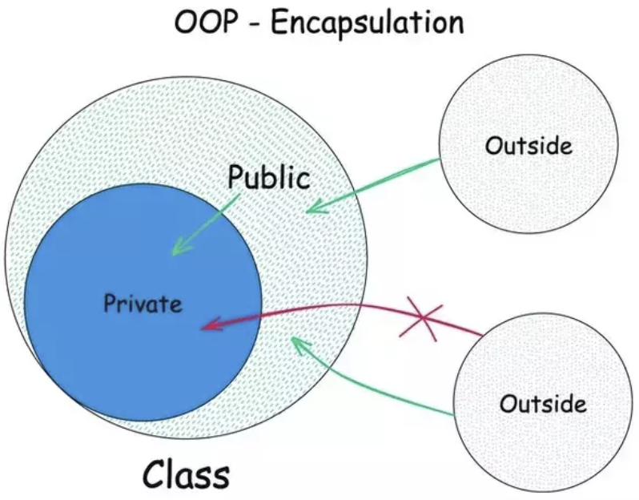

<!-- _class: cover -->

<div class="middle">

# <!-- fit --> Lập trình hướng đối tượng với C++

## Chương 1: Giới thiệu OOP

</div>

### Giảng viên: Nguyễn Văn A

---

<!-- _class: toc -->

# Nội dung

- Class & Object.
- Encapsulation & Abstraction.
- Constructor & Destructor.
- Operator Overloading.

---

<!-- _class: section -->

# Class & Object

---

# Khái niệm cơ bản

<div class="columns">
<div>

- **Lớp (Class)**: Là một khuôn mẫu (blueprint) cho đối tượng. Không tồn tại trong bộ nhớ.
- **Đối tượng (Object)**: Là một thể hiện (instance) cụ thể của lớp, chiếm bộ nhớ.
- **Thành phần dữ liệu (Data Members) và Hàm thành viên (Member Functions)**: Thuộc tính và hành vi của đối tượng.
- **Phạm vi truy cập (Access Specifiers)**: public, private, protected để đóng gói dữ liệu.

</div>
<div>



</div>
</div>

---

# Cú pháp khai báo

- **Cú pháp khai báo class**: Một Class trong C++ bao gồm **Thuộc tính** (Dữ liệu) và **Phương thức** (Hàm xử lý).
<gap style="--size: 10px;"></gap>
<div class="columns">
<div class="col-2">

```cpp
class SinhVien {
    // 1. Thuộc tính (Attributes)
    private:
        string hoTen;
        int maSo;
        float diemTB;

    // 2. Phương thức (Methods)
    public:
        void nhapThongTin() {
            // Code nhập liệu...
        }

        void xuatThongTin() {
            cout << "Ten: " << hoTen << endl;
        }
}; // Lưu ý dấu chấm phẩy ở cuối
```

</div>
<div>

### Lưu ý quan trọng:

- Từ khóa `class` định nghĩa kiểu dữ liệu mới.
- Mặc định thành viên trong class là `private` (bảo mật).

</div>
</div>

---

<!-- _class: text-xs-->

# Khởi tạo & Sử dụng

- **Khởi tạo object**: Sau khi có "Khuôn" (Class), ta tạo ra "Vật thể" (Object) trong hàm `main`.

```cpp
int main() {
    // 1. Khởi tạo đối tượng
    SinhVien sv1;
    SinhVien sv2;

    // 2. Truy cập thành viên (Toán tử .)
    sv1.hoTen = "Nguyen Van A"; // LỖI nếu hoTen là private!

    // Đúng: Gọi qua hàm public
    sv1.nhapThongTin();
    sv1.xuatThongTin();

    return 0;
}
```

- **Cơ chế đóng gói (Encapsulation):**
  - **Private:** Chỉ truy cập được từ bên trong Class (Bảo vệ dữ liệu).
  - **Public:** Có thể truy cập từ bên ngoài (Giao diện sử dụng).
  - $\rightarrow$ **Nguyên tắc:** Ẩn dữ liệu, lộ phương thức.

---

<!--_class: text-xs-->

# So sánh C và C++

- Một số khác biệt giữa C và C++:

| Đặc điểm            | Ngôn ngữ C                                | Ngôn ngữ C++                                      |
| ------------------- | ----------------------------------------- | ------------------------------------------------- |
| **Kiểu lập trình**  | Hướng thủ tục (Procedural)                | Đa mô hình (Hướng đối tượng & Thủ tục)            |
| **Hướng đối tượng** | Không hỗ trợ (Class, Object, v.v.)        | Hỗ trợ đầy đủ (Class, Inheritance, Polymorphism)  |
| **Quản lý bộ nhớ**  | Thủ công (`malloc`, `calloc`, `free`)     | Cấp cao (`new`, `delete`) & RAII                  |
| **Nạp chồng**       | Không hỗ trợ nạp chồng hàm                | Hỗ trợ nạp chồng hàm và toán tử                   |
| **Tính an toàn**    | Ít an toàn hơn (con trỏ dễ gây lỗi)       | An toàn hơn nhờ hệ thống kiểu dữ liệu nghiêm ngặt |
| **Thư viện**        | Hạn chế (chủ yếu là các hàm C tiêu chuẩn) | Phong phú (Standard Template Library - STL)       |
