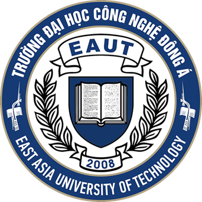

TRƯỜNG ĐẠI HỌC CÔNG NGHỆ ĐÔNG Á

KHOA CÔNG NGHỆ THÔNG TIN

BÀI TẬP LỚN

HỌC PHẦN: XỬ LÝ ẢNH & THỊ GIÁC MÁY TÍNH

MÃ ĐỀ THI:....

TÊN ĐỀ TÀI:....

LỚP TÍN CHỈ:....

Giảng viên hướng dẫn: Th.S Nguyễn Phồn Lữa

Danh sách sinh viên thực hiện: Nhóm…..

<table class="member">

<tr>
    <th>TT</th>
    <th>Mã sinh viên</th>
    <th>Sinh viên thực hiện</th>
    <th>Lớp hành chính</th>
</tr>

<tr>
    <td>1</td>
    <td></td>
    <td></td>
    <td></td>
</tr>

<tr>
    <td>2</td>
    <td></td>
    <td></td>
    <td></td>
</tr>

<tr>
    <td>3</td>
    <td></td>
    <td></td>
    <td></td>
</tr>

<tr>
    <td>4</td>
    <td></td>
    <td></td>
    <td></td>
</tr>

<tr>
    <td>5</td>
    <td></td>
    <td></td>
    <td></td>
</tr>

</table>

Bắc Ninh - 2026

