<!-- _class: cover -->

<div class="middle">

# XỬ LÝ ẢNH & THỊ GIÁC MÁY TÍNH

## Chương 1: Giới thiệu tổng quan

</div>

### Giảng viên: Nguyễn Phồn Lữa

---

<!-- _class: toc -->

# Nội dung

- Giới thiệu học phần
- Tổng quan về xử lý ảnh & TGMT
- Khái niệm nền tảng
- Công cụ toán học cơ bản
- Công cụ xử lý ảnh trong Python

---

<!-- _class: section -->

# Giới thiệu học phần

---

# Giới thiệu học phần

- **Tên học phần:** Xử lý ảnh và Thị giác máy tính
- **Giảng viên:** Nguyễn Phồn Lữa
  - Email: luanp@eaut.edu.vn
  - Điện thoại: 0902624295
- **Số tín chỉ:** 3 TC (2 Lý thuyết, 1 Thực hành) ~ 15 buổi lên lớp. Thời gian tự học: 75 giờ.
- **Mục tiêu học phần:**
  - Nắm vững kiến thức nền tảng và cơ bản về xử lý ảnh và thị giác máy tính.
  - Ứng dụng giải quyết các bài toán thực tế trong xử lý ảnh và thị giác máy tính.
- **Hình thức đánh giá:**
  - Chuyên cần: 10%
  - Quá trình (Kiểm tra giữa kỳ): 30%
  - Thi cuối kỳ (Bài tập lớn): 60%

---

# Phương pháp đánh giá

- **Điểm chuyên cần (10%):**
  - Mỗi sinh viên có 10 điểm chăm chỉ ban đầu.
  - Công thức tính: $10 - (x + 2y + 2z - 2t)$
  - $x$: Số buổi đi muộn (muộn quá 5 phút sau khi điểm danh).
  - $y$: Số buổi nghỉ không có lý do.
  - $z$: Số lần vi phạm ý thức học tập (nội quy, điểm danh hộ, không làm bài tập).
  - $t$: Số lần xung phong phát biểu, hỗ trợ bạn bè trong học tập.
- **Điểm quá trình (30%):** Đánh giá qua các bài kiểm tra giữa kỳ (tự luận/thực hành) và kết quả làm bài tập hàng ngày.
- **Điểm cuối kỳ (60%):** Đánh giá qua Bài tập lớn (BTL).
  - Hình thức báo cáo: 10%
  - Nội dung báo cáo: 50%
  - Vấn đáp: 40%

---

# Nội quy lớp học

- Tham gia đầy đủ các buổi học lý thuyết và thực hành.
- Đi học đúng giờ, không đi muộn quá 5 phút sau khi điểm danh.
- Nghỉ học phải có lý do chính đáng và xin phép giảng viên trước.
- Tuân thủ tuyệt đối các quy định về thi cử, kiểm tra, không gian lận dưới mọi hình thức.
- Tích cực tham gia phát biểu xây dựng bài, hỗ trợ bạn bè trong quá trình học tập.
- Tôn trọng giảng viên và các bạn trong lớp, giữ gìn trật tự và vệ sinh chung.

---

# Bài tập lớn

- **Mục đích:** Sử dụng để đánh giá kết quả học tập giữa kỳ và cuối kỳ.
- **Hình thức tổ chức:**
  - Chia lớp thành các nhóm từ 3 - 5 sinh viên.
  - Các nhóm tự chọn đề tài, đảm bảo không trùng lặp đề tài giữa các nhóm.
- **Yêu cầu thực hiện:**
  - Hoàn thành đề tài đáp ứng đúng yêu cầu kỹ thuật và nội dung.
  - Viết báo cáo theo mẫu quy định và nộp trên hệ thống e-learning.
- **Đánh giá BTL:**
  - Hình thức báo cáo: 10%
  - Nội dung báo cáo: 50%
  - Vấn đáp: 40%

---

# Nội dung học phần

- **Chương 1:** Tổng quan về xử lý ảnh và thị giác máy tính
- **Chương 2:** Biến đổi ảnh
- **Chương 3:** Nén ảnh
- **Chương 4:** Phát hiện biên & phân vùng ảnh
- **Chương 5:** Thị giác máy tính (Computer Vision)

---

<!-- _class: section -->

# TỔNG QUAN VỀ XỬ LÝ ẢNH

---

# Khái niệm cơ bản về xử lý ảnh số

- **Định nghĩa ảnh:** Là một hàm hai chiều $f(x, y)$, trong đó $x$ và $y$ là tọa độ không gian. Biên độ của $f$ tại $(x, y)$ được gọi là cường độ (intensity) hoặc mức xám (gray level).
- **Ảnh số (Digital Image):** Là ảnh khi $x$, $y$ và các giá trị cường độ của $f$ đều là các đại lượng hữu hạn và rời rạc.
- **Pixel (Picture Element):** Các phần tử cơ bản cấu tạo nên ảnh số. Mỗi pixel có một vị trí xác định và một giá trị cường độ cụ thể.
- **Tầm nhìn của con người vs. Máy móc:**
  - Con người chỉ nhìn thấy dải ánh sáng khả kiến của phổ điện từ (EM).
  - Máy móc có thể xử lý ảnh từ toàn bộ phổ EM (từ tia gamma đến sóng vô tuyến) và các nguồn năng lượng khác (siêu âm, kính hiển vi điện tử, ảnh tổng hợp).

---

# Phân cấp trong xử lý ảnh

Không có ranh giới tuyệt đối, nhưng thường được chia thành 3 mức độ:

- **Mức thấp (Low-level):**
  - Đầu vào là ảnh, đầu ra cũng là ảnh.
  - Ví dụ: Giảm nhiễu, tăng cường độ tương phản, làm sắc nét ảnh.
- **Mức trung bình (Mid-level):**
  - Đầu vào là ảnh, đầu ra là các thuộc tính trích xuất từ ảnh.
  - Ví dụ: Phân vùng ảnh (segmentation), mô tả đối tượng, nhận dạng đối tượng.
- **Mức cao (High-level):**
  - "Hiểu" tập hợp các đối tượng đã nhận dạng, thực hiện các chức năng nhận thức giống thị giác con người.
  - Thuộc về lĩnh vực Thị giác máy tính (Computer Vision) và Trí tuệ nhân tạo (AI).

---

# Lịch sử hình thành xử lý ảnh số

<div class="columns">
<div class="col-5">

- **Thập niên 1920:** Ứng dụng sớm nhất trong ngành báo chí. Hệ truyền ảnh qua cáp Bartlane (London - New York) giúp giảm thời gian truyền ảnh từ >1 tuần xuống <3 giờ (chưa sử dụng máy tính số).
- **Thập niên 1960:** Đánh dấu sự ra đời của máy tính số đủ mạnh và chương trình không gian.
  - Mốc quan trọng: Năm 1964, Phòng thí nghiệm Sức đẩy Phản lực (JPL) xử lý ảnh mặt trăng từ tàu Ranger 7 để hiệu chỉnh biến dạng.
- **Thập niên 1970:** Ứng dụng đột phá trong y tế.
  - Phát minh ra chụp cắt lớp vi tính (CT scan) bởi Sir Godfrey N. Hounsfield và Allan M. Cormack (Giải Nobel Y học 1979).

</div>
<div class ="col-2">
<br/>

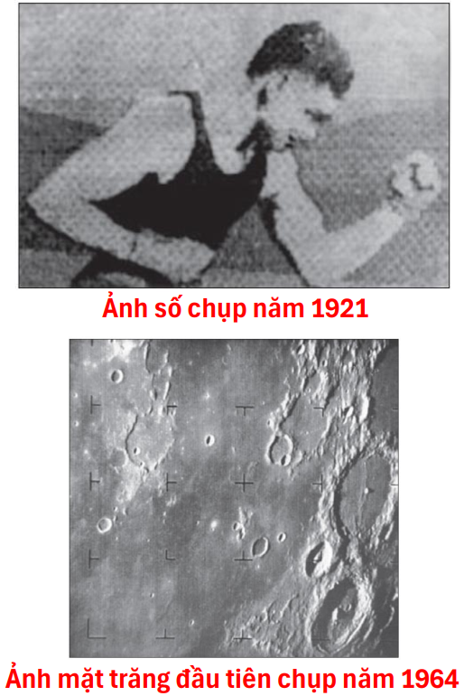

</div>
</div>


---

# Các lĩnh vực ứng dụng (Dựa trên phổ điện từ)

- **Ảnh tia Gamma:** Y học hạt nhân (PET scan, quét xương), thiên văn học (vụ nổ sao).
- **Ảnh tia X:** Chẩn đoán y tế (chụp X-quang), kiểm tra công nghiệp, thiên văn học.
- **Ảnh tia cực tím (UV):** Kính hiển vi huỳnh quang, thiên văn học.

<div class="columns">
<div class="col-2">

- **Ảnh vùng Khả kiến & Hồng ngoại (IR):**
  - Kính hiển vi quang học.
  - Viễn thám (vệ tinh LANDSAT, dự báo thời tiết).
  - Kiểm tra tự động trong công nghiệp (phát hiện lỗi, đếm sản phẩm).
  - An ninh (nhận dạng vân tay, biển số xe).

</div>
<div>

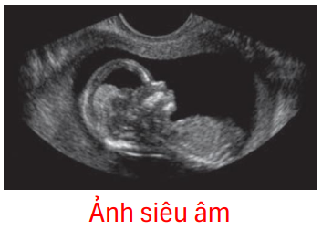

</div>
</div>
<div class="columns">
<div>

- **Các nguồn khác:** Ảnh siêu âm (y tế), ảnh kính hiển vi điện tử.

</div>
<div class="col-2">

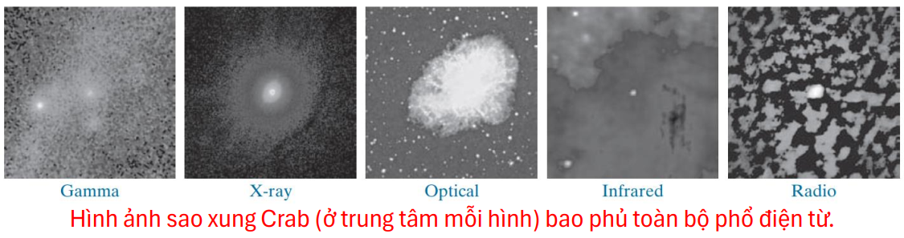

</div>
</div>

---

# Quy trình xử lý ảnh số (1)

<div class="columns">
<div class="col-5">

1. **Thu nhận ảnh (Image Acquisition):** Tiền xử lý như thay đổi kích thước, chuyển đổi định dạng.
2. **Tăng cường ảnh (Image Enhancement):** Làm ảnh phù hợp hơn cho ứng dụng cụ thể (mang tính chủ quan). Ví dụ: làm sáng ảnh tối.
3. **Khôi phục ảnh (Image Restoration):** Cải thiện chất lượng ảnh dựa trên mô hình toán học/xác suất của sự suy giảm (mang tính khách quan).
4. **Xử lý ảnh màu (Color Image Processing):** Trích xuất đặc trưng, phân vùng dựa trên màu sắc.

</div>
<div class="col-4">
<br/>

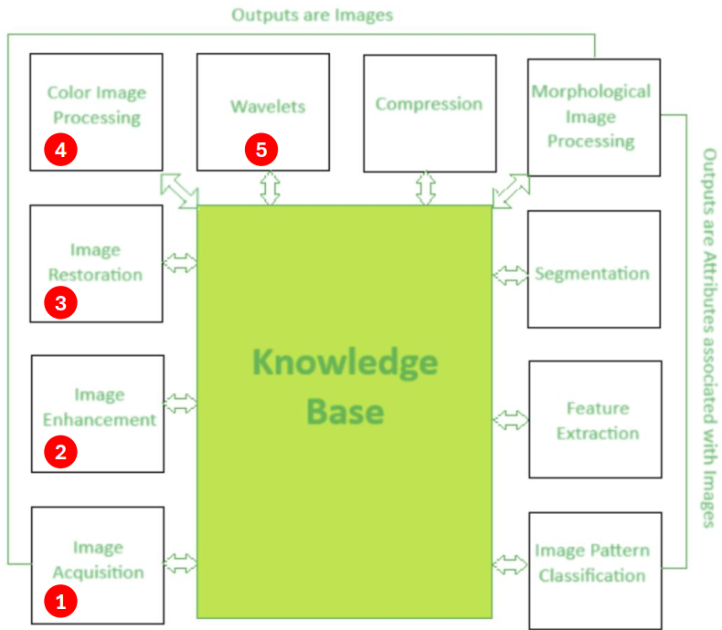

</div>
</div>

5. **Wavelets & Đa phân giải:** Nén dữ liệu và biểu diễn ảnh ở các độ phân giải khác nhau.

---
<!--_class: text-sm-->

# Quy trình xử lý ảnh số (2)

<div class="columns">
<div class="col-5">

6. **Nén ảnh (Compression):** Giảm dung lượng lưu trữ và băng thông truyền tải (Ví dụ: JPEG, PNG).
7. **Xử lý hình thái học (Morphological Processing):** Trích xuất các thành phần ảnh hữu ích cho biểu diễn và mô tả hình dạng (dựa trên lý thuyết tập hợp).
8. **Phân vùng ảnh (Segmentation):** Chia ảnh thành các phần hoặc đối tượng cấu thành. Đây là bước khó nhất và quan trọng nhất để nhận dạng tự động.
9. **Trích xuất đặc trưng (Feature Extraction):** Phát hiện và mô tả định lượng các đặc trưng của đối tượng (ví dụ: góc, cạnh, hướng, diện tích).

</div>
<div class="col-4">
<br/>

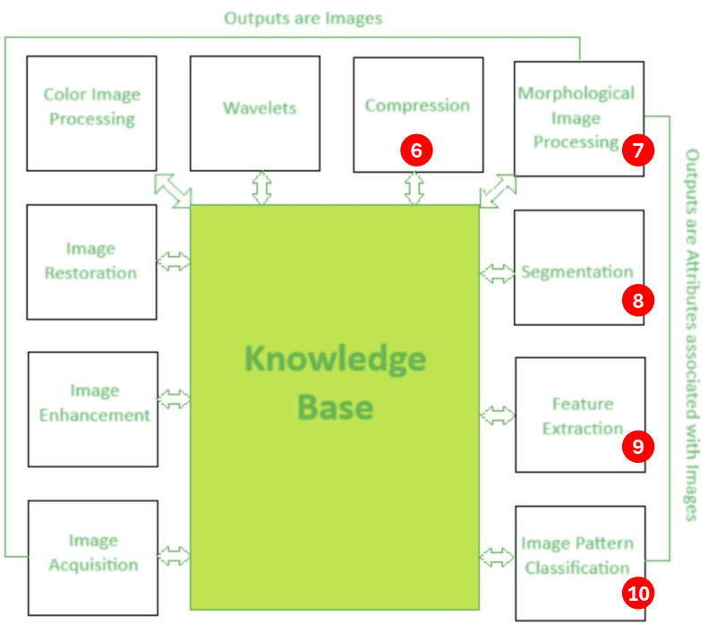
</div>
</div>

10. **Phân loại mẫu ảnh (Image Pattern Classification):** Gán nhãn cho đối tượng dựa trên các đặc trưng đã trích xuất.

---
<!--_class: text-sm-->

# Các thành phần của hệ thống xử lý ảnh

<div class="columns">
<div class="col-5">

1. **Cảm biến ảnh & Bộ số hóa:** Chuyển đổi năng lượng vật lý thành tín hiệu điện và sau đó thành dữ liệu số.
2. **Phần cứng chuyên dụng:** ALU (xử lý song song tốc độ cao), GPU (tính toán ma trận, deep learning), Frame buffers.
3. **Máy tính:** Từ PC cá nhân đến các siêu máy tính phục vụ xử lý dữ liệu lớn.
4. **Phần mềm:** Các module chuyên biệt (Ví dụ: MATLAB Image Processing Toolbox, OpenCV).
5. **Lưu trữ lớn:** Ngắn hạn (RAM), Trực tuyến (Ổ cứng/SSD), Dài hạn (Băng từ, Cloud).
6. **Hiển thị ảnh:** Màn hình màu, thiết bị in ấn (laser, film).


</div>
<div class="col-3">

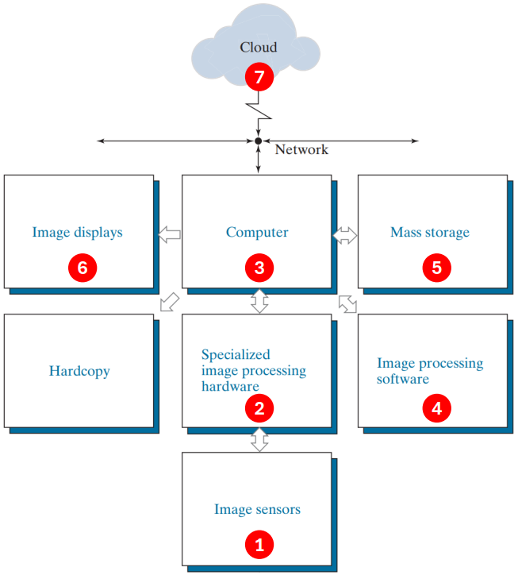

</div>
</div>

7. **Mạng & Điện toán đám mây:** Truyền tải dữ liệu ảnh (yêu cầu băng thông lớn, nén ảnh là bắt buộc).
---

<!-- _class: section -->

# KHÁI NIỆM NỀN TẢNG

---

# Thị giác con người và ánh sáng

<div class="columns">
<div class="col-4">

- **Cấu tạo mắt người:**
  - **Giác mạc (Cornea):** Mô trong suốt, bảo vệ bề mặt trước của mắt.
  - **Màng cứng (Sclera):** Màng đục bao bọc phần còn lại của mắt.
  - **Màng mạch (Choroid):** Chứa mạch máu, giảm tán xạ ánh sáng.
  - **Mống mắt (Iris):** Điều chỉnh lượng ánh sáng vào mắt thông qua đồng tử (2-8mm).
  - **Thủy tinh thể (Lens):** Hội tụ ánh sáng lên võng mạc.
  

</div>
<div class="col-2">

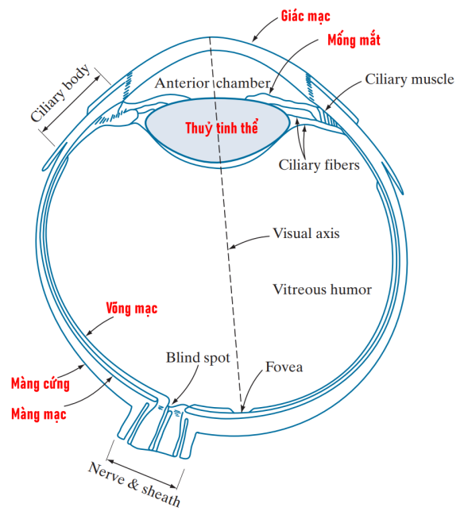

</div>
</div>

- **Võng mạc (Retina):** Chứa thụ thể ánh sáng:
    - **Tế bào hình nón (Cones):** Nhìn màu, chi tiết cao, hoạt động tốt ở ánh sáng mạnh.
    - **Tế bào hình que (Rods):** Nhìn sáng yếu, không phân biệt màu sắc.

---

# Sự thích nghi và phân biệt độ sáng

<div class="columns">
<div class="col-3">

- **Thích nghi độ sáng:** Mắt người có thể thích nghi với dải cường độ ánh sáng rất rộng (~$10^{10}$), nhưng không thể hoạt động trên toàn bộ dải này cùng một lúc.
- **Tỷ lệ Weber (Weber Ratio):** $\Delta I_c / I$. Giá trị càng nhỏ thì khả năng phân biệt độ sáng càng tốt. Khả năng này kém ở vùng ánh sáng yếu (do tế bào que) và tốt ở vùng ánh sáng mạnh (do tế bào nón).
- **Hiện tượng quang học:**
  - **Vạch Mach (Mach bands):** Mắt có xu hướng tăng/giảm cường độ cảm nhận ở ranh giới giữa các vùng có cường độ khác nhau.

</div>
<div>

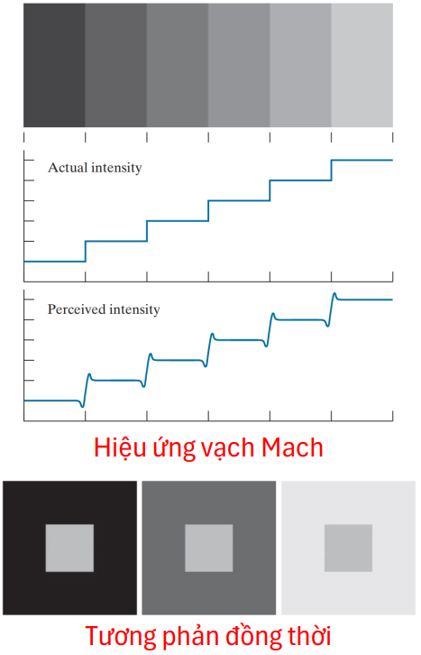

</div>
</div>
<ul>

- **Tương phản đồng thời:** Độ sáng cảm nhận của một vùng phụ thuộc vào nền xung quanh nó.

</ul>

---

# Ánh sáng và phổ điện từ

- **Phổ điện từ (EM):** Bao gồm sóng vô tuyến, vi sóng, hồng ngoại, ánh sáng khả kiến, tử ngoại, tia X, tia gamma.

<div class="columns">
<div class="col-5">

- **Công thức cơ bản:**
  - Bước sóng ($\lambda$) và Tần số ($\nu$): $\lambda \nu = c$ (với $c \approx 3 \times 10^8$ m/s).
  - Năng lượng photon: $E = h\nu$.
- **Ánh sáng khả kiến:** Khoảng từ ~0.43 $\mu m$ (tím) đến ~0.79 $\mu m$ (đỏ).

</div>
<div  class="col-5">

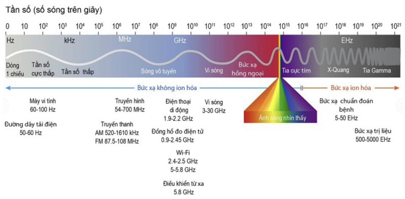

</div>
</div>

- **Thuật ngữ:**
  - **Đơn sắc (Monochromatic):** Chỉ có cường độ (mức xám).
  - **Đa sắc (Chromatic):** Có 3 đặc tính: Bức xạ (Radiance - tổng năng lượng), Độ chói (Luminance - năng lượng cảm nhận được), Độ sáng (Brightness - mô tả chủ quan).

---

# Mô hình thu nhận ảnh

<div class="columns">
<div>

- **Nguyên lý:** Dựa trên nguồn chiếu sáng và sự phản xạ/hấp thụ của vật thể.
- **3 phương pháp cảm biến chính:**
  1. **Phần tử cảm biến đơn (Single sensor):** Cần chuyển động cơ học theo 2 chiều (x, y) để quét. Ví dụ: Máy quét phim.
  2. **Dải cảm biến (Sensor strip):** Cảm biến 1 chiều, chuyển động cơ học 1 chiều. Ví dụ: Máy scan phẳng, chụp ảnh hàng không, CT scan.

</div>
<div>

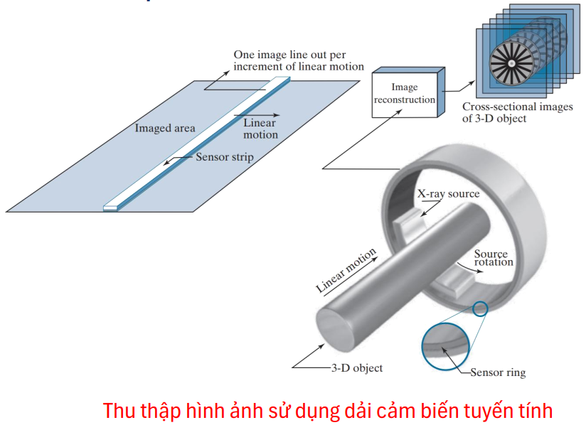

</div>
</div>
<ul>

  3. **Mảng cảm biến (Sensor array):** Mảng 2D (ví dụ: CCD, CMOS trong camera kỹ thuật số). Không cần chuyển động cơ học, thu nhận ảnh toàn phần ngay lập tức.

</ul>

---

# Mô hình hình thành ảnh đơn giản

<div class="columns">
<div class="col-2">

- **Hàm ảnh 2D:** $f(x, y) = i(x, y) \times r(x, y)$
  - $i(x, y)$: Thành phần chiếu sáng (Illumination) - $0 \le i(x, y) < \infty$.
  - $r(x, y)$: Thành phần phản xạ (Reflectance) - $0 \le r(x, y) \le 1$.

</div>
<div class="col-3">

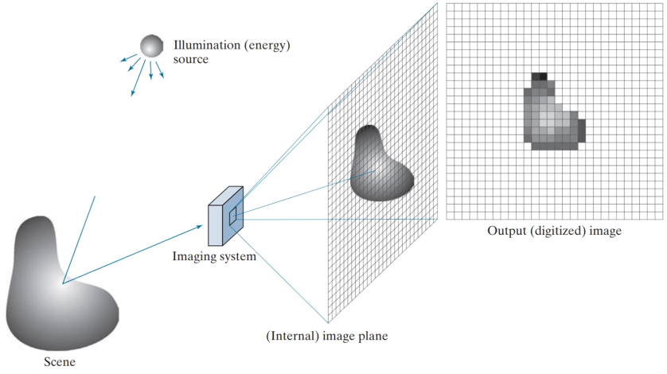

</div>
</div>

- **Ví dụ thực tế:**
  - Ánh sáng văn phòng: ~1000 lm/m².
  - Phản xạ của tuyết: ~0.93 (gần như phản xạ toàn phần).
  - Phản xạ của vải nhung đen: ~0.01 (hấp thụ hầu hết ánh sáng).

---

# Lấy mẫu và lượng tử hóa

<div class="columns">
<div class="col-3">

- **Lấy mẫu (Sampling):** Quá trình số hóa tọa độ không gian (x, y). Bước này quyết định độ phân giải không gian (Spatial Resolution) của ảnh.
- **Lượng tử hóa (Quantization):** Quá trình số hóa biên độ cường độ sáng. Bước này quyết định độ phân giải cường độ (Intensity Resolution).
- **Biểu diễn ảnh số:** Dưới dạng ma trận kích thước $M \times N$.
  - Tọa độ $(x, y)$ với $x \in [0, M-1]$, $y \in [0, N-1]$.
  - Gốc tọa độ (0,0) thường ở góc trên bên trái.

</div>
<div class="col-2">

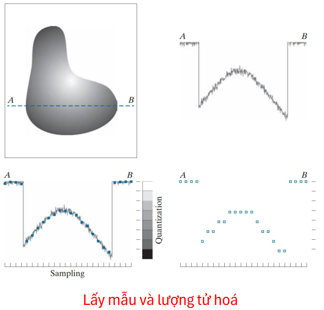

</div>
</div>

- **Số bit lưu trữ:** $b = M \times N \times k$ (với $L = 2^k$ là số mức xám).

---

# Độ phân giải và nội suy

- **Độ phân giải không gian:** Số cặp đường (line pairs) trên một đơn vị khoảng cách, hoặc số điểm ảnh trên mỗi inch (dpi).
- **Độ phân giải cường độ:** Số bit dùng để lượng tử hóa mức xám (thường là 8-bit = 256 mức xám).
- **Nhiễu vân giả (False contouring):** Xuất hiện khi số mức xám quá thấp (thường $\le$ 16 mức) ở các vùng chuyển màu mượt mà, tạo ra các đường viền giả.
- **Nội suy ảnh (Interpolation):** Ước lượng giá trị mới của ảnh tại những vị trí không có điểm ảnh gốc (dùng khi thay đổi kích thước, xoay ảnh).
  - **Láng giềng gần nhất (Nearest Neighbor):** Nhanh, nhưng gây răng cưa.
  - **Tuyến tính kép (Bilinear):** Mượt hơn, sử dụng 4 láng giềng.
  - **Bicubic:** Mượt nhất, giữ chi tiết tốt, sử dụng 16 láng giềng (chuẩn trong Photoshop).

---

# Láng giềng của một điểm ảnh

- Điểm ảnh $p$ tại tọa độ $(x, y)$ có các tập láng giềng:
- **4-láng giềng ($N_4(p)$):** $(x+1, y), (x-1, y), (x, y+1), (x, y-1)$.
- **Láng giềng chéo ($N_D(p)$):** $(x+1, y+1), (x+1, y-1), (x-1, y+1), (x-1, y-1)$.
- **8-láng giềng ($N_8(p)$):** $N_4(p) \cup N_D(p)$.

<div style="margin-top: 20px">

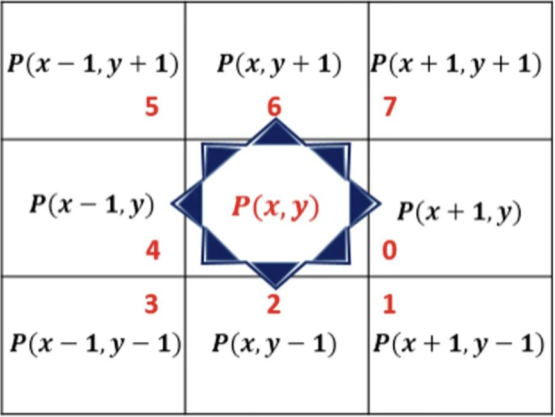

</div>

---

# Tính kề và liên thông

- **Tập giá trị cường độ V:** Ví dụ $V = \{1\}$ cho ảnh nhị phân.
- **4-kề nhau:** $q \in N_4(p)$ và $p, q \in V$.
- **8-kề nhau:** $q \in N_8(p)$ và $p, q \in V$. (Có thể gây mơ hồ về đường đi).
- **m-kề nhau (Mixed adjacency):** $q \in N_4(p)$ hoặc $q \in N_D(p)$ và $N_4(p) \cap N_4(q)$ không chứa điểm nào có giá trị thuộc $V$. $\rightarrow$ Loại bỏ sự mơ hồ của 8-kề nhau.
- **Đường đi (Path):** Dãy các điểm kề nhau. Độ dài đường đi là số bước.

<div style="margin-top:20px">

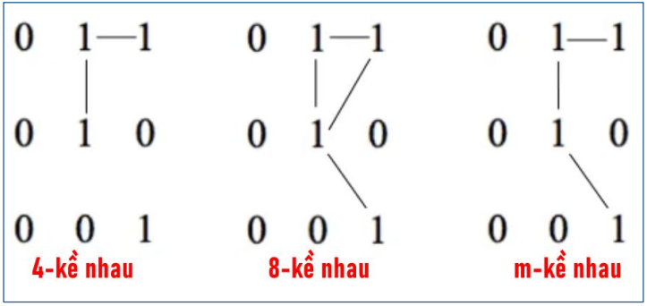

</div>

---

# Vùng, biên và khoảng cách

- **Vùng (Region):** Tập hợp các điểm liên thông.
- **Biên (Boundary):** Tập hợp các điểm trong vùng có ít nhất một láng giềng thuộc phần bù (background) của vùng đó.
- **Các độ đo khoảng cách D:** Thỏa mãn $D \ge 0$, $D(p,q) = D(q,p)$, $D(p,q) \le D(p,z) + D(z,q)$.
  - **Khoảng cách Euclidean ($D_e$):** $\sqrt{(x-u)^2 + (y-v)^2}$ (Hình tròn).
  - **Khoảng cách City-block ($D_4$):** $|x-u| + |y-v|$ (Hình thoi).
  - **Khoảng cách Chessboard ($D_8$):** $\max(|x-u|, |y-v|)$ (Hình vuông).
  - **Khoảng cách $D_m$:** Độ dài ngắn nhất của đường đi m-kề nhau.
- **Bài tập thực hành:** Tính 3 loại khoảng cách trên giữa điểm $p(2, 3)$ và $q(5, 7)$.
- **Lời giải:**
  - Euclidean: $\sqrt{(5-2)^2 + (7-3)^2} = 5$
  - City-block: $|5-2| + |7-3| = 7$
  - Chessboard: $\max(|5-2|, |7-3|) = 4$

---

<!-- _class: section -->

# CÔNG CỤ TOÁN HỌC CƠ BẢN

---

# Phép toán trên ảnh

<div class="columns">
<div class="col-2">

- **Phép toán theo phần tử (Elementwise):** Cộng, trừ, nhân, chia từng cặp điểm ảnh tương ứng.
  - **Cộng ảnh (Averaging):** Giảm nhiễu. Trung bình $k$ ảnh nhiễu $\rightarrow$ phương sai nhiễu giảm $k$ lần.
  - **Trừ ảnh (Subtraction):** Phát hiện thay đổi, trừ nền.
  - **Nhân/Chia ảnh:** Hiệu chỉnh độ sáng không đều (Shading correction), tạo mặt nạ vùng quan tâm (ROI Masking).
- **Phép toán Logic:** AND, OR, NOT, XOR (chủ yếu dùng cho ảnh nhị phân/mask).
- **Ví dụ ứng dụng:** Trung bình nhiều ảnh bị nhiễu Gaussian sẽ giúp khử nhiễu hiệu quả, ảnh càng rõ nét khi số lượng ảnh càng lớn.

</div>
<div>

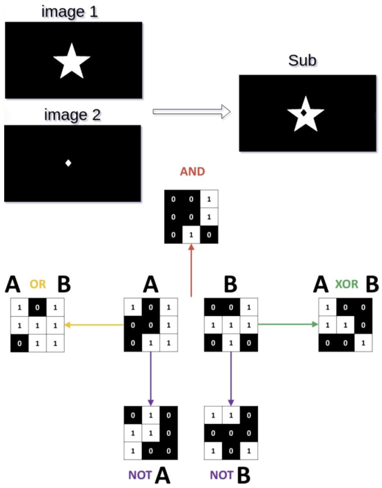

</div>
</div>

---

# Ví dụ ứng dụng phép toán trên ảnh

<div class="columns">
<div class="col-2">

- Hình ảnh của cặp thiên hà NGC 3314 bị nhiễu Gaussian cộng thêm.
- Các hình (b)-(f) là kết quả trung bình của 5, 10, 20, 50 và 1.000 hình ảnh bị nhiễu, tương ứng.

</div>
<div class="col-5">

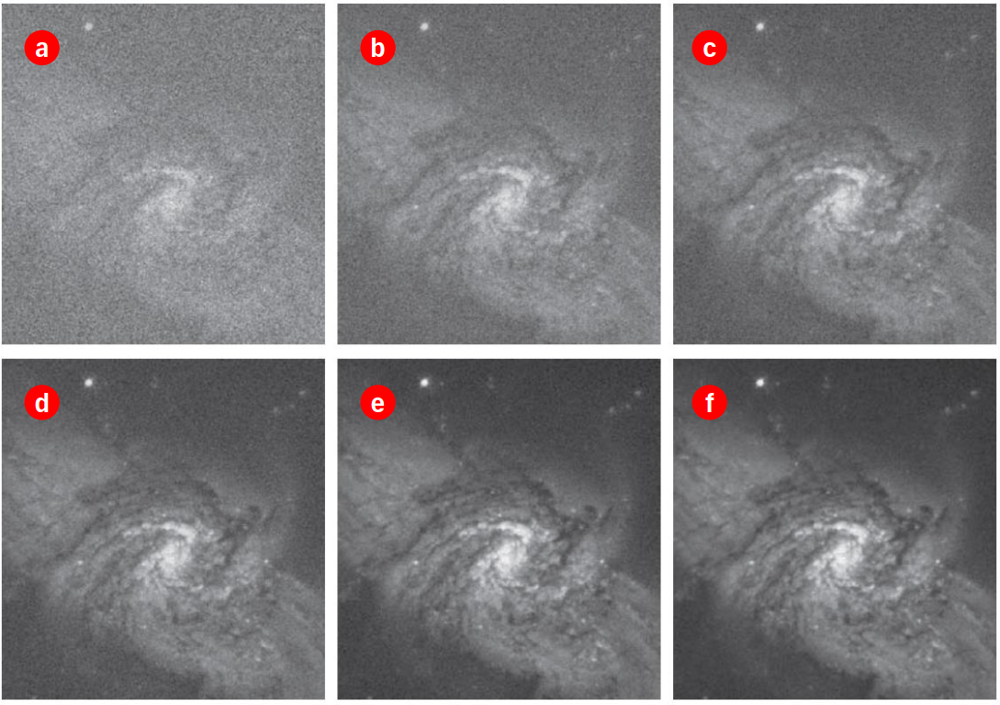

</div>
</div>


---

# Phép toán không gian

- Là các phép toán biến đổi tác động trực tiếp lên giá trị điểm ảnh trong miền không gian: $g(x, y) = T[f(x, y)]$.
- **Đơn điểm ảnh (Single-pixel):** Biến đổi cường độ $s = T(z)$. Ví dụ: tạo ảnh âm bản.
- **Láng giềng (Neighborhood):** Giá trị điểm ảnh đầu ra phụ thuộc vào một vùng lân cận của ảnh đầu vào. Ví dụ: làm mờ cục bộ (local averaging).
- **Biến đổi hình học (Geometric Transformations):**
  - Biến đổi tọa độ (Affine): Tỷ lệ, Tịnh tiến, Quay, Trượt.
  - Nội suy cường độ cho tọa độ mới (Nearest, Bilinear, Bicubic).
- **Đăng ký ảnh (Image Registration):** Căn chỉnh 2 ảnh bằng cách tìm các điểm mốc (tie points/control points) và ước lượng ma trận biến đổi.

---

# Biến đổi ảnh & thống kê cường độ

- **Biến đổi ảnh (Image Transforms):** Chuyển từ miền không gian sang miền biến đổi (ví dụ: miền tần số Fourier), xử lý, rồi biến đổi ngược.
  - Công thức tổng quát: $T(u, v) = \sum\sum f(x, y) r(x, y, u, v)$.
- **Cường độ ảnh là biến ngẫu nhiên:**
  - Xác suất xuất hiện mức xám $z_k$: $p(z_k) = n_k / MN$ (Cơ sở của Histogram).
  - **Trung bình (Mean):** $m = \sum z_k p(z_k)$ (Đo độ sáng trung bình).
  - **Phương sai (Variance):** $\sigma^2 = \sum (z_k - m)^2 p(z_k)$ (Đo độ tương phản của ảnh).

---

<!-- _class: section -->

# CÔNG CỤ XỬ LÝ ẢNH TRONG PYTHON

---

# Tổng quan về xử lý ảnh trong Python

- Python là ngôn ngữ phổ biến nhất cho xử lý ảnh và Computer Vision nhờ cú pháp đơn giản và hệ sinh thái thư viện phong phú.
- Ảnh được biểu diễn như mảng NumPy đa chiều.
- **Các thư viện hỗ trợ chính:**
  - **OpenCV:** Computer Vision real-time, mạnh mẽ.
  - **Pillow/PIL:** Hiển thị và thao tác cơ bản, thân thiện.
  - **scikit-image:** Thuật toán học thuật, dễ sử dụng cho nghiên cứu.
  - **mahotas:** Xử lý nhanh, tập trung vào hình thái học (morphology).

---

# OpenCV- Open Computer Vision Library

<div class="columns">
<div class="col-2">

- **OpenCV** là thư viện xử lý ảnh và Computer Vision mã nguồn mở hàng đầu.
- **Mục đích:** Phục vụ các ứng dụng Computer Vision thời gian thực (real-time).
- **Lịch sử:** Được phát triển bởi Intel, hiện duy trì bởi Open Source Vision Foundation.
- **Quy mô:** Chứa hơn 2500 thuật toán tối ưu.
- **Hỗ trợ đa ngôn ngữ:** Python, C++, C, Java, MATLAB.
- **Đa nền tảng:** Chạy trên Windows, Linux, macOS, Android, iOS.

</div>
<div>


</div>
</div>

---

# Đặc điểm nổi bật của OpenCV

- **Hiệu suất cao:** Được viết bằng C/C++, tối ưu hóa cho tốc độ xử lý thời gian thực.
- **Đa năng:** Bao phủ từ các tác vụ xử lý ảnh cơ bản đến các thuật toán AI, Deep Learning phức tạp.
- **Cộng đồng lớn:** Tài liệu phong phú, cộng đồng người dùng đông đảo, dễ dàng tìm kiếm sự hỗ trợ.
- **Tích hợp dễ dàng:** Dễ dàng kết hợp với NumPy, SciPy, Matplotlib trong Python.
- **Mã nguồn mở:** Miễn phí cho cả mục đích học tập và thương mại.

---

# OpenCV- chức năng cơ bản

- **Đọc/ghi ảnh:**
  - `cv2.imread()`: Đọc ảnh từ file.
  - `cv2.imwrite()`: Ghi ảnh ra file.
- **Hiển thị:**
  - `cv2.imshow()`: Hiển thị ảnh trong cửa sổ.
  - `cv2.waitKey()`: Chờ phím bấm để đóng cửa sổ.
- **Thao tác cơ bản:**
  - `cv2.resize()`: Thay đổi kích thước ảnh.
  - `cv2.flip()`: Lật ảnh ngang/dọc.
  - `cv2.rotate()`: Xoay ảnh 90/180/270 độ.
  - `cv2.cvtColor()`: Chuyển đổi không gian màu (RGB sang Gray, HSV...).
- **Vẽ hình học:** `cv2.line()`, `cv2.rectangle()`, `cv2.circle()`.

---

# OpenCV- Image Filtering& Enhancement

- **Làm mờ & Giảm nhiễu:**
  - `cv2.blur()`: Làm mờ trung bình.
  - `cv2.medianBlur()`: Giảm nhiễu muối tiêu (salt-and-pepper).
  - `cv2.bilateralFilter()`: Làm mờ nhưng vẫn bảo toàn biên.
- **Phát hiện biên:** `cv2.Canny()`.
- **Phân ngưỡng (Thresholding):**
  - `cv2.threshold()`: Nhị phân hóa ảnh.
  - `cv2.adaptiveThreshold()`: Nhị phân hóa thích nghi với điều kiện sáng.
- **Hình thái học (Morphology):** `cv2.erode()`, `cv2.dilate()`.
- **Đường viền (Contours):** `cv2.findContours()`, `cv2.drawContours()`.

---

# OpenCV- Computer Vision Advanced

- **Phát hiện khuôn mặt:** `cv2.CascadeClassifier()` (Sử dụng Haar Cascade).
- **Phát hiện đối tượng & Đặc trưng:** HOG, SIFT, SURF, ORB.
- **Theo dõi đối tượng (Tracking):** Feature matching, Background subtraction.
- **Hiệu chỉnh phối cảnh (Perspective correction).**
- **Suy luận mạng nơ-ron (Neural network inference):** `dnn.readNet()` để chạy các mô hình AI.
- **Ứng dụng:** Phân loại ảnh, theo dõi chuyển động, nhận dạng đối tượng phức tạp.

---

# Pillow(PIL Fork)

- **Pillow** là bản fork hiện đại của PIL (Python Imaging Library).
- **Mục tiêu:** Hiển thị và thao tác ảnh cơ bản, tập trung vào tính thân thiện với người dùng.
- **Đặc điểm:**
  - Dễ sử dụng, cú pháp trực quan.
  - Hỗ trợ nhiều định dạng: Animated GIFs, JPEG2000, WebP.
  - Không gian màu mặc định: RGB.
- **Ứng dụng:** Xử lý ảnh cho web, các tác vụ chỉnh sửa đơn giản.
- **Lưu ý:** Hiệu suất chậm hơn OpenCV, không phù hợp cho các tác vụ thời gian thực hoặc xử lý video.

---

# scikit-image

- **Mục tiêu:** Thư viện thuật toán xử lý ảnh dành cho khoa học và nghiên cứu, ưu tiên tính dễ sử dụng và dễ hiểu.
- **Đặc điểm:**
  - Chức năng mở rộng, bao phủ nhiều thuật toán học thuật.
  - Không gian màu: RGB.
  - Kiểu dữ liệu mặc định: float (giá trị từ 0 đến 1).
- **Ứng dụng:** Nghiên cứu, giáo dục, phân tích ảnh y tế, khoa học.
- **Bao gồm:** Phát hiện biên, trích xuất đặc trưng, khôi phục ảnh, phân vùng.

---

# mahotas

- **Mục tiêu:** Thư viện xử lý ảnh tốc độ cao, được xây dựng bằng C++.
- **Tập trung:** Các phép toán hình thái học (Morphology operations) và xử lý ảnh cơ bản.
- **Đặc điểm:**
  - Mã nguồn đơn giản, tài liệu tốt.
  - Hiệu suất nhanh nhất trong các hàm xử lý cơ bản.
- **Ứng dụng:** Xử lý ảnh sinh học, phân tích ảnh hiển vi, các tác vụ yêu cầu tốc độ cao.
- **Lưu ý:** Ít chức năng mở rộng hơn so với scikit-image.

---

# NumPy- hỗ trợ xử lý ảnh

- **Nền tảng:** NumPy là cốt lõi cho mọi thư viện xử lý ảnh trong Python (OpenCV, scikit-image đều dùng NumPy array).
- **Biểu diễn ảnh:** Ảnh được biểu diễn như mảng đa chiều (2D cho ảnh xám, 3D cho ảnh màu).
- **Hỗ trợ toán học:** Cung cấp nhiều hàm toán học tối ưu cho các phép toán trên pixel.
- **Yêu cầu:** Bắt buộc phải cài đặt khi làm việc với OpenCV (NumPy + SciPy).
- **Thao tác phổ biến:**
  - Slice arrays để crop (cắt) ảnh.
  - Create masks cho các phép toán masked operations.
  - Biến đổi ma trận ảnh nhanh chóng.

---

# Cài đặt môi trường thực hành

<div class="columns">
<div class="col-2">

- Phần mềm cần cài đặt:
  - Python 3.11+
  - VSCode
  - pip/pipenv
- VSCode extensions:
  - Python (Microsoft)
  - Jupyter (Microsoft)

</div>
<div  class="col-2">

- Python packages:
  - numpy
  - opencv-python
  - matplotlib
  - scikit-image
  - pillow
  - ipykernel

</div>
<div class="col-3">

- Tổ chức dự án

```text
projects/
│
├── images/           # Ảnh đầu vào
├── output/           # Kết quả xử lý
├── notebooks/        # Jupyter Notebook
├── src/              # Mã nguồn Python
└── requirements.txt  # Danh sách thư viện
```

</div>
</div>

- Cài đặt thư viện
```bash
pipenv shell
pipenv install numpy opencv-python matplotlib scikit-image pillow ipykernel
```