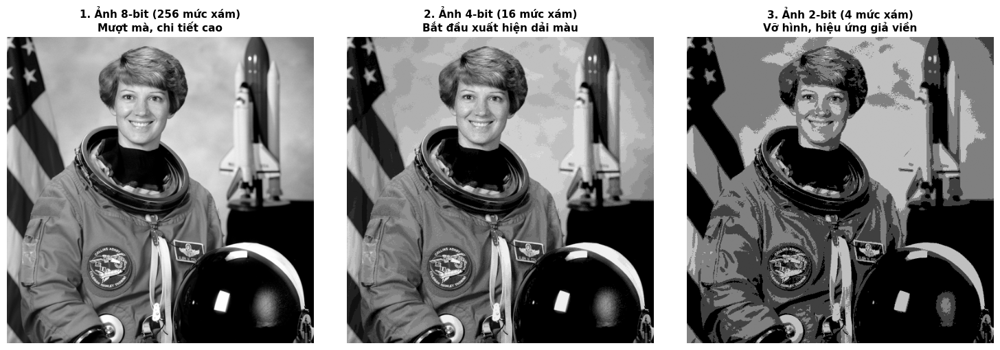
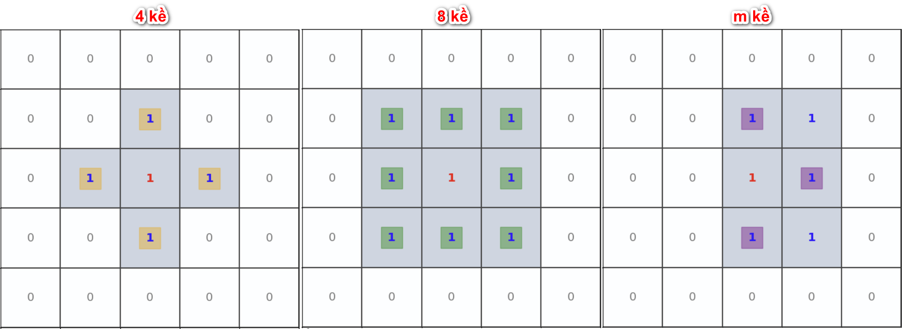
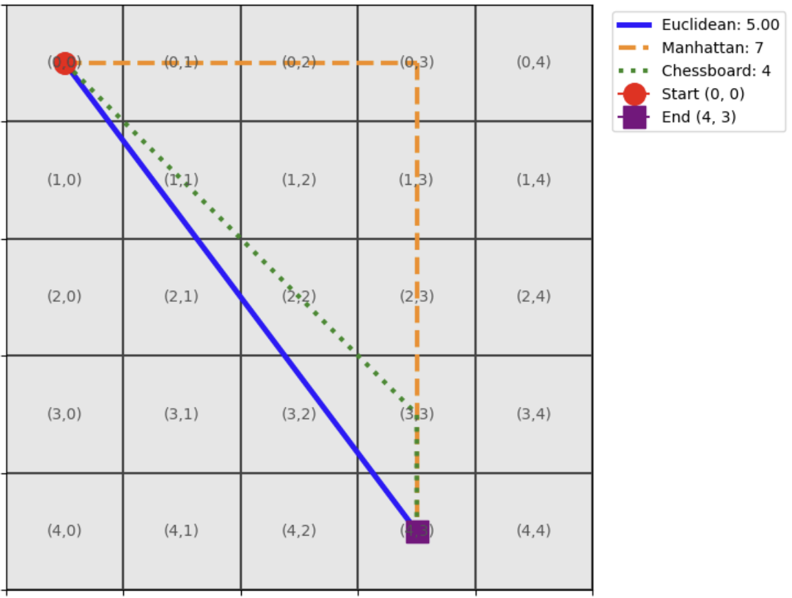
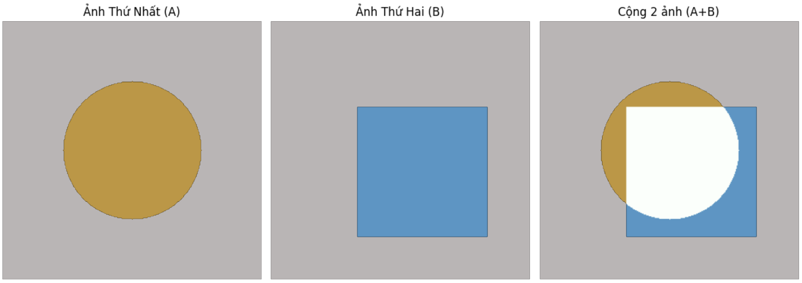
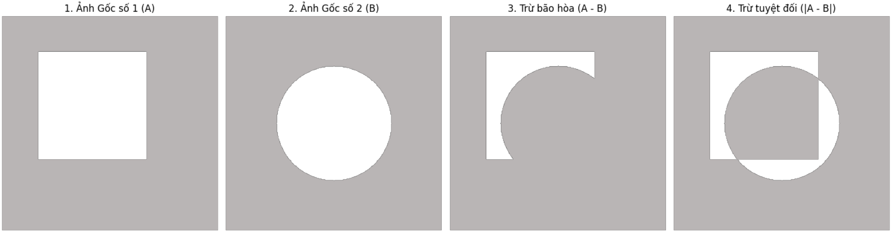
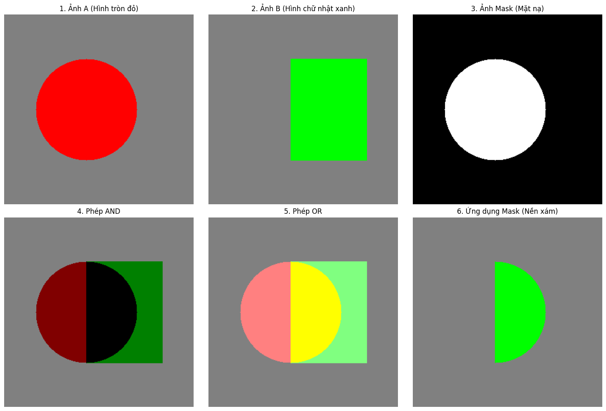
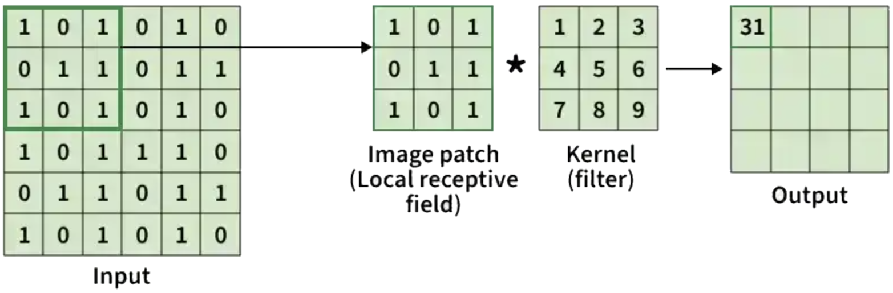
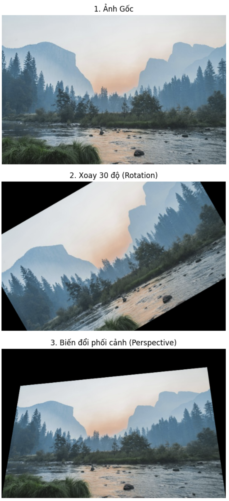
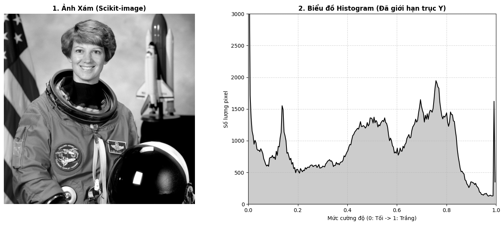

<!-- _class: cover -->

<div class="middle">

# XỬ LÝ ẢNH & THỊ GIÁC MÁY TÍNH

## Chương 1: Giới thiệu tổng quan

</div>

### Giảng viên: Nguyễn Phồn Lữa

---

<!-- _class: toc -->

# Nội dung

1. Giới thiệu học phần
2. Tổng quan về xử lý ảnh & TGMT
3. Từ thế giới thực đến ảnh số
4. Biểu diễn ảnh và các quan hệ trong ảnh
5. Các phép toán cơ bản trên ảnh
6. Công cụ xử lý ảnh trong Python

---

<!-- _class: section -->

# Giới thiệu học phần

---

# Giới thiệu học phần

- **Tên học phần:** Xử lý ảnh và Thị giác máy tính
- **Giảng viên:** Nguyễn Phồn Lữa
  - Email: luanp@eaut.edu.vn
  - Điện thoại: 0902624295
- **Số tín chỉ:** 3 TC (2 Lý thuyết, 1 Thực hành) ~ 15 buổi lên lớp. Thời gian tự học: 75 giờ.
- **Mục tiêu học phần:**
  - Nắm vững kiến thức nền tảng và cơ bản về xử lý ảnh và thị giác máy tính.
  - Ứng dụng giải quyết các bài toán thực tế trong xử lý ảnh và thị giác máy tính.
- **Hình thức đánh giá:**
  - Chuyên cần: 10%
  - Quá trình (Kiểm tra giữa kỳ): 30%
  - Thi cuối kỳ (Bài tập lớn): 60%

---

# Phương pháp đánh giá

- **Điểm chuyên cần (10%):**
  - Mỗi sinh viên có 10 điểm chăm chỉ ban đầu.
  - Công thức tính: $10 - (x + 2y + 2z - 2t)$
  - $x$: Số buổi đi muộn (muộn quá 5 phút sau khi điểm danh).
  - $y$: Số buổi nghỉ không có lý do.
  - $z$: Số lần vi phạm ý thức học tập (nội quy, điểm danh hộ, không làm bài tập).
  - $t$: Số lần xung phong phát biểu, hỗ trợ bạn bè trong học tập.
- **Điểm quá trình (30%):** Đánh giá qua các bài kiểm tra giữa kỳ (tự luận/thực hành) và kết quả làm bài tập hàng ngày.
- **Điểm cuối kỳ (60%):** Đánh giá qua Bài tập lớn (BTL).
  - Hình thức báo cáo: 10%
  - Nội dung báo cáo: 50%
  - Vấn đáp: 40%

---

# Nội quy lớp học

- Tham gia đầy đủ các buổi học lý thuyết và thực hành.
- Đi học đúng giờ, không đi muộn quá 5 phút sau khi điểm danh.
- Nghỉ học phải có lý do chính đáng và xin phép giảng viên trước.
- Tuân thủ tuyệt đối các quy định về thi cử, kiểm tra, không gian lận dưới mọi hình thức.
- Tích cực tham gia phát biểu xây dựng bài, hỗ trợ bạn bè trong quá trình học tập.
- Tôn trọng giảng viên và các bạn trong lớp, giữ gìn trật tự và vệ sinh chung.

---

# Bài tập lớn

- **Mục đích:** Sử dụng để đánh giá kết quả học tập giữa kỳ và cuối kỳ.
- **Hình thức tổ chức:**
  - Chia lớp thành các nhóm từ 3 - 5 sinh viên.
  - Các nhóm tự chọn đề tài, đảm bảo không trùng lặp đề tài giữa các nhóm.
- **Yêu cầu thực hiện:**
  - Hoàn thành đề tài đáp ứng đúng yêu cầu kỹ thuật và nội dung.
  - Viết báo cáo theo mẫu quy định và nộp trên hệ thống e-learning.
- **Đánh giá BTL:**
  - Hình thức báo cáo: 10%
  - Nội dung báo cáo: 50%
  - Vấn đáp: 40%

---

# Nội dung học phần

- **Chương 1:** Tổng quan về xử lý ảnh và thị giác máy tính
- **Chương 2:** Biến đổi ảnh
- **Chương 3:** Nén ảnh
- **Chương 4:** Phát hiện biên & phân vùng ảnh
- **Chương 5:** Thị giác máy tính (Computer Vision)

---

<!-- _class: section -->

# TỔNG QUAN VỀ XỬ LÝ ẢNH & TGMT

---

# TỪ THẾ GIỚI THỰC ĐẾN MÁY TÍNH

- **Con người nhìn thấy:** Người, xe, nhà, cây, chữ, khuôn mặt – những đối tượng có ý nghĩa.

<div class="columns">
<div class="col-2">

- **Máy tính không "nhìn" ảnh theo cách con người nhìn.** Máy tính chỉ nhận được dữ liệu số biểu diễn năng lượng ánh sáng hoặc các dạng tín hiệu khác.
- **Ví dụ:** Khi bạn chụp một bức ảnh con mèo, mắt bạn nhận ra ngay "con mèo", nhưng máy tính chỉ thấy một ma trận các con số biểu diễn cường độ sáng tại từng vị trí.

</div>
<div class="col-3">

<gap></gap>


</div>
</div>

---

# KHÁI NIỆM ẢNH SỐ

- **Ảnh**: Một cách mô hình hóa ảnh mức xám: $f(x,y)$, trong đó:
  - $(x, y)$: tọa độ không gian
  - $f(x,y)$: cường độ tại vị trí $(x,y)$
  - **Có thể hiểu đơn giản:** Ảnh là một hàm mô tả cường độ tại mỗi vị trí trong không gian.
- **Ảnh số**

<div class="columns">
<div>
<ul>

- Ảnh số là ảnh mà:
  - Tọa độ không gian được số hóa
  - Giá trị cường độ được số hóa
  - Các giá trị chỉ nhận một tập hữu hạn các giá trị rời rạc
</ul>
</div>
<div>

**Biểu diễn bằng ma trận:**

$$f(x,y) \rightarrow \begin{bmatrix} f(0,0) & f(0,1) & \cdots \\ f(1,0) & f(1,1) & \cdots \\ \vdots & \vdots & \ddots \end{bmatrix}$$

</div>
</div>
<ul>

- **Ví dụ:** Một ảnh 640×480 sẽ được biểu diễn bằng ma trận có 480 hàng và 640 cột.

</ul>

---

# PIXEL – PHẦN TỬ ẢNH

**Pixel** (viết tắt của *Picture Element*) là phần tử cơ bản cấu tạo nên ảnh số.

Mỗi pixel có:


<div class="columns">
<div class="col-2">


- Một vị trí (tọa độ)
- Một giá trị (cường độ sáng hoặc màu sắc)

**Ví dụ ảnh mức xám:**

```
┌────┬────┬────┬────┐
│  12│  30│  45│  70│
├────┼────┼────┼────┤
│  18│  42│  80│ 100│
├────┼────┼────┼────┤
│  25│  60│ 110│ 150│
└────┴────┴────┴────┘
```

</div>
<div class="col-3">


</div>
</div>

- Giá trị càng lớn thì pixel càng sáng. Pixel có giá trị 150 sẽ sáng hơn pixel có giá trị 12.

---

# ẢNH XÁM VÀ ẢNH MÀU

**Ảnh mức xám:**

- Mỗi pixel có một giá trị duy nhất: $0 \leq f(x,y) \leq 255$ (với ảnh 8-bit)
- 0 → đen, 255 → trắng
- **Ví dụ:** Một bức ảnh chân dung đen trắng

**Ảnh màu:**

- Mỗi pixel được biểu diễn bởi nhiều thành phần màu
- **Ví dụ RGB:** $Pixel = (R, G, B)$
- Mỗi kênh R, G, B thường có giá trị từ 0 đến 255
- **Ví dụ:** Pixel $(255, 0, 0)$ là màu đỏ thuần, $(0, 255, 0)$ là màu xanh lá thuần

---

# Ảnh dựa trên phổ điện từ

- **Ảnh tia Gamma:** Y học hạt nhân (PET scan, quét xương), thiên văn học (vụ nổ sao).
- **Ảnh tia X:** Chẩn đoán y tế (chụp X-quang), kiểm tra công nghiệp, thiên văn học.
- **Ảnh tia cực tím (UV):** Kính hiển vi huỳnh quang, thiên văn học.

<div class="columns">
<div class="col-2">

- **Ảnh vùng Khả kiến & Hồng ngoại (IR):**
  - Kính hiển vi quang học.
  - Viễn thám (vệ tinh LANDSAT, dự báo thời tiết).
  - Kiểm tra tự động trong công nghiệp (phát hiện lỗi, đếm sản phẩm).
  - An ninh (nhận dạng vân tay, biển số xe).

</div>
<div>


</div>
</div>
<div class="columns">
<div>

- **Các nguồn khác:** Ảnh siêu âm (y tế), ảnh kính hiển vi điện tử.

</div>
<div class="col-2">


</div>
</div>

---

# IMAGE PROCESSING

**Image Processing – Xử lý ảnh** là tập hợp các phương pháp dùng để:

- Biến đổi ảnh
- Cải thiện chất lượng ảnh
- Khôi phục ảnh
- Trích xuất thông tin từ ảnh

**Ví dụ:**

- Ảnh tối → Tăng độ sáng → Ảnh sáng hơn
- Ảnh nhiễu → Lọc nhiễu → Ảnh ít nhiễu hơn

**Bản chất:** Đầu vào là ảnh, đầu ra cũng là ảnh (hoặc tập hợp các đặc trưng từ ảnh).


---

# COMPUTER VISION

**Computer Vision – Thị giác máy tính** là lĩnh vực nghiên cứu cách máy tính thu nhận, xử lý, phân tích và suy luận thông tin từ hình ảnh hoặc video.

**Ví dụ:**

Camera → Image → Object Detection → Kết quả:

<div class="columns">
<div class="col-3">
<gap></gap>


</div>
<div class="col-2">

```
┌──────────────────┐
│ 2 người          │
│ 1 chiếc xe ô tô  │
│ 1 chiếc xe máy   │
└──────────────────┘
```

**Bản chất:** Đầu vào là ảnh, đầu ra là *thông tin có ý nghĩa* hoặc *quyết định*.
</div>
</div>


---

# IMAGE PROCESSING vs COMPUTER VISION

| Image Processing | Computer Vision |
| --- | --- |
| Biến đổi ảnh | Hiểu nội dung ảnh |
| Cải thiện ảnh | Nhận biết đối tượng |
| Lọc nhiễu | Phát hiện đối tượng |
| Tăng tương phản | Phân loại |
| Sharpening | Tracking |
| Geometric transform | Recognition |

- **Lưu ý:** Hai lĩnh vực không có ranh giới tuyệt đối. Computer Vision thường sử dụng nhiều kỹ thuật Image Processing làm nền tảng.

- **Ví dụ:** Trước khi nhận dạng khuôn mặt (CV), thường cần lọc nhiễu và chuẩn hóa ảnh (IP).

---

# BA MỨC ĐỘ XỬ LÝ

**Low-level (Mức thấp):**

- Input: ảnh → Output: ảnh
- **Ví dụ:** Denoising, Enhancement, Sharpening

**Mid-level (Mức trung bình):**

- Input: ảnh → Output: đặc trưng / cấu trúc
- **Ví dụ:** Segmentation, Edge detection, Feature extraction

**High-level (Mức cao):**

- Input: thông tin hình ảnh → Output: hiểu biết / quyết định
- **Ví dụ:** Object recognition, Scene understanding, Activity recognition

**Ví dụ minh họa:** Từ ảnh chụp đường phố (low-level) → phát hiện các xe và người (mid-level) → nhận ra "đang có tắc nghẽn giao thông" (high-level).

---

# PIPELINE TỔNG QUÁT

<div class="columns">
<div>

```
ẢNH / VIDEO / CAMERA
         │
         ▼
  Image Acquisition
         │
         ▼
   Pre-processing
         │
         ▼
Representation / Features
         │
         ▼
┌────────┼─────────┐
▼        ▼         ▼
Class. Detection Segmentation
└────────┼─────────┘
         ▼
  Interpretation
         │
         ▼
     Decision
```

</div>
<div class="col-2">


<gap></gap>

**Mục tiêu:** Biến dữ liệu hình ảnh thành thông tin hữu ích.

</div>
</div>

---

# ỨNG DỤNG

<div class="columns">
<div>

- **Y tế:** X-quang, CT, MRI, phân tích ảnh y tế
- **Công nghiệp:** Kiểm tra lỗi sản phẩm, đếm sản phẩm, đo kích thước
- **Giao thông:** Nhận dạng biển số, phát hiện phương tiện, giám sát giao thông
  - **Ví dụ:** Hệ thống camera giao thông sử dụng CV để tự động phát hiện xe vượt đèn đỏ và ghi lại biển số.
- **An ninh:** Nhận dạng khuôn mặt, theo dõi đối tượng

</div>
<div>


</div>
</div>

- **Viễn thám:** Ảnh vệ tinh, theo dõi môi trường, phân tích đất đai

---

# Lịch sử hình thành xử lý ảnh số

<div class="columns">
<div class="col-5">

- **Thập niên 1920:** Ứng dụng sớm nhất trong ngành báo chí. Hệ truyền ảnh qua cáp Bartlane (London - New York) giúp giảm thời gian truyền ảnh từ >1 tuần xuống <3 giờ (chưa sử dụng máy tính số).
- **Thập niên 1960:** Đánh dấu sự ra đời của máy tính số đủ mạnh và chương trình không gian.
  - Mốc quan trọng: Năm 1964, Phòng thí nghiệm Sức đẩy Phản lực (JPL) xử lý ảnh mặt trăng từ tàu Ranger 7 để hiệu chỉnh biến dạng.
- **Thập niên 1970:** Ứng dụng đột phá trong y tế.
  - Phát minh ra chụp cắt lớp vi tính (CT scan) bởi Sir Godfrey N. Hounsfield và Allan M. Cormack (Giải Nobel Y học 1979).

</div>
<div class ="col-2">
<br/>


</div>
</div>

---

<!-- _class: section -->

# Từ thế giới thực đến ảnh số

---

# THỊ GIÁC CON NGƯỜI

Mắt người là một hệ thống thu nhận và xử lý thông tin quang học phức tạp.

<div class="columns">
<div class="col-2">

**Một số thành phần chính:**

- **Cornea** (giác mạc): lớp ngoài cùng, bảo vệ mắt
- **Iris** (mống mắt): điều chỉnh lượng ánh sáng vào
- **Lens** (thủy tinh thể): hội tụ ánh sáng
- **Retina** (võng mạc): nơi tiếp nhận ánh sáng
- **Rods** (tế bào hình que): cảm nhận độ sáng, hoạt động tốt trong điều kiện thiếu sáng
- **Cones** (tế bào hình nón): cảm nhận màu sắc, hoạt động tốt trong điều kiện đủ sáng

</div>
<div>


</div>
</div>

**Ý nghĩa đối với Computer Vision:** Nghiên cứu thị giác người giúp chúng ta hiểu về ánh sáng, độ sáng, độ tương phản, màu sắc và nhận thức thị giác.

---

# ÁNH SÁNG VÀ ĐỘ SÁNG

Khả năng cảm nhận của mắt không đơn giản là: *"Giá trị pixel lớn → luôn cảm thấy sáng hơn."*

- **Nhận thức phụ thuộc vào:**

<div class="columns">
<div class="col-2">
<ul>

  - Cường độ ánh sáng
  - Nền xung quanh
  - Tương phản
  - Điều kiện quan sát

</ul>

- **Ví dụ:** Một vùng xám có cùng giá trị pixel có thể được cảm nhận khác nhau khi đặt trên nền sáng so với khi đặt trên nền tối. Đây là hiệu ứng *simultaneous contrast* – một hiện tượng quan trọng trong tâm lý học thị giác.

- **Vạch Mach (Mach bands):** Mắt có xu hướng tăng/giảm cường độ cảm nhận ở ranh giới giữa các vùng có cường độ khác nhau.

</div>
<div>


</div>
</div>

---

# Phổ điện từ
- **Phổ điện từ (EM)**: Bao gồm sóng vô tuyến, vi sóng, hồng ngoại, ánh sáng khả kiến, tử ngoại, tia X, tia gamma.
<div class="columns">
<div class="col-5">

- **Quan hệ tần số, bước sóng:** $c = \lambda \nu$. Trong đó:
  - $c$: tốc độ ánh sáng ($\approx 3 \times 10^8$ m/s)
  - $\lambda$: bước sóng
  - $\nu$: tần số

- **Năng lượng photon:** $E = h\nu$, với $h$ là hằng số Planck.

</div>
<div  class="col-5">


</div>
</div>

- **Ánh sáng khả kiến** có bước sóng chỉ nằm trong một khoảng hẹp của phổ điện từ (khoảng 380nm – 750nm).

---

# Thu nhận ảnh

Một hệ thống thu nhận ảnh có thể được mô hình hóa:

<div class="columns">
<div>

1. **Nguồn năng lượng** (ánh sáng, tia X, ...)
2. **Vật thể** (đối tượng cần chụp)
3. **Phản xạ / truyền qua** (tương tác giữa năng lượng và vật thể)
4. **Cảm biến** (thu nhận tín hiệu)

</div>
<div>

5. **Tín hiệu điện** (chuyển đổi từ năng lượng sang điện)
6. **Số hóa** (chuyển sang dạng số)
7. **Ảnh số** (kết quả cuối cùng)

</div>
</div>
<gap></gap>


---

# CẢM BIẾN ẢNH

<div class="columns">
<div>

Ba mô hình cảm biến cơ bản:

**1. Single sensor (cảm biến đơn):**

- Một cảm biến duy nhất
- Cần chuyển động để quét ảnh
- **Ví dụ:** Máy quét ảnh cũ

**2. Sensor strip (dải cảm biến):**

- Một dải cảm biến
- Cần chuyển động theo một chiều
- **Ví dụ:** Máy fax, máy scan dòng

**3. Sensor array (mảng cảm biến):**

- Mảng cảm biến 2D

</div>
<div>


</div>
</div>

- Thu nhận toàn bộ ảnh trong một lần chụp
- **Ví dụ:** CCD, CMOS trong máy ảnh kỹ thuật số, điện thoại

---

# MÔ HÌNH HÌNH THÀNH ẢNH

Một mô hình đơn giản:

$$f(x,y) = i(x,y) \cdot r(x,y)$$

Trong đó:

- $i(x,y)$: **Illumination** – thành phần chiếu sáng
- $r(x,y)$: **Reflectance** – thành phần phản xạ

**Ý nghĩa:** Độ sáng quan sát được phụ thuộc cả vào *nguồn sáng* và *đặc tính bề mặt vật thể*.

**Ví dụ:** Một tờ giấy trắng dưới ánh sáng yếu có thể trông xám, nhưng dưới ánh sáng mạnh sẽ trông trắng. Vật thể có hệ số phản xạ cao (như gương) sẽ sáng hơn vật thể có hệ số phản xạ thấp (như vải đen).

>Một hệ thống Computer Vision phải quan tâm đến điều kiện ánh sáng. Đây là lý do vì sao các thuật toán xử lý ảnh thường cần bước chuẩn hóa ánh sáng (illumination normalization) trước khi phân tích.

---

# TỪ ẢNH LIÊN TỤC ĐẾN ẢNH SỐ

Ảnh thực tế có thể được xem là tín hiệu liên tục. Để máy tính xử lý, cần **số hóa**:

```
Ảnh liên tục
     │
     ├──────────────┐
     ▼              ▼
 Sampling       Quantization
     │              │
     ▼              ▼
Tọa độ rời rạc   Mức cường độ rời rạc
     └──────────────┘
             │
             ▼
          Ảnh số
```

**Ví dụ:** Một bức ảnh chụp trên phim (liên tục) khi được quét sẽ trải qua quá trình lấy mẫu và lượng tử hóa để trở thành ảnh số.

---

# Lấy mẫu (SAMPLING)

**Sampling – Lấy mẫu** là quá trình số hóa tọa độ không gian.

**Nó quyết định:** Độ phân giải không gian của ảnh.

**Sampling nhiều:**

```
● ● ● ● ● ● ●
● ● ● ● ● ● ●
● ● ● ● ● ● ●
```

**Sampling ít:**

```
●     ●     ●
●     ●     ●
```

**Kết luận:** Sampling thấp → ít pixel → mất chi tiết không gian.

**Ví dụ:** Khi bạn phóng to một ảnh có độ phân giải thấp, bạn sẽ thấy các "ô vuông" – đó là do sampling không đủ dày.

---

# Lượng tử hoá (QUANTIZATION)

**Quantization – Lượng tử hóa** là quá trình số hóa biên độ cường độ.

**Ví dụ:**

- **Nhiều mức xám:** 0, 20, 40, 60, 80, 100, ..., 255
- **Ít mức xám:** 0, 85, 170, 255

**Kết luận:** Quantization thấp → ít mức cường độ → dễ xuất hiện **false contouring** (hiện tượng xuất hiện các đường viền giả do không đủ mức xám để thể hiện chuyển tiếp mượt).

**Ví dụ:** Khi giảm ảnh màu 24-bit xuống còn 8-bit (256 màu), bạn có thể thấy các vệt màu không tự nhiên trên bầu trời – đó là false contouring.

---

# SAMPLING vs QUANTIZATION

| | Sampling | Quantization |
| --- | --- | --- |
| Số hóa | Tọa độ | Cường độ |
| Ảnh hưởng | Spatial resolution | Intensity resolution |
| Quá thấp | Mất chi tiết không gian | Mất chi tiết mức xám |
| Liên quan | Số pixel | Số mức xám |

**Ghi nhớ:**

- **Sampling → Where?** (Vị trí nào được lấy mẫu?)
- **Quantization → How much?** (Cường độ được làm tròn đến mức nào?)

---

# ĐỘ PHÂN GIẢI

**Spatial Resolution (Độ phân giải không gian):**

- Khả năng biểu diễn chi tiết không gian
- Liên quan đến: kích thước ảnh, mật độ pixel, kích thước pixel
- **Ví dụ:** Ảnh 4K (3840×2160) có độ phân giải không gian cao hơn ảnh HD (1920×1080)

**Intensity Resolution (Độ phân giải cường độ):**

- Khả năng phân biệt các mức cường độ
- **Ví dụ:** Ảnh 8-bit có $L = 2^8 = 256$ mức xám

---

# BITS VÀ MỨC XÁM

Nếu sử dụng $k$ bit cho mỗi pixel:

<div class="columns">
<div>

$$L = 2^k$$

| Bit | Mức |
| --- | --- |
| 1-bit | 2 |
| 2-bit | 4 |
| 4-bit | 16 |
| 8-bit | 256 |
| 16-bit | 65,536 |

</div>
<div class="col-3">

<gap></gap>



</div>
</div>


**Ví dụ:** Ảnh 8-bit thường dùng trong các bài toán xử lý ảnh mức xám cơ bản vì cân bằng giữa chất lượng và dung lượng.

---

# NỘI SUY ẢNH

Khi thay đổi kích thước hoặc biến đổi hình học, ta thường cần ước lượng giá trị tại vị trí mới.

**Interpolation – Nội suy** có ba phương pháp phổ biến:

<div class="columns">
<div class="col-4">

**1. Nearest Neighbor (láng giềng gần nhất):**

- Nhanh, đơn giản
- Có thể tạo răng cưa
- **Ví dụ:** Phóng to ảnh pixel art

**2. Bilinear (tuyến tính kép):**

- Sử dụng các pixel lân cận
- Kết quả mượt hơn
- **Ví dụ:** Phóng to ảnh thông thường

</div>
<div class="col-5">

**3. Bicubic (bậc ba):**

- Sử dụng nhiều điểm lân cận hơn
- Kết quả thường mượt và giữ chi tiết tốt hơn
- **Ví dụ:** Phóng to ảnh chất lượng cao


</div>
</div>

---
<!--_class: section-->

# Biểu diễn ảnh và các quan hệ trong ảnh

---

# ẢNH NHƯ MỘT MA TRẬN

Một ảnh xám có thể biểu diễn:

$$I \in R^{M \times N}$$

**Ví dụ:**

```
        x →
      0   1   2   3
    ┌───┬───┬───┬───┐
 y 0│12 │30 │45 │70 │
 ↓  ├───┼───┼───┼───┤
   1│18 │42 │80 │100│
    ├───┼───┼───┼───┤
   2│25 │60 │110│150│
    └───┴───┴───┴───┘
```

**Ý nghĩa:** Đây là nền tảng để sử dụng **NumPy** trong Python. Mỗi ảnh được lưu dưới dạng mảng 2 chiều (hoặc 3 chiều với ảnh màu).

---

# Láng giềng của một điểm ảnh

- Điểm ảnh $p$ tại tọa độ $(x, y)$ có các tập láng giềng:
- **4-láng giềng ($N_4(p)$):** $(x+1, y), (x-1, y), (x, y+1), (x, y-1)$.
- **Láng giềng chéo ($N_D(p)$):** $(x+1, y+1), (x+1, y-1), (x-1, y+1), (x-1, y-1)$.
- **8-láng giềng ($N_8(p)$):** $N_4(p) \cup N_D(p)$.

<div style="margin-top: 20px">


</div>

---

# Tính kề và liên thông

- **Tập giá trị cường độ V:** Ví dụ $V = \{1\}$ cho ảnh nhị phân.
- **4-kề nhau:** $q \in N_4(p)$ và $p, q \in V$.
- **8-kề nhau:** $q \in N_8(p)$ và $p, q \in V$. (Có thể gây mơ hồ về đường đi).
- **m-kề nhau (Mixed adjacency):** $q \in N_4(p)$ hoặc $q \in N_D(p)$ và $N_4(p) \cap N_4(q)$ không chứa điểm nào có giá trị thuộc $V$. $\rightarrow$ Loại bỏ sự mơ hồ của 8-kề nhau.

<gap></gap>



---

# ĐƯỜNG ĐI VÀ VÙNG

- **Path – Đường đi:** Một chuỗi các pixel liên tiếp thỏa mãn điều kiện kề nhau.
- **Region – Vùng:** Một tập các pixel liên thông.
- **Boundary – Biên:** Tập các pixel thuộc vùng nhưng có ít nhất một láng giềng nằm ngoài vùng.
- **Ví dụ ứng dụng:** Khi phân vùng ảnh để tách nền và đối tượng, ta cần xác định vùng liên thông của đối tượng và biên của nó.
<gap></gap>


---

# KHOẢNG CÁCH GIỮA CÁC PIXEL

Hai điểm $p(x,y), q(s,t)$, ba khoảng cách phổ biến giữa 2 điểm:

<div class="columns">
<div>

- **Euclidean (khoảng cách Euclid):**

$$D_E(p,q) = \sqrt{(x-s)^2 + (y-t)^2}$$

- **City-block (khoảng cách Manhattan):**

$$D_4(p,q) = |x-s| + |y-t|$$

- **Chessboard (khoảng cách bàn cờ):**

$$D_8(p,q) = \max(|x-s|, |y-t|)$$

- **Ví dụ:** Từ $(0,0)$ đến $(3,4)$:
  - Euclidean: 5
  - City-block: 7
  - Chessboard: 4

</div>
<div>


</div>
</div>

- Cách định nghĩa khoảng cách phụ thuộc vào mô hình láng giềng và bài toán cần giải.


---
<!-- _class: section -->

# Các phép toán cơ bản trên ảnh

---

# CÁC PHÉP TOÁN TRÊN ẢNH

Vì ảnh có thể biểu diễn dưới dạng ma trận nên ta có thể thực hiện:

<div class="columns">
<div class="col-2">

- **Arithmetic (số học):**

  - Addition (cộng)
  - Subtraction (trừ)
  - Multiplication (nhân)
  - Division (chia)

- **Logical (logic):** AND, OR, NOT, XOR

</div>
<div class="col-3">


</div>
</div>

- **Lưu ý:** Các phép toán có thể thực hiện theo từng pixel – *element-wise*.
- **Ứng dụng:** Trung bình nhiều ảnh để giảm nhiễu.

---

# TRỪ ẢNH

Phép trừ ảnh có thể được sử dụng để phát hiện thay đổi:

```
Ảnh trước ─┐
           ├── Difference ──→ Vùng thay đổi
Ảnh sau  ──┘
```

<div class="columns">
<div>

**Một số ứng dụng:**

- Background subtraction (trừ nền)
- Change detection (phát hiện thay đổi)
- Phân tích chuyển động
- So sánh ảnh

</div>
<div>


</div>
</div>

**Ví dụ:** Camera giám sát trừ ảnh hiện tại với ảnh nền (background) để phát hiện người hoặc vật thể mới xuất hiện.

---

# PHÉP TOÁN LOGIC VÀ MASK

Ảnh nhị phân hoặc mask thường được sử dụng để xác định vùng quan tâm.

<div class="columns">
<div>

**Ví dụ:**

```
Image
  AND
Mask
  ↓
ROI
```

**ROI – Region of Interest (Vùng quan tâm):** Chỉ xử lý vùng cần thiết thay vì toàn bộ ảnh.

</div>
<div>


</div>
</div>

**Ví dụ:** Khi nhận dạng khuôn mặt, ta dùng mask để chỉ xử lý vùng khuôn mặt, bỏ qua nền và các vùng không liên quan.

---

# PHÉP TOÁN KHÔNG GIAN

Trong phép toán không gian, giá trị đầu ra có thể phụ thuộc vào một pixel hoặc một vùng lân cận của pixel.

**Single-pixel operation (toán tử đơn pixel):**

$$g(x,y) = T(f(x,y))$$

- **Ví dụ:** Negative (đảo màu), Brightness adjustment (điều chỉnh độ sáng), Threshold (ngưỡng hóa)

**Neighborhood operation (toán tử lân cận):**

Giá trị đầu ra phụ thuộc vào các pixel xung quanh.

- **Ví dụ:** Blur (làm mờ), Sharpening (làm sắc), Edge detection (phát hiện biên)

---

# TÍCH CHẬP (CONVOLUTION)

Một trong những công cụ quan trọng nhất của xử lý ảnh là **kernel / filter**.

<div class="columns">
<div class="col-2">

```
      Kernel
     ┌───┬───┬───┐
     │   │   │   │
     ├───┼───┼───┤
     │   │ X │   │
     ├───┼───┼───┤
     │   │   │   │
     └───┴───┴───┘
            │
            ▼
       tính tổng có trọng số
            │
            ▼
        pixel đầu ra
```

</div>
<div class="col-3">

**Biểu diễn toán học:**

$$g(x,y) = \sum_m \sum_n h(m,n) f(x-m, y-n)$$

Trong đó:

- $f$: ảnh đầu vào
- $h$: kernel
- $g$: ảnh đầu ra

<gap></gap>


</div>
</div>

---

# BIẾN ĐỔI HÌNH HỌC

Biến đổi hình học thay đổi vị trí của pixel.

<div class="columns">
<div class="col-2">

**Các phép biến đổi phổ biến:**

- **Translation** – Tịnh tiến
- **Rotation** – Xoay
- **Scaling** – Co giãn
- **Shearing** – Trượt
- **Perspective transformation** – Biến đổi phối cảnh

```
Ảnh gốc
   ↓
Geometric Transformation
   ↓
Ảnh mới
   ↓
Interpolation
```

</div>
<div>



</div>
</div>

**Ví dụ:** Khi xoay một bức ảnh 45 độ, các pixel mới sẽ được tính bằng nội suy từ các pixel gốc.

---
<!--_class: text-sm-->

# THỐNG KÊ CƯỜNG ĐỘ VÀ Histogram

- Cường độ pixel có thể được xem như một biến ngẫu nhiên, các giá trị thống kê thể hiện:

  - **Mean (giá trị trung bình):** $\mu = \frac{1}{N} \sum_{i=1}^{N} x_i$, cho biết mức cường độ trung bình của ảnh.

  - **Variance (phương sai):** $\sigma^2 = \frac{1}{N} \sum_{i=1}^{N} (x_i - \mu)^2$, cho biết mức độ phân tán của cường độ → liên quan đến độ tương phản.

  - **Ví dụ:** Ảnh có phương sai cao thường có độ tương phản tốt (sáng tối rõ ràng), ảnh có phương sai thấp thường trông mờ nhạt.

<div class="columns">
<div>

- **Histogram:** mô tả số lượng pixel tương ứng với từng mức cường độ.**Histogram** giúp phân tích:
  - Độ sáng
  - Độ tương phản
  - Phân bố cường độ

</div>
<div>



</div>
</div>

  - **Ví dụ:** Nếu histogram tập trung ở vùng tối (bên trái), ảnh bị thiếu sáng; nếu trải đều từ 0 đến 255, ảnh có độ tương phản tốt.


---
<!-- _class: section -->

# Công cụ xử lý ảnh trong Python

---

# HỆ SINH THÁI PYTHON

Python được sử dụng rộng rãi trong Image Processing và Computer Vision nhờ:

- Cú pháp đơn giản
- Hệ sinh thái thư viện phong phú
- Tích hợp tốt với Machine Learning / Deep Learning
- Hỗ trợ nghiên cứu và triển khai ứng dụng

**Các thư viện chính:**

```
                 Python
                    │
       ┌────────────┼────────────┐
       ▼            ▼            ▼
    NumPy        OpenCV      scikit-image
       │            │            │
       └────────────┼────────────┘
                    ▼
              Image Processing
```

---

# NUMPY – NỀN TẢNG DỮ LIỆU

NumPy cung cấp:

- Mảng đa chiều
- Phép toán vector / ma trận
- Các hàm toán học
- Boolean masking
- Slicing

**Biểu diễn ảnh:**

- Ảnh xám: $H \times W$
- Ảnh màu RGB: $H \times W \times 3$

**Ví dụ:**

```python
image.shape  # có thể cho: (480, 640, 3)
```

**Ý nghĩa:** NumPy là nền tảng để biểu diễn và thao tác với ảnh dưới dạng ma trận trong Python.

---

# OPENCV

**OpenCV – Open Source Computer Vision Library** là thư viện mã nguồn mở được sử dụng rộng rãi cho:

<div class="columns">
<div>

- Image Processing
- Computer Vision
- Video processing
- Real-time applications
- AI model inference

</div>
<div>

**Một số chức năng:**

- Đọc / ghi ảnh
- Resize / rotate / flip
- Color conversion
- Filtering, Edge detection
- Thresholding, Morphology
- Contours, Object detection
- Video processing

</div>
</div>


**Ví dụ:** OpenCV được sử dụng trong các hệ thống nhận dạng khuôn mặt thời gian thực trên điện thoại.

---

# OPENCV – CÁC HÀM CƠ BẢN

**Đọc / ghi:**

- `cv2.imread()`, `cv2.imwrite()`

**Biến đổi:**

- `cv2.resize()`, `cv2.flip()`, `cv2.rotate()`, `cv2.cvtColor()`

**Vẽ:**

- `cv2.line()`, `cv2.rectangle()`, `cv2.circle()`

**Hiển thị:**

- `cv2.imshow()`, `cv2.waitKey()`

**Ví dụ:**

```python
img = cv2.imread("photo.jpg")
gray = cv2.cvtColor(img, cv2.COLOR_BGR2GRAY)
cv2.imshow("Gray", gray)
cv2.waitKey(0)
```

---

# OPENCV – FILTERING & ENHANCEMENT

**Làm mờ / giảm nhiễu:**

- `cv2.blur()`, `cv2.medianBlur()`, `cv2.bilateralFilter()`

**Phát hiện biên:**

- `cv2.Canny()`

**Thresholding:**

- `cv2.threshold()`, `cv2.adaptiveThreshold()`

**Morphology:**

- `cv2.erode()`, `cv2.dilate()`

**Contours:**

- `cv2.findContours()`, `cv2.drawContours()`

**Ví dụ:** Sử dụng `cv2.medianBlur()` để loại bỏ nhiễu muối tiêu (salt-and-pepper noise) mà vẫn giữ được biên.

---

# CÁC THƯ VIỆN KHÁC

**Pillow:**

- Phù hợp với: đọc / ghi ảnh, chuyển đổi định dạng, các thao tác ảnh cơ bản
- Ứng dụng web và xử lý ảnh đơn giản

**scikit-image:**

- Phù hợp với: giáo dục, nghiên cứu, các thuật toán xử lý ảnh khoa học
- Segmentation, restoration, feature extraction...

**Mahotas:**

- Tập trung vào: image processing, morphology
- Một số thao tác xử lý ảnh hiệu năng cao

**Ví dụ:** scikit-image thường được dùng trong nghiên cứu vì có nhiều thuật toán tiên tiến và tài liệu tốt.

---

# NÊN DÙNG THƯ VIỆN NÀO?

| Thư viện | Điểm mạnh |
| --- | --- |
| NumPy | Ma trận và tính toán số |
| OpenCV | Image Processing & Computer Vision |
| Pillow | Thao tác ảnh cơ bản |
| scikit-image | Thuật toán nghiên cứu |
| Matplotlib | Hiển thị và trực quan hóa |

**Trong học phần:** NumPy + OpenCV + Matplotlib sẽ là bộ công cụ chính. Các thư viện khác được sử dụng khi phù hợp.
