<!-- _class: cover -->

<div class="middle">

# XỬ LÝ ẢNH & THỊ GIÁC MÁY TÍNH

## Chương 1: Giới thiệu tổng quan

</div>

### Giảng viên: Nguyễn Phồn Lữa

---

<!-- _class: toc -->

# Nội dung

- Giới thiệu học phần
- Tổng quan về xử lý ảnh & TGMT
- Khái niệm nền tảng
- Công cụ toán học cơ bản
- Công cụ xử lý ảnh trong Python

---

<!-- _class: section -->

# Giới thiệu học phần

---

# Giới thiệu học phần

- **Tên học phần:** Xử lý ảnh và Thị giác máy tính
- **Giảng viên:** Nguyễn Phồn Lữa
  - Email: luanp@eaut.edu.vn
  - Điện thoại: 0902624295
- **Số tín chỉ:** 3 TC (2 Lý thuyết, 1 Thực hành) ~ 15 buổi lên lớp. Thời gian tự học: 75 giờ.
- **Mục tiêu học phần:**
  - Nắm vững kiến thức nền tảng và cơ bản về xử lý ảnh và thị giác máy tính.
  - Ứng dụng giải quyết các bài toán thực tế trong xử lý ảnh và thị giác máy tính.
- **Hình thức đánh giá:**
  - Chuyên cần: 10%
  - Quá trình (Kiểm tra giữa kỳ): 30%
  - Thi cuối kỳ (Bài tập lớn): 60%

---

# Phương pháp đánh giá

- **Điểm chuyên cần (10%):**
  - Mỗi sinh viên có 10 điểm chăm chỉ ban đầu.
  - Công thức tính: $10 - (x + 2y + 2z - 2t)$
  - $x$: Số buổi đi muộn (muộn quá 5 phút sau khi điểm danh).
  - $y$: Số buổi nghỉ không có lý do.
  - $z$: Số lần vi phạm ý thức học tập (nội quy, điểm danh hộ, không làm bài tập).
  - $t$: Số lần xung phong phát biểu, hỗ trợ bạn bè trong học tập.
- **Điểm quá trình (30%):** Đánh giá qua các bài kiểm tra giữa kỳ (tự luận/thực hành) và kết quả làm bài tập hàng ngày.
- **Điểm cuối kỳ (60%):** Đánh giá qua Bài tập lớn (BTL).
  - Hình thức báo cáo: 10%
  - Nội dung báo cáo: 50%
  - Vấn đáp: 40%

---

# Nội quy lớp học

- Tham gia đầy đủ các buổi học lý thuyết và thực hành.
- Đi học đúng giờ, không đi muộn quá 5 phút sau khi điểm danh.
- Nghỉ học phải có lý do chính đáng và xin phép giảng viên trước.
- Tuân thủ tuyệt đối các quy định về thi cử, kiểm tra, không gian lận dưới mọi hình thức.
- Tích cực tham gia phát biểu xây dựng bài, hỗ trợ bạn bè trong quá trình học tập.
- Tôn trọng giảng viên và các bạn trong lớp, giữ gìn trật tự và vệ sinh chung.

---

# Bài tập lớn

- **Mục đích:** Sử dụng để đánh giá kết quả học tập giữa kỳ và cuối kỳ.
- **Hình thức tổ chức:**
  - Chia lớp thành các nhóm từ 3 - 5 sinh viên.
  - Các nhóm tự chọn đề tài, đảm bảo không trùng lặp đề tài giữa các nhóm.
- **Yêu cầu thực hiện:**
  - Hoàn thành đề tài đáp ứng đúng yêu cầu kỹ thuật và nội dung.
  - Viết báo cáo theo mẫu quy định và nộp trên hệ thống e-learning.
- **Đánh giá BTL:**
  - Hình thức báo cáo: 10%
  - Nội dung báo cáo: 50%
  - Vấn đáp: 40%

---

# Nội dung học phần

- **Chương 1:** Tổng quan về xử lý ảnh và thị giác máy tính
- **Chương 2:** Biến đổi ảnh
- **Chương 3:** Nén ảnh
- **Chương 4:** Phát hiện biên & phân vùng ảnh
- **Chương 5:** Thị giác máy tính (Computer Vision)

---

<!-- _class: section -->

# TỔNG QUAN VỀ XỬ LÝ ẢNH

---

# TỪ THẾ GIỚI THỰC ĐẾN MÁY TÍNH

- **Con người nhìn thấy:** Người, xe, nhà, cây, chữ, khuôn mặt – những đối tượng có ý nghĩa.

<div class="columns">
<div class="col-2">

- **Máy tính không "nhìn" ảnh theo cách con người nhìn.** Máy tính chỉ nhận được dữ liệu số biểu diễn năng lượng ánh sáng hoặc các dạng tín hiệu khác.
- **Ví dụ:** Khi bạn chụp một bức ảnh con mèo, mắt bạn nhận ra ngay "con mèo", nhưng máy tính chỉ thấy một ma trận các con số biểu diễn cường độ sáng tại từng vị trí.

</div>
<div class="col-3">

<gap></gap>

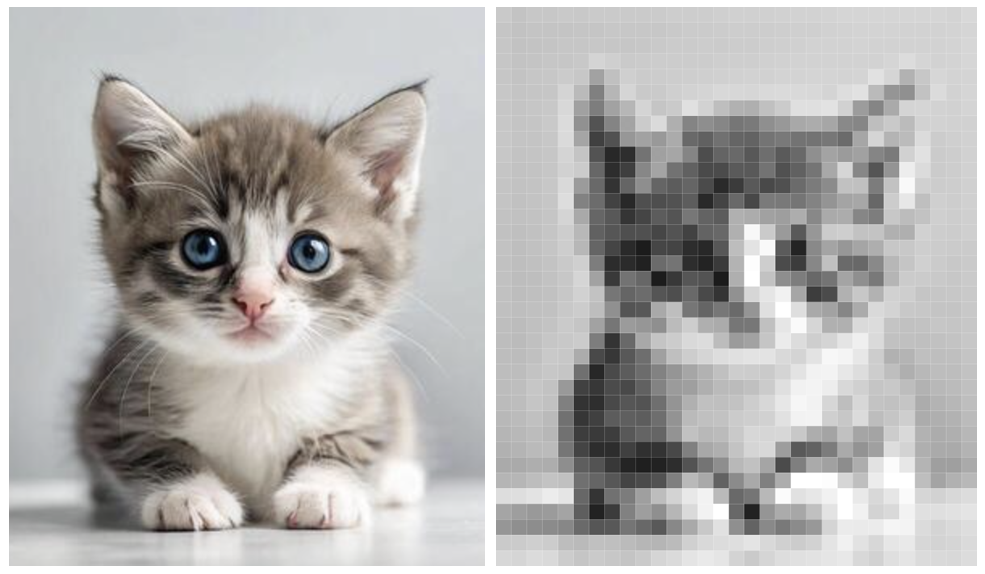

</div>
</div>

---

# KHÁI NIỆM ẢNH SỐ

- **Ảnh**: Một cách mô hình hóa ảnh mức xám: $f(x,y)$, trong đó:
  - $(x, y)$: tọa độ không gian
  - $f(x,y)$: cường độ tại vị trí $(x,y)$
  - **Có thể hiểu đơn giản:** Ảnh là một hàm mô tả cường độ tại mỗi vị trí trong không gian.
- **Ảnh số**

<div class="columns">
<div>
<ul>

- Ảnh số là ảnh mà:
  - Tọa độ không gian được số hóa
  - Giá trị cường độ được số hóa
  - Các giá trị chỉ nhận một tập hữu hạn các giá trị rời rạc
</ul>
</div>
<div>

**Biểu diễn bằng ma trận:**

$$f(x,y) \rightarrow \begin{bmatrix} f(0,0) & f(0,1) & \cdots \\ f(1,0) & f(1,1) & \cdots \\ \vdots & \vdots & \ddots \end{bmatrix}$$

</div>
</div>
<ul>

- **Ví dụ:** Một ảnh 640×480 sẽ được biểu diễn bằng ma trận có 480 hàng và 640 cột.

</ul>

---

# PIXEL – PHẦN TỬ ẢNH

**Pixel** (viết tắt của *Picture Element*) là phần tử cơ bản cấu tạo nên ảnh số.

Mỗi pixel có:


<div class="columns">
<div class="col-2">


- Một vị trí (tọa độ)
- Một giá trị (cường độ sáng hoặc màu sắc)

**Ví dụ ảnh mức xám:**

```
┌────┬────┬────┬────┐
│  12│  30│  45│  70│
├────┼────┼────┼────┤
│  18│  42│  80│ 100│
├────┼────┼────┼────┤
│  25│  60│ 110│ 150│
└────┴────┴────┴────┘
```

</div>
<div class="col-3">

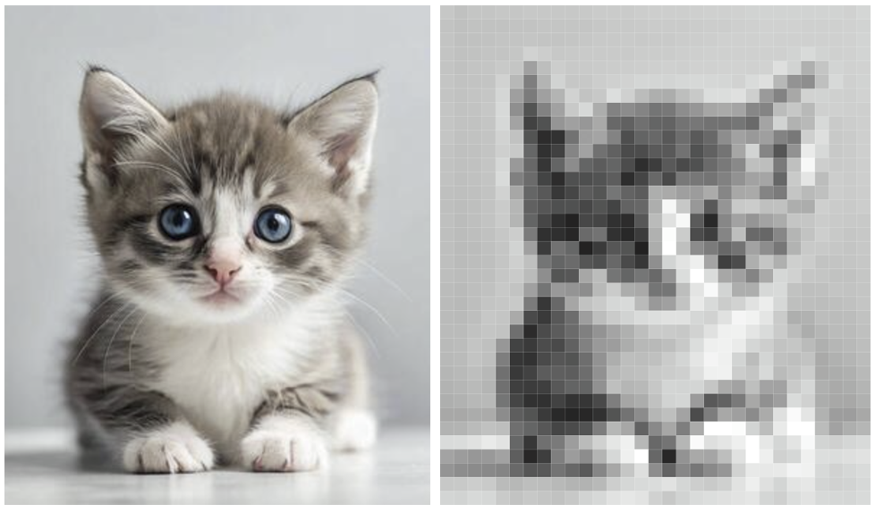
</div>
</div>

- Giá trị càng lớn thì pixel càng sáng. Pixel có giá trị 150 sẽ sáng hơn pixel có giá trị 12.

---

# ẢNH XÁM VÀ ẢNH MÀU

**Ảnh mức xám:**

- Mỗi pixel có một giá trị duy nhất: $0 \leq f(x,y) \leq 255$ (với ảnh 8-bit)
- 0 → đen, 255 → trắng
- **Ví dụ:** Một bức ảnh chân dung đen trắng

**Ảnh màu:**

- Mỗi pixel được biểu diễn bởi nhiều thành phần màu
- **Ví dụ RGB:** $Pixel = (R, G, B)$
- Mỗi kênh R, G, B thường có giá trị từ 0 đến 255
- **Ví dụ:** Pixel $(255, 0, 0)$ là màu đỏ thuần, $(0, 255, 0)$ là màu xanh lá thuần

---

# Ảnh dựa trên phổ điện từ

- **Ảnh tia Gamma:** Y học hạt nhân (PET scan, quét xương), thiên văn học (vụ nổ sao).
- **Ảnh tia X:** Chẩn đoán y tế (chụp X-quang), kiểm tra công nghiệp, thiên văn học.
- **Ảnh tia cực tím (UV):** Kính hiển vi huỳnh quang, thiên văn học.

<div class="columns">
<div class="col-2">

- **Ảnh vùng Khả kiến & Hồng ngoại (IR):**
  - Kính hiển vi quang học.
  - Viễn thám (vệ tinh LANDSAT, dự báo thời tiết).
  - Kiểm tra tự động trong công nghiệp (phát hiện lỗi, đếm sản phẩm).
  - An ninh (nhận dạng vân tay, biển số xe).

</div>
<div>

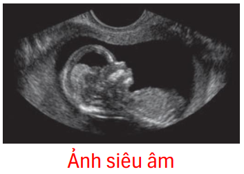

</div>
</div>
<div class="columns">
<div>

- **Các nguồn khác:** Ảnh siêu âm (y tế), ảnh kính hiển vi điện tử.

</div>
<div class="col-2">

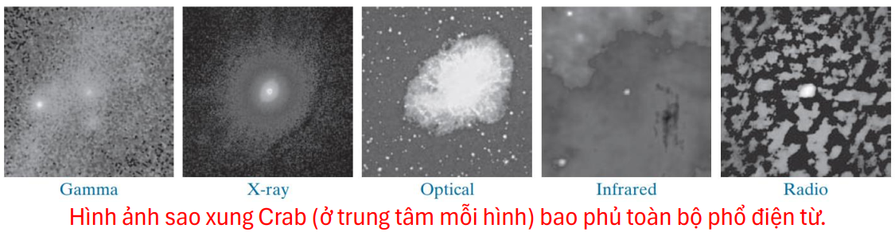

</div>
</div>

---

# IMAGE PROCESSING

**Image Processing – Xử lý ảnh** là tập hợp các phương pháp dùng để:

- Biến đổi ảnh
- Cải thiện chất lượng ảnh
- Khôi phục ảnh
- Trích xuất thông tin từ ảnh

**Ví dụ:**

- Ảnh tối → Tăng độ sáng → Ảnh sáng hơn
- Ảnh nhiễu → Lọc nhiễu → Ảnh ít nhiễu hơn

**Bản chất:** Đầu vào là ảnh, đầu ra cũng là ảnh (hoặc tập hợp các đặc trưng từ ảnh).

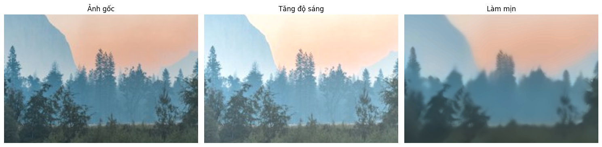

---

# COMPUTER VISION

**Computer Vision – Thị giác máy tính** là lĩnh vực nghiên cứu cách máy tính thu nhận, xử lý, phân tích và suy luận thông tin từ hình ảnh hoặc video.

**Ví dụ:**

Camera → Image → Object Detection → Kết quả:

<div class="columns">
<div class="col-3">
<gap></gap>


</div>
<div class="col-2">

```
┌──────────────────┐
│ 2 người          │
│ 1 chiếc xe ô tô  │
│ 1 chiếc xe máy   │
└──────────────────┘
```

**Bản chất:** Đầu vào là ảnh, đầu ra là *thông tin có ý nghĩa* hoặc *quyết định*.
</div>
</div>


---

# IMAGE PROCESSING vs COMPUTER VISION

| Image Processing | Computer Vision |
| --- | --- |
| Biến đổi ảnh | Hiểu nội dung ảnh |
| Cải thiện ảnh | Nhận biết đối tượng |
| Lọc nhiễu | Phát hiện đối tượng |
| Tăng tương phản | Phân loại |
| Sharpening | Tracking |
| Geometric transform | Recognition |

- **Lưu ý:** Hai lĩnh vực không có ranh giới tuyệt đối. Computer Vision thường sử dụng nhiều kỹ thuật Image Processing làm nền tảng.

- **Ví dụ:** Trước khi nhận dạng khuôn mặt (CV), thường cần lọc nhiễu và chuẩn hóa ảnh (IP).

---

# BA MỨC ĐỘ XỬ LÝ

**Low-level (Mức thấp):**

- Input: ảnh → Output: ảnh
- **Ví dụ:** Denoising, Enhancement, Sharpening

**Mid-level (Mức trung bình):**

- Input: ảnh → Output: đặc trưng / cấu trúc
- **Ví dụ:** Segmentation, Edge detection, Feature extraction

**High-level (Mức cao):**

- Input: thông tin hình ảnh → Output: hiểu biết / quyết định
- **Ví dụ:** Object recognition, Scene understanding, Activity recognition

**Ví dụ minh họa:** Từ ảnh chụp đường phố (low-level) → phát hiện các xe và người (mid-level) → nhận ra "đang có tắc nghẽn giao thông" (high-level).

---

# PIPELINE TỔNG QUÁT

<div class="columns">
<div>

```
ẢNH / VIDEO / CAMERA
         │
         ▼
  Image Acquisition
         │
         ▼
   Pre-processing
         │
         ▼
Representation / Features
         │
         ▼
┌────────┼─────────┐
▼        ▼         ▼
Class. Detection Segmentation
└────────┼─────────┘
         ▼
  Interpretation
         │
         ▼
     Decision
```

</div>
<div class="col-2">

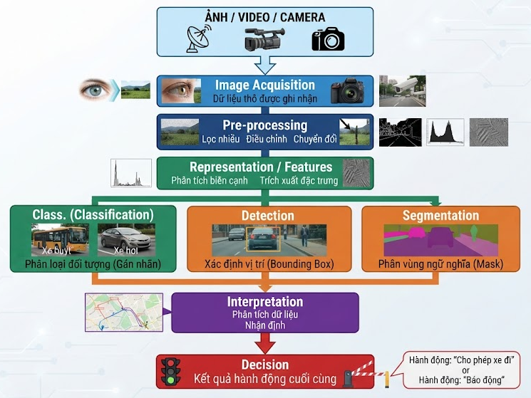

<gap></gap>

**Mục tiêu:** Biến dữ liệu hình ảnh thành thông tin hữu ích.

</div>
</div>

---

# ỨNG DỤNG

<div class="columns">
<div>

- **Y tế:** X-quang, CT, MRI, phân tích ảnh y tế
- **Công nghiệp:** Kiểm tra lỗi sản phẩm, đếm sản phẩm, đo kích thước
- **Giao thông:** Nhận dạng biển số, phát hiện phương tiện, giám sát giao thông
  - **Ví dụ:** Hệ thống camera giao thông sử dụng CV để tự động phát hiện xe vượt đèn đỏ và ghi lại biển số.
- **An ninh:** Nhận dạng khuôn mặt, theo dõi đối tượng

</div>
<div>

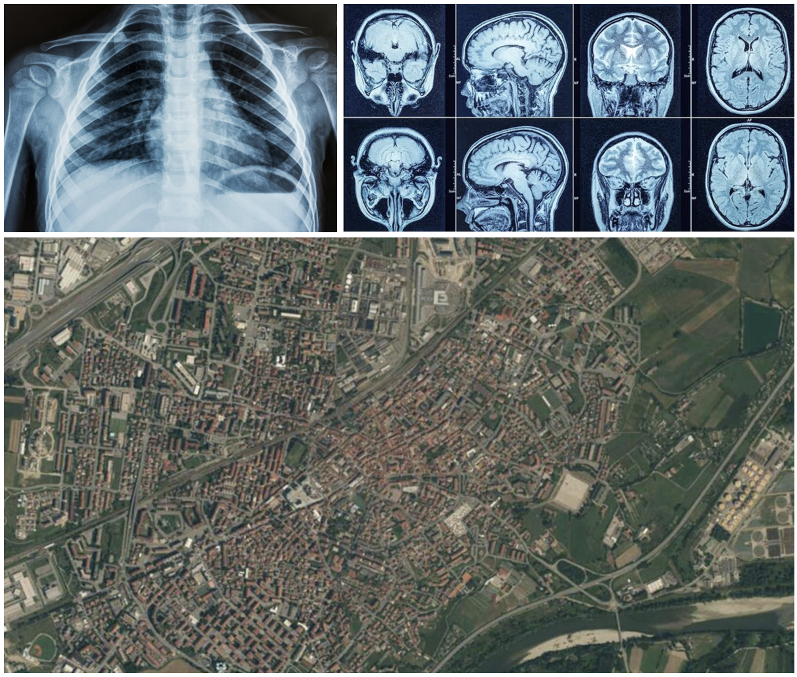

</div>
</div>

- **Viễn thám:** Ảnh vệ tinh, theo dõi môi trường, phân tích đất đai

---

# Lịch sử hình thành xử lý ảnh số

<div class="columns">
<div class="col-5">

- **Thập niên 1920:** Ứng dụng sớm nhất trong ngành báo chí. Hệ truyền ảnh qua cáp Bartlane (London - New York) giúp giảm thời gian truyền ảnh từ >1 tuần xuống <3 giờ (chưa sử dụng máy tính số).
- **Thập niên 1960:** Đánh dấu sự ra đời của máy tính số đủ mạnh và chương trình không gian.
  - Mốc quan trọng: Năm 1964, Phòng thí nghiệm Sức đẩy Phản lực (JPL) xử lý ảnh mặt trăng từ tàu Ranger 7 để hiệu chỉnh biến dạng.
- **Thập niên 1970:** Ứng dụng đột phá trong y tế.
  - Phát minh ra chụp cắt lớp vi tính (CT scan) bởi Sir Godfrey N. Hounsfield và Allan M. Cormack (Giải Nobel Y học 1979).

</div>
<div class ="col-2">
<br/>

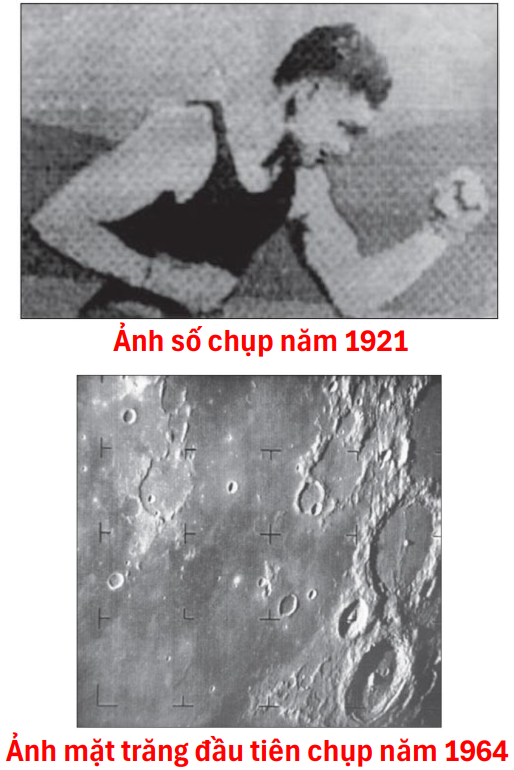

</div>
</div>

---

<!-- _class: section -->

# Từ thế giới thực đến ảnh số

---

# THỊ GIÁC CON NGƯỜI

Mắt người là một hệ thống thu nhận và xử lý thông tin quang học phức tạp.

<div class="columns">
<div class="col-2">

**Một số thành phần chính:**

- **Cornea** (giác mạc): lớp ngoài cùng, bảo vệ mắt
- **Iris** (mống mắt): điều chỉnh lượng ánh sáng vào
- **Lens** (thủy tinh thể): hội tụ ánh sáng
- **Retina** (võng mạc): nơi tiếp nhận ánh sáng
- **Rods** (tế bào hình que): cảm nhận độ sáng, hoạt động tốt trong điều kiện thiếu sáng
- **Cones** (tế bào hình nón): cảm nhận màu sắc, hoạt động tốt trong điều kiện đủ sáng

</div>
<div>

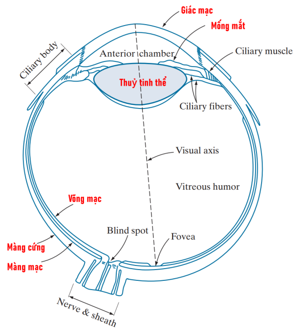

</div>
</div>

**Ý nghĩa đối với Computer Vision:** Nghiên cứu thị giác người giúp chúng ta hiểu về ánh sáng, độ sáng, độ tương phản, màu sắc và nhận thức thị giác.

---

# ÁNH SÁNG VÀ ĐỘ SÁNG

Khả năng cảm nhận của mắt không đơn giản là: *"Giá trị pixel lớn → luôn cảm thấy sáng hơn."*

- **Nhận thức phụ thuộc vào:**

<div class="columns">
<div class="col-2">
<ul>

  - Cường độ ánh sáng
  - Nền xung quanh
  - Tương phản
  - Điều kiện quan sát

</ul>

- **Ví dụ:** Một vùng xám có cùng giá trị pixel có thể được cảm nhận khác nhau khi đặt trên nền sáng so với khi đặt trên nền tối. Đây là hiệu ứng *simultaneous contrast* – một hiện tượng quan trọng trong tâm lý học thị giác.

- **Vạch Mach (Mach bands):** Mắt có xu hướng tăng/giảm cường độ cảm nhận ở ranh giới giữa các vùng có cường độ khác nhau.

</div>
<div>

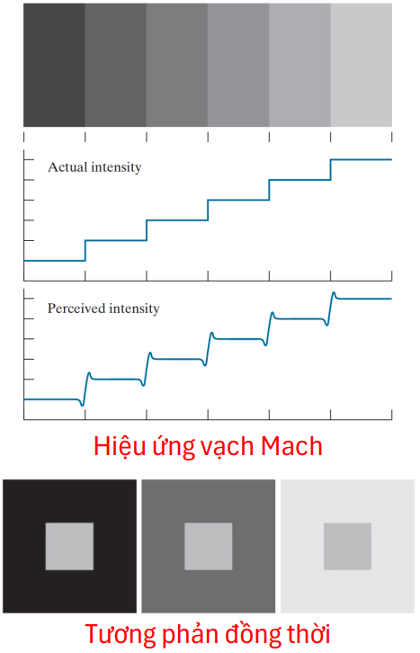

</div>
</div>

---

# Phổ điện từ
- **Phổ điện từ (EM)**: Bao gồm sóng vô tuyến, vi sóng, hồng ngoại, ánh sáng khả kiến, tử ngoại, tia X, tia gamma.
<div class="columns">
<div class="col-5">

- **Quan hệ tần số, bước sóng:** $c = \lambda \nu$. Trong đó:
  - $c$: tốc độ ánh sáng ($\approx 3 \times 10^8$ m/s)
  - $\lambda$: bước sóng
  - $\nu$: tần số

- **Năng lượng photon:** $E = h\nu$, với $h$ là hằng số Planck.

</div>
<div  class="col-5">

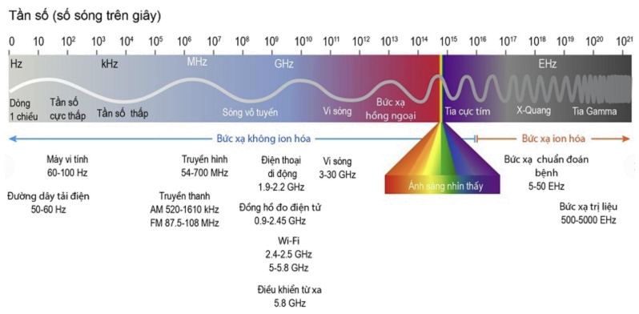

</div>
</div>

- **Ánh sáng khả kiến** có bước sóng chỉ nằm trong một khoảng hẹp của phổ điện từ (khoảng 380nm – 750nm).

---

# Thu nhận ảnh

Một hệ thống thu nhận ảnh có thể được mô hình hóa:

<div class="columns">
<div>

1. **Nguồn năng lượng** (ánh sáng, tia X, ...)
2. **Vật thể** (đối tượng cần chụp)
3. **Phản xạ / truyền qua** (tương tác giữa năng lượng và vật thể)
4. **Cảm biến** (thu nhận tín hiệu)

</div>
<div>

5. **Tín hiệu điện** (chuyển đổi từ năng lượng sang điện)
6. **Số hóa** (chuyển sang dạng số)
7. **Ảnh số** (kết quả cuối cùng)

</div>
</div>
<gap></gap>

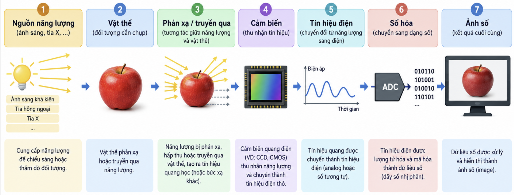

---

# CẢM BIẾN ẢNH

<div class="columns">
<div>

Ba mô hình cảm biến cơ bản:

**1. Single sensor (cảm biến đơn):**

- Một cảm biến duy nhất
- Cần chuyển động để quét ảnh
- **Ví dụ:** Máy quét ảnh cũ

**2. Sensor strip (dải cảm biến):**

- Một dải cảm biến
- Cần chuyển động theo một chiều
- **Ví dụ:** Máy fax, máy scan dòng

**3. Sensor array (mảng cảm biến):**

- Mảng cảm biến 2D

</div>
<div>

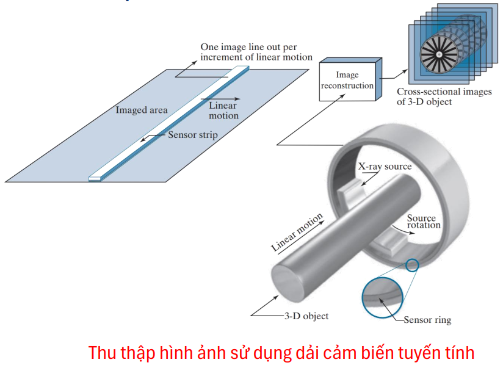
</div>
</div>

- Thu nhận toàn bộ ảnh trong một lần chụp
- **Ví dụ:** CCD, CMOS trong máy ảnh kỹ thuật số, điện thoại

---

# MÔ HÌNH HÌNH THÀNH ẢNH

Một mô hình đơn giản:

$$f(x,y) = i(x,y) \cdot r(x,y)$$

Trong đó:

- $i(x,y)$: **Illumination** – thành phần chiếu sáng
- $r(x,y)$: **Reflectance** – thành phần phản xạ

**Ý nghĩa:** Độ sáng quan sát được phụ thuộc cả vào *nguồn sáng* và *đặc tính bề mặt vật thể*.

**Ví dụ:** Một tờ giấy trắng dưới ánh sáng yếu có thể trông xám, nhưng dưới ánh sáng mạnh sẽ trông trắng. Vật thể có hệ số phản xạ cao (như gương) sẽ sáng hơn vật thể có hệ số phản xạ thấp (như vải đen).

>Một hệ thống Computer Vision phải quan tâm đến điều kiện ánh sáng. Đây là lý do vì sao các thuật toán xử lý ảnh thường cần bước chuẩn hóa ánh sáng (illumination normalization) trước khi phân tích.

---

# TỪ ẢNH LIÊN TỤC ĐẾN ẢNH SỐ

Ảnh thực tế có thể được xem là tín hiệu liên tục. Để máy tính xử lý, cần **số hóa**:

```
Ảnh liên tục
     │
     ├──────────────┐
     ▼              ▼
 Sampling       Quantization
     │              │
     ▼              ▼
Tọa độ rời rạc   Mức cường độ rời rạc
     └──────────────┘
             │
             ▼
          Ảnh số
```

**Ví dụ:** Một bức ảnh chụp trên phim (liên tục) khi được quét sẽ trải qua quá trình lấy mẫu và lượng tử hóa để trở thành ảnh số.

---

# Lấy mẫu (SAMPLING)

**Sampling – Lấy mẫu** là quá trình số hóa tọa độ không gian.

**Nó quyết định:** Độ phân giải không gian của ảnh.

**Sampling nhiều:**

```
● ● ● ● ● ● ●
● ● ● ● ● ● ●
● ● ● ● ● ● ●
```

**Sampling ít:**

```
●     ●     ●
●     ●     ●
```

**Kết luận:** Sampling thấp → ít pixel → mất chi tiết không gian.

**Ví dụ:** Khi bạn phóng to một ảnh có độ phân giải thấp, bạn sẽ thấy các "ô vuông" – đó là do sampling không đủ dày.

---

# Lượng tử hoá (QUANTIZATION)

**Quantization – Lượng tử hóa** là quá trình số hóa biên độ cường độ.

**Ví dụ:**

- **Nhiều mức xám:** 0, 20, 40, 60, 80, 100, ..., 255
- **Ít mức xám:** 0, 85, 170, 255

**Kết luận:** Quantization thấp → ít mức cường độ → dễ xuất hiện **false contouring** (hiện tượng xuất hiện các đường viền giả do không đủ mức xám để thể hiện chuyển tiếp mượt).

**Ví dụ:** Khi giảm ảnh màu 24-bit xuống còn 8-bit (256 màu), bạn có thể thấy các vệt màu không tự nhiên trên bầu trời – đó là false contouring.

---

# SAMPLING vs QUANTIZATION

| | Sampling | Quantization |
| --- | --- | --- |
| Số hóa | Tọa độ | Cường độ |
| Ảnh hưởng | Spatial resolution | Intensity resolution |
| Quá thấp | Mất chi tiết không gian | Mất chi tiết mức xám |
| Liên quan | Số pixel | Số mức xám |

**Ghi nhớ:**

- **Sampling → Where?** (Vị trí nào được lấy mẫu?)
- **Quantization → How much?** (Cường độ được làm tròn đến mức nào?)

---

# ĐỘ PHÂN GIẢI

**Spatial Resolution (Độ phân giải không gian):**

- Khả năng biểu diễn chi tiết không gian
- Liên quan đến: kích thước ảnh, mật độ pixel, kích thước pixel
- **Ví dụ:** Ảnh 4K (3840×2160) có độ phân giải không gian cao hơn ảnh HD (1920×1080)

**Intensity Resolution (Độ phân giải cường độ):**

- Khả năng phân biệt các mức cường độ
- **Ví dụ:** Ảnh 8-bit có $L = 2^8 = 256$ mức xám

---

# BITS VÀ MỨC XÁM

Nếu sử dụng $k$ bit cho mỗi pixel:

$$L = 2^k$$

| Bit | Mức |
| --- | --- |
| 1-bit | 2 |
| 2-bit | 4 |
| 4-bit | 16 |
| 8-bit | 256 |
| 16-bit | 65,536 |

**Ví dụ:** Ảnh 8-bit thường dùng trong các bài toán xử lý ảnh mức xám cơ bản vì cân bằng giữa chất lượng và dung lượng.

---

# NỘI SUY ẢNH

Khi thay đổi kích thước hoặc biến đổi hình học, ta thường cần ước lượng giá trị tại vị trí mới.

**Interpolation – Nội suy** có ba phương pháp phổ biến:

<div class="columns">
<div class="col-4">

**1. Nearest Neighbor (láng giềng gần nhất):**

- Nhanh, đơn giản
- Có thể tạo răng cưa
- **Ví dụ:** Phóng to ảnh pixel art

**2. Bilinear (tuyến tính kép):**

- Sử dụng các pixel lân cận
- Kết quả mượt hơn
- **Ví dụ:** Phóng to ảnh thông thường

</div>
<div class="col-5">

**3. Bicubic (bậc ba):**

- Sử dụng nhiều điểm lân cận hơn
- Kết quả thường mượt và giữ chi tiết tốt hơn
- **Ví dụ:** Phóng to ảnh chất lượng cao

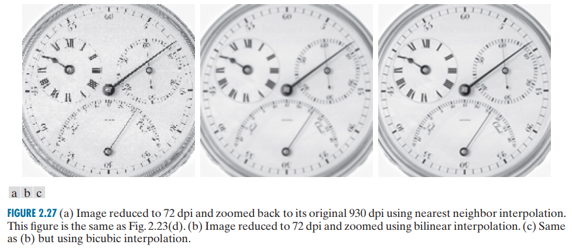

</div>
</div>

---
<!--_class: section-->

# Biểu diễn và các quan hệ trong ảnh

---

# ẢNH NHƯ MỘT MA TRẬN

Một ảnh xám có thể biểu diễn:

$$I \in R^{M \times N}$$

**Ví dụ:**

```
        x →
      0   1   2   3
    ┌───┬───┬───┬───┐
 y 0│12 │30 │45 │70 │
 ↓  ├───┼───┼───┼───┤
   1│18 │42 │80 │100│
    ├───┼───┼───┼───┤
   2│25 │60 │110│150│
    └───┴───┴───┴───┘
```

**Ý nghĩa:** Đây là nền tảng để sử dụng **NumPy** trong Python. Mỗi ảnh được lưu dưới dạng mảng 2 chiều (hoặc 3 chiều với ảnh màu).

---

# 34. LÁNG GIỀNG CỦA PIXEL (here)

Với pixel $p(x,y)$:

- **4-láng giềng (4-neighbors):**

$$N_4(p) = \{(x-1,y), (x+1,y), (x,y-1), (x,y+1)\}$$

- **Láng giềng chéo (diagonal neighbors):** Gồm bốn pixel theo đường chéo: $(x-1,y-1), (x-1,y+1), (x+1,y-1), (x+1,y+1)$

- **8-láng giềng (8-neighbors):** Kết hợp 4-láng giềng và láng giềng chéo.
- **Ví dụ:** Khi xét pixel trung tâm trong một cửa sổ 3×3, 4-láng giềng là 4 pixel ở trên/dưới/trái/phải, 8-láng giềng là tất cả 8 pixel xung quanh.

---

# 35. TÍNH KỀ VÀ LIÊN THÔNG

Các pixel có thể được xem là kề nhau dựa trên:

- **4-connectivity:** kề theo 4 hướng (trên, dưới, trái, phải)
- **8-connectivity:** kề theo 8 hướng (bao gồm cả đường chéo)
- **m-connectivity (mixed connectivity):** kết hợp để tránh các vấn đề về đường đi kép

**Tại sao cần?** Để xác định:

- Pixel nào thuộc cùng một đối tượng
- Đường đi giữa các pixel
- Một vùng ảnh gồm những pixel nào

**Ví dụ:** Trong trò chơi Caro, nếu dùng 4-connectivity thì chỉ cần 4 quân liên tiếp theo hàng ngang/dọc để thắng; nếu dùng 8-connectivity thì đường chéo cũng được tính.

---

# 36. ĐƯỜNG ĐI VÀ VÙNG

**Path – Đường đi:** Một chuỗi các pixel liên tiếp thỏa mãn điều kiện kề nhau.

**Region – Vùng:** Một tập các pixel liên thông.

**Boundary – Biên:** Tập các pixel thuộc vùng nhưng có ít nhất một láng giềng nằm ngoài vùng.

```
████████
██    ██
██    ██
████████
```

Phần bao quanh → boundary.

**Ví dụ:** Khi phân vùng ảnh để tách nền và đối tượng, ta cần xác định vùng liên thông của đối tượng và biên của nó.

---

# 37. KHOẢNG CÁCH GIỮA CÁC PIXEL

Ba khoảng cách phổ biến:

**Euclidean (khoảng cách Euclid):**

$$D_E(p,q) = \sqrt{(x-s)^2 + (y-t)^2}$$

**City-block (khoảng cách Manhattan):**

$$D_4(p,q) = |x-s| + |y-t|$$

**Chessboard (khoảng cách bàn cờ):**

$$D_8(p,q) = \max(|x-s|, |y-t|)$$

**Ví dụ:** Từ $(0,0)$ đến $(3,4)$:
- Euclidean: 5
- City-block: 7
- Chessboard: 4

---

# 38. SO SÁNH CÁC KHOẢNG CÁCH

**Euclidean:**

```
    ○
```

**City-block:**

```
    ◇
```

**Chessboard:**

```
    □
```

**Ý nghĩa:** Cách định nghĩa khoảng cách phụ thuộc vào mô hình láng giềng và bài toán cần giải.

**Các khái niệm này sẽ được sử dụng trong:**

- Segmentation (phân vùng)
- Morphology (hình thái học)
- Connected components (thành phần liên thông)
- Feature extraction (trích xuất đặc trưng)

---

# Láng giềng của một điểm ảnh

- Điểm ảnh $p$ tại tọa độ $(x, y)$ có các tập láng giềng:
- **4-láng giềng ($N_4(p)$):** $(x+1, y), (x-1, y), (x, y+1), (x, y-1)$.
- **Láng giềng chéo ($N_D(p)$):** $(x+1, y+1), (x+1, y-1), (x-1, y+1), (x-1, y-1)$.
- **8-láng giềng ($N_8(p)$):** $N_4(p) \cup N_D(p)$.

<div style="margin-top: 20px">

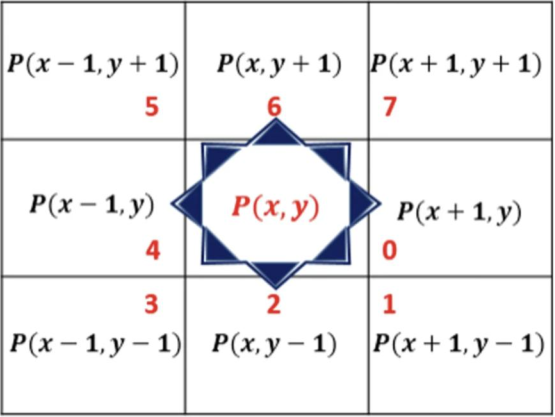

</div>

---

# Tính kề và liên thông

- **Tập giá trị cường độ V:** Ví dụ $V = \{1\}$ cho ảnh nhị phân.
- **4-kề nhau:** $q \in N_4(p)$ và $p, q \in V$.
- **8-kề nhau:** $q \in N_8(p)$ và $p, q \in V$. (Có thể gây mơ hồ về đường đi).
- **m-kề nhau (Mixed adjacency):** $q \in N_4(p)$ hoặc $q \in N_D(p)$ và $N_4(p) \cap N_4(q)$ không chứa điểm nào có giá trị thuộc $V$. $\rightarrow$ Loại bỏ sự mơ hồ của 8-kề nhau.
- **Đường đi (Path):** Dãy các điểm kề nhau. Độ dài đường đi là số bước.

<div style="margin-top:20px">

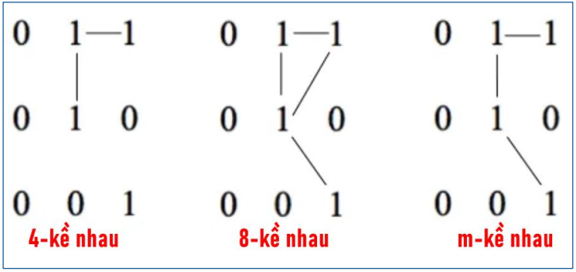

</div>

---

# Vùng, biên và khoảng cách

- **Vùng (Region):** Tập hợp các điểm liên thông.
- **Biên (Boundary):** Tập hợp các điểm trong vùng có ít nhất một láng giềng thuộc phần bù (background) của vùng đó.
- **Các độ đo khoảng cách D:** Thỏa mãn $D \ge 0$, $D(p,q) = D(q,p)$, $D(p,q) \le D(p,z) + D(z,q)$.
  - **Khoảng cách Euclidean ($D_e$):** $\sqrt{(x-u)^2 + (y-v)^2}$ (Hình tròn).
  - **Khoảng cách City-block ($D_4$):** $|x-u| + |y-v|$ (Hình thoi).
  - **Khoảng cách Chessboard ($D_8$):** $\max(|x-u|, |y-v|)$ (Hình vuông).
  - **Khoảng cách $D_m$:** Độ dài ngắn nhất của đường đi m-kề nhau.
- **Bài tập thực hành:** Tính 3 loại khoảng cách trên giữa điểm $p(2, 3)$ và $q(5, 7)$.
- **Lời giải:**
  - Euclidean: $\sqrt{(5-2)^2 + (7-3)^2} = 5$
  - City-block: $|5-2| + |7-3| = 7$
  - Chessboard: $\max(|5-2|, |7-3|) = 4$

---

<!-- _class: section -->

# CÔNG CỤ TOÁN HỌC CƠ BẢN

---

# Phép toán trên ảnh

<div class="columns">
<div class="col-2">

- **Phép toán theo phần tử (Elementwise):** Cộng, trừ, nhân, chia từng cặp điểm ảnh tương ứng.
  - **Cộng ảnh (Averaging):** Giảm nhiễu. Trung bình $k$ ảnh nhiễu $\rightarrow$ phương sai nhiễu giảm $k$ lần.
  - **Trừ ảnh (Subtraction):** Phát hiện thay đổi, trừ nền.
  - **Nhân/Chia ảnh:** Hiệu chỉnh độ sáng không đều (Shading correction), tạo mặt nạ vùng quan tâm (ROI Masking).
- **Phép toán Logic:** AND, OR, NOT, XOR (chủ yếu dùng cho ảnh nhị phân/mask).
- **Ví dụ ứng dụng:** Trung bình nhiều ảnh bị nhiễu Gaussian sẽ giúp khử nhiễu hiệu quả, ảnh càng rõ nét khi số lượng ảnh càng lớn.

</div>
<div>

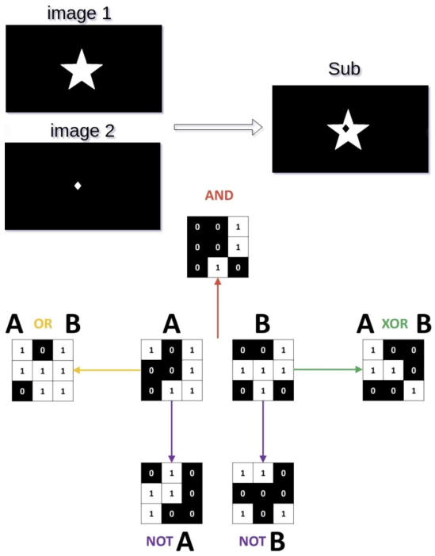

</div>
</div>

---

# Ví dụ ứng dụng phép toán trên ảnh

<div class="columns">
<div class="col-2">

- Hình ảnh của cặp thiên hà NGC 3314 bị nhiễu Gaussian cộng thêm.
- Các hình (b)-(f) là kết quả trung bình của 5, 10, 20, 50 và 1.000 hình ảnh bị nhiễu, tương ứng.

</div>
<div class="col-5">

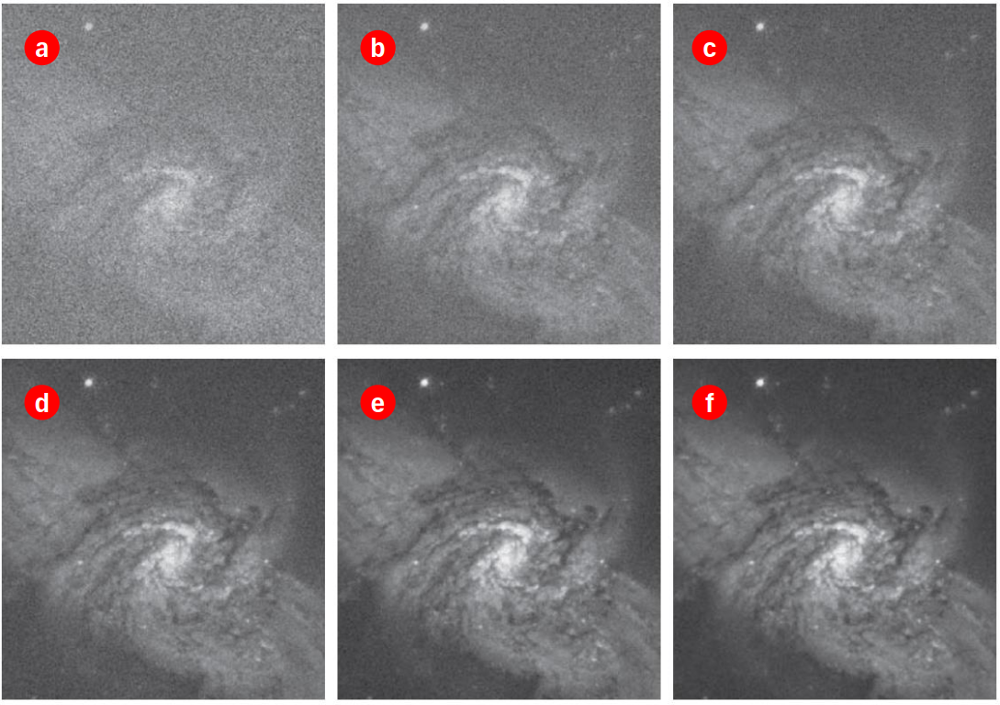

</div>
</div>


---

# Phép toán không gian

- Là các phép toán biến đổi tác động trực tiếp lên giá trị điểm ảnh trong miền không gian: $g(x, y) = T[f(x, y)]$.
- **Đơn điểm ảnh (Single-pixel):** Biến đổi cường độ $s = T(z)$. Ví dụ: tạo ảnh âm bản.
- **Láng giềng (Neighborhood):** Giá trị điểm ảnh đầu ra phụ thuộc vào một vùng lân cận của ảnh đầu vào. Ví dụ: làm mờ cục bộ (local averaging).
- **Biến đổi hình học (Geometric Transformations):**
  - Biến đổi tọa độ (Affine): Tỷ lệ, Tịnh tiến, Quay, Trượt.
  - Nội suy cường độ cho tọa độ mới (Nearest, Bilinear, Bicubic).
- **Đăng ký ảnh (Image Registration):** Căn chỉnh 2 ảnh bằng cách tìm các điểm mốc (tie points/control points) và ước lượng ma trận biến đổi.

---

# Biến đổi ảnh & thống kê cường độ

- **Biến đổi ảnh (Image Transforms):** Chuyển từ miền không gian sang miền biến đổi (ví dụ: miền tần số Fourier), xử lý, rồi biến đổi ngược.
  - Công thức tổng quát: $T(u, v) = \sum\sum f(x, y) r(x, y, u, v)$.
- **Cường độ ảnh là biến ngẫu nhiên:**
  - Xác suất xuất hiện mức xám $z_k$: $p(z_k) = n_k / MN$ (Cơ sở của Histogram).
  - **Trung bình (Mean):** $m = \sum z_k p(z_k)$ (Đo độ sáng trung bình).
  - **Phương sai (Variance):** $\sigma^2 = \sum (z_k - m)^2 p(z_k)$ (Đo độ tương phản của ảnh).

---

<!-- _class: section -->

# CÔNG CỤ XỬ LÝ ẢNH TRONG PYTHON

---

# Tổng quan về xử lý ảnh trong Python

- Python là ngôn ngữ phổ biến nhất cho xử lý ảnh và Computer Vision nhờ cú pháp đơn giản và hệ sinh thái thư viện phong phú.
- Ảnh được biểu diễn như mảng NumPy đa chiều.
- **Các thư viện hỗ trợ chính:**
  - **OpenCV:** Computer Vision real-time, mạnh mẽ.
  - **Pillow/PIL:** Hiển thị và thao tác cơ bản, thân thiện.
  - **scikit-image:** Thuật toán học thuật, dễ sử dụng cho nghiên cứu.
  - **mahotas:** Xử lý nhanh, tập trung vào hình thái học (morphology).

---

# OpenCV- Open Computer Vision Library

<div class="columns">
<div class="col-2">

- **OpenCV** là thư viện xử lý ảnh và Computer Vision mã nguồn mở hàng đầu.
- **Mục đích:** Phục vụ các ứng dụng Computer Vision thời gian thực (real-time).
- **Lịch sử:** Được phát triển bởi Intel, hiện duy trì bởi Open Source Vision Foundation.
- **Quy mô:** Chứa hơn 2500 thuật toán tối ưu.
- **Hỗ trợ đa ngôn ngữ:** Python, C++, C, Java, MATLAB.
- **Đa nền tảng:** Chạy trên Windows, Linux, macOS, Android, iOS.

</div>
<div>


</div>
</div>

---

# Đặc điểm nổi bật của OpenCV

- **Hiệu suất cao:** Được viết bằng C/C++, tối ưu hóa cho tốc độ xử lý thời gian thực.
- **Đa năng:** Bao phủ từ các tác vụ xử lý ảnh cơ bản đến các thuật toán AI, Deep Learning phức tạp.
- **Cộng đồng lớn:** Tài liệu phong phú, cộng đồng người dùng đông đảo, dễ dàng tìm kiếm sự hỗ trợ.
- **Tích hợp dễ dàng:** Dễ dàng kết hợp với NumPy, SciPy, Matplotlib trong Python.
- **Mã nguồn mở:** Miễn phí cho cả mục đích học tập và thương mại.

---

# OpenCV- chức năng cơ bản

- **Đọc/ghi ảnh:**
  - `cv2.imread()`: Đọc ảnh từ file.
  - `cv2.imwrite()`: Ghi ảnh ra file.
- **Hiển thị:**
  - `cv2.imshow()`: Hiển thị ảnh trong cửa sổ.
  - `cv2.waitKey()`: Chờ phím bấm để đóng cửa sổ.
- **Thao tác cơ bản:**
  - `cv2.resize()`: Thay đổi kích thước ảnh.
  - `cv2.flip()`: Lật ảnh ngang/dọc.
  - `cv2.rotate()`: Xoay ảnh 90/180/270 độ.
  - `cv2.cvtColor()`: Chuyển đổi không gian màu (RGB sang Gray, HSV...).
- **Vẽ hình học:** `cv2.line()`, `cv2.rectangle()`, `cv2.circle()`.

---

# OpenCV- Image Filtering& Enhancement

- **Làm mờ & Giảm nhiễu:**
  - `cv2.blur()`: Làm mờ trung bình.
  - `cv2.medianBlur()`: Giảm nhiễu muối tiêu (salt-and-pepper).
  - `cv2.bilateralFilter()`: Làm mờ nhưng vẫn bảo toàn biên.
- **Phát hiện biên:** `cv2.Canny()`.
- **Phân ngưỡng (Thresholding):**
  - `cv2.threshold()`: Nhị phân hóa ảnh.
  - `cv2.adaptiveThreshold()`: Nhị phân hóa thích nghi với điều kiện sáng.
- **Hình thái học (Morphology):** `cv2.erode()`, `cv2.dilate()`.
- **Đường viền (Contours):** `cv2.findContours()`, `cv2.drawContours()`.

---

# OpenCV- Computer Vision Advanced

- **Phát hiện khuôn mặt:** `cv2.CascadeClassifier()` (Sử dụng Haar Cascade).
- **Phát hiện đối tượng & Đặc trưng:** HOG, SIFT, SURF, ORB.
- **Theo dõi đối tượng (Tracking):** Feature matching, Background subtraction.
- **Hiệu chỉnh phối cảnh (Perspective correction).**
- **Suy luận mạng nơ-ron (Neural network inference):** `dnn.readNet()` để chạy các mô hình AI.
- **Ứng dụng:** Phân loại ảnh, theo dõi chuyển động, nhận dạng đối tượng phức tạp.

---

# Pillow(PIL Fork)

- **Pillow** là bản fork hiện đại của PIL (Python Imaging Library).
- **Mục tiêu:** Hiển thị và thao tác ảnh cơ bản, tập trung vào tính thân thiện với người dùng.
- **Đặc điểm:**
  - Dễ sử dụng, cú pháp trực quan.
  - Hỗ trợ nhiều định dạng: Animated GIFs, JPEG2000, WebP.
  - Không gian màu mặc định: RGB.
- **Ứng dụng:** Xử lý ảnh cho web, các tác vụ chỉnh sửa đơn giản.
- **Lưu ý:** Hiệu suất chậm hơn OpenCV, không phù hợp cho các tác vụ thời gian thực hoặc xử lý video.

---

# scikit-image

- **Mục tiêu:** Thư viện thuật toán xử lý ảnh dành cho khoa học và nghiên cứu, ưu tiên tính dễ sử dụng và dễ hiểu.
- **Đặc điểm:**
  - Chức năng mở rộng, bao phủ nhiều thuật toán học thuật.
  - Không gian màu: RGB.
  - Kiểu dữ liệu mặc định: float (giá trị từ 0 đến 1).
- **Ứng dụng:** Nghiên cứu, giáo dục, phân tích ảnh y tế, khoa học.
- **Bao gồm:** Phát hiện biên, trích xuất đặc trưng, khôi phục ảnh, phân vùng.

---

# mahotas

- **Mục tiêu:** Thư viện xử lý ảnh tốc độ cao, được xây dựng bằng C++.
- **Tập trung:** Các phép toán hình thái học (Morphology operations) và xử lý ảnh cơ bản.
- **Đặc điểm:**
  - Mã nguồn đơn giản, tài liệu tốt.
  - Hiệu suất nhanh nhất trong các hàm xử lý cơ bản.
- **Ứng dụng:** Xử lý ảnh sinh học, phân tích ảnh hiển vi, các tác vụ yêu cầu tốc độ cao.
- **Lưu ý:** Ít chức năng mở rộng hơn so với scikit-image.

---

# NumPy- hỗ trợ xử lý ảnh

- **Nền tảng:** NumPy là cốt lõi cho mọi thư viện xử lý ảnh trong Python (OpenCV, scikit-image đều dùng NumPy array).
- **Biểu diễn ảnh:** Ảnh được biểu diễn như mảng đa chiều (2D cho ảnh xám, 3D cho ảnh màu).
- **Hỗ trợ toán học:** Cung cấp nhiều hàm toán học tối ưu cho các phép toán trên pixel.
- **Yêu cầu:** Bắt buộc phải cài đặt khi làm việc với OpenCV (NumPy + SciPy).
- **Thao tác phổ biến:**
  - Slice arrays để crop (cắt) ảnh.
  - Create masks cho các phép toán masked operations.
  - Biến đổi ma trận ảnh nhanh chóng.

---

# Cài đặt môi trường thực hành

<div class="columns">
<div class="col-2">

- Phần mềm:
  - Python 3.11+
  - VSCode
  - pip/pipenv
- VSCode extensions:
  - Python (Microsoft)
  - Jupyter (Microsoft)

</div>
<div  class="col-2">

- Python packages:
  - numpy
  - opencv-python
  - matplotlib
  - scikit-image
  - pillow
  - ipykernel

</div>
<div class="col-3">

- Tổ chức dự án:

```text
projects/
│
├── images/           # Ảnh đầu vào
├── output/           # Kết quả xử lý
├── notebooks/        # Jupyter Notebook
├── src/              # Mã nguồn Python
└── requirements.txt  # Danh sách thư viện
```

</div>
</div>

- Cài đặt thư viện:
```bash
pipx install pipenv
pipenv shell
pipenv install numpy opencv-python matplotlib scikit-image pillow ipykernel
```