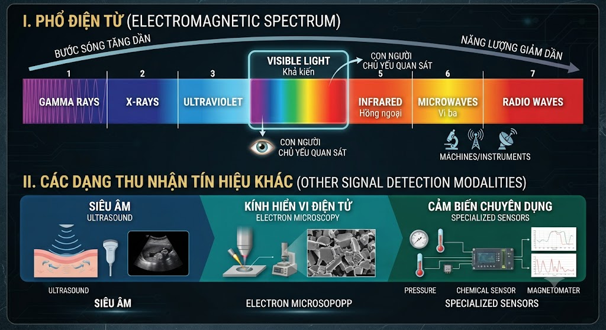

---

marp: true
theme: eaut
paginate: true
--------------

<!--_class: cover-->

<div class="middle">

# XỬ LÝ ẢNH & THỊ GIÁC MÁY TÍNH

## CHƯƠNG 1 - GIỚI THIỆU TỔNG QUAN

</div>

### Giảng viên: Nguyễn Phồn Lữa

---
<!-- _class: toc -->

# NỘI DUNG

1. Giới thiệu học phần
2. Tổng quan về xử lý ảnh & thị giác máy tính
3. Từ thế giới thực đến ảnh số
4. Biểu diễn và các quan hệ trong ảnh
5. Các phép toán cơ bản trên ảnh
6. Công cụ xử lý ảnh trong Python
7. Môi trường thực hành

---
<!-- _class: section -->

# Giới thiệu học phần

---

# 1. GIỚI THIỆU HỌC PHẦN

**Tên học phần:** Xử lý ảnh và Thị giác máy tính

**Quy mô:** 3 tín chỉ

- 2 tín chỉ lý thuyết
- 1 tín chỉ thực hành
- Khoảng 15 buổi học
- Thời gian tự học: khoảng 75 giờ

**Mục tiêu:**

- Nắm vững kiến thức nền tảng về xử lý ảnh và thị giác máy tính
- Hiểu các kỹ thuật xử lý và phân tích ảnh cơ bản
- Sử dụng công cụ lập trình để giải quyết các bài toán thực tế

---

# 2. MỤC TIÊU HỌC TẬP

Sau học phần, sinh viên có thể:

**Hiểu**

- Ảnh số được hình thành và biểu diễn như thế nào
- Các khái niệm cơ bản của Image Processing và Computer Vision
- Các kỹ thuật xử lý ảnh cơ bản

**Thực hiện**

- Đọc, hiển thị và biến đổi ảnh
- Thực hiện các phép toán trên ảnh
- Áp dụng các kỹ thuật lọc, phát hiện biên và phân vùng

**Vận dụng**

- Xây dựng pipeline xử lý ảnh
- Sử dụng Python và các thư viện xử lý ảnh
- Giải quyết các bài toán Computer Vision cơ bản

---

# 3. PHƯƠNG PHÁP ĐÁNH GIÁ

| Thành phần | Tỷ trọng |
| --- | --- |
| Chuyên cần | 10% |
| Quá trình / giữa kỳ | 30% |
| Cuối kỳ – Bài tập lớn | 60% |

**Lưu ý:** Bài tập lớn chiếm tỷ trọng cao nhất, đòi hỏi sinh viên phải làm việc nhóm và vận dụng tổng hợp kiến thức.

---

# 4. BÀI TẬP LỚN

**Quy định:**

- Làm việc theo nhóm 3–5 sinh viên
- Mỗi nhóm tự chọn đề tài, các nhóm không trùng đề tài
- Hoàn thành sản phẩm, báo cáo và vấn đáp

**Quy trình thực hiện:**

1. Chọn bài toán
2. Phân tích yêu cầu
3. Thu thập / chọn dữ liệu
4. Thiết kế phương pháp
5. Cài đặt
6. Thực nghiệm
7. Đánh giá
8. Báo cáo & vấn đáp

**Cơ chế đánh giá:**

- Hình thức báo cáo: 10%
- Nội dung báo cáo: 50%
- Vấn đáp: 40%

---

# 5. ROADMAP HỌC PHẦN

**CHƯƠNG 1:** Nền tảng
↓
**CHƯƠNG 2:** Biến đổi ảnh
↓
**CHƯƠNG 3:** Nén ảnh
↓
**CHƯƠNG 4:** Phát hiện biên & phân vùng
↓
**CHƯƠNG 5:** Thị giác máy tính

**Câu hỏi xuyên suốt:** Làm thế nào để biến một hình ảnh thành thông tin có ý nghĩa?

---
<!-- _class: section -->

# <!--fit-->Tổng quan về xử lý ảnh & thị giác máy tính

---

# TỪ THẾ GIỚI THỰC ĐẾN MÁY TÍNH

- **Con người nhìn thấy:** Người, xe, nhà, cây, chữ, khuôn mặt – những đối tượng có ý nghĩa.
- **Máy tính không "nhìn" ảnh theo cách con người nhìn.** Máy tính chỉ nhận được dữ liệu số biểu diễn năng lượng ánh sáng hoặc các dạng tín hiệu khác.
- **Ví dụ:** Khi bạn chụp một bức ảnh con mèo, mắt bạn nhận ra ngay "con mèo", nhưng máy tính chỉ thấy một ma trận các con số biểu diễn cường độ sáng tại từng vị trí.


---

# ẢNH LÀ GÌ?

Một cách mô hình hóa ảnh mức xám:

$$f(x,y)$$

Trong đó:

- $(x, y)$: tọa độ không gian
- $f(x,y)$: cường độ tại vị trí $(x,y)$

**Có thể hiểu đơn giản:** Ảnh là một hàm mô tả cường độ tại mỗi vị trí trong không gian.

**Ví dụ:** Tại vị trí $(100, 200)$, nếu $f(100, 200) = 180$ thì điểm ảnh đó có cường độ sáng khá cao (gần trắng).

---

# ẢNH SỐ

Ảnh số là ảnh mà:

- Tọa độ không gian được số hóa
- Giá trị cường độ được số hóa
- Các giá trị chỉ nhận một tập hữu hạn các giá trị rời rạc

**Biểu diễn bằng ma trận:**

$$f(x,y) \rightarrow \begin{bmatrix} f(0,0) & f(0,1) & \cdots \\ f(1,0) & f(1,1) & \cdots \\ \vdots & \vdots & \ddots \end{bmatrix}$$

**Ví dụ:** Một ảnh 640×480 sẽ được biểu diễn bằng ma trận có 480 hàng và 640 cột.

---

# PIXEL – PHẦN TỬ ẢNH

**Pixel** (viết tắt của *Picture Element*) là phần tử cơ bản cấu tạo nên ảnh số.

Mỗi pixel có:

- Một vị trí (tọa độ)
- Một giá trị (cường độ sáng hoặc màu sắc)

**Ví dụ ảnh mức xám:**

```
┌────┬────┬────┬────┐
│  12│  30│  45│  70│
├────┼────┼────┼────┤
│  18│  42│  80│ 100│
├────┼────┼────┼────┤
│  25│  60│ 110│ 150│
└────┴────┴────┴────┘
```

**Giải thích:** Giá trị càng lớn thì pixel càng sáng. Pixel có giá trị 150 sẽ sáng hơn pixel có giá trị 12.

---

# ẢNH XÁM VÀ ẢNH MÀU

**Ảnh mức xám:**

- Mỗi pixel có một giá trị duy nhất: $0 \leq f(x,y) \leq 255$ (với ảnh 8-bit)
- 0 → đen, 255 → trắng
- **Ví dụ:** Một bức ảnh chân dung đen trắng

**Ảnh màu:**

- Mỗi pixel được biểu diễn bởi nhiều thành phần màu
- **Ví dụ RGB:** $Pixel = (R, G, B)$
- Mỗi kênh R, G, B thường có giá trị từ 0 đến 255
- **Ví dụ:** Pixel $(255, 0, 0)$ là màu đỏ thuần, $(0, 255, 0)$ là màu xanh lá thuần

---

# IMAGE PROCESSING LÀ GÌ?

**Image Processing – Xử lý ảnh** là tập hợp các phương pháp dùng để:

- Biến đổi ảnh
- Cải thiện chất lượng ảnh
- Khôi phục ảnh
- Trích xuất thông tin từ ảnh

**Ví dụ:**

- Ảnh tối → Tăng độ sáng → Ảnh sáng hơn
- Ảnh nhiễu → Lọc nhiễu → Ảnh ít nhiễu hơn

**Bản chất:** Đầu vào là ảnh, đầu ra cũng là ảnh (hoặc tập hợp các đặc trưng từ ảnh).


---

# COMPUTER VISION LÀ GÌ?

**Computer Vision – Thị giác máy tính** là lĩnh vực nghiên cứu cách máy tính thu nhận, xử lý, phân tích và suy luận thông tin từ hình ảnh hoặc video.

**Ví dụ:**

Camera → Image → Object Detection → Kết quả:

<div class="columns">
<div class="col-3">
<gap></gap>


</div>
<div class="col-2">

```
┌──────────────────┐
│ 2 người          │
│ 1 chiếc xe ô tô  │
│ 1 chiếc xe máy   │
└──────────────────┘
```

**Bản chất:** Đầu vào là ảnh, đầu ra là *thông tin có ý nghĩa* hoặc *quyết định*.
</div>
</div>


---

# IMAGE PROCESSING vs COMPUTER VISION

| Image Processing | Computer Vision |
| --- | --- |
| Biến đổi ảnh | Hiểu nội dung ảnh |
| Cải thiện ảnh | Nhận biết đối tượng |
| Lọc nhiễu | Phát hiện đối tượng |
| Tăng tương phản | Phân loại |
| Sharpening | Tracking |
| Geometric transform | Recognition |

- **Lưu ý:** Hai lĩnh vực không có ranh giới tuyệt đối. Computer Vision thường sử dụng nhiều kỹ thuật Image Processing làm nền tảng.

- **Ví dụ:** Trước khi nhận dạng khuôn mặt (CV), thường cần lọc nhiễu và chuẩn hóa ảnh (IP).

---

# BA MỨC ĐỘ XỬ LÝ

**Low-level (Mức thấp):**

- Input: ảnh → Output: ảnh
- **Ví dụ:** Denoising, Enhancement, Sharpening

**Mid-level (Mức trung bình):**

- Input: ảnh → Output: đặc trưng / cấu trúc
- **Ví dụ:** Segmentation, Edge detection, Feature extraction

**High-level (Mức cao):**

- Input: thông tin hình ảnh → Output: hiểu biết / quyết định
- **Ví dụ:** Object recognition, Scene understanding, Activity recognition

**Ví dụ minh họa:** Từ ảnh chụp đường phố (low-level) → phát hiện các xe và người (mid-level) → nhận ra "đang có tắc nghẽn giao thông" (high-level).

---

# PIPELINE TỔNG QUÁT

<div class="columns">
<div>

```
ẢNH / VIDEO / CAMERA
         │
         ▼
  Image Acquisition
         │
         ▼
   Pre-processing
         │
         ▼
Representation / Features
         │
         ▼
┌────────┼─────────┐
▼        ▼         ▼
Class. Detection Segmentation
└────────┼─────────┘
         ▼
  Interpretation
         │
         ▼
     Decision
```

</div>
<div class="col-2">


<gap></gap>

**Mục tiêu:** Biến dữ liệu hình ảnh thành thông tin hữu ích.

</div>
</div>


---

# ỨNG DỤNG

- **Y tế:** X-quang, CT, MRI, phân tích ảnh y tế
- **Công nghiệp:** Kiểm tra lỗi sản phẩm, đếm sản phẩm, đo kích thước
- **Giao thông:** Nhận dạng biển số, phát hiện phương tiện, giám sát giao thông
  - **Ví dụ:** Hệ thống camera giao thông sử dụng CV để tự động phát hiện xe vượt đèn đỏ và ghi lại biển số.
- **An ninh:** Nhận dạng khuôn mặt, theo dõi đối tượng
- **Viễn thám:** Ảnh vệ tinh, theo dõi môi trường, phân tích đất đai

---
<!--_class: text-sm-->
# ẢNH KHÔNG CHỈ LÀ ÁNH SÁNG KHẢ KIẾN

Con người chủ yếu quan sát vùng ánh sáng khả kiến. Máy móc có thể thu nhận nhiều loại tín hiệu hơn:

<div class="columns">
<div>

- Gamma
- X-ray
- UV
- Visible (khả kiến)
- Infrared (hồng ngoại)
- Microwave
- Radio

**Ngoài phổ điện từ còn có:**

- Siêu âm
- Kính hiển vi điện tử
- Các hệ thống cảm biến chuyên dụng

</div>
<div class="col-2">



</div>
</div>

**Ví dụ:** Ảnh chụp X-quang dùng trong y tế, ảnh hồng ngoại dùng để quan sát vào ban đêm.

---

# LỊCH SỬ PHÁT TRIỂN

- **1920s:** Truyền ảnh
- **1960s:** Computer + Space Imaging
- **1970s:** Medical Imaging
- **1980s–1990s:** Digital Image Processing
- **2000s:** Computer Vision
- **2010s:** Deep Learning
- **2020s:** Vision + AI + Multimodal Systems

**Ý tưởng chính:** Sự phát triển của xử lý ảnh gắn chặt với sự phát triển của cảm biến, máy tính và AI.

---
<!-- _class: section -->

# Từ thế giới thực đến ảnh số

---

# THỊ GIÁC CON NGƯỜI

Mắt người là một hệ thống thu nhận và xử lý thông tin quang học phức tạp.

<div class="columns">
<div class="col-2">

**Một số thành phần chính:**

- **Cornea** (giác mạc): lớp ngoài cùng, bảo vệ mắt
- **Iris** (mống mắt): điều chỉnh lượng ánh sáng vào
- **Lens** (thủy tinh thể): hội tụ ánh sáng
- **Retina** (võng mạc): nơi tiếp nhận ánh sáng
- **Rods** (tế bào hình que): cảm nhận độ sáng, hoạt động tốt trong điều kiện thiếu sáng
- **Cones** (tế bào hình nón): cảm nhận màu sắc, hoạt động tốt trong điều kiện đủ sáng

</div>
<div>


</div>
</div>

**Ý nghĩa đối với Computer Vision:** Nghiên cứu thị giác người giúp chúng ta hiểu về ánh sáng, độ sáng, độ tương phản, màu sắc và nhận thức thị giác.

---

# ÁNH SÁNG VÀ ĐỘ SÁNG (here)

Khả năng cảm nhận của mắt không đơn giản là: *"Giá trị pixel lớn → luôn cảm thấy sáng hơn."*

- **Nhận thức phụ thuộc vào:**

<div class="columns">
<div class="col-2">
<ul>

  - Cường độ ánh sáng
  - Nền xung quanh
  - Tương phản
  - Điều kiện quan sát

</ul>

- **Vạch Mach (Mach bands):** Mắt có xu hướng tăng/giảm cường độ cảm nhận ở ranh giới giữa các vùng có cường độ khác nhau.

- **Ví dụ:** Một vùng xám có cùng giá trị pixel có thể được cảm nhận khác nhau khi đặt trên nền sáng so với khi đặt trên nền tối. Đây là hiệu ứng *simultaneous contrast* – một hiện tượng quan trọng trong tâm lý học thị giác.

</div>
<div>


</div>
</div>

---

# 21. PHỔ ĐIỆN TỪ

Sóng điện từ được mô tả bởi:

$$c = \lambda \nu$$

Trong đó:

- $c$: tốc độ ánh sáng ($\approx 3 \times 10^8$ m/s)
- $\lambda$: bước sóng
- $\nu$: tần số

**Năng lượng photon:**

$$E = h\nu$$

với $h$ là hằng số Planck.

**Ánh sáng khả kiến** chỉ nằm trong một khoảng hẹp của phổ điện từ (khoảng 380nm – 750nm).

---

# 22. THU NHẬN ẢNH

Một hệ thống thu nhận ảnh có thể được mô hình hóa:

1. **Nguồn năng lượng** (ánh sáng, tia X, ...)
2. **Vật thể** (đối tượng cần chụp)
3. **Phản xạ / truyền qua** (tương tác giữa năng lượng và vật thể)
4. **Cảm biến** (thu nhận tín hiệu)
5. **Tín hiệu điện** (chuyển đổi từ năng lượng sang điện)
6. **Số hóa** (chuyển sang dạng số)
7. **Ảnh số** (kết quả cuối cùng)

**Ví dụ:** Khi chụp ảnh bằng điện thoại, ánh sáng từ cảnh vật phản xạ qua ống kính, đến cảm biến CMOS, chuyển thành tín hiệu điện và được số hóa thành ảnh JPEG.

---

# 23. CẢM BIẾN ẢNH

Ba mô hình cảm biến cơ bản:

**1. Single sensor (cảm biến đơn):**

- Một cảm biến duy nhất
- Cần chuyển động để quét ảnh
- **Ví dụ:** Máy quét ảnh cũ

**2. Sensor strip (dải cảm biến):**

- Một dải cảm biến
- Cần chuyển động theo một chiều
- **Ví dụ:** Máy fax, máy scan dòng

**3. Sensor array (mảng cảm biến):**

- Mảng cảm biến 2D
- Thu nhận toàn bộ ảnh trong một lần chụp
- **Ví dụ:** CCD, CMOS trong máy ảnh kỹ thuật số, điện thoại

---

# 24. MÔ HÌNH HÌNH THÀNH ẢNH

Một mô hình đơn giản:

$$f(x,y) = i(x,y) \cdot r(x,y)$$

Trong đó:

- $i(x,y)$: **Illumination** – thành phần chiếu sáng
- $r(x,y)$: **Reflectance** – thành phần phản xạ

**Ý nghĩa:** Độ sáng quan sát được phụ thuộc cả vào *nguồn sáng* và *đặc tính bề mặt vật thể*.

**Ví dụ:** Một tờ giấy trắng dưới ánh sáng yếu có thể trông xám, nhưng dưới ánh sáng mạnh sẽ trông trắng. Vật thể có hệ số phản xạ cao (như gương) sẽ sáng hơn vật thể có hệ số phản xạ thấp (như vải đen).

---

# 25. VÍ DỤ: CHIẾU SÁNG VÀ PHẢN XẠ

Hai vật thể có cùng màu nhưng dưới điều kiện chiếu sáng khác nhau có thể tạo ra ảnh rất khác nhau.

```
      Nguồn sáng
          ↓
    ┌───────────┐
    │  Vật thể  │
    └───────────┘
          ↓
     Ánh sáng phản xạ
          ↓
       Camera
```

**Do đó:** Một hệ thống Computer Vision phải quan tâm đến điều kiện ánh sáng. Đây là lý do vì sao các thuật toán xử lý ảnh thường cần bước *chuẩn hóa ánh sáng* (illumination normalization) trước khi phân tích.

---

# 26. TỪ ẢNH LIÊN TỤC ĐẾN ẢNH SỐ

Ảnh thực tế có thể được xem là tín hiệu liên tục. Để máy tính xử lý, cần **số hóa**:

```
Ảnh liên tục
     │
     ├──────────────┐
     ▼              ▼
 Sampling       Quantization
     │              │
     ▼              ▼
Tọa độ rời rạc   Mức cường độ rời rạc
     └──────────────┘
             │
             ▼
          Ảnh số
```

**Ví dụ:** Một bức ảnh chụp trên phim (liên tục) khi được quét sẽ trải qua quá trình lấy mẫu và lượng tử hóa để trở thành ảnh số.

---

# 27. SAMPLING

**Sampling – Lấy mẫu** là quá trình số hóa tọa độ không gian.

**Nó quyết định:** Độ phân giải không gian của ảnh.

**Sampling nhiều:**

```
● ● ● ● ● ● ●
● ● ● ● ● ● ●
● ● ● ● ● ● ●
```

**Sampling ít:**

```
●     ●     ●
●     ●     ●
```

**Kết luận:** Sampling thấp → ít pixel → mất chi tiết không gian.

**Ví dụ:** Khi bạn phóng to một ảnh có độ phân giải thấp, bạn sẽ thấy các "ô vuông" – đó là do sampling không đủ dày.

---

# 28. QUANTIZATION

**Quantization – Lượng tử hóa** là quá trình số hóa biên độ cường độ.

**Ví dụ:**

- **Nhiều mức xám:** 0, 20, 40, 60, 80, 100, ..., 255
- **Ít mức xám:** 0, 85, 170, 255

**Kết luận:** Quantization thấp → ít mức cường độ → dễ xuất hiện **false contouring** (hiện tượng xuất hiện các đường viền giả do không đủ mức xám để thể hiện chuyển tiếp mượt).

**Ví dụ:** Khi giảm ảnh màu 24-bit xuống còn 8-bit (256 màu), bạn có thể thấy các vệt màu không tự nhiên trên bầu trời – đó là false contouring.

---

# 29. SAMPLING vs QUANTIZATION

| | Sampling | Quantization |
| --- | --- | --- |
| Số hóa | Tọa độ | Cường độ |
| Ảnh hưởng | Spatial resolution | Intensity resolution |
| Quá thấp | Mất chi tiết không gian | Mất chi tiết mức xám |
| Liên quan | Số pixel | Số mức xám |

**Ghi nhớ:**

- **Sampling → Where?** (Vị trí nào được lấy mẫu?)
- **Quantization → How much?** (Cường độ được làm tròn đến mức nào?)

---

# 30. ĐỘ PHÂN GIẢI

**Spatial Resolution (Độ phân giải không gian):**

- Khả năng biểu diễn chi tiết không gian
- Liên quan đến: kích thước ảnh, mật độ pixel, kích thước pixel
- **Ví dụ:** Ảnh 4K (3840×2160) có độ phân giải không gian cao hơn ảnh HD (1920×1080)

**Intensity Resolution (Độ phân giải cường độ):**

- Khả năng phân biệt các mức cường độ
- **Ví dụ:** Ảnh 8-bit có $L = 2^8 = 256$ mức xám

---

# 31. BITS VÀ MỨC XÁM

Nếu sử dụng $k$ bit cho mỗi pixel:

$$L = 2^k$$

| Bit | Mức |
| --- | --- |
| 1-bit | 2 |
| 2-bit | 4 |
| 4-bit | 16 |
| 8-bit | 256 |
| 16-bit | 65,536 |

**Ví dụ:** Ảnh 8-bit thường dùng trong các bài toán xử lý ảnh mức xám cơ bản vì cân bằng giữa chất lượng và dung lượng.

---

# 32. NỘI SUY ẢNH

Khi thay đổi kích thước hoặc biến đổi hình học, ta thường cần ước lượng giá trị tại vị trí mới.

**Interpolation – Nội suy** có ba phương pháp phổ biến:

**1. Nearest Neighbor (láng giềng gần nhất):**

- Nhanh, đơn giản
- Có thể tạo răng cưa
- **Ví dụ:** Phóng to ảnh pixel art

**2. Bilinear (tuyến tính kép):**

- Sử dụng các pixel lân cận
- Kết quả mượt hơn
- **Ví dụ:** Phóng to ảnh thông thường

**3. Bicubic (bậc ba):**

- Sử dụng nhiều điểm lân cận hơn
- Kết quả thường mượt và giữ chi tiết tốt hơn
- **Ví dụ:** Phóng to ảnh chất lượng cao

---
<!-- _class: section -->

# Biểu diễn và các quan hệ trong ảnh

---

# 33. ẢNH NHƯ MỘT MA TRẬN

Một ảnh xám có thể biểu diễn:

$$I \in R^{M \times N}$$

**Ví dụ:**

```
        x →
      0   1   2   3
    ┌───┬───┬───┬───┐
 y 0│12 │30 │45 │70 │
 ↓  ├───┼───┼───┼───┤
   1│18 │42 │80 │100│
    ├───┼───┼───┼───┤
   2│25 │60 │110│150│
    └───┴───┴───┴───┘
```

**Ý nghĩa:** Đây là nền tảng để sử dụng **NumPy** trong Python. Mỗi ảnh được lưu dưới dạng mảng 2 chiều (hoặc 3 chiều với ảnh màu).

---

# 34. LÁNG GIỀNG CỦA PIXEL

Với pixel $p(x,y)$:

**4-láng giềng (4-neighbors):**

$$N_4(p) = \{(x-1,y), (x+1,y), (x,y-1), (x,y+1)\}$$

**Láng giềng chéo (diagonal neighbors):**

Gồm bốn pixel theo đường chéo: $(x-1,y-1), (x-1,y+1), (x+1,y-1), (x+1,y+1)$

**8-láng giềng (8-neighbors):**

Kết hợp 4-láng giềng và láng giềng chéo.

**Ví dụ:** Khi xét pixel trung tâm trong một cửa sổ 3×3, 4-láng giềng là 4 pixel ở trên/dưới/trái/phải, 8-láng giềng là tất cả 8 pixel xung quanh.

---

# 35. TÍNH KỀ VÀ LIÊN THÔNG

Các pixel có thể được xem là kề nhau dựa trên:

- **4-connectivity:** kề theo 4 hướng (trên, dưới, trái, phải)
- **8-connectivity:** kề theo 8 hướng (bao gồm cả đường chéo)
- **m-connectivity (mixed connectivity):** kết hợp để tránh các vấn đề về đường đi kép

**Tại sao cần?** Để xác định:

- Pixel nào thuộc cùng một đối tượng
- Đường đi giữa các pixel
- Một vùng ảnh gồm những pixel nào

**Ví dụ:** Trong trò chơi Caro, nếu dùng 4-connectivity thì chỉ cần 4 quân liên tiếp theo hàng ngang/dọc để thắng; nếu dùng 8-connectivity thì đường chéo cũng được tính.

---

# 36. ĐƯỜNG ĐI VÀ VÙNG

**Path – Đường đi:** Một chuỗi các pixel liên tiếp thỏa mãn điều kiện kề nhau.

**Region – Vùng:** Một tập các pixel liên thông.

**Boundary – Biên:** Tập các pixel thuộc vùng nhưng có ít nhất một láng giềng nằm ngoài vùng.

```
████████
██    ██
██    ██
████████
```

Phần bao quanh → boundary.

**Ví dụ:** Khi phân vùng ảnh để tách nền và đối tượng, ta cần xác định vùng liên thông của đối tượng và biên của nó.

---

# 37. KHOẢNG CÁCH GIỮA CÁC PIXEL

Ba khoảng cách phổ biến:

**Euclidean (khoảng cách Euclid):**

$$D_E(p,q) = \sqrt{(x-s)^2 + (y-t)^2}$$

**City-block (khoảng cách Manhattan):**

$$D_4(p,q) = |x-s| + |y-t|$$

**Chessboard (khoảng cách bàn cờ):**

$$D_8(p,q) = \max(|x-s|, |y-t|)$$

**Ví dụ:** Từ $(0,0)$ đến $(3,4)$:
- Euclidean: 5
- City-block: 7
- Chessboard: 4

---

# 38. SO SÁNH CÁC KHOẢNG CÁCH

**Euclidean:**

```
    ○
```

**City-block:**

```
    ◇
```

**Chessboard:**

```
    □
```

**Ý nghĩa:** Cách định nghĩa khoảng cách phụ thuộc vào mô hình láng giềng và bài toán cần giải.

**Các khái niệm này sẽ được sử dụng trong:**

- Segmentation (phân vùng)
- Morphology (hình thái học)
- Connected components (thành phần liên thông)
- Feature extraction (trích xuất đặc trưng)

---
<!-- _class: section -->

# Các phép toán cơ bản trên ảnh

---

# 39. CÁC PHÉP TOÁN TRÊN ẢNH

Vì ảnh có thể biểu diễn dưới dạng ma trận nên ta có thể thực hiện:

**Arithmetic (số học):**

- Addition (cộng)
- Subtraction (trừ)
- Multiplication (nhân)
- Division (chia)

**Logical (logic):**

- AND, OR, NOT, XOR

**Lưu ý:** Các phép toán có thể thực hiện theo từng pixel – *element-wise*.

**Ví dụ:** Cộng hai ảnh cùng kích thước sẽ cho một ảnh mới mà mỗi pixel là tổng của hai pixel tương ứng.

---

# 40. CỘNG ẢNH – IMAGE AVERAGING

Giả sử có nhiều ảnh của cùng một cảnh:

$$g_k(x,y) = f(x,y) + n_k(x,y)$$

Có thể lấy trung bình:

$$\bar{g}(x,y) = \frac{1}{K} \sum_{k=1}^{K} g_k(x,y)$$

Nếu nhiễu độc lập có trung bình bằng 0:

$$\sigma_{\bar{n}}^2 = \frac{\sigma_n^2}{K}$$

**Kết luận:** Tăng số lượng ảnh trung bình → giảm ảnh hưởng của nhiễu.

**Ví dụ:** Khi chụp ảnh trong điều kiện thiếu sáng, bạn có thể chụp nhiều ảnh rồi ghép trung bình để giảm nhiễu.

---

# 41. TRỪ ẢNH

Phép trừ ảnh có thể được sử dụng để phát hiện thay đổi:

```
Ảnh trước ─┐
           ├── Difference ──→ Vùng thay đổi
Ảnh sau  ──┘
```

**Một số ứng dụng:**

- Background subtraction (trừ nền)
- Change detection (phát hiện thay đổi)
- Phân tích chuyển động
- So sánh ảnh

**Ví dụ:** Camera giám sát trừ ảnh hiện tại với ảnh nền (background) để phát hiện người hoặc vật thể mới xuất hiện.

---

# 42. PHÉP TOÁN LOGIC VÀ MASK

Ảnh nhị phân hoặc mask thường được sử dụng để xác định vùng quan tâm.

**Ví dụ:**

```
Image
  AND
Mask
  ↓
ROI
```

**ROI – Region of Interest (Vùng quan tâm):** Chỉ xử lý vùng cần thiết thay vì toàn bộ ảnh.

**Ví dụ:** Khi nhận dạng khuôn mặt, ta dùng mask để chỉ xử lý vùng khuôn mặt, bỏ qua nền và các vùng không liên quan.

---

# 43. PHÉP TOÁN KHÔNG GIAN

Trong phép toán không gian, giá trị đầu ra có thể phụ thuộc vào một pixel hoặc một vùng lân cận của pixel.

**Single-pixel operation (toán tử đơn pixel):**

$$g(x,y) = T(f(x,y))$$

- **Ví dụ:** Negative (đảo màu), Brightness adjustment (điều chỉnh độ sáng), Threshold (ngưỡng hóa)

**Neighborhood operation (toán tử lân cận):**

Giá trị đầu ra phụ thuộc vào các pixel xung quanh.

- **Ví dụ:** Blur (làm mờ), Sharpening (làm sắc), Edge detection (phát hiện biên)

---

# 44. CONVOLUTION – Ý TƯỞNG CỐT LÕI

Một trong những công cụ quan trọng nhất của xử lý ảnh là **kernel / filter**.

```
      Kernel
     ┌───┬───┬───┐
     │   │   │   │
     ├───┼───┼───┤
     │   │ X │   │
     ├───┼───┼───┤
     │   │   │   │
     └───┴───┴───┘
            │
            ▼
       tính tổng có trọng số
            │
            ▼
        pixel đầu ra
```

**Biểu diễn toán học:**

$$g(x,y) = \sum_m \sum_n h(m,n) f(x-m, y-n)$$

Trong đó:

- $f$: ảnh đầu vào
- $h$: kernel
- $g$: ảnh đầu ra

**Ví dụ:** Kernel 3×3 với tất cả các giá trị bằng 1/9 sẽ tạo ra bộ lọc trung bình (mean filter) làm mờ ảnh.

---

# 45. VÍ DỤ KERNEL

**Mean filter (lọc trung bình):**

$$\frac{1}{9} \begin{bmatrix} 1 & 1 & 1 \\ 1 & 1 & 1 \\ 1 & 1 & 1 \end{bmatrix}$$

→ Làm mượt / giảm nhiễu

**Edge filter (lọc biên):**

$$\begin{bmatrix} -1 & -1 & -1 \\ -1 & 8 & -1 \\ -1 & -1 & -1 \end{bmatrix}$$

→ Nhấn mạnh các vùng có thay đổi cường độ mạnh (biên)

**Ví dụ:** Khi áp dụng edge filter lên ảnh khuôn mặt, ta sẽ thấy các đường viền của mắt, mũi, miệng được làm nổi bật.

---

# 46. BIẾN ĐỔI HÌNH HỌC

Biến đổi hình học thay đổi vị trí của pixel.

**Các phép biến đổi phổ biến:**

- **Translation** – Tịnh tiến
- **Rotation** – Xoay
- **Scaling** – Co giãn
- **Shearing** – Trượt
- **Perspective transformation** – Biến đổi phối cảnh

```
Ảnh gốc
   ↓
Geometric Transformation
   ↓
Ảnh mới
   ↓
Interpolation
```

**Ví dụ:** Khi xoay một bức ảnh 45 độ, các pixel mới sẽ được tính bằng nội suy từ các pixel gốc.

---

# 47. THỐNG KÊ CƯỜNG ĐỘ

Cường độ pixel có thể được xem như một biến ngẫu nhiên.

**Mean (giá trị trung bình):**

$$\mu = \frac{1}{N} \sum_{i=1}^{N} x_i$$

Cho biết mức cường độ trung bình của ảnh.

**Variance (phương sai):**

$$\sigma^2 = \frac{1}{N} \sum_{i=1}^{N} (x_i - \mu)^2$$

Cho biết mức độ phân tán của cường độ → liên quan đến độ tương phản.

**Ví dụ:** Ảnh có phương sai cao thường có độ tương phản tốt (sáng tối rõ ràng), ảnh có phương sai thấp thường trông mờ nhạt.

---

# 48. HISTOGRAM

Histogram mô tả số lượng pixel tương ứng với từng mức cường độ.

**Ví dụ ảnh 8-bit:**

```
Số pixel
  │
  │       ███
  │   ███████
  │ ██████████
  │████████████
  └────────────────→
   0            255
       Intensity
```

**Histogram giúp phân tích:**

- Độ sáng
- Độ tương phản
- Phân bố cường độ

**Ví dụ:** Nếu histogram tập trung ở vùng tối (bên trái), ảnh bị thiếu sáng; nếu trải đều từ 0 đến 255, ảnh có độ tương phản tốt.

---
<!-- _class: section -->

# Công cụ xử lý ảnh trong Python

---

# 49. HỆ SINH THÁI PYTHON

Python được sử dụng rộng rãi trong Image Processing và Computer Vision nhờ:

- Cú pháp đơn giản
- Hệ sinh thái thư viện phong phú
- Tích hợp tốt với Machine Learning / Deep Learning
- Hỗ trợ nghiên cứu và triển khai ứng dụng

**Các thư viện chính:**

```
                 Python
                    │
       ┌────────────┼────────────┐
       ▼            ▼            ▼
    NumPy        OpenCV      scikit-image
       │            │            │
       └────────────┼────────────┘
                    ▼
              Image Processing
```

---

# 50. NUMPY – NỀN TẢNG DỮ LIỆU

NumPy cung cấp:

- Mảng đa chiều
- Phép toán vector / ma trận
- Các hàm toán học
- Boolean masking
- Slicing

**Biểu diễn ảnh:**

- Ảnh xám: $H \times W$
- Ảnh màu RGB: $H \times W \times 3$

**Ví dụ:**

```python
image.shape  # có thể cho: (480, 640, 3)
```

**Ý nghĩa:** NumPy là nền tảng để biểu diễn và thao tác với ảnh dưới dạng ma trận trong Python.

---

# 51. OPENCV

**OpenCV – Open Source Computer Vision Library** là thư viện mã nguồn mở được sử dụng rộng rãi cho:

- Image Processing
- Computer Vision
- Video processing
- Real-time applications
- AI model inference

**Một số chức năng:**

- Đọc / ghi ảnh
- Resize / rotate / flip
- Color conversion
- Filtering, Edge detection
- Thresholding, Morphology
- Contours, Object detection
- Video processing

**Ví dụ:** OpenCV được sử dụng trong các hệ thống nhận dạng khuôn mặt thời gian thực trên điện thoại.

---

# 52. OPENCV – CÁC HÀM CƠ BẢN

**Đọc / ghi:**

- `cv2.imread()`, `cv2.imwrite()`

**Biến đổi:**

- `cv2.resize()`, `cv2.flip()`, `cv2.rotate()`, `cv2.cvtColor()`

**Vẽ:**

- `cv2.line()`, `cv2.rectangle()`, `cv2.circle()`

**Hiển thị:**

- `cv2.imshow()`, `cv2.waitKey()`

**Ví dụ:**

```python
img = cv2.imread("photo.jpg")
gray = cv2.cvtColor(img, cv2.COLOR_BGR2GRAY)
cv2.imshow("Gray", gray)
cv2.waitKey(0)
```

---

# 53. OPENCV – FILTERING & ENHANCEMENT

**Làm mờ / giảm nhiễu:**

- `cv2.blur()`, `cv2.medianBlur()`, `cv2.bilateralFilter()`

**Phát hiện biên:**

- `cv2.Canny()`

**Thresholding:**

- `cv2.threshold()`, `cv2.adaptiveThreshold()`

**Morphology:**

- `cv2.erode()`, `cv2.dilate()`

**Contours:**

- `cv2.findContours()`, `cv2.drawContours()`

**Ví dụ:** Sử dụng `cv2.medianBlur()` để loại bỏ nhiễu muối tiêu (salt-and-pepper noise) mà vẫn giữ được biên.

---

# 54. CÁC THƯ VIỆN KHÁC

**Pillow:**

- Phù hợp với: đọc / ghi ảnh, chuyển đổi định dạng, các thao tác ảnh cơ bản
- Ứng dụng web và xử lý ảnh đơn giản

**scikit-image:**

- Phù hợp với: giáo dục, nghiên cứu, các thuật toán xử lý ảnh khoa học
- Segmentation, restoration, feature extraction...

**Mahotas:**

- Tập trung vào: image processing, morphology
- Một số thao tác xử lý ảnh hiệu năng cao

**Ví dụ:** scikit-image thường được dùng trong nghiên cứu vì có nhiều thuật toán tiên tiến và tài liệu tốt.

---

# 55. NÊN DÙNG THƯ VIỆN NÀO?

| Thư viện | Điểm mạnh |
| --- | --- |
| NumPy | Ma trận và tính toán số |
| OpenCV | Image Processing & Computer Vision |
| Pillow | Thao tác ảnh cơ bản |
| scikit-image | Thuật toán nghiên cứu |
| Matplotlib | Hiển thị và trực quan hóa |

**Trong học phần:** NumPy + OpenCV + Matplotlib sẽ là bộ công cụ chính. Các thư viện khác được sử dụng khi phù hợp.

---
<!-- _class: section -->

# Môi trường thực hành

---

# 56. MÔI TRƯỜNG THỰC HÀNH

**Phần mềm:**

- Python 3.11+
- VS Code
- Jupyter Notebook
- VS Code Extensions: Python, Jupyter

**Python packages:**

- numpy
- opencv-python
- matplotlib
- scikit-image
- pillow
- ipykernel

**Lưu ý:** SciPy không bắt buộc để sử dụng OpenCV. SciPy chỉ cần khi bài toán sử dụng các chức năng khoa học / tính toán số phù hợp của thư viện này.

---

# 57. TỔ CHỨC PROJECT

```
projects/
│
├── images/
│   └── input images
│
├── output/
│   └── processed images
│
├── notebooks/
│   └── *.ipynb
│
├── src/
│   └── Python source code
│
└── pyproject.toml
```

**Nguyên tắc:**

```
images/
   ↓
Input
   ↓
Processing
   ↓
output/
```

Không ghi đè dữ liệu đầu vào trong quá trình thực hành nếu không cần thiết.

---

# 58. MINI WORKFLOW ĐẦU TIÊN

Một pipeline xử lý ảnh đơn giản:

```
          input.jpg
               │
               ▼
         Read Image
               │
               ▼
            Resize
               │
               ▼
        Convert to Gray
               │
               ▼
             Blur
               │
               ▼
       Edge Detection
               │
               ▼
         Save Result
               │
               ▼
          output.jpg
```

**Đây chính là cầu nối:** Kiến thức Chương 1 → Thực hành Python

---

# 59. VÍ DỤ PYTHON ĐẦU TIÊN

```python
import cv2
import matplotlib.pyplot as plt

image = cv2.imread("images/input.jpg")
gray = cv2.cvtColor(image, cv2.COLOR_BGR2GRAY)
edges = cv2.Canny(gray, 100, 200)

plt.imshow(edges, cmap="gray")
plt.axis("off")
plt.show()
```

**Pipeline:**

```
Image
  ↓
Grayscale
  ↓
Canny
  ↓
Edges
```

**Ví dụ:** Đoạn code trên đọc một ảnh màu, chuyển sang ảnh xám, phát hiện biên bằng thuật toán Canny, và hiển thị kết quả.

---

# 60. TỔNG KẾT CHƯƠNG

Sau chương này, cần nắm được:

**1. Khái niệm:** Image, Digital Image, Pixel, Image Processing, Computer Vision

**2. Hình thành ảnh:** Light, Sensor, Image acquisition, Illumination / Reflectance

**3. Số hóa:**

- Sampling
- Quantization
- Spatial resolution
- Intensity resolution
- Interpolation

---

# 61. TỔNG KẾT – BIỂU DIỄN ẢNH

```
Digital Image
     │
     ├── Pixel
     │
     ├── Matrix
     │
     ├── Neighborhood
     │
     ├── Connectivity
     │
     ├── Region / Boundary
     │
     └── Distance
```

**Các khái niệm này là nền tảng cho:**

- Filtering
- Segmentation
- Morphology
- Feature extraction
- Computer Vision

---

# 62. TỔNG KẾT – TOÀN BỘ HỆ THỐNG

```
THẾ GIỚI THỰC
       │
       ▼
 ÁNH SÁNG / TÍN HIỆU
       │
       ▼
 CẢM BIẾN
       │
       ▼
      ẢNH
       │
       ▼
    SỐ HÓA
       │
       ▼
   PIXEL / MATRIX
       │
       ▼
 IMAGE PROCESSING
       │
       ▼
 COMPUTER VISION
       │
       ▼
 THÔNG TIN / QUYẾT ĐỊNH
```

---

# 63. CÂU HỎI ÔN TẬP

1. Ảnh số khác ảnh liên tục như thế nào?
2. Pixel là gì?
3. Sampling và quantization khác nhau như thế nào?
4. Spatial resolution và intensity resolution là gì?
5. 4-neighborhood và 8-neighborhood khác nhau như thế nào?
6. Euclidean, City-block và Chessboard distance khác nhau như thế nào?
7. Image Processing và Computer Vision có quan hệ như thế nào?
8. Convolution được sử dụng để làm gì?
9. Histogram biểu diễn thông tin gì?
10. NumPy và OpenCV có vai trò gì trong xử lý ảnh bằng Python?

---

# 64. BÀI TẬP THỰC HÀNH

**Bài 1 – Khám phá ảnh số:**

- Đọc một ảnh bằng OpenCV
- Hiển thị ảnh
- In kích thước ảnh
- In số kênh màu
- Truy cập một pixel

**Bài 2 – Biến đổi ảnh:**

- Thực hiện: Resize, Flip, Rotate, Grayscale

**Bài 3 – Pixel operations:**

- Thực hiện: Brightness adjustment, Negative image, Image addition, Image subtraction

---

# 65. BÀI TẬP THỰC HÀNH – FILTERING

Với một ảnh có nhiễu:

- Áp dụng Mean filter
- Áp dụng Median filter
- Áp dụng Gaussian filter
- So sánh kết quả
- Nhận xét ảnh hưởng đến biên

**Câu hỏi:** Tại sao Median filter thường phù hợp với salt-and-pepper noise?

**Gợi ý:** Median filter thay thế pixel bằng giá trị trung vị của các pixel lân cận, do đó loại bỏ được các giá trị nhiễu cực đoan (rất sáng hoặc rất tối) mà không làm mờ biên quá nhiều.

---

# 66. BÀI TẬP THỰC HÀNH – EDGE

**Pipeline:**

```
Original
   ↓
Grayscale
   ↓
Gaussian Blur
   ↓
Canny
   ↓
Edge Image
```

Sinh viên thay đổi tham số Canny và quan sát:

- Số lượng biên
- Biên yếu / mạnh
- Nhiễu

**Ví dụ:** Thử với các cặp ngưỡng (50, 150), (100, 200), (200, 300) để thấy sự khác biệt.

---

# 67. CHUẨN BỊ CHO CHƯƠNG 2

**CHƯƠNG 2 – BIẾN ĐỔI ẢNH**

Từ nền tảng:

```
Pixel
  ↓
Image as Matrix
  ↓
Image Operations
```

chúng ta sẽ đi sâu vào:

- Point transformation
- Histogram processing
- Spatial transformation
- Frequency-domain transformation
- Các kỹ thuật biến đổi ảnh

**Câu hỏi dẫn nhập:** Có thể biến đổi một ảnh như thế nào để làm nổi bật thông tin mà chúng ta quan tâm?

---

# 68. THÔNG ĐIỆP CỐT LÕI

**Máy tính không nhìn thấy "con mèo".** Nó nhận được dữ liệu số.

**Nhiệm vụ của Image Processing và Computer Vision là biến dữ liệu đó thành:**

```
đặc trưng → thông tin → hiểu biết → quyết định
```

**Ví dụ:** Từ ma trận pixel của ảnh con mèo → trích xuất đặc trưng (mắt, tai, râu) → nhận ra "đây là con mèo" → quyết định "phân loại vào nhóm động vật".

---

# 69. KẾT THÚC CHƯƠNG 1

**TỪ PIXEL ĐẾN COMPUTER VISION**

```
Pixel
  ↓
Image
  ↓
Processing
  ↓
Features
  ↓
Objects
  ↓
Understanding
```

**Chương 1 cung cấp nền tảng.** Các chương tiếp theo sẽ trả lời:

*Làm thế nào để xử lý và biến đổi ảnh hiệu quả?*