<!-- _class: cover -->

<div class="middle">

# XỬ LÝ ẢNH & THỊ GIÁC MÁY TÍNH

## Chương 2: Biến đổi ảnh

</div>

### Giảng viên: Nguyễn Phồn Lữa

---

<!-- _class: toc -->

# Nội dung

- Biến đổi trong miền không gian
  - Biến đổi cường độ
  - Lọc không gian
- Xử lý Histogram
- Biến đổi trong miền tần số

---

<!-- _class: section -->

# BIẾN ĐỔI TRONG MIỀN KHÔNG GIAN

---

# TỔNG QUAN

- **Miền không gian**: Là chính mặt phẳng ảnh, nơi các phương pháp xử lý dựa trên thao tác trực tiếp lên các pixel.
- **Công thức tổng quát**: $g(x, y) = T[f(x, y)]$
  - $f(x, y)$: Ảnh đầu vào.
  - $g(x, y)$: Ảnh đầu ra.
  - $T$: Toán tử tác động lên $f$ tại lân cận điểm $(x, y)$.
- **Phân loại**:
  - **Point Processing (Xử lý điểm)**: Lân cận kích thước $1 \times 1$ (chỉ phụ thuộc vào giá trị pixel hiện tại). Ví dụ: Biến đổi cường độ.
  - **Neighborhood Processing (Xử lý lân cận)**: Dựa trên các pixel xung quanh. Ví dụ: Lọc không gian.

---

# Biến đổi cường độ (1)

- **Định nghĩa**: Là kỹ thuật xử lý ảnh theo điểm (point processing), giá trị của một pixel tại vị trí $(x, y)$ trong ảnh đầu ra chỉ phụ thuộc vào giá trị của chính pixel đó tại vị trí $(x, y)$ trong ảnh đầu vào.

<div class="columns">
<div class="col-4">

- **Công thức tổng quát**: $s = T(r)$
  - $r$: Cường độ đầu vào.
  - $s$: Cường độ đầu ra.
  - $T$: Hàm biến đổi.
- **Các phương pháp phổ biến**:
  - **Ảnh âm bản (Image Negatives)**: $s = L - 1 - r$
    - Ứng dụng: Tăng cường chi tiết màu trắng/xám trong vùng tối (ví dụ: ảnh chụp X-quang, y tế).

</div>
<div class="col-2">

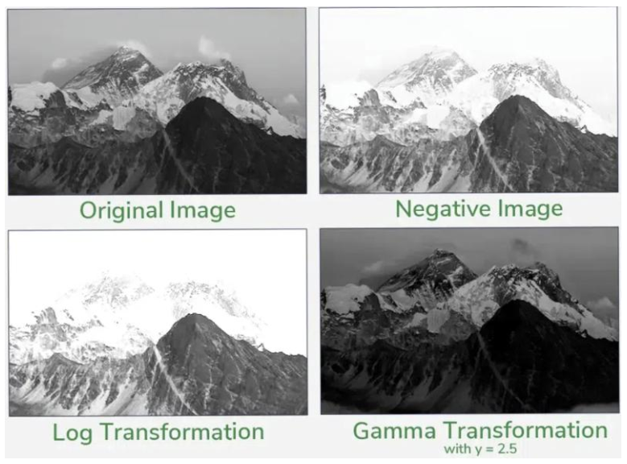

</div>
</div>
<ul>

  - **Biến đổi Log (Log Transformations)**: $s = c \log(1 + r)$
    - Ứng dụng: Mở rộng dải giá trị pixel tối, nén dải giá trị pixel sáng. Thường dùng để hiển thị phổ Fourier.

</ul>

---
<!--_class: text-2xs-->

# Biến đổi cường độ (2)

<div class="columns">
<div>

- **Biến đổi Lũy thừa/Gamma**: $s = c r^\gamma$
  - $\gamma < 1$: Mở rộng vùng tối, nén vùng sáng.
  - $\gamma > 1$: Nén vùng tối, mở rộng vùng sáng.
  - $\gamma = 1$: Biến đổi tuyến tính.

</div>
<div class="col-2">


</div>
</div>
<div class="columns">
<div class="col-2">
<ul>

- Ứng dụng: Hiệu chỉnh Gamma cho màn hình CRT, LCD, máy in.

</ul>

- **Biến đổi hàm bậc thang (Piecewise-Linear Transformation)**:
  - Chia dải giá trị pixel thành các đoạn tuyến tính khác nhau, cho phép điều chỉnh độ tương phản theo từng khoảng mức xám cụ thể.
  - 3 phương pháp chính:
    - **Tăng độ tương phản**: Làm nổi bật sự khác biệt giữa các mức xám.
    - **Cắt mức xám (Gray-level slicing)**: Làm nổi bật một dải mức xám cụ thể (ví dụ: khối u trong ảnh y tế).

</div>
<div>

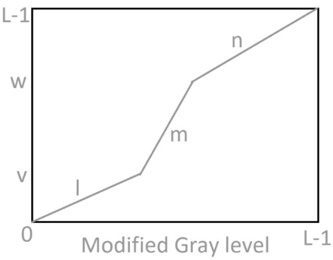

</div>
</div>
<ul>
<ul>

- **Trích xuất bit (Bit-plane slicing)**: Phân tích sự đóng góp của từng bit trong byte biểu diễn pixel.

</ul>
</ul>

---

# Biến đổi cường độ - Bài tập thực hành

- Viết code Python sử dụng OpenCV để tạo ảnh âm bản và biến đổi Gamma.

```python
import cv2
import numpy as np
import matplotlib.pyplot as plt

# Đọc ảnh grayscale
img = cv2.imread('input.jpg', cv2.IMREAD_GRAYSCALE)

# 1. Ảnh âm bản
negative = 255 - img

# 2. Biến đổi Gamma (gamma = 0.5)
gamma = 0.5
lookUpTable = np.empty((1,256), np.uint8)
for i in range(256):
    lookUpTable[0,i] = np.clip(pow(i / 255.0, gamma) * 255.0, 0, 255)
gamma_img = cv2.LUT(img, lookUpTable)

# Hiển thị
titles = ['Gốc', 'Âm bản', f'Gamma={gamma}']
images = [img, negative, gamma_img]
for i in range(3):
    plt.subplot(1, 3, i+1), plt.imshow(images[i], cmap='gray')
    plt.title(titles[i]), plt.axis('off')
plt.show()
```

---

# Lọc không gian (Spatial Filtering)

- **Định nghĩa**: Là kỹ thuật thay đổi giá trị của một pixel dựa trên giá trị của các pixel lân cận xung quanh nó. Là công cụ chủ chốt để làm mịn ảnh hoặc làm nét ảnh.

<div class="columns">
<div>

- **Cơ chế hoạt động**:
  - Sử dụng một mặt nạ nhỏ (Kernel) "trượt" qua từng pixel của ảnh gốc.
  - Giá trị pixel mới $g(x, y)$ tại vị trí $(x, y)$:
    $g(x, y) = \sum_{s=-a}^{a} \sum_{t=-b}^{b} w(s, t) f(x+s, y+t)$
  - $f$: Ảnh đầu vào.
  - $w$: Các trọng số trong Kernel.
  - $a, b$: Các tham số xác định kích thước Kernel (ví dụ với Kernel $3 \times 3$, $a = b = 1$).

</div>
<div>

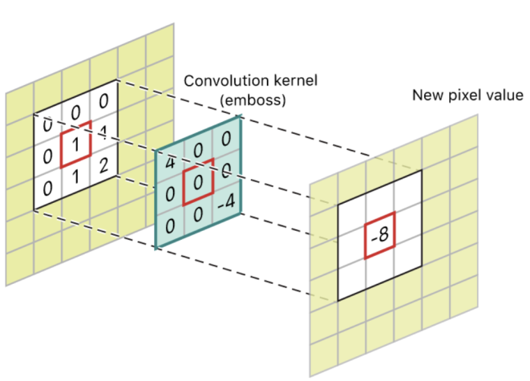

</div>
</div>

- **Lưu ý**: Kích thước mặt nạ thường là lẻ ($3 \times 3, 5 \times 5, 7 \times 7, ...$) để có một pixel trung tâm xác định.

---

# Phân loại bộ lọc không gian

- Bộ lọc làm mịn (Smoothing Filters)
  - **Tên gọi khác**: Bộ lọc thông thấp (Low-pass filters).
  - **Mục đích**: Làm mờ ảnh (blurring) và **giảm nhiễu** (noise reduction).
  - **Đặc điểm**: Làm giảm các chuyển tiếp đột ngột về mức xám, giúp ảnh mượt hơn nhưng cũng làm mất đi các chi tiết sắc nét.
- Bộ lọc làm nét (Sharpening Filters)
  - **Tên gọi khác**: Bộ lọc thông cao (High-pass filters).
  - **Mục đích**: Làm nổi bật các chi tiết nhỏ, **tăng cường biên** (edges) và làm rõ các chi tiết đã bị mờ.
  - **Đặc điểm**: Làm tăng độ tương phản ở các vùng có sự thay đổi đột ngột về cường độ sáng (biên của đối tượng).

---

# Bộ lọc làm mịn (Smoothing/Lowpass Filters)

- **Mục đích**: Làm mờ ảnh để giảm nhiễu hoặc làm mất đi các chi tiết nhỏ không mong muốn.
- **Bộ lọc trung bình (Mean/Box Filter)**:
  - Các trọng số trong Kernel bằng nhau ($1/N$) $\rightarrow$ giá trị pixel mới là trung bình cộng các pixel xung quanh.
- **Bộ lọc Gaussian**:
  - Các trọng số tuân theo phân phối hình chuông (pixel gần tâm có trọng số cao hơn).
  - Công thức trọng số: $G(x, y) = K e^{-(x^2 + y^2) / 2\sigma^2}$
  - $\sigma$: Độ lệch chuẩn, quyết định độ rộng của kernel, kiểm soát mức độ làm mờ.
- **Bộ lọc trung vị (Median Filter)**:
  - Thay thế giá trị pixel bằng trung vị của các giá trị trong vùng lân cận thay vì tính trung bình.
  - Ưu điểm: Khử nhiễu muối tiêu (salt-and-pepper noise) cực tốt mà không làm mờ biên.

---

# Ví dụ Mean Kernel

- **Mean Kernel $3 \times 3$**:
  - Giá trị mỗi phần tử trong kernel: $h(x, y) = \frac{1}{M \times N} = \frac{1}{9}$
  - Kernel:
  <span>
  
  $$
  \begin{bmatrix} 1/9 & 1/9 & 1/9 \\ 1/9 & 1/9 & 1/9 \\ 1/9 & 1/9 & 1/9 \end{bmatrix}
  $$
  
  </span>
- **Mean Kernel $5 \times 5$**:
  - Giá trị mỗi phần tử trong kernel: $h(x, y) = \frac{1}{M \times N} = \frac{1}{25} = 0.04$
  - Kernel: Ma trận $5 \times 5$ với mỗi phần tử là $0.04$.

<span>

$$
\begin{bmatrix}
0.04 & 0.04 & 0.04 & 0.04 & 0.04 \\
0.04 & 0.04 & 0.04 & 0.04 & 0.04 \\
0.04 & 0.04 & 0.04 & 0.04 & 0.04 \\
0.04 & 0.04 & 0.04 & 0.04 & 0.04 \\
0.04 & 0.04 & 0.04 & 0.04 & 0.04
\end{bmatrix}
$$

</span>

---

# Ví dụ Gaussian Kernel

- **Kernel Gaussian $3 \times 3$ với $\sigma = 1$**:
  - $G(x, y) = e^{-(x^2 + y^2) / 2}$
  - Tính giá trị tại các điểm:

  <div class="columns">
  <div>

  <ul>

  - Tâm $(0,0)$: $e^0 = 1$
    
  </ul>

  </div>
  <div class="col-2">

  <ul>

    - Cạnh $(1,0), (0,1), ...$: $e^{-1/2} \approx 0.6065$
    - Góc $(1,1), ...$: $e^{-1} \approx 0.3679$

  </ul>
  </div>
  </div>
  <div class="columns">
  <div>

  - Ma trận chưa chuẩn hoá:
  <span>$\begin{bmatrix} 0.3679 & 0.6065 & 0.3679 \\ 0.6065 & 1 & 0.6065 \\ 0.3679 & 0.6065 & 0.3679 \end{bmatrix}$</span>
  - Tổng trọng số: $S = 4 \times 0.3679 + 4 \times 0.6065 + 1 = 4.8976$

  </div>
  <div>
  
  - Chuẩn hoá (chia cho S):
    <span>$\begin{bmatrix} 0.075 & 0.124 & 0.075 \\ 0.124 & 0.204 & 0.124 \\ 0.075 & 0.124 & 0.075 \end{bmatrix}$</span>

  - Thường được làm tròn để dễ tính toán.

  </div>
  </div>
  

---
<!--_class: text-2xs-->

# Tổng hợp các bộ lọc làm mịn

| Tiêu chí           | Lọc trung bình (Mean)                             | Lọc Gaussian                                            | Lọc trung vị (Median)                               |
| ------------------ | ------------------------------------------------- | ------------------------------------------------------- | --------------------------------------------------- |
| **Nguyên lý**      | Trung bình cộng các pixel trong cửa sổ.           | Tổng có trọng số theo hàm Gaussian.                     | Giá trị trung vị sau khi sắp xếp.                   |
| **Loại lọc**       | Tuyến tính, thông thấp                            | Tuyến tính, thông thấp                                  | Phi tuyến (dựa trên thứ tự)                         |
| **Ưu điểm**        | Đơn giản, tính toán nhanh.                        | Làm mờ tự nhiên, kiểm soát được mức độ mờ qua $\sigma$. | Khử nhiễu muối tiêu tốt, giữ biên rất tốt.          |
| **Nhược điểm**     | Làm mờ tất cả chi tiết, nhạy với nhiễu muối tiêu. | Vẫn làm mờ biên, tốn thời gian hơn.                     | Không hiệu quả với nhiễu Gaussian, độ phức tạp cao. |
| **Nhiễu tốt nhất** | Nhiễu Gaussian (mịn, nhẹ)                         | Nhiễu Gaussian (tự nhiên nhất)                          | Nhiễu muối tiêu (chấm trắng/đen)                    |
| **Tác động biên**  | Làm mờ biên mạnh                                  | Làm mờ biên vừa phải                                    | Hầu như giữ nguyên biên                             |
| **Ứng dụng**  | Tiền xử lý nhanh; làm mờ chủ ý.                                  | Làm mờ trong nhiếp ảnh; tạo không gian tỉ lệ.                                    | Khử nhiễu ảnh y tế, văn bản, ảnh scan.                            |

---

# Bộ lọc làm nét (Sharpening/Highpass Filters)

<div class="columns">
  <div class="col-3">
    
- **Mục đích**: Làm nổi bật các cạnh và các chi tiết sắc nét trong ảnh.
- **Cơ sở toán học**:
  - **Đạo hàm bậc 1**:
    - Bằng 0 ở vùng cường độ không đổi.
    - Khác 0 tại điểm bắt đầu/kết thúc của bước nhảy (step) hoặc dốc (ramp).
    - Khác 0 dọc theo vùng dốc $\rightarrow$ Tạo ra cạnh dày.

  </div>
  <div class="col-2">
  <br/>
    
    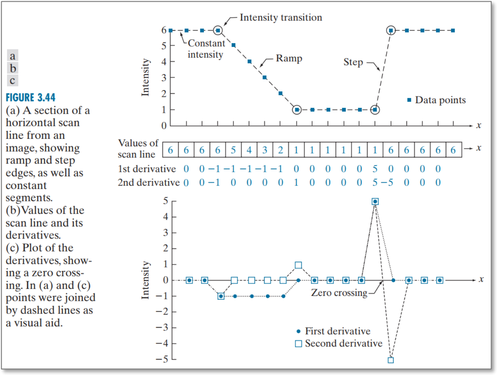

  </div>
</div>

  - **Đạo hàm bậc 2**:
    - Bằng 0 ở vùng cường độ không đổi.
    - Khác 0 tại điểm bắt đầu và kết thúc của bước nhảy/dốc.
    - Bằng 0 dọc theo vùng dốc $\rightarrow$ Tạo ra cạnh mỏng (1 pixel), có tính chất "zero-crossing", rất tốt để làm nét chi tiết nhỏ.

---

# Bộ lọc Laplacian (1)

- **Nguyên lý**:
  - Nếu coi ảnh là một bề mặt độ sáng: Vùng đồng nhất $\rightarrow$ độ sáng thay đổi rất ít. Vùng biên $\rightarrow$ độ sáng thay đổi đột ngột.
  - Bộ lọc Laplace đo mức độ thay đổi này bằng đạo hàm bậc hai: $\nabla^2 f(x, y) = \frac{\partial^2 f}{\partial x^2} + \frac{\partial^2 f}{\partial y^2}$

- **Trong ảnh số**:
  - Đạo hàm được xấp xỉ bằng sai phân hữu hạn: $f''(x) \approx \frac{f(x+h) - 2f(x) + f(x-h)}{h^2}$
  - Từ phép xấp xỉ này để tính kernel Laplace.

<div class="columns">
<div>
<ul>
  
- Kernel Laplacian cơ bản $3 \times 3$:
  <span>$\begin{bmatrix} 0 & 1 & 0 \\ 1 & -4 & 1 \\ 0 & 1 & 0 \end{bmatrix}$ hoặc $\begin{bmatrix} 1 & 1 & 1 \\ 1 & -8 & 1 \\ 1 & 1 & 1 \end{bmatrix}$</span>

</ul>
</div>
<div>
  
  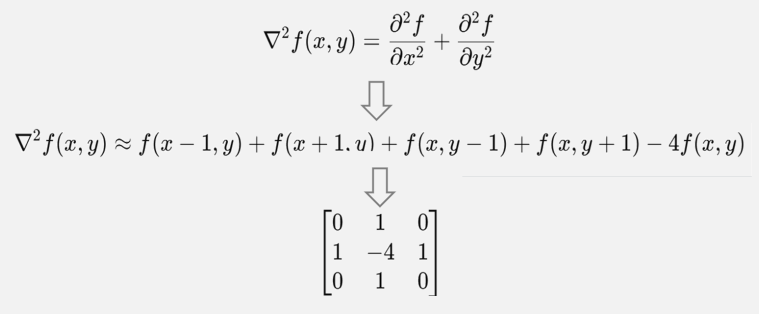

</div>
</div>


---

# Bộ lọc Laplacian (2)

- **Phát hiện biên bằng Laplace**:
  - Nếu chỉ lấy kết quả Laplace: $g(x, y) = \nabla^2 f(x, y)$ ta thu được ảnh biên (các đường viền mảnh).
- **Làm nét ảnh**:
  - Ta thường cộng (hoặc trừ, tùy dấu của tâm kernel) ảnh gốc với ảnh kết quả của bộ lọc Laplacian:     $g(x, y) = f(x, y) + c * \nabla^2 f(x, y)$ , $c = \pm 1$
  - Nếu tâm kernel là số âm ($-4$), cộng ($c = -1$). Nếu tâm là số dương ($4$), trừ ($c = 1$).

<div style="margin-top:20px">

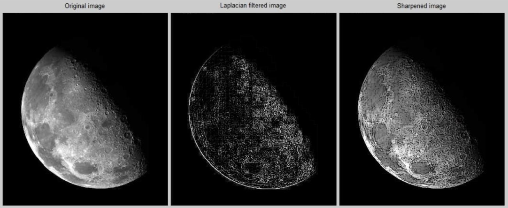

</div>

---

# Các bước làm sắc nét ảnh với bộ lọc Laplace

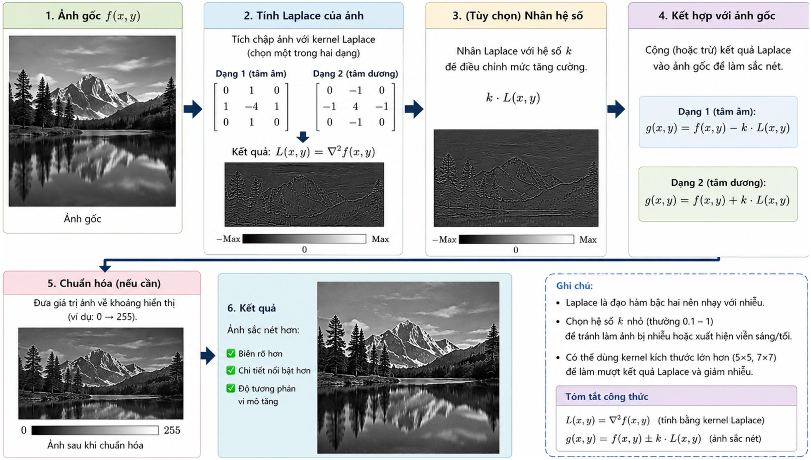

---

# Bộ lọc Laplacian - Bài tập thực hành

Làm nét ảnh bằng Laplacian trong OpenCV.

```python
import cv2
import numpy as np

img = cv2.imread('input.jpg', cv2.IMREAD_GRAYSCALE)

# Tính Laplacian
laplacian = cv2.Laplacian(img, cv2.CV_64F)

# Làm nét: Ảnh gốc - Laplacian (do tâm kernel mặc định là âm)
sharpened = img - laplacian
sharpened = np.clip(sharpened, 0, 255).astype(np.uint8)
```

---

# Bộ lọc Gradient (Đạo hàm bậc một - Sobel, Prewitt)

- **Nguyên lý**: Sử dụng đạo hàm bậc một để tính toán độ dốc (độ lớn) của cường độ: $\nabla f(x, y) = \left[ \frac{\partial f}{\partial x}, \frac{\partial f}{\partial y} \right]^T$
- **Toán tử Sobel**:
  - Sử dụng hai kernel để tính đạo hàm theo 2 hướng ngang $(G_x)$ và dọc $(G_y)$.
  - Sobel Kernel:
    <span>$G_x = \begin{bmatrix} -1 & 0 & 1 \\ -2 & 0 & 2 \\ -1 & 0 & 1 \end{bmatrix}$, $G_y = \begin{bmatrix} -1 & -2 & -1 \\ 0 & 0 & 0 \\ 1 & 2 & 1 \end{bmatrix}$</span>
- **Độ lớn của gradient** (độ mạnh của biên):
  - $M(x, y) = \sqrt{G_x^2 + G_y^2}$ hoặc xấp xỉ $|G_x| + |G_y|$

---

# Các bước làm sắc nét ảnh với bộ lọc Gradient

1. Tính đạo hàm theo hướng ngang $G_x$ bằng kernel Sobel/Prewitt tương ứng.
2. Tính đạo hàm theo hướng dọc $G_y$ bằng kernel Sobel/Prewitt tương ứng.
3. Tính độ lớn gradient $M(x, y) = \sqrt{G_x^2 + G_y^2}$.
4. (Tùy chọn) Cộng độ lớn gradient này vào ảnh gốc để làm nét: $g(x, y) = f(x, y) + c \cdot M(x, y)$.
---

# Bài tập thực hành

Phát hiện biên với Sobel.

```python
import cv2
import numpy as np

img = cv2.imread('input.jpg', cv2.IMREAD_GRAYSCALE)

# Tính Sobel
sobelx = cv2.Sobel(img, cv2.CV_64F, 1, 0, ksize=3)
sobely = cv2.Sobel(img, cv2.CV_64F, 0, 1, ksize=3)

# Độ lớn gradient
magnitude = np.sqrt(sobelx**2 + sobely**2)
magnitude = np.clip(magnitude, 0, 255).astype(np.uint8)
```

---

# Unsharp Masking & Highboost Filtering

<div class="columns">
<div>

- **Định nghĩa**: Là kỹ thuật làm nét ảnh dựa trên nguyên tắc tạo mặt nạ từ ảnh làm mờ và cộng lại với ảnh gốc.
- **Quy trình cổ điển trong nhiếp ảnh**:
  1. Làm mờ ảnh gốc: $f_{blur}$
  2. Tạo mặt nạ (mask): $mask = f - f_{blur}$ (Phần chi tiết bị mất đi do làm mờ)
  3. Cộng mặt nạ trở lại ảnh gốc: $g = f + k \cdot mask$

</div>
<div>
  
  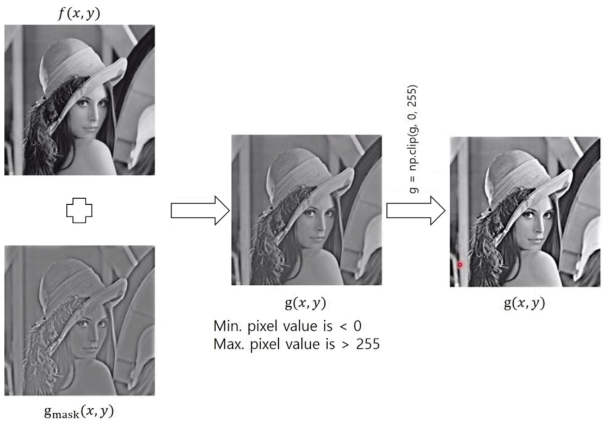

</div>
</div>

- **Phân loại**:
  - Nếu $k = 1$: **Unsharp masking** (Làm nét tiêu chuẩn).
  - Nếu $k > 1$: **Highboost filtering** (Tăng cường độ làm nét mạnh hơn).

---

# Làm nét ảnh với Unsharp Masking & Highboost Filtering

- **Công thức tổng quát**: $g(x, y) = f(x, y) + k \cdot (f(x, y) - f_{blur}(x, y))$
  $g(x, y) = (1 + k) f(x, y) - k \cdot f_{blur}(x, y)$

<div class="columns">
<div class="col-2">

- **Đặc điểm**:
  - Unsharp Masking
   ($k=1$): $g = 2f - f_{blur}$
  - Highboost Filtering
   ($k>1$): $g = A \cdot f - f_{blur}$ (với $A = 1 + k > 2$)
  - Giúp kiểm soát mức độ làm nét, kết quả tự nhiên hơn so với Laplacian.

</div>
<div class="col-3">

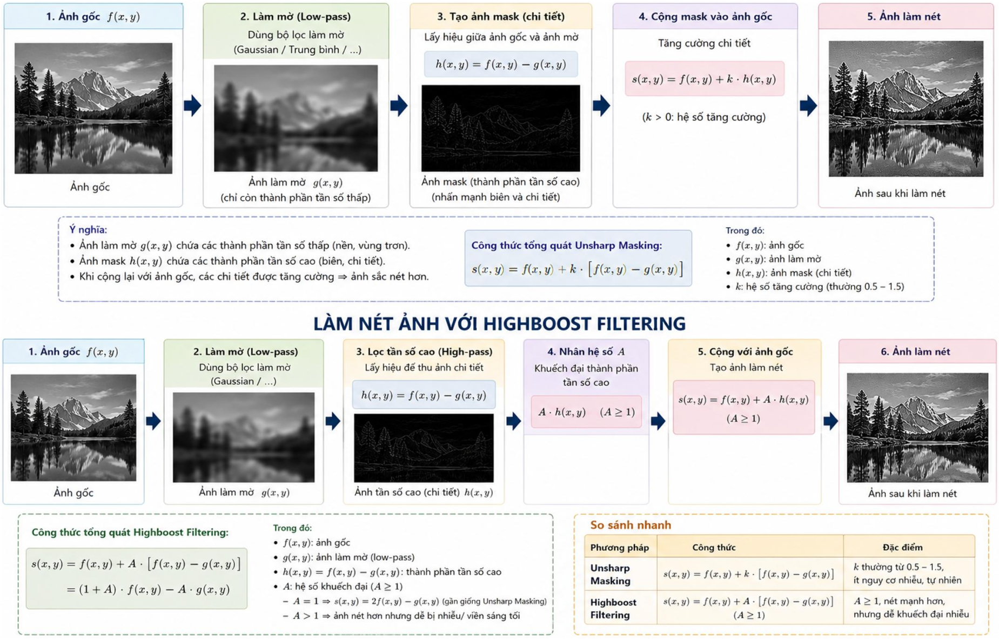

</div>
</div>

---
<!--_class: text-2xs-->

# Tổng hợp các bộ lọc làm nét

| Bộ lọc               | Nguyên lý                                                    | Ưu điểm                                                   | Nhược điểm                                                   | Ứng dụng                                     |
| -------------------- | ------------------------------------------------------------ | --------------------------------------------------------- | ------------------------------------------------------------ | -------------------------------------------- |
| **Laplace**          | Đạo hàm bậc hai, tính tổng biến thiên theo x và y.           | Đẳng hướng; dùng một mặt nạ duy nhất; tính toán nhanh.    | Rất nhạy với nhiễu; tạo biên kép; không cho biết hướng biên. | Làm nét nhanh; phát hiện biên zero-crossing. |
| **Gradient (Sobel)** | Đạo hàm bậc nhất theo hai hướng.                             | Cho cả độ lớn và hướng biên; chống nhiễu tốt hơn Laplace. | Làm nét trực tiếp kém hiệu quả; chậm hơn Laplace.            | Phát hiện biên trong thị giác máy tính.      |
| **Unsharp Masking**  | Ảnh gốc trừ ảnh đã làm mờ, cộng lại với hệ số k.             | Kiểm soát mức độ làm nét; ít nhiễu hơn Laplace; tự nhiên. | Cần chọn bán kính làm mờ phù hợp; dễ tạo quầng sáng (halo).  | Photoshop, in ấn, xuất bản.                  |
| **Highboost**        | Mở rộng của USM, nhân thành phần tần số cao với hệ số A > 1. | Làm nét mạnh; điều chỉnh từ tự nhiên đến siêu nét.        | Dễ tạo quầng sáng/nhiễu nếu A quá lớn.                       | Ảnh viễn thám, thiên văn, y tế.              |

---
<!--_class: section-->

# Xử lý Histogram

---

# Histogram là gì?

<div class="columns">
<div class="col-2">

- **Định nghĩa**: Biểu đồ thể hiện tần suất xuất hiện của các mức cường độ trong ảnh.
  - $h(r_k) = n_k$: Số lượng pixel có mức cường độ $r_k$.
  - $p(r_k) = n_k / (M \times N)$: Histogram chuẩn hóa - xác suất xuất hiện cường độ $r_k$.
- **Mối liên hệ với ảnh**:
  - **Ảnh tối**: Histogram tập trung ở phía trái (giá trị thấp).
  - **Ảnh sáng**: Histogram tập trung ở phía phải (giá trị cao).
  - **Ảnh tương phản thấp**: Histogram hẹp, tập trung ở giữa.
  - **Ảnh tương phản cao**: Histogram trải rộng và phân bố đều.

</div>
<div>

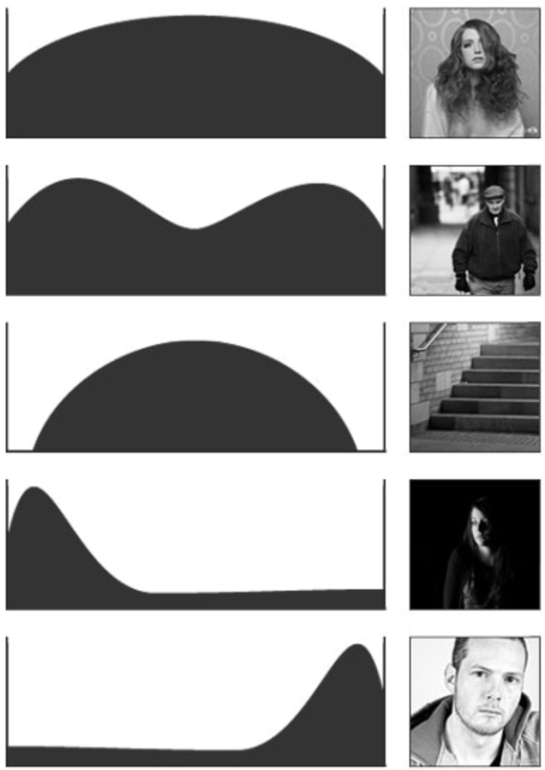

</div>
</div>


---

# Tại sao cần xử lý Histogram

- **Tăng cường ảnh**: Giúp ảnh dễ nhìn hơn, làm nổi bật chi tiết ẩn trong các vùng bị tối hoặc quá sáng.
- **Chuẩn hóa**: Đưa các ảnh chụp trong điều kiện ánh sáng khác nhau về cùng một trạng thái để phục vụ cho các thuật toán thị giác máy tính phía sau (như nhận diện vật thể).
- **Phân đoạn ảnh (Thresholding)**: Histogram giúp xác định ngưỡng (threshold) tốt nhất để tách biệt đối tượng và nền (ví dụ: dùng phương pháp Otsu dựa trên Histogram).

---

# Cân bằng Histogram (Histogram Equalization)
- **Mục tiêu**: Tự động tạo ra ảnh có histogram phân bố đều (uniform), từ đó tăng cường tương phản toàn cục.

<div class="columns">
<div class="col-2">

- **Công thức rời rạc**:
  $s_k = T(r_k) = (L - 1) \sum_{j=0}^{k} p(r_j)$
  - $s_k$: Mức cường độ đầu ra.
  - $L$: Số mức cường độ (ví dụ: 256).
  - $\sum p(r_j)$: Hàm phân phối tích lũy (CDF).
- **Hạn chế**:
  - Có thể làm nổi bật nhiễu nền.
  - Không phải lúc nào cũng tạo ra histogram phẳng hoàn hảo do làm tròn số nguyên.
  - Đôi khi làm mất chi tiết ở các vùng có tần suất xuất hiện cao.

</div>
<div>

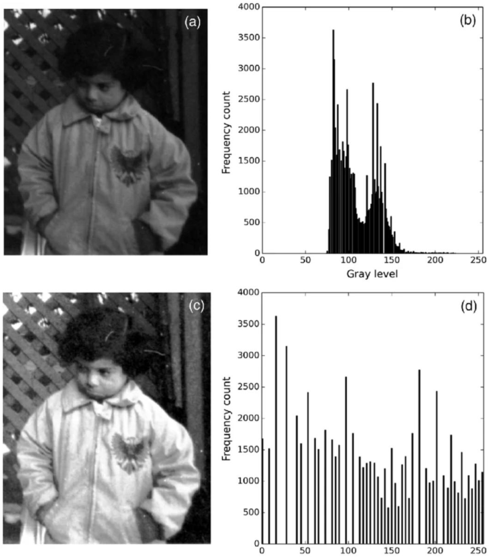

</div>
</div>

---

# Bài tập thực hành

Cân bằng histogram với OpenCV.

```python
import cv2
import matplotlib.pyplot as plt

img = cv2.imread('input.jpg', cv2.IMREAD_GRAYSCALE)

# Cân bằng histogram
eq_img = cv2.equalizeHist(img)

# Vẽ histogram
plt.figure(figsize=(10, 5))
plt.subplot(121), plt.hist(img.ravel(), 256, [0, 256]), plt.title('Histogram Gốc')
plt.subplot(122), plt.hist(eq_img.ravel(), 256, [0, 256]), plt.title('Histogram Sau cân bằng')
plt.show()
```

---

# Khớp Histogram (Histogram Matching/Specification)

- **Mục tiêu**: Biến đổi ảnh đầu vào để có histogram gần giống với một histogram mục tiêu được chỉ định trước.

<div class="columns">
<div>

- **Quy trình**:
  1. Cân bằng histogram ảnh đầu vào $f$ để được $s$.
  2. Cân bằng histogram mục tiêu $z$ để được $v$.
  3. Ánh xạ ngược từ $s$ sang $z$ sao cho $v \approx s$ (tìm giá trị $z$ gần nhất với $s$).
- **Ứng dụng**: Rất hữu ích khi cần chuẩn hóa ảnh theo một mẫu chuẩn, ví dụ trong xử lý ảnh y tế hoặc vệ tinh.

</div>
<div>

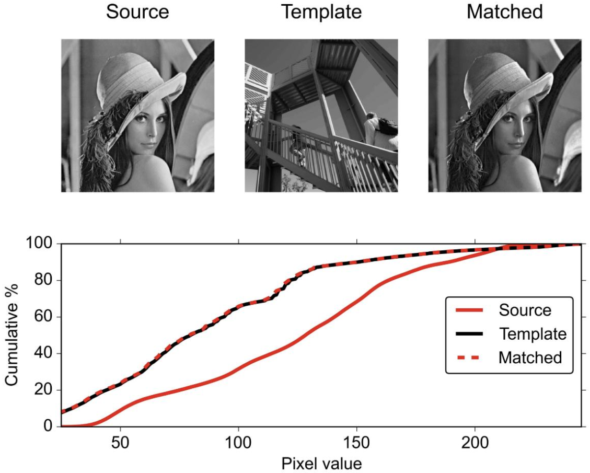

</div>
</div>

---

# Xử lý Histogram cục bộ (Local Histogram Processing)

- **Vấn đề**: Cân bằng toàn cục (global) có thể làm hỏng chi tiết ở các vùng nhỏ hoặc làm sáng quá mức các vùng vốn đã sáng.

<div class="columns">
<div class="col-3">

- **Giải pháp**:
  - Di chuyển một cửa sổ lân cận (ví dụ $3 \times 3$, $5 \times 5$) khắp ảnh.
  - Tính histogram cục bộ và áp dụng biến đổi cho pixel trung tâm.

</div>
<div class="col-4">
<br/>

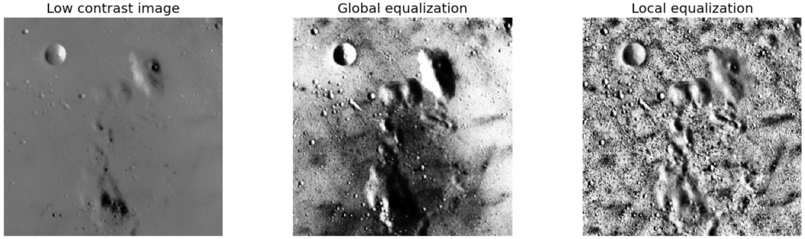

</div>
</div>

- **Thống kê Histogram**:
  - Sử dụng **Mean (trung bình)** và **Variance (phương sai)** cục bộ để phát hiện vùng tối/thấp tương phản.
  - Chỉ tăng cường những vùng đó (tránh khuếch đại nhiễu ở vùng sáng).
- **Lưu ý**: Cách này tốn nhiều tài nguyên tính toán hơn so với cân bằng toàn cục.


---
<!--_class: section-->

# BIẾN ĐỔI TRONG MIỀN TẦN SỐ

---

# Giới thiệu

- Ngoài việc xử lý trực tiếp trên các pixel (miền không gian), chúng ta có thể chuyển ảnh sang miền tần số để thực hiện các phép lọc phức tạp hơn.
- Miền tần số cung cấp một cái nhìn khác về ảnh, dựa trên các thành phần tần số thay vì vị trí pixel.

---

# Biến đổi Fourier

- **Khái niệm**: Mọi tín hiệu phức tạp, dù hỗn độn đến đâu, đều có thể được tạo ra bằng cách cộng các sóng hình sin (sine) và cosin (cosine) đơn giản, có tần số khác nhau, lại với nhau.
- **Miền không gian**: Nhìn ảnh dưới dạng các điểm ảnh (pixel) với giá trị màu sắc/độ sáng tại tọa độ $(x, y)$.
- **Miền tần số**: Ảnh là tổng hợp của các sóng sin và cosin với các tần số, biên độ và pha khác nhau.
- **Biến đổi Fourier (FT)**: Công cụ toán học chuyển tín hiệu từ miền không gian/thời gian sang miền tần số.
- **Công thức toán học biến đổi Fourier rời rạc 2D (2D DFT)**:
$F(u, v) = \sum_{x=0}^{M-1} \sum_{y=0}^{N-1} f(x, y) \cdot e^{-j 2\pi (\frac{ux}{M} + \frac{vy}{N})}$
  - $f(x, y)$: Giá trị pixel tại vị trí $(x, y)$ (miền không gian).
  - $F(u, v)$: Giá trị phức tại tần số $(u, v)$ (miền tần số).
  - $M, N$: Kích thước ảnh

---

# Ý nghĩa của phổ Fourier (Kết quả sau biến đổi)
- Khi thực hiện biến đổi Fourier trên một ảnh sẽ nhận được phổ Fourier, thường được biểu diễn dưới dạng một ảnh khác.

<div class="columns">
<div class="col-5">

- **Tâm của ảnh phổ**: Đại diện cho tần số thấp nhất (0) – tức là độ sáng trung bình của toàn bộ ảnh (thành phần DC). Điểm này thường rất sáng.
- **Càng xa tâm**: Đại diện cho tần số càng cao. Các điểm sáng ở xa tâm thể hiện các chi tiết sắc nét, các cạnh, đường biên hoặc nhiễu.
- **Hai thành phần quan trọng**:
  - **Phổ biên độ (Magnitude Spectrum)**: Cho biết các tần số nào có mặt và "mạnh" đến mức nào.
  - **Phổ pha (Phase Spectrum)**: Cho biết vị trí của các tần số đó trong ảnh. (Pha cực kỳ quan trọng, nếu mất pha sẽ không khôi phục được ảnh gốc).

</div>
<div>

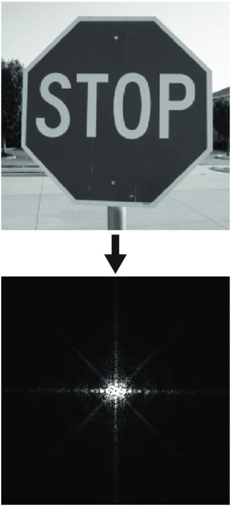

</div>
</div>

---

# Các tính chất của 2D DFT

- **Tính tuần hoàn (Periodicity)**: Phổ Fourier có tính tuần hoàn, dữ liệu lặp lại $\rightarrow$ khi hiển thị phổ thường phải dịch tâm (Shift) để thấy rõ các tần số thấp ở giữa.
- **Tính đối xứng liên hợp (Conjugate Symmetry)**: Đối với ảnh thực, phổ $F(u, v)$ có tính đối xứng qua tâm: $F(u, v) = F^*(-u, -v)$.
- **Tính phân tách (Separability)**: 2D DFT có thể tách thành hai lần 1D DFT liên tiếp (theo hàng rồi theo cột). Giúp thuật toán FFT hoạt động cực nhanh.
- **Tính dịch chuyển (Translation)**: Dịch chuyển trong miền không gian chỉ làm thay đổi pha của $F(u, v)$ chứ không làm thay đổi độ lớn (magnitude).

---

# Nguyên lý biến đổi ảnh trong miền TS

- **Nguyên lý chung**:
  1. Lấy ảnh đầu vào $\rightarrow$ Biến đổi Fourier (FFT) $\rightarrow$ Thu được phổ Fourier.
  2. Nhân phổ Fourier với một mặt nạ $H$ (filter/kernel/transfer function) trên miền tần số. Mặt nạ này sẽ "cho qua" hoặc "chặn" một dải tần số nhất định.
  3. Lấy kết quả vừa nhân $\rightarrow$ Biến đổi Fourier ngược (IFFT) $\rightarrow$ Thu được ảnh đầu ra.
- **Định lý tích chập (Convolution Theorem)**:
  - Tích chập trong miền không gian $\Leftrightarrow$ Phép nhân trong miền tần số: $f(t) * h(t) \Leftrightarrow F(\mu)H(\mu)$.
- **Lợi ích**:
  - Sử dụng phép nhân trong miền tần số nhanh hơn phép tích chập trong miền không gian (với các kernel lớn).
  - Cô lập và xử lý các dạng nhiễu "đặc biệt" (nhiễu tuần hoàn) mà miền không gian bất lực.

---

# Lọc thông thấp (Lowpass Filters - LPF)

- **Mục đích**: Giữ lại thành phần tần số thấp, thường dùng để làm mịn, làm mờ và giảm nhiễu trong ảnh.

<div class="columns">
<div class="col-2">

- **Các loại bộ lọc**:
  - **Ideal LPF (ILPF)**: Cắt đột ngột tại $D_0$. Nhược điểm: Gây hiện tượng rung (ringing) nghiêm trọng do biến đổi ngược là hàm sinc.
  - **Gaussian LPF (GLPF)**: $H(u, v) = e^{-D^2(u,v) / 2D_0^2}$. Mượt mà, không gây rung.
  - **Butterworth LPF (BLPF)**: $H(u, v) = \frac{1}{1 + [D(u,v)/D_0]^{2n}}$. Có thể điều chỉnh độ dốc bằng bậc $n$.
- **Lưu ý**:
  - $D(u, v)$: Khoảng cách từ điểm $(u, v)$ đến tâm phổ.
  - $D_0$: Bán kính ngưỡng, bao nhiêu tần số được giữ lại.

</div>
<div>

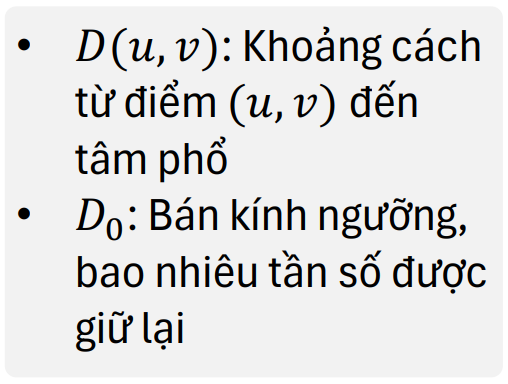

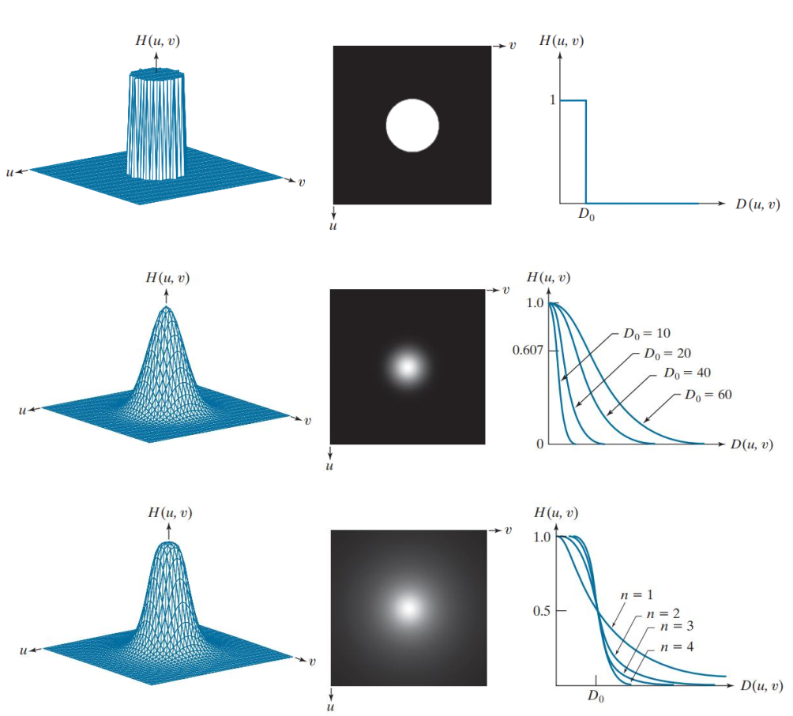

</div>
</div>

---

# Lọc thông cao (Highpass Filters - HPF)

<div class="columns">
<div>

- **Mục đích**: Làm sắc nét (sharpening), nổi bật biên (edge enhancement).
- **Công thức chung**: $H_{HP}(u, v) = 1 - H_{LP}(u, v)$.
- **Các loại kernel**: Ideal HPF, Gaussian HPF, Butterworth HPF.
- **Lưu ý quan trọng**:
  - HPF loại bỏ thành phần DC (giá trị trung bình), làm ảnh đầu ra tối đen.
  - $\rightarrow$ Cần cộng thêm hằng số (Offset) hoặc sử dụng kỹ thuật High-frequency-emphasis để giữ lại độ sáng tổng thể.

</div>
<div>

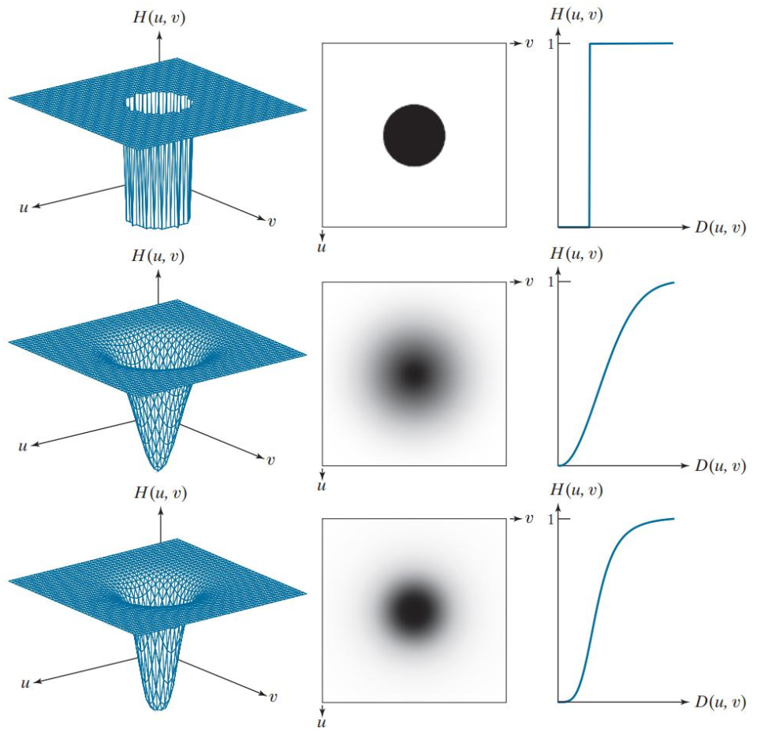

</div>
</div>


---

# Toán tử Laplacian trong miền tần số

- **Hàm truyền**: $H(u, v) = -4\pi^2 D^2(u, v)$.
  - Tại tâm: $D = 0 \implies H = 0$.
  - Xa tâm: $D$ lớn $\implies H$ rất lớn: Laplacian tăng cường mạnh các thành phần tần số cao.
- **Quy trình**:
  - $L(u, v) = H(u, v) F(u, v)$: Phổ Fourier của ảnh Laplace.
  - $l(x, y) = \text{IFFT}\{L(u, v)\}$: Ảnh biên.
  - Tạo ảnh sắc nét (trong miền không gian): $g(x, y) = f(x, y) + c \cdot l(x, y)$.
- **Ưu điểm**: Bao quát toàn bộ ảnh, cho kết quả sắc nét hơn so với kernel Laplacian $3 \times 3$ trong miền không gian.

---

# High-frequency-emphasis

- **Vấn đề**:
  - Tần số thấp $\rightarrow$ vùng trơn, nền ảnh, ánh sáng tổng thể.
  - Tần số cao $\rightarrow$ biên, chi tiết, cạnh, texture.
  - Nếu chỉ dùng high-pass filter ($H_{HP}$), ta sẽ giữ chi tiết tốt nhưng làm mất độ sáng tổng thể (ảnh bị "tối/thiếu tự nhiên").
- **Giải pháp High-frequency-emphasis filter**:
  - Giúp vừa giữ thông tin nền (low frequency), vừa tăng cường chi tiết (high frequency).
  - Công thức: $H(u, v) = a + b \cdot H_{HP}(u, v)$, ($a \ge 0, b > 1$).
  - $a$: Thành phần giữ nền.
  - $b$: Hệ số khuếch đại chi tiết.

---

# Lọc chọn lọc (Selective Filtering)

- **Mục đích**: "Nhắm mục tiêu" vào các dải tần số cụ thể để xử lý các nhiễu phức tạp mà LPF/HPF thông thường không xử lý được.
- **Bộ lọc chặn dải (Band-reject filter)**: Loại bỏ một dải tần số nhất định.
  - Ứng dụng: Loại bỏ nhiễu định kỳ (như các đường sọc gây ra bởi nhiễu điện từ).
- **Bộ lọc thông dải (Band-pass filter)**: Chỉ giữ lại một dải tần số nhất định.
  - Ứng dụng: Tách biệt các đối tượng có kích thước hoặc kết cấu cụ thể.
- **Bộ lọc Notch (Notch filter)**: Chặn hoặc thông qua các tần số xung quanh một điểm cụ thể trong phổ Fourier.
  - Ứng dụng: Loại bỏ các nhiễu có tần số rất hẹp (như tần số 50Hz/60Hz từ ánh sáng đèn huỳnh quang).

---

# Biến đổi Fourier Nhanh (Fast Fourier Transform - FFT)

- **Vấn đề**: Nếu thực hiện biến đổi DFT trực tiếp theo công thức toán học, độ phức tạp tính toán là $O(N^2)$. Với một bức ảnh $1024 \times 1024$, con số này là khổng lồ.
- **Giải pháp FFT**:
  - Là một thuật toán đột phá làm giảm độ phức tạp xuống còn $O(N \log_2 N)$.
  - Cơ chế: Dựa trên phương pháp "Chia để trị" (Divide and Conquer). Chia nhỏ bài toán DFT lớn thành các DFT nhỏ hơn, tính toán chúng, rồi kết hợp lại.
- **Tầm quan trọng**: FFT là "xương sống" của hầu hết các công nghệ xử lý ảnh hiện đại, từ nén ảnh (JPEG) cho đến lọc nhiễu trong video thời gian thực.
---

# Thực hành - Biến đổi ảnh sang miền TS và lọc thông thấp.

```python
import cv2
import numpy as np
import matplotlib.pyplot as plt

img = cv2.imread('input.jpg', cv2.IMREAD_GRAYSCALE)

# 1. Biến đổi Fourier
f = np.fft.fft2(img)
fshift = np.fft.fftshift(f) # Dịch tâm tần số 0 về giữa

# 2. Tạo mặt nạ lọc thông thấp Ideal (hoặc Gaussian)
rows, cols = img.shape
crow, ccol = rows // 2 , cols // 2
D0 = 50 # Bán kính ngưỡng
mask = np.zeros((rows, cols), np.uint8)
for i in range(rows):
    for j in range(cols):
        D = np.sqrt((i - crow)**2 + (j - ccol)**2)
        if D <= D0:
            mask[i, j] = 1

# Áp dụng mặt nạ
fshift_filtered = fshift * mask

# 3. Biến đổi ngược
f_ishift = np.fft.ifftshift(fshift_filtered)
img_back = np.fft.ifft2(f_ishift)
img_back = np.abs(img_back)

# Hiển thị
plt.subplot(131), plt.imshow(img, cmap='gray'), plt.title('Input', axis='off')
plt.subplot(132), plt.imshow(np.log(1 + np.abs(fshift)), cmap='gray'), plt.title('Magnitude Spectrum', axis='off')
plt.subplot(133), plt.imshow(img_back, cmap='gray'), plt.title('After LPF', axis='off')
plt.show()
```

---

# Các bước biến đổi ảnh trong miền tần số

- **Tóm tắt quy trình**:
  1. **Tiền xử lý**: Đọc ảnh, chuyển đổi sang ảnh xám (grayscale) nếu cần, và thêm viền (padding) để tránh hiện tượng wrap-around (gập viền).
  2. **Biến đổi thuận**: Sử dụng FFT (Fast Fourier Transform) để chuyển ảnh từ miền không gian sang miền tần số.
  3. **Dịch tâm (Centering)**: Sử dụng hàm dịch để đưa thành phần tần số 0 (DC component) về trung tâm của phổ.
  4. **Lọc (Filtering)**: Tạo mặt nạ lọc (Filter Mask) và nhân phổ tần số với mặt nạ này (theo định lý tích chập).
  5. **Dịch ngược**: Đưa tâm phổ về lại vị trí ban đầu (góc trên bên trái).
  6. **Biến đổi ngược**: Sử dụng IFFT (Inverse Fast Fourier Transform) để chuyển ảnh từ miền tần số về lại miền không gian.
  7. **Hậu xử lý**: Cắt bỏ phần viền đã thêm, chuẩn hóa giá trị pixel về đoạn $[0, 255]$ để hiển thị.
