---

marp: true
theme: eaut
paginate: true
transition: fade

---
<!--_class: cover-->

<div class="middle">

# XỬ LÝ ẢNH & THỊ GIÁC MÁY TÍNH

## CHƯƠNG 2 - BIẾN ĐỔI ẢNH

</div>

### Giảng viên: Nguyễn Phồn Lữa

---
<!--_class: toc-->

# NỘI DUNG

1. Biến đổi trong miền không gian
2. Histogram
3. Biến đổi trong miền tần số

---

# MỤC TIÊU HỌC TẬP

Sau chương này, sinh viên có thể:

1. **Phân biệt** được miền không gian và miền tần số trong xử lý ảnh.
2. **Thực hiện** các phép biến đổi cường độ để tăng cường ảnh.
3. **Hiểu và áp dụng** các bộ lọc không gian để làm mịn và làm nét ảnh.
4. **Phân tích và xử lý** ảnh dựa trên Histogram.
5. **Hiểu nguyên lý** của biến đổi Fourier 2D.
6. **Thực hiện** lọc ảnh trong miền tần số.
7. **Sử dụng** Python, NumPy, OpenCV và Matplotlib để cài đặt các kỹ thuật cơ bản.

---
<!--_class: section-->

# BIẾN ĐỔI TRONG MIỀN KHÔNG GIAN

---

# HAI CÁCH NHÌN VỀ ẢNH

<div class="columns">
<div class="col-3">

**Miền không gian (Spatial Domain)**

- Làm việc **trực tiếp trên pixel** của ảnh.
- Quan tâm: *Pixel nằm ở đâu và có giá trị bao nhiêu?*
- **Ví dụ:** Biến đổi cường độ, Mean Filter, Gaussian Filter, Median Filter, Sobel, Laplacian.

**Miền tần số (Frequency Domain)**

- Biểu diễn ảnh bằng các **thành phần tần số**.
- Quan tâm: *Ảnh thay đổi nhanh hay chậm?*
- **Ví dụ:** Fourier Transform, Low-pass Filter, High-pass Filter, Band-reject Filter.

</div>
<div class="col-2">

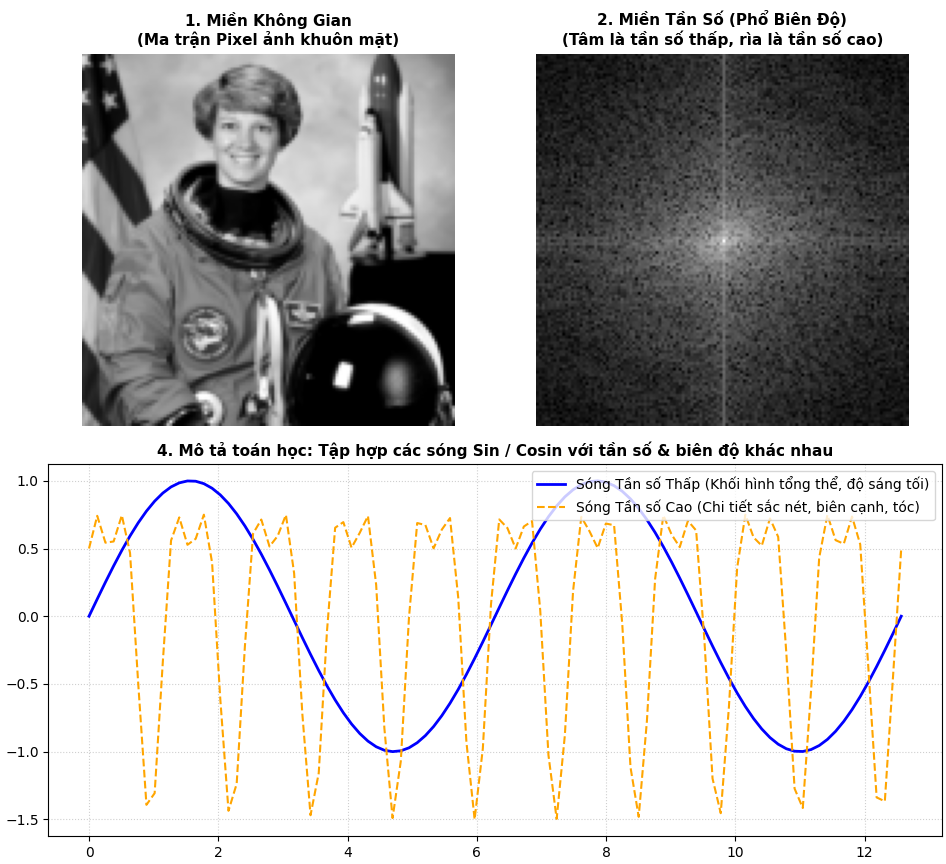

</div>
</div>

- **Ví dụ:** Bức ảnh phi công trong miền không gian là ma trận các pixel; trong miền tần số, nó được mô tả bằng tập hợp các sóng sin/cosin với tần số và biên độ khác nhau.

---

# KHÁI NIỆM MIỀN KHÔNG GIAN

- **Miền không gian (Spatial Domain)** là chính mặt phẳng ảnh, trong đó các phương pháp xử lý tác động **trực tiếp lên các pixel**.
- Hai nhóm biến đổi chính:
    - **Point Processing** (Xử lý điểm): biến đổi từng pixel độc lập.
    - **Neighborhood Processing** (Xử lý lân cận): biến đổi dựa trên vùng lân cận của pixel.
- **Ví dụ:** Khi chỉnh độ sáng của một bức ảnh trên điện thoại → thực hiện Point Processing. Khi dùng chế độ "làm mờ" (blur) → dùng Neighborhood Processing vì giá trị mỗi pixel mới được tính từ các pixel xung quanh.

---

# POINT PROCESSING VÀ NEIGHBORHOOD PROCESSING

**Point Processing**

- Giá trị pixel đầu ra **chỉ phụ thuộc** vào pixel tương ứng ở ảnh đầu vào.
- Công thức: $g(x,y) = T[f(x,y)]$
- **Ví dụ:** Negative, Log, Gamma, Contrast stretching.

**Neighborhood Processing**

- Giá trị pixel đầu ra **phụ thuộc vào một vùng lân cận** quanh pixel đó.
- Công thức: $g(x,y) = T\{f(s,t) \mid (s,t) \in N(x,y)\}$
- **Ví dụ:** Mean Filter, Gaussian Filter, Median Filter, Sobel, Laplacian.

> **Ví dụ minh họa:** Với Point Processing, pixel (x,y) mới chỉ phụ thuộc vào pixel (x,y) cũ. Với Neighborhood Processing, pixel (x,y) mới được tính từ 9 pixel xung quanh (kernel 3x3).

---
<!--_class: subsection-->

# Biến đổi cường độ

---

# BIẾN ĐỔI CƯỜNG ĐỘ (INTENSITY TRANSFORMATION)

- **Định nghĩa:** Là kỹ thuật Point Processing, mỗi pixel được biến đổi độc lập dựa trên giá trị cường độ của chính nó.

<div class="columns">
<div class="col-3">

- **Công thức tổng quát:** $s = T(r)$, trong đó:
  - $r$: cường độ pixel đầu vào
  - $s$: cường độ pixel đầu ra
  - $T$: hàm biến đổi

</div>
<div class="col-2">

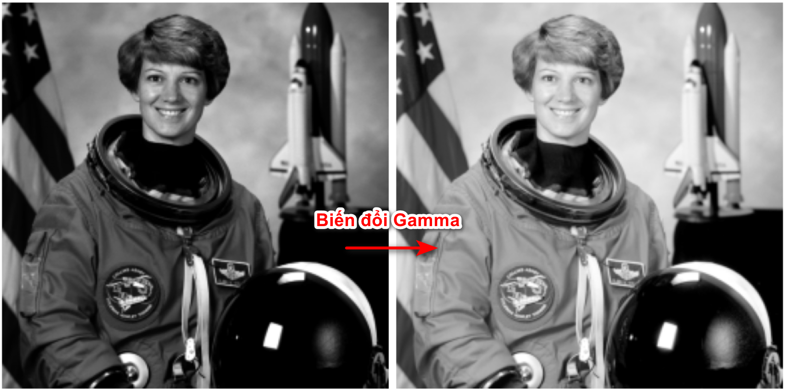

</div>
</div>

- **Mục đích:**
  - Thay đổi độ sáng, tăng hoặc giảm tương phản.
  - Làm nổi bật vùng ảnh quan tâm.
  - Điều chỉnh ảnh phù hợp với thiết bị hiển thị.
- **Ví dụ:** Khi chụp ảnh trong điều kiện thiếu sáng, ta dùng biến đổi Gamma để làm sáng các vùng tối mà không làm cháy sáng các vùng đã sáng.

---

# ẢNH ÂM BẢN (IMAGE NEGATIVE)
<div class="columns">
<div class="col-3">

**Công thức:** $s = L - 1 - r$

Với ảnh 8-bit ($L = 256$): $s = 255 - r$

**Đặc điểm:**

- Pixel sáng → pixel tối, pixel tối → pixel sáng.
- Đảo ngược thứ tự các mức cường độ.

**Ứng dụng:**

- Làm nổi bật chi tiết sáng trong vùng tối.
- Ảnh X-quang và ảnh y tế.
- Ảnh phim âm bản.

</div>
<div class="col-2">

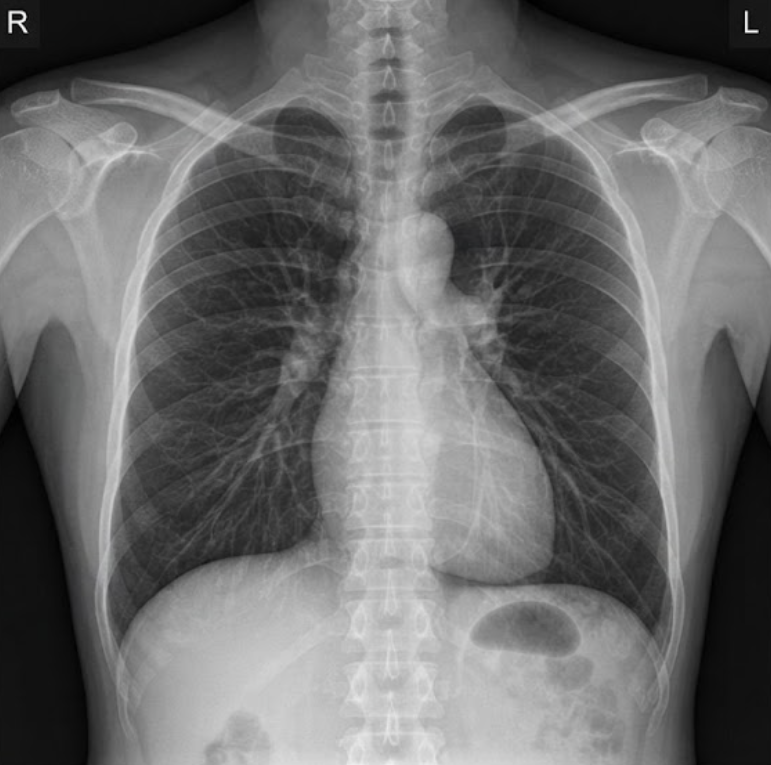

</div>
</div>

> **Ví dụ:** Trên phim X-quang, vùng xương (cản tia) sẽ có màu trắng, vùng mô mềm (cho tia đi qua) có màu đen. Ảnh âm bản giúp bác sĩ quan sát chi tiết dễ hơn.

---

# BIẾN ĐỔI LOGARITHM

<div class="columns">
<div class="col-3">

**Công thức:** $s = c \cdot \log(1 + r)$

**Đặc điểm:**

- **Mở rộng** vùng giá trị cường độ thấp.
- **Nén** vùng giá trị cường độ cao.
- Các chi tiết trong vùng tối được làm nổi bật.

**Ứng dụng:**

- Hiển thị các giá trị có dynamic range lớn.
- Hiển thị Fourier magnitude spectrum.
- Làm nổi bật thông tin trong vùng cường độ thấp.

</div>
<div class="col-2">

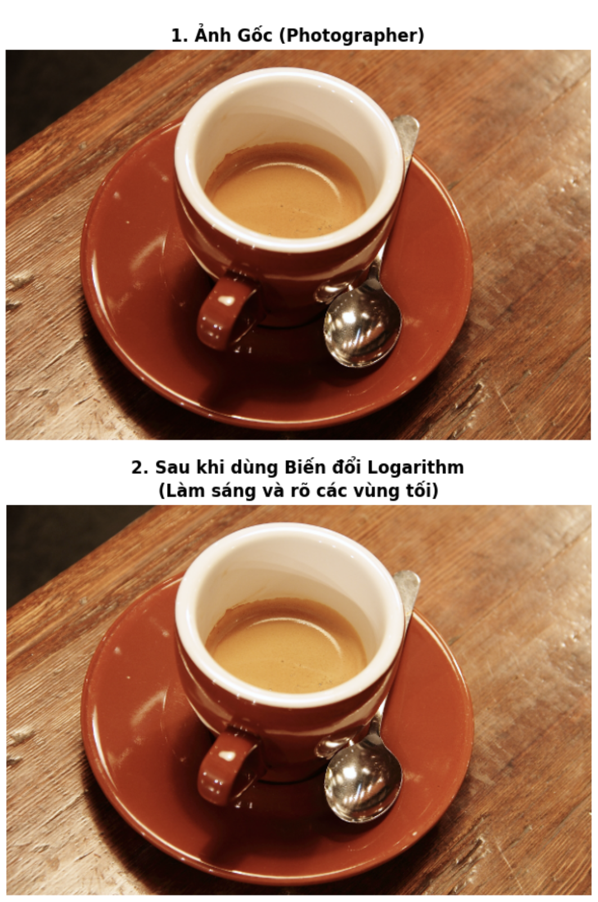

</div>
</div>


---

# BIẾN ĐỔI LŨY THỪA / GAMMA

**Công thức:** $s = c \cdot r^\gamma$

Với $r$ thường được chuẩn hóa về $[0, 1]$.

**Ảnh hưởng của $\gamma$:**

- $\gamma < 1$: mở rộng vùng tối, nén vùng sáng → **ảnh sáng hơn**.
- $\gamma = 1$: biến đổi tuyến tính.
- $\gamma > 1$: nén vùng tối, mở rộng vùng sáng → **ảnh tối hơn**.

**Ứng dụng:** Hiệu chỉnh gamma, điều chỉnh ảnh theo đặc tính thiết bị hiển thị (màn hình CRT, LCD), tiền xử lý ảnh.

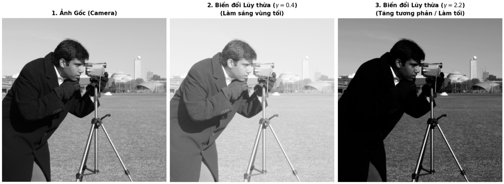

---

# TRỰC QUAN VỀ GAMMA

<div class="columns">
<div>

Đồ thị hàm biến đổi $s = r^\gamma$:

- Đường cong $\gamma < 1$ nằm **phía trên** đường chéo → pixel đầu ra lớn hơn đầu vào → ảnh sáng hơn.
- Đường chéo $\gamma = 1$ là biến đổi tuyến tính.
- Đường cong $\gamma > 1$ nằm **phía dưới** đường chéo → pixel đầu ra nhỏ hơn đầu vào → ảnh tối hơn.

**Ghi nhớ:**

- $\gamma < 1 \Rightarrow$ ảnh sáng hơn
- $\gamma > 1 \Rightarrow$ ảnh tối hơn

> **Lưu ý:** Hiệu ứng cụ thể phụ thuộc vào cách chuẩn hóa và hệ số $c$.

</div>
<div>

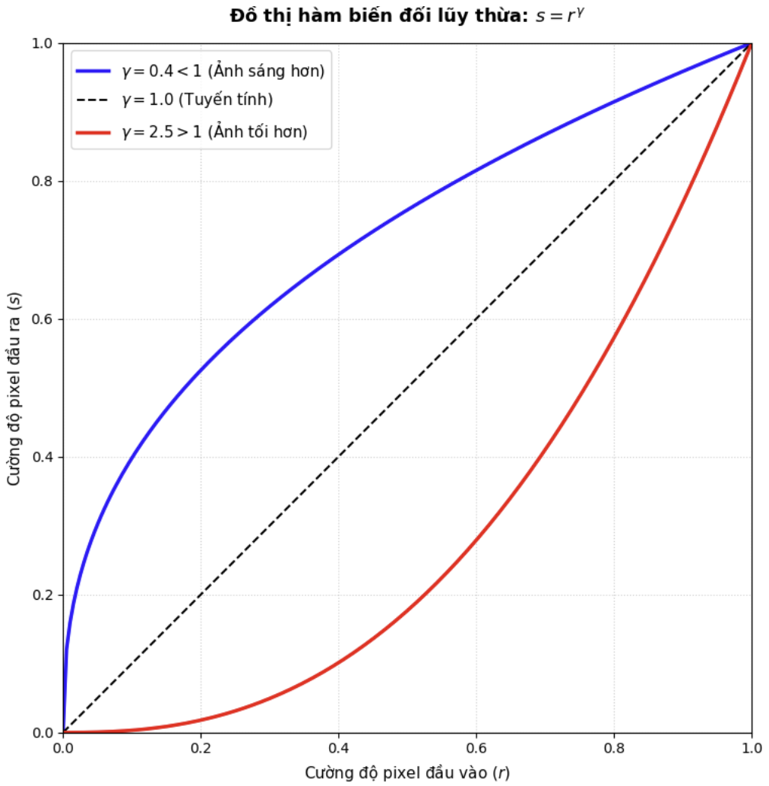

</div>
</div>


---

# BIẾN ĐỔI HÀM BẬC THANG (PIECEWISE-LINEAR)

**Định nghĩa:** Thay vì sử dụng một hàm duy nhất trên toàn bộ dải cường độ, ta **chia dải giá trị thành nhiều đoạn**, mỗi đoạn có một hàm biến đổi riêng.

<div class="columns">
<div class="col-3">

**Công thức:**
$$s = \begin{cases} T_1(r), & r < r_1 \\ T_2(r), & r_1 \leq r \leq r_2 \\ T_3(r), & r > r_2 \end{cases}$$

**Ưu điểm:** Cho phép kiểm soát cường độ theo từng khoảng giá trị.

**Các kỹ thuật tiêu biểu:**

- Contrast Stretching
- Gray-Level Slicing
- Bit-Plane Slicing

> **Ví dụ:** Trong ảnh y tế, ta chỉ muốn làm nổi bật vùng mô có mức xám từ 80 đến 150, các vùng còn lại giữ nguyên hoặc làm tối đi.

</div>
<div class="col-2">

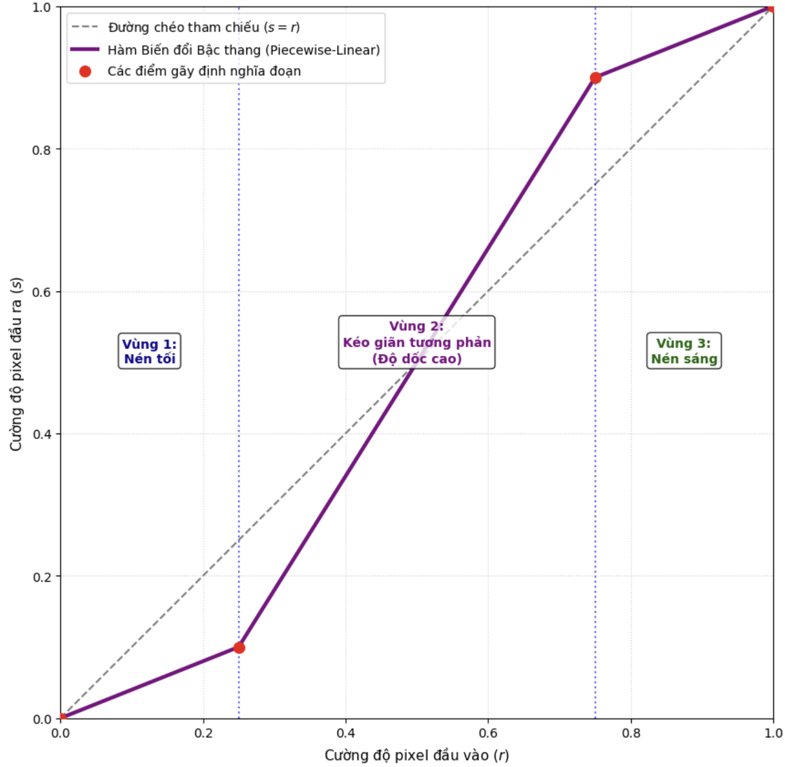

</div>
</div>


---

# TĂNG CƯỜNG ĐỘ TƯƠNG PHẢN (CONTRAST STRETCHING)

**Mục tiêu:** Mở rộng khoảng giá trị cường độ của ảnh để tăng sự khác biệt giữa các vùng sáng và tối.

<div class="columns">
<div>

**Ví dụ:** Ảnh đầu vào có $r \in [r_1, r_2]$ được ánh xạ sang $s \in [s_1, s_2]$.

**Trường hợp tuyến tính:**
$$s = \frac{s_2 - s_1}{r_2 - r_1}(r - r_1) + s_1$$

**Ứng dụng:**

- Ảnh có tương phản thấp.
- Ảnh bị mờ do điều kiện chiếu sáng.
- Tiền xử lý trước các bước phân tích ảnh.

</div>
<div>

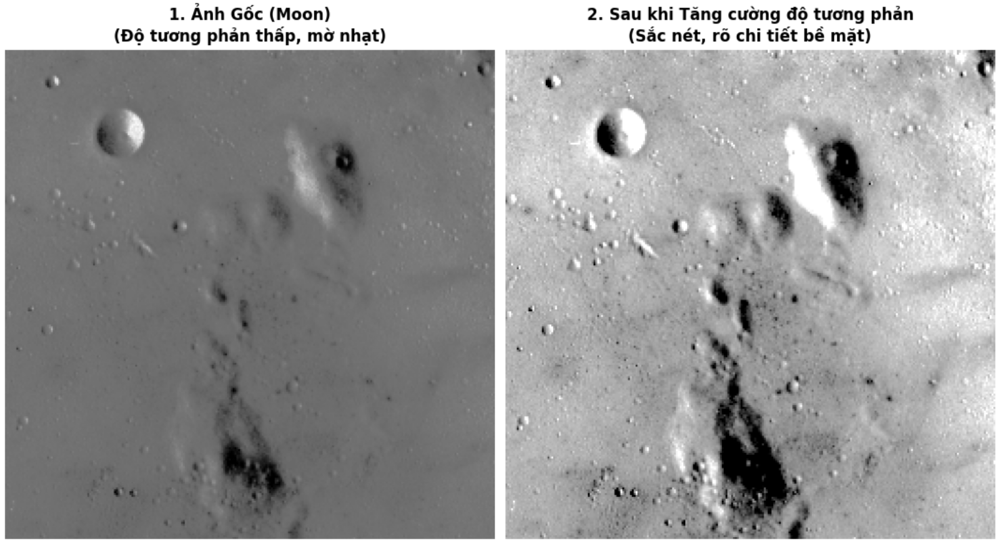

</div>
</div>

> **Ví dụ:** Ảnh chụp trong sương mù có các mức xám tập trung trong khoảng hẹp [60, 120]. Contrast stretching kéo giãn khoảng này ra [0, 255] giúp ảnh rõ hơn.

---

# CẮT MỨC XÁM (GRAY-LEVEL SLICING)

**Mục tiêu:** Làm nổi bật một khoảng mức xám quan tâm (ROI - Region Of Interest).

**Cách thực hiện:**

- Giữ nguyên các mức xám ngoài khoảng.
- Hoặc đưa toàn bộ vùng ngoài khoảng về một giá trị cố định.

<div class="columns">
<div>

**Ứng dụng:**

- Làm nổi bật cấu trúc trong ảnh y tế.
- Phân tích vật thể có khoảng cường độ đặc trưng.

> **Ví dụ:** Trong ảnh vệ tinh, ta muốn làm nổi bật vùng nước (có mức xám 40-80) để phân tích sông hồ. Các vùng khác (đất, cây cối) được đưa về màu đen.

</div>
<div>

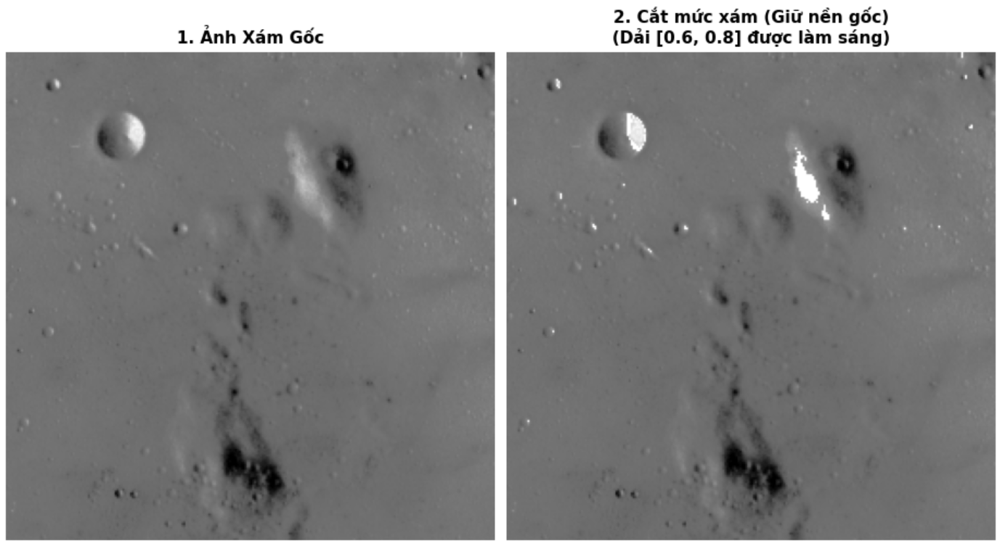

</div>
</div>

---

# TRÍCH XUẤT MẶT PHẲNG BIT (BIT-PLANE SLICING)

**Định nghĩa:** Pixel 8-bit được biểu diễn bởi $b_7b_6b_5b_4b_3b_2b_1b_0$. Ảnh có thể được phân tách thành **8 bit-plane**.

<div class="columns">
<div class="col-2">

**Trong đó:**

- $b_7$: Most Significant Bit (MSB) - bit có trọng số lớn nhất.
- $b_0$: Least Significant Bit (LSB) - bit có trọng số nhỏ nhất.

</div>
<div class="col-3">

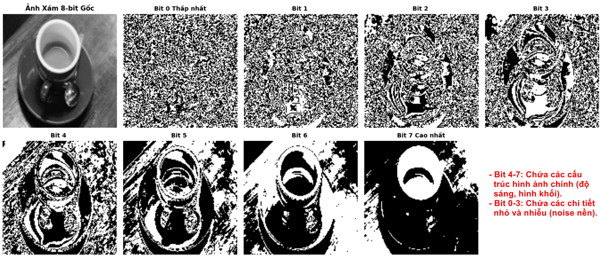

</div>
</div>

**Ý nghĩa:**

- Bit cao → đóng góp lớn vào cấu trúc và độ sáng.
- Bit thấp → thường chứa chi tiết nhỏ và có thể chứa nhiễu.

**Ứng dụng:** Phân tích cấu trúc ảnh, nghiên cứu nén ảnh, phân tích thông tin bit.

---

# BÀI TẬP THỰC HÀNH - BIẾN ĐỔI CƯỜNG ĐỘ

**Yêu cầu:** Sử dụng Python + OpenCV

1. Đọc ảnh grayscale.
2. Tạo ảnh âm bản (Negative).
3. Thực hiện Gamma Transformation với:
    - $\gamma = 0.5$
    - $\gamma = 1.0$
    - $\gamma = 2.0$
4. So sánh kết quả.
5. Vẽ đồ thị hàm biến đổi $T(r)$.

**Câu hỏi thảo luận:** Giải thích tại sao các giá trị gamma khác nhau tạo ra kết quả khác nhau?

---
<!--_class: subsection-->

# LỌC KHÔNG GIAN

---

# Lọc không gian (Spatial Filtering)

- **Định nghĩa**: Là kỹ thuật thay đổi giá trị của một pixel dựa trên giá trị của các pixel lân cận xung quanh nó. Là công cụ chủ chốt để làm mịn ảnh hoặc làm nét ảnh.

<div class="columns">
<div>

- **Cơ chế hoạt động**:
  - Sử dụng một mặt nạ nhỏ (Kernel) "trượt" qua từng pixel của ảnh gốc.
  - **Công thức tổng quát:** $g(x,y) = \sum_s \sum_t w(s,t) \cdot f(x-s, y-t)$

  - Trong đó:
    - $f(x,y)$: ảnh đầu vào
    - $w(s,t)$: kernel (bộ lọc)
    - $g(x,y)$: ảnh đầu ra

- **Kích thước kernel:** Thường là số lẻ ($3\times3$, $5\times5$, $7\times7$) để xác định rõ pixel trung tâm.

</div>
<div>

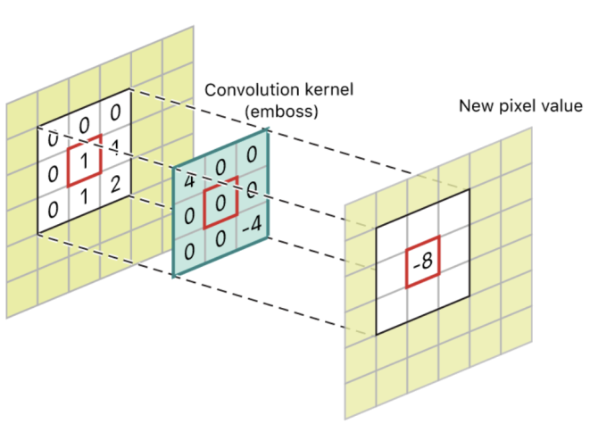

</div>
</div>

---

# PHÂN LOẠI BỘ LỌC KHÔNG GIAN

- **Smoothing Filters (Bộ lọc làm mịn / Low-pass)**

  - Giảm nhiễu, làm mờ ảnh.
  - Giảm chi tiết nhỏ.
  - Làm giảm các thay đổi cường độ nhanh.

- **Sharpening Filters (Bộ lọc làm nét / High-pass)**

  - Tăng cường chi tiết, làm nổi bật biên.
  - Tăng các thay đổi cường độ nhanh.

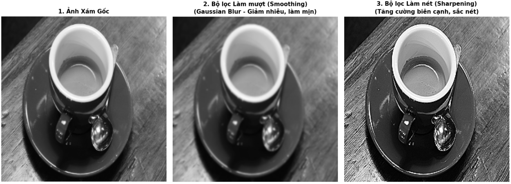

---
<!--_class: subsection-->

# LÀM MỊN ẢNH

---

# BỘ LỌC TRUNG BÌNH (MEAN / BOX FILTER)

**Định nghĩa:** Tất cả pixel trong kernel có **trọng số như nhau**.

Với kernel $m \times n$: $w(i,j) = \frac{1}{mn}$

<div class="columns">
<div>

**Ví dụ kernel 3×3:**
$$\frac{1}{9}\begin{bmatrix} 1 & 1 & 1 \\ 1 & 1 & 1 \\ 1 & 1 & 1 \end{bmatrix}$$

**Đặc điểm:**

- Đơn giản, tính toán nhanh.
- Làm mờ ảnh nhưng có thể làm mất biên và chi tiết.
- Nhạy với nhiễu salt-and-pepper (nhiễu muối tiêu).

</div>
<div>

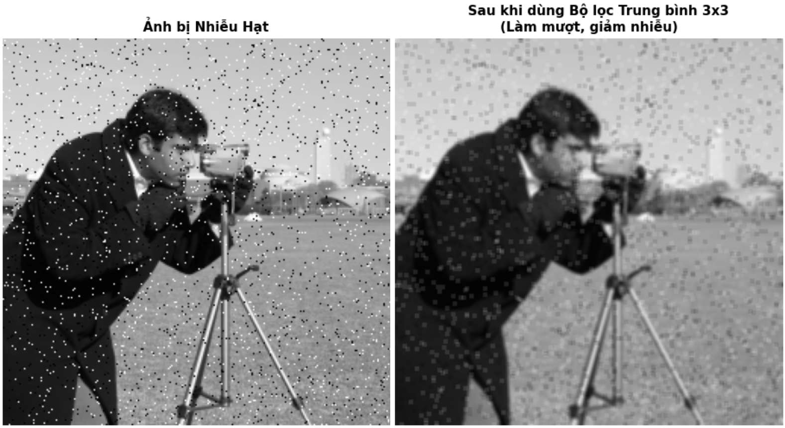

</div>
</div>

---

# BỘ LỌC GAUSSIAN

**Định nghĩa:** Trọng số kernel tuân theo **phân phối Gaussian**. $G(x,y) = \frac{1}{2\pi\sigma^2} e^{-\frac{x^2+y^2}{2\sigma^2}}$
**Đặc điểm:**

- Pixel gần tâm có trọng số lớn hơn, càng xa tâm trọng số càng nhỏ.
- $\sigma$ kiểm soát mức độ làm mờ.

**Ưu điểm:**

- Làm mờ tự nhiên, giảm nhiễu tốt.
- Thường được sử dụng trước các thuật toán phát hiện biên.

<gap></gap>

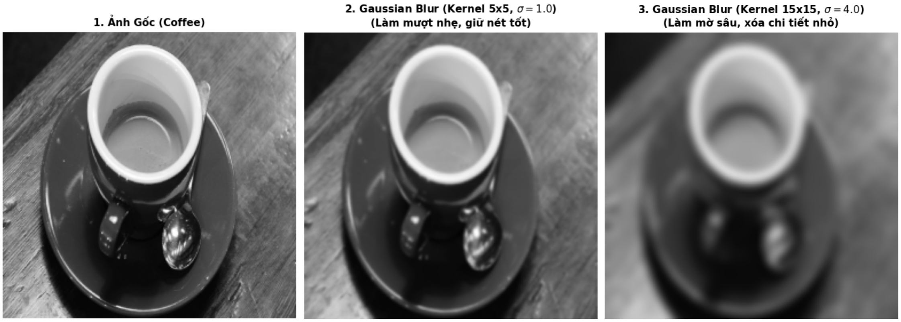

---

# BỘ LỌC TRUNG VỊ (MEDIAN FILTER)

**Định nghĩa:** Thay giá trị pixel trung tâm bằng **trung vị** (median) của các pixel trong vùng lân cận.

<div class="columns">
<div>

**Ví dụ:** Với vùng 3x3 có các giá trị:
```
10   12   11
 9  255   10
11   13   12
```
Sắp xếp: 9, 10, 10, 11, **11**, 12, 12, 13, 255
→ Median = **11** (pixel nhiễu 255 đã bị loại bỏ)

**Ưu điểm:**

- Hiệu quả với nhiễu salt-and-pepper.
- Bảo toàn biên tốt hơn bộ lọc trung bình.

</div>
<div>

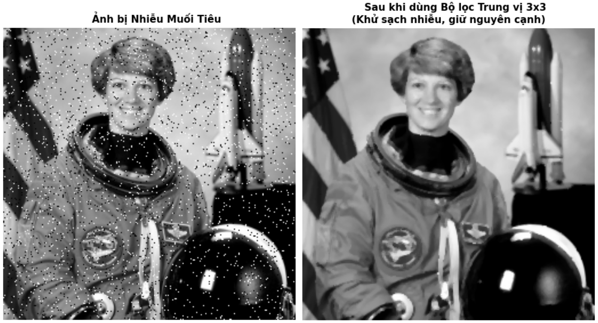

</div>
</div>

> **Ví dụ:** Ảnh bị nhiễu muối tiêu (các chấm trắng/đen ngẫu nhiên) sẽ được khôi phục gần như hoàn toàn bằng Median Filter 3x3.

---

# SO SÁNH CÁC BỘ LỌC LÀM MỊN

| Tiêu chí | Mean | Gaussian | Median |
| --- | --- | --- | --- |
| **Nguyên lý** | Trung bình | Trung bình có trọng số | Trung vị |
| **Loại** | Tuyến tính | Tuyến tính | Phi tuyến |
| **Làm mờ** | Mạnh | Tự nhiên | Tùy dữ liệu |
| **Salt-and-pepper** | Kém | Kém | Tốt |
| **Bảo toàn biên** | Kém | Tốt hơn Mean | Tốt |
| **Tốc độ** | Nhanh | Nhanh | Chậm hơn |
| **Ứng dụng** | Làm mờ đơn giản | Tiền xử lý | Khử nhiễu xung |

---
<!--_class: subsection-->

# LÀM NÉT ẢNH

---

# Bộ lọc làm nét (Sharpening/Highpass Filters)

- **Mục đích**: Làm nổi bật các cạnh và các chi tiết sắc nét trong ảnh.
- **Cơ sở toán học**:
  - **Đạo hàm bậc 1**:
    - Bằng 0 ở vùng cường độ không đổi.
    - Khác 0 tại điểm bắt đầu/kết thúc của bước nhảy (step) hoặc dốc (ramp).
    - Khác 0 dọc theo vùng dốc $\rightarrow$ Tạo ra cạnh dày.
  - **Đạo hàm bậc 2**:
    - Bằng 0 ở vùng cường độ không đổi.
    - Khác 0 tại điểm bắt đầu và kết thúc của bước nhảy/dốc.
    - Bằng 0 dọc theo vùng dốc $\rightarrow$ Tạo ra cạnh mỏng (1 pixel), có tính chất "zero-crossing", rất tốt để làm nét chi tiết nhỏ.

---

# Bộ lọc Laplacian (1)

- **Nguyên lý**:
  - Nếu coi ảnh là một bề mặt độ sáng: Vùng đồng nhất $\rightarrow$ độ sáng thay đổi rất ít. Vùng biên $\rightarrow$ độ sáng thay đổi đột ngột.
  - Bộ lọc Laplace đo mức độ thay đổi này bằng đạo hàm bậc hai: $\nabla^2 f(x, y) = \frac{\partial^2 f}{\partial x^2} + \frac{\partial^2 f}{\partial y^2}$

- **Trong ảnh số**:
  - Đạo hàm được xấp xỉ bằng sai phân hữu hạn: $f''(x) \approx \frac{f(x+h) - 2f(x) + f(x-h)}{h^2}$
  - Từ phép xấp xỉ này để tính kernel Laplace.

<div class="columns">
<div>
<ul>
  
- Kernel Laplacian cơ bản $3 \times 3$:
  <span>$\begin{bmatrix} 0 & 1 & 0 \\ 1 & -4 & 1 \\ 0 & 1 & 0 \end{bmatrix}$ hoặc $\begin{bmatrix} 1 & 1 & 1 \\ 1 & -8 & 1 \\ 1 & 1 & 1 \end{bmatrix}$</span>

</ul>
</div>
<div>
  
  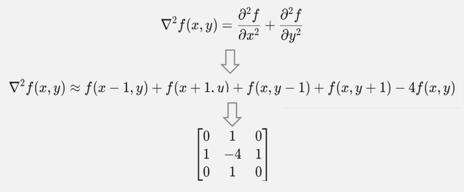

</div>
</div>


---

# Bộ lọc Laplacian (2)

- **Phát hiện biên bằng Laplace**:
  - Nếu chỉ lấy kết quả Laplace: $g(x, y) = \nabla^2 f(x, y)$ ta thu được ảnh biên (các đường viền mảnh).
- **Làm nét ảnh**:
  - Ta thường cộng (hoặc trừ, tùy dấu của tâm kernel) ảnh gốc với ảnh kết quả của bộ lọc Laplacian:     $g(x, y) = f(x, y) + c * \nabla^2 f(x, y)$ , $c = \pm 1$
  - Nếu tâm kernel là số âm ($-4$), cộng ($c = -1$). Nếu tâm là số dương ($4$), trừ ($c = 1$).

<div style="margin-top:20px">

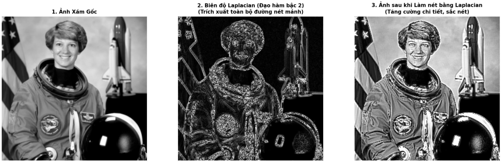

</div>

---

# Các bước làm sắc nét ảnh với bộ lọc Laplace

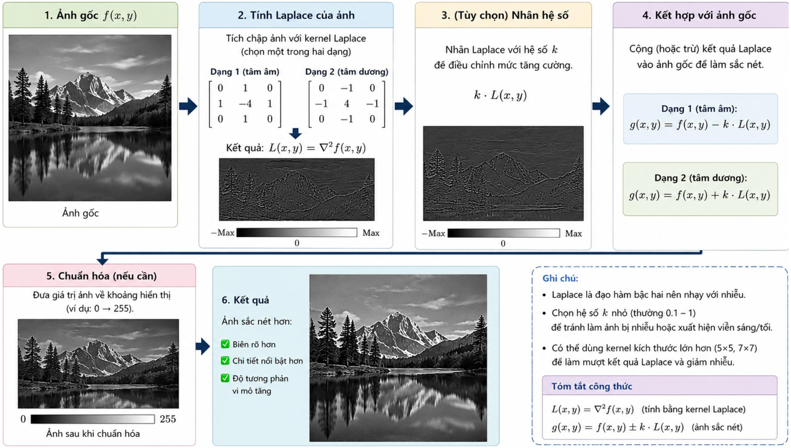

---

# Bộ lọc Laplacian - Bài tập thực hành

Làm nét ảnh bằng Laplacian trong OpenCV.

```python
import cv2
import numpy as np

img = cv2.imread('input.jpg', cv2.IMREAD_GRAYSCALE)

# Tính Laplacian
laplacian = cv2.Laplacian(img, cv2.CV_64F)

# Làm nét: Ảnh gốc - Laplacian (do tâm kernel mặc định là âm)
sharpened = img - laplacian
sharpened = np.clip(sharpened, 0, 255).astype(np.uint8)
```

---

# Bộ lọc Gradient (Đạo hàm bậc một - Sobel, Prewitt)

- **Nguyên lý**: Sử dụng đạo hàm bậc một để tính toán độ dốc (độ lớn) của cường độ: $\nabla f(x, y) = \left[ \frac{\partial f}{\partial x}, \frac{\partial f}{\partial y} \right]^T$
- **Toán tử Sobel**:
  - Sử dụng hai kernel để tính đạo hàm theo 2 hướng ngang $(G_x)$ và dọc $(G_y)$.
  - Sobel Kernel:
    <span>$G_x = \begin{bmatrix} -1 & 0 & 1 \\ -2 & 0 & 2 \\ -1 & 0 & 1 \end{bmatrix}$, $G_y = \begin{bmatrix} -1 & -2 & -1 \\ 0 & 0 & 0 \\ 1 & 2 & 1 \end{bmatrix}$</span>
- **Độ lớn của gradient** (độ mạnh của biên):
  - $M(x, y) = \sqrt{G_x^2 + G_y^2}$ hoặc xấp xỉ $|G_x| + |G_y|$

---

# Các bước làm sắc nét ảnh với bộ lọc Gradient

1. Tính đạo hàm theo hướng ngang $G_x$ bằng kernel Sobel/Prewitt tương ứng.
2. Tính đạo hàm theo hướng dọc $G_y$ bằng kernel Sobel/Prewitt tương ứng.
3. Tính độ lớn gradient $M(x, y) = \sqrt{G_x^2 + G_y^2}$.
4. (Tùy chọn) Cộng độ lớn gradient này vào ảnh gốc để làm nét: $g(x, y) = f(x, y) + c \cdot M(x, y)$.

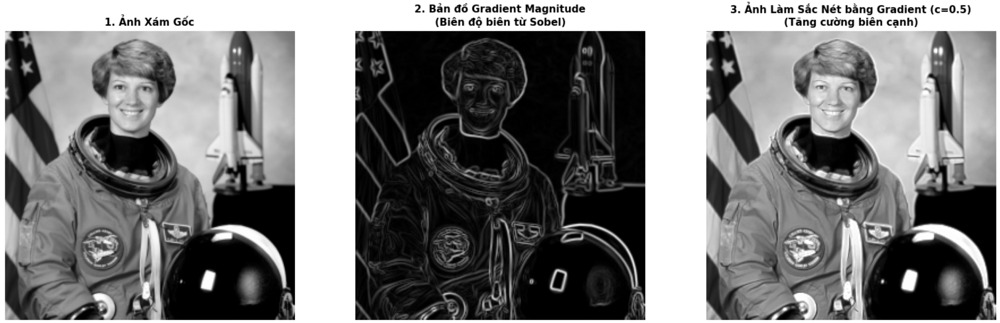

---

# Bài tập thực hành

Phát hiện biên với Sobel.

```python
import cv2
import numpy as np

img = cv2.imread('input.jpg', cv2.IMREAD_GRAYSCALE)

# Tính Sobel
sobelx = cv2.Sobel(img, cv2.CV_64F, 1, 0, ksize=3)
sobely = cv2.Sobel(img, cv2.CV_64F, 0, 1, ksize=3)

# Độ lớn gradient
magnitude = np.sqrt(sobelx**2 + sobely**2)
magnitude = np.clip(magnitude, 0, 255).astype(np.uint8)
```

---

# Unsharp Masking & Highboost Filtering

<div class="columns">
<div>

- **Định nghĩa**: Là kỹ thuật làm nét ảnh dựa trên nguyên tắc tạo mặt nạ từ ảnh làm mờ và cộng lại với ảnh gốc.
- **Quy trình cổ điển trong nhiếp ảnh**:
  1. Làm mờ ảnh gốc: $f_{blur}$
  2. Tạo mặt nạ (mask): $mask = f - f_{blur}$ (Phần chi tiết bị mất đi do làm mờ)
  3. Cộng mặt nạ trở lại ảnh gốc: $g = f + k \cdot mask$

</div>
<div>
  
  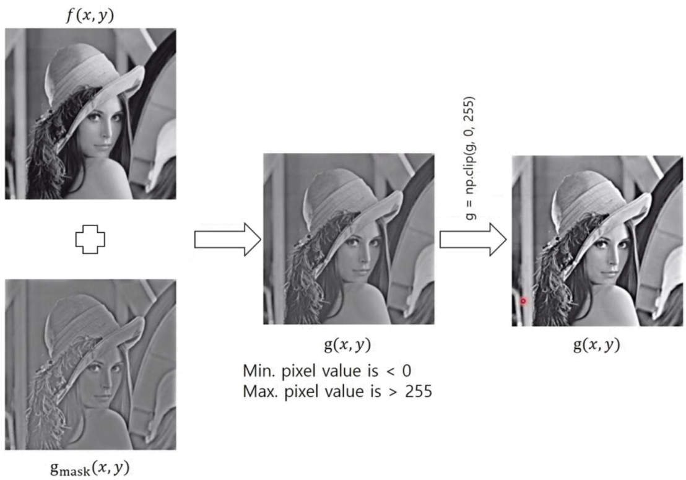

</div>
</div>

- **Phân loại**:
  - Nếu $k = 1$: **Unsharp masking** (Làm nét tiêu chuẩn).
  - Nếu $k > 1$: **Highboost filtering** (Tăng cường độ làm nét mạnh hơn).

---

# Làm nét ảnh với Unsharp Masking & Highboost Filtering

- **Công thức tổng quát**: $g(x, y) = f(x, y) + k \cdot (f(x, y) - f_{blur}(x, y))$
  $g(x, y) = (1 + k) f(x, y) - k \cdot f_{blur}(x, y)$

<div class="columns">
<div class="col-2">

- **Đặc điểm**:
  - Unsharp Masking
   ($k=1$): $g = 2f - f_{blur}$
  - Highboost Filtering
   ($k>1$): $g = A \cdot f - f_{blur}$ (với $A = 1 + k > 2$)
  - Giúp kiểm soát mức độ làm nét, kết quả tự nhiên hơn so với Laplacian.

</div>
<div class="col-3">

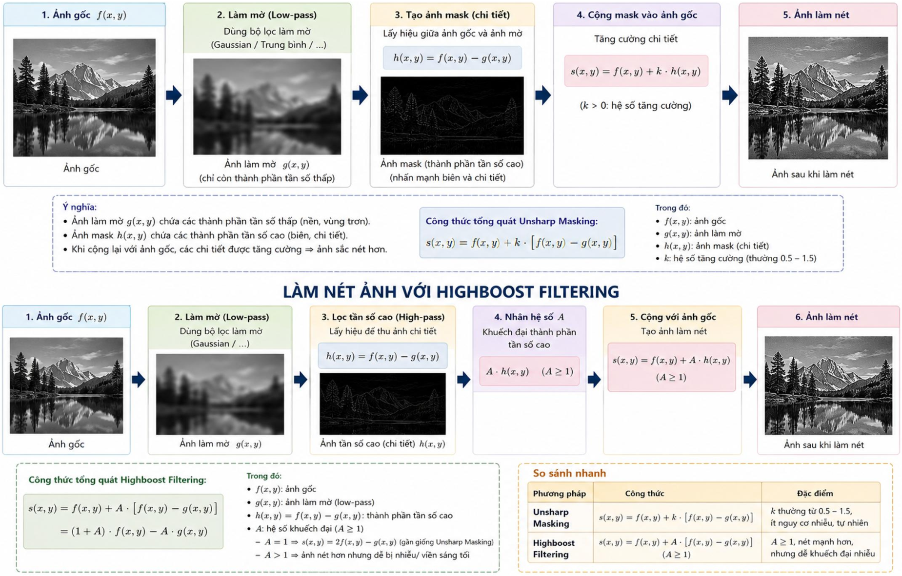

</div>
</div>

---
<!--_class: text-2xs-->

# Tổng hợp các bộ lọc làm nét

| Bộ lọc               | Nguyên lý                                                    | Ưu điểm                                                   | Nhược điểm                                                   | Ứng dụng                                     |
| -------------------- | ------------------------------------------------------------ | --------------------------------------------------------- | ------------------------------------------------------------ | -------------------------------------------- |
| **Laplace**          | Đạo hàm bậc hai, tính tổng biến thiên theo x và y.           | Đẳng hướng; dùng một mặt nạ duy nhất; tính toán nhanh.    | Rất nhạy với nhiễu; tạo biên kép; không cho biết hướng biên. | Làm nét nhanh; phát hiện biên zero-crossing. |
| **Gradient (Sobel)** | Đạo hàm bậc nhất theo hai hướng.                             | Cho cả độ lớn và hướng biên; chống nhiễu tốt hơn Laplace. | Làm nét trực tiếp kém hiệu quả; chậm hơn Laplace.            | Phát hiện biên trong thị giác máy tính.      |
| **Unsharp Masking**  | Ảnh gốc trừ ảnh đã làm mờ, cộng lại với hệ số k.             | Kiểm soát mức độ làm nét; ít nhiễu hơn Laplace; tự nhiên. | Cần chọn bán kính làm mờ phù hợp; dễ tạo quầng sáng (halo).  | Photoshop, in ấn, xuất bản.                  |
| **Highboost**        | Mở rộng của USM, nhân thành phần tần số cao với hệ số A > 1. | Làm nét mạnh; điều chỉnh từ tự nhiên đến siêu nét.        | Dễ tạo quầng sáng/nhiễu nếu A quá lớn.                       | Ảnh viễn thám, thiên văn, y tế.              |

---

# BÀI TẬP THỰC HÀNH - SHARPENING

**Yêu cầu:** Với cùng một ảnh, thực hiện:

1. Làm nét bằng Laplacian.
2. Làm nét bằng Unsharp Masking.
3. Làm nét bằng Highboost.
4. So sánh với Sobel.

**Đánh giá theo các tiêu chí:**

- Độ sắc nét.
- Biên.
- Nhiễu.
- Halo.
- Khả năng giữ chi tiết.

---
<!--_class: section-->

# XỬ LÝ HISTOGRAM

---

# HISTOGRAM LÀ GÌ?

**Định nghĩa:** Histogram biểu diễn **tần suất xuất hiện** của các mức cường độ trong ảnh.

<div class="columns">
<div class="col-2">

**Với ảnh grayscale:** $h(r_k) = n_k$

Trong đó:
- $r_k$: mức cường độ thứ $k$
- $n_k$: số pixel có mức cường độ $r_k$

**Histogram chuẩn hóa:** $p(r_k) = \frac{n_k}{M \cdot N}$

với ảnh kích thước $M \times N$.

</div>
<div class="col-3">

<gap></gap>

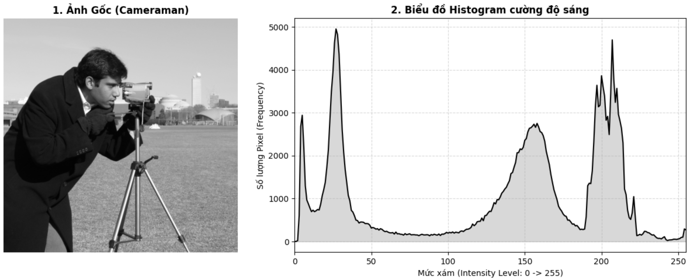

</div>
</div>

**Ý nghĩa:**

- **Ảnh tối:** Histogram tập trung về bên trái (gần 0).
- **Ảnh sáng:** Histogram tập trung về bên phải (gần 255).
- **Tương phản thấp:** Histogram tập trung trong một khoảng hẹp.
- **Tương phản cao:** Histogram trải rộng trên một khoảng lớn.

---

# ỨNG DỤNG CỦA HISTOGRAM

- **Tăng cường ảnh**: Giúp ảnh dễ nhìn hơn, làm nổi bật chi tiết ẩn trong các vùng bị tối hoặc quá sáng.
- **Chuẩn hóa**: Đưa các ảnh chụp trong điều kiện ánh sáng khác nhau về cùng một trạng thái để phục vụ cho các thuật toán thị giác máy tính phía sau (như nhận diện vật thể).
- **Phân đoạn ảnh (Thresholding)**: Histogram giúp xác định ngưỡng (threshold) tốt nhất để tách biệt đối tượng và nền (ví dụ: dùng phương pháp Otsu dựa trên Histogram).
- **Phân tích ảnh:** Độ sáng, độ tương phản, phân bố mức xám.
- **Phân đoạn ảnh:** Hỗ trợ lựa chọn ngưỡng: Thresholding, Otsu.

> **Ví dụ:** Trong nhận dạng khuôn mặt, histogram của vùng da mặt thường có phân bố đặc trưng, giúp phân biệt da người với nền.

---

# CÂN BẰNG HISTOGRAM (HISTOGRAM EQUALIZATION)

**Mục tiêu:** Phân bố lại các mức cường độ để tăng cường độ tương phản **toàn cục**.

**Công thức:**

- Xác suất: $p(r_k) = \frac{n_k}{M \cdot N}$
- Hàm phân phối tích lũy: $CDF(r_k) = \sum_{j=0}^{k} p(r_j)$
- Phép biến đổi: $s_k = (L-1) \cdot CDF(r_k)$

Trong đó $L$ là số mức cường độ (với ảnh 8-bit: $L = 256$).

**Ví dụ:** Ảnh chụp trong phòng tối có histogram tập trung ở vùng 0-80. Sau khi cân bằng, histogram được trải đều trên toàn dải 0-255, ảnh sáng và rõ chi tiết hơn.

---

# CƠ CHẾ CÂN BẰNG HISTOGRAM

<div class="columns">
<div class="col-4">

**Quy trình:**

1. Tính histogram gốc.
2. Tính xác suất $p(r_k)$.
3. Tính CDF (hàm phân phối tích lũy).
4. Dùng CDF làm hàm ánh xạ.
5. Áp dụng lên từng pixel để có histogram mới.
6. Ảnh có tương phản được cải thiện.

</div>
<div class="col-3">

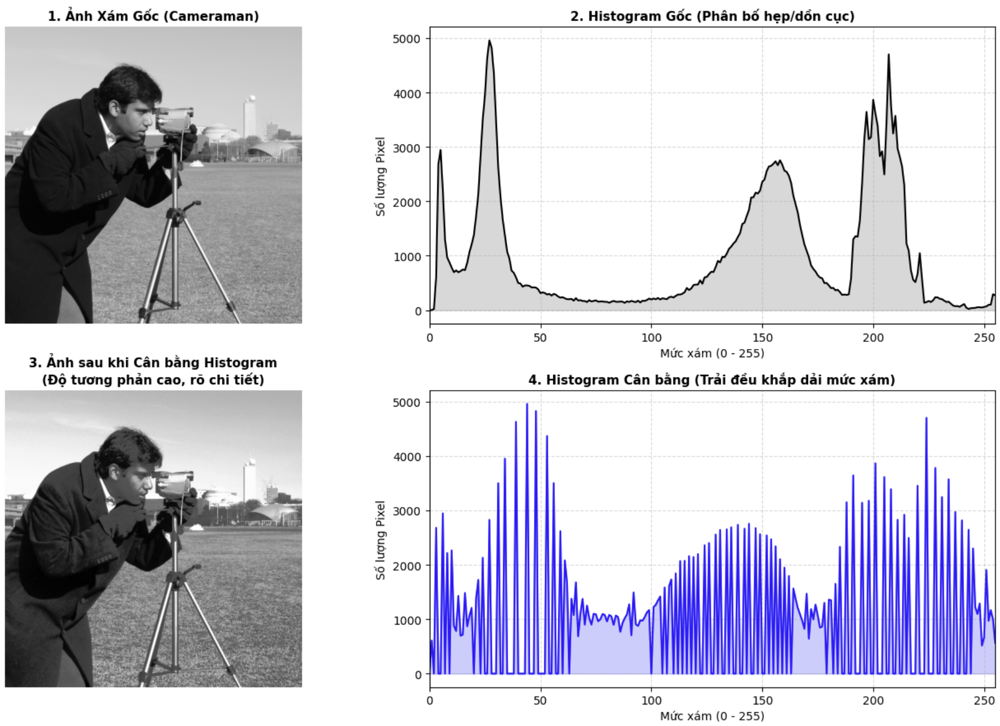

</div>
</div>

**Lưu ý:** Histogram sau cân bằng **không nhất thiết phẳng hoàn toàn** vì:

- Pixel là dữ liệu rời rạc.
- Số mức cường độ hữu hạn.
- Phép ánh xạ có làm tròn.
---

# HẠN CHẾ CỦA HISTOGRAM EQUALIZATION

**Histogram Equalization toàn cục có thể:**

- Khuếch đại nhiễu.
- Làm thay đổi quá mạnh độ sáng.
- Không xử lý tốt ảnh có nhiều vùng sáng/tối khác nhau.
- Làm mất một số chi tiết cục bộ.

**Giải pháp:** Cần các phương pháp **local/adaptive enhancement** như CLAHE.

**Ví dụ:** Ảnh có cả vùng bầu trời sáng và vùng đất tối. Histogram Equalization toàn cục có thể làm bầu trời bị cháy sáng trong khi cố gắng làm sáng vùng đất.

---

# KHỚP HISTOGRAM (HISTOGRAM MATCHING)

**Mục tiêu:** Biến đổi ảnh đầu vào để histogram của nó **gần với một histogram mục tiêu**.

**Quy trình:**

1. Tính CDF của ảnh đầu vào sau equalization.
2. Tính CDF của ảnh mục tiêu sau equalization.
3. Tìm hàm ánh xạ từ CDF đầu vào sang CDF mục tiêu.
4. Áp dụng hàm ánh xạ lên ảnh đầu vào.

**Ứng dụng:**

- Chuẩn hóa ảnh.
- Xử lý ảnh y tế, ảnh vệ tinh.
- Các hệ thống cần đưa ảnh về một phân bố tham chiếu.

**Ví dụ:** Trong y tế, các ảnh X-quang chụp ở các máy khác nhau có histogram khác nhau. Histogram Matching giúp đưa tất cả về cùng một phân bố để bác sĩ dễ so sánh.

---

# Ví dụ Histogram Matching

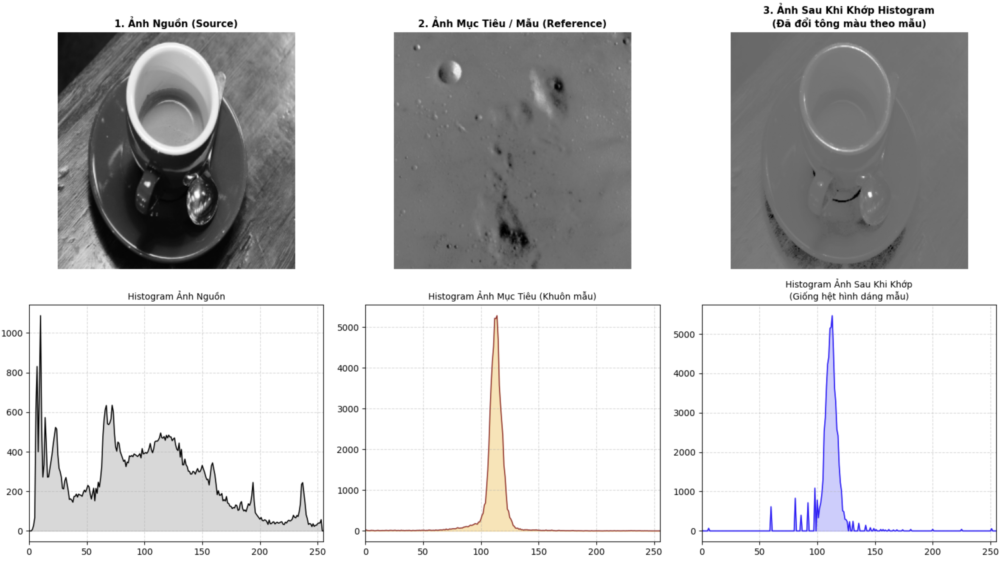

---

# XỬ LÝ HISTOGRAM CỤC BỘ (LOCAL HISTOGRAM)

**Ý tưởng:** Thay vì tính histogram trên toàn ảnh, ta di chuyển một **cửa sổ nhỏ** qua ảnh và xử lý từng vùng lân cận.

<div class="columns">
<div class="col-3">

**Kích thước cửa sổ:** $3\times3$, $5\times5$, $7\times7$, ...

**Tại mỗi vị trí:**

1. Xác định vùng lân cận.
2. Tính histogram cục bộ.
3. Thực hiện biến đổi (ví dụ: equalization).
4. Cập nhật pixel trung tâm.

**Ưu điểm:** Tăng cường chi tiết cục bộ.

</div>
<div class="col-2">

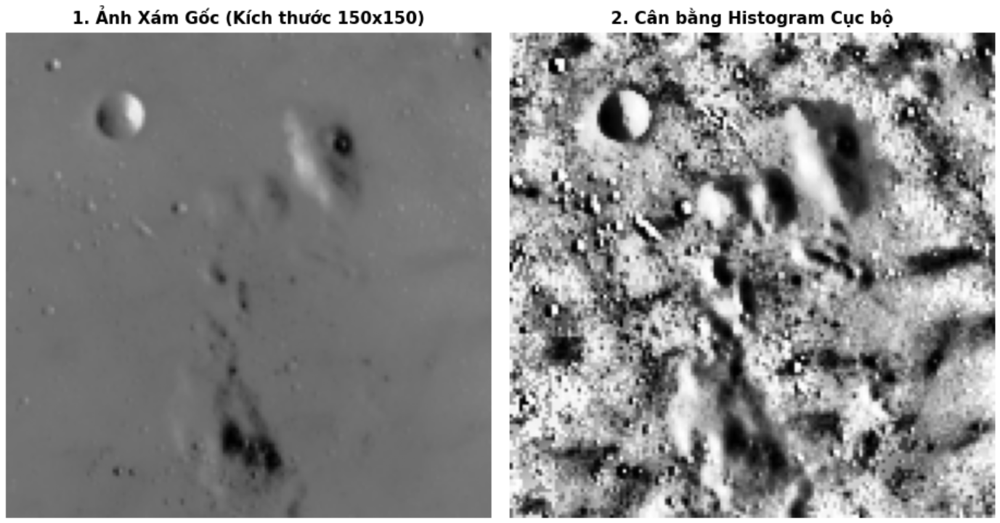

</div>
</div>

**Nhược điểm:** Tốn chi phí tính toán, có thể khuếch đại nhiễu.

**Ví dụ:** Trong ảnh có cả vùng sáng và tối, local histogram processing có thể tăng cường chi tiết ở cả hai vùng mà không làm ảnh hưởng lẫn nhau.

---

# CLAHE (CONTRAST LIMITED ADAPTIVE HISTOGRAM EQUALIZATION)

**Định nghĩa:** CLAHE là phương pháp tăng cường tương phản cục bộ có giới hạn.

<div class="columns">
<div class="col-5">

**Quy trình:**

1. Chia ảnh thành các tile (ví dụ 8x8).
2. Tính histogram từng tile.
3. Giới hạn clipping (clip limit) để tránh khuếch đại nhiễu.
4. Equalization trên từng tile.
5. Nội suy giữa các tile để tránh biên cứng.

**So sánh với AHE (Adaptive HE):**

- AHE: Có thể khuếch đại nhiễu mạnh.
- CLAHE: Giới hạn mức khuếch đại histogram thông qua clip limit.

</div>
<div class="col-3">

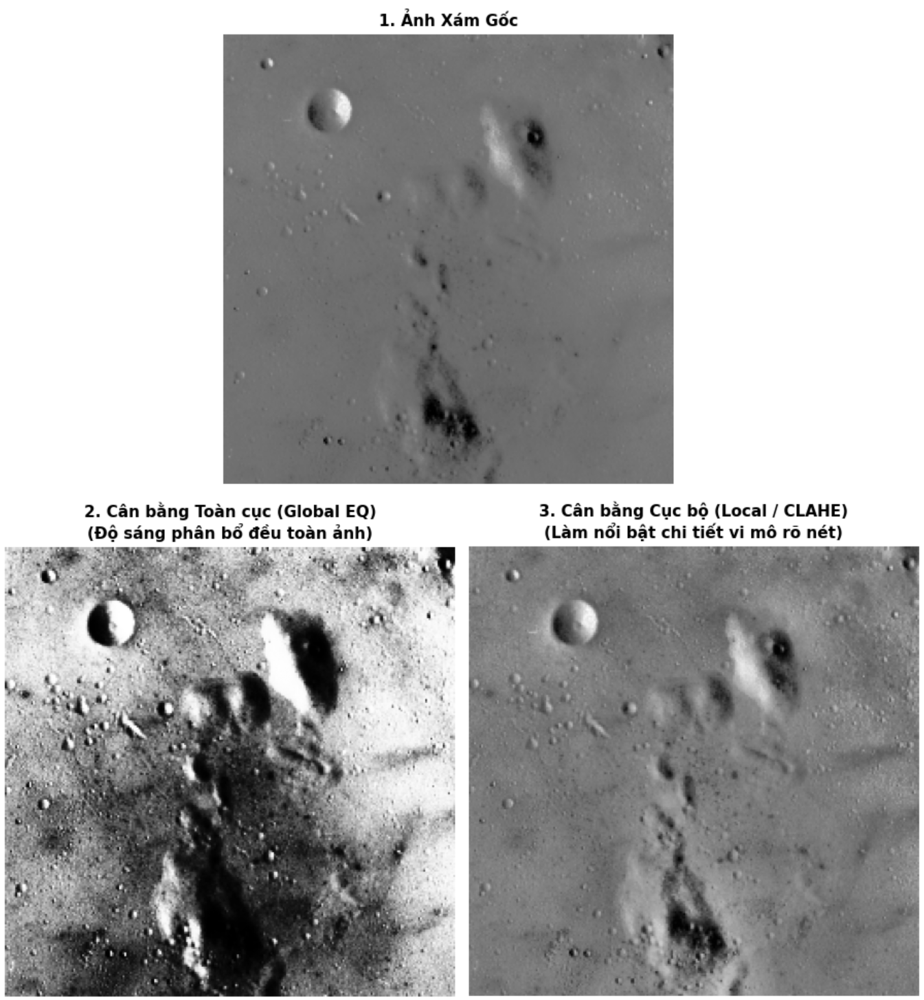

</div>
</div>

**Ví dụ:** Trong ảnh nội tạng y tế, CLAHE giúp làm rõ chi tiết ở cả vùng sáng và tối mà không tạo ra nhiễu quá mức ở vùng đồng nhất.

---

# BÀI TẬP THỰC HÀNH - HISTOGRAM

```python
import cv2

eq = cv2.equalizeHist(img)
clahe = cv2.createCLAHE(clipLimit=2.0, tileGridSize=(8, 8))
clahe_img = clahe.apply(img)
```

**Yêu cầu:**

- So sánh 3 ảnh: Original, Histogram Equalization, CLAHE.
- Vẽ histogram của cả ba ảnh.
- Nhận xét sự khác biệt về tương phản và nhiễu.

---
<!--_class: section-->

# BIẾN ĐỔI TRONG MIỀN TẦN SỐ

---
<!--_class: text-sm-->

# Biến đổi Fourier

- **Ý tưởng:** Một tín hiệu phức tạp có thể được biểu diễn bằng **tổng các thành phần hình sin/cosin** với các tần số khác nhau.

<div class="columns">
<div class="col-3">

- **Miền không gian**: Ảnh được biểu diễn bằng $f(x,y)$.
- **Miền tần số**: Ảnh là tổng hợp của các sóng sin và cosin với các tần số, biên độ và pha khác nhau → $F(u,v)$.
- **Biến đổi Fourier (FT)**: Công cụ toán học chuyển tín hiệu từ miền không gian/thời gian sang miền tần số: $f(x,y) \rightarrow F(u,v)$.
- **Biến đổi Fourier ngược:** $F(u,v) \rightarrow f(x,y)$

</div>
<div class="col-2">

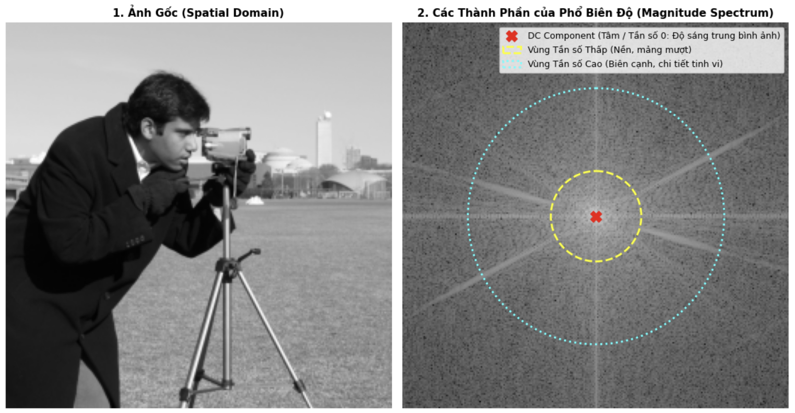

</div>
</div>

- Khi thực hiện biến đổi Fourier trên một ảnh sẽ nhận được phổ Fourier, thường được biểu diễn dưới dạng một ảnh khác.
- **Tâm của ảnh phổ**: Đại diện cho tần số thấp nhất (0) – tức là độ sáng trung bình của toàn bộ ảnh (thành phần DC). Điểm này thường rất sáng.
- **Càng xa tâm**: Đại diện cho tần số càng cao. Các điểm sáng ở xa tâm thể hiện các chi tiết sắc nét, các cạnh, đường biên hoặc nhiễu.

---

# BIẾN ĐỔI TRONG MIỀN TẦN SỐ

**Ý tưởng:** Ngoài việc xử lý trực tiếp trên pixel, ta có thể chuyển ảnh sang **miền tần số**.

**Mục tiêu:** Phân tích và xử lý ảnh dựa trên các thành phần tần số.

**Quy trình tổng quát:**

1. Ảnh trong miền không gian $f(x,y)$.
2. Biến đổi Fourier → Miền tần số $F(u,v)$.
3. Lọc trong miền tần số → $G(u,v)$.
4. Biến đổi Fourier ngược → Ảnh đã xử lý $g(x,y)$.

---

# TẦN SỐ THẤP VÀ TẦN SỐ CAO

**Low Frequency (Tần số thấp):**

- Ảnh thay đổi chậm.
- Vùng nền, vùng tương đối đồng nhất.
- Biến thiên ánh sáng, các cấu trúc lớn.

**High Frequency (Tần số cao):**

- Ảnh thay đổi nhanh.
- Biên, chi tiết nhỏ, texture, nhiễu.

**Ghi nhớ:**

- Smooth region → Low frequency
- Sharp edge → High frequency

> **Ví dụ:** Vùng bầu trời xanh đồng nhất là tần số thấp. Đường biên giữa tóc và nền là tần số cao. Nhiễu muối tiêu cũng là tần số cao.

---

# 2D DISCRETE FOURIER TRANSFORM (2D DFT)

**Công thức:** Với ảnh kích thước $M \times N$:
$$F(u,v) = \sum_{x=0}^{M-1} \sum_{y=0}^{N-1} f(x,y) \cdot e^{-j2\pi\left(\frac{ux}{M} + \frac{vy}{N}\right)}$$

Trong đó:
- $f(x,y)$: pixel trong miền không gian
- $F(u,v)$: thành phần tần số
- $(u,v)$: tọa độ tần số
- $j = \sqrt{-1}$

**Lưu ý:** Kết quả DFT là **giá trị phức**.

> **Ví dụ:** Với ảnh 256x256, DFT cho ta một ma trận 256x256 các số phức, mỗi phần tử biểu diễn một thành phần tần số.

---

# PHỔ FOURIER: Biên độ (MAGNITUDE) VÀ Pha (PHASE)

**Magnitude** $|F(u,v)|$:
- **Ý nghĩa vật lý:** Cho biết mức độ năng lượng của các thành phần tần số xuất hiện trong bức ảnh.
- **Vai trò:** Quyết định độ tương phản, độ sáng tối tổng thể và mức độ đậm nhạt của các cấu trúc.

**Phase** $\angle F(u,v)$:
- **Ý nghĩa vật lý:** Ghi nhận vị trí không gian chính xác (shift/alignment) của các sóng hình sin thành phần.
- **Vai trò:** Chứa phần lớn thông tin nhận dạng cấu trúc của bức ảnh. Nếu thay đổi biên độ, bức ảnh chỉ bị mờ hoặc tối đi; nhưng nếu xáo trộn hoặc làm mất pha, bức ảnh sẽ mất đi hình dáng.

**Công thức:** $F(u,v) = |F(u,v)| \cdot e^{j\phi(u,v)}$

---

# TÍNH CHẤT CỦA 2D DFT

- **Tính tuần hoàn:** DFT có tính tuần hoàn theo miền tần số.
- **Đối xứng liên hợp:** Với ảnh thực: $F(-u,-v) = F^*(u,v)$
- **Tính phân tách (Separability):** 2D DFT có thể thực hiện bằng:
  1. DFT theo hàng.
  2. DFT theo cột.
- **Tính dịch chuyển:** Dịch ảnh trong miền không gian làm thay đổi phase, nhưng **không làm thay đổi magnitude**.

>**Ví dụ:** Nhờ tính phân tách, 2D FFT của ảnh 1024x1024 chỉ cần thực hiện 2048 phép FFT 1D kích thước 1024, nhanh hơn nhiều so với tính trực tiếp.

---

# TỪ SPATIAL FILTER ĐẾN FREQUENCY FILTER

| Miền không gian | Miền tần số |
| --- | --- |
| Mean Filter | Low-pass |
| Gaussian Filter | Gaussian LPF |
| Sharpening | High-pass |
| Laplacian | Laplacian frequency filter |
| Unsharp Masking | High-frequency emphasis |

**Ý tưởng cốt lõi:** Lọc trong hai miền là **hai cách biểu diễn khác nhau** của cùng một bài toán xử lý tín hiệu.

> **Ví dụ:** Bộ lọc Mean trong miền không gian (tính trung bình các pixel lân cận) tương đương với bộ lọc Low-pass trong miền tần số (giữ tần số thấp, loại tần số cao).

---

# ĐỊNH LÝ TÍCH CHẬP (CONVOLUTION THEOREM)

**Phát biểu:** Trong điều kiện phù hợp:
$$f(x,y) * h(x,y) \Longleftrightarrow F(u,v) \cdot H(u,v)$$

⇒ Tích chập trong miền không gian tương ứng với **phép nhân** trong miền tần số.

**Quy trình:**

1. Ảnh $f$ → Fourier → $F$
2. Kernel $h$ → Fourier → $H$
3. Nhân: $G = F \times H$
4. IFFT → $g$

**Ý nghĩa:** Cho phép thực hiện một số phép lọc lớn hiệu quả hơn bằng FFT.

> **Ví dụ:** Với kernel lớn 100x100, tích chập trong miền không gian cần 10.000 phép nhân cho mỗi pixel. Trong miền tần số, chỉ cần một phép nhân sau khi FFT.

---


# CÁC BƯỚC XỬ LÝ ẢNH TRONG MIỀN TẦN SỐ

1. **Tiền xử lý:** Đọc ảnh, chuyển grayscale nếu cần, padding khi cần để giảm ảnh hưởng biên.
2. **Fourier Transform:** $f(x,y) \rightarrow F(u,v)$
3. **Dịch tâm:** Đưa DC component về trung tâm.
4. **Filtering:** $G(u,v) = H(u,v) \cdot F(u,v)$
5. **Dịch ngược:** Đưa phổ về vị trí ban đầu.
6. **IFFT:** $G(u,v) \rightarrow g(x,y)$
7. **Hậu xử lý:** Lấy phần thực, chuẩn hóa/clipping, cắt padding nếu đã thêm.

---
<!--_class: subsection-->

# LỌC THÔNG THẤP (LOW-PASS FILTER)

---

# KHÁI NIỆM LOW-PASS FILTER

**Mục tiêu:** Giữ các thành phần **tần số thấp** và loại bỏ/giảm các thành phần **tần số cao**.

<div class="columns">
<div class="col-2">

**Hiệu ứng:**

- Làm mịn, làm mờ ảnh.
- Giảm nhiễu.
- Giảm chi tiết nhỏ.

**Trong phổ đã dịch tâm:**

- Vùng trung tâm (tần số thấp) được giữ lại.
- Vùng biên (tần số cao) bị loại bỏ.


</div>
<div class="col-3">

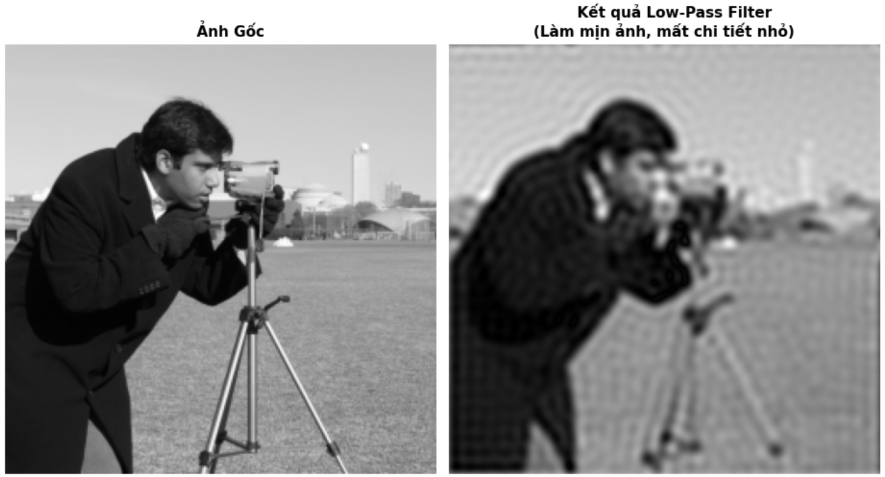

</div>
</div>

---

# IDEAL LOW-PASS FILTER

**Mục tiêu:** Cho tất cả các tần số nằm vòng tròn bán kính $D_0$ (tính từ tâm phổ) đi qua hoàn toàn mà không bị suy giảm, chặn mọi tần số nằm ngoài bán kính đó

<div class="columns">
<div>

**Công thức:**
$$H(u,v) = \begin{cases} 1, & D(u,v) \leq D_0 \\ 0, & D(u,v) > D_0 \end{cases}$$

Trong đó: $D(u,v) = \sqrt{(u-u_0)^2 + (v-v_0)^2}$

$D_0$: bán kính cắt.

**Đặc điểm:**

- Cắt tần số đột ngột.
- Dễ hiểu và dễ cài đặt.

</div>
<div>

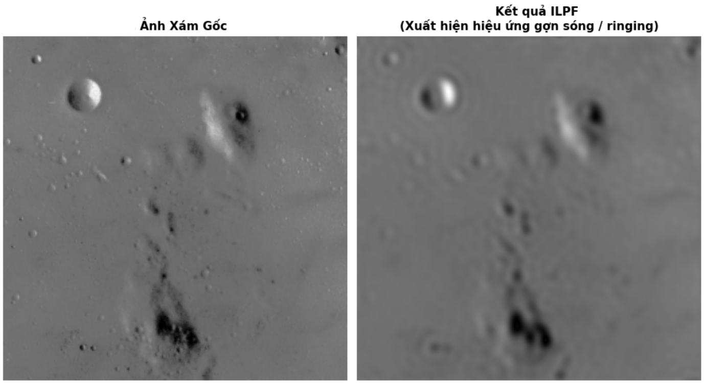

</div>
</div>

- Có thể gây **ringing** (hiệu ứng gợn sóng) do biên chuyển tiếp quá đột ngột.
> **Ví dụ:** Ideal LPF với $D_0 = 30$ sẽ giữ nguyên tất cả các thành phần tần số trong bán kính 30 từ tâm, và loại bỏ hoàn toàn các thành phần ngoài bán kính này.

---

# GAUSSIAN LOW-PASS FILTER
**Hoạt động:** dựa trên hàm phân phối chuẩn (hàm Gaussian / hình chuông).
**Mục tiêu:** Cho phép các tần số thấp đi qua tâm phổ, triệt tiêu mượt mà các tần số cao ở phần biên ngoài (làm mờ ảnh, khử nhiễu hạt).

<div class="columns">
<div>

**Công thức:**
$$H(u,v) = e^{-\frac{D^2(u,v)}{2\sigma^2}}$$

**Đặc điểm:**

- Suy giảm **mượt** theo khoảng cách.
- Không có biên cắt đột ngột.
- Giảm ringing so với Ideal LPF.

**Tham số:** $\sigma \uparrow \Rightarrow$ lọc mạnh hơn (bán kính hiệu dụng lớn hơn).

</div>
<div>

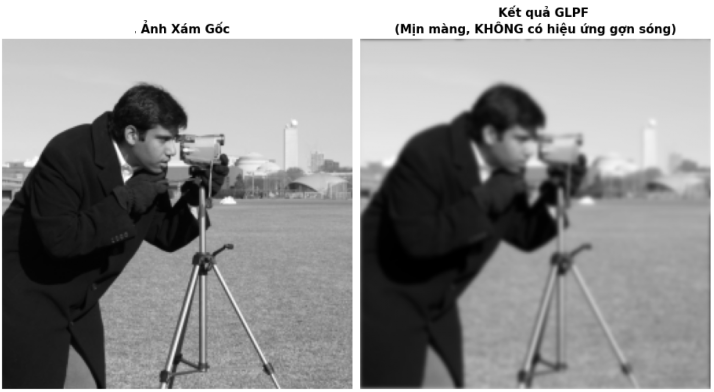

</div>
</div>

---

# BUTTERWORTH LOW-PASS FILTER

**Điểm đặc biệt:** BLPF cung cấp một tham số bậc lọc ($n$) cho phép người thiết kế linh hoạt điều chỉnh độ dốc của vùng chuyển tiếp, khắc phục được nhược điểm cắt đột ngột của ILPF nhưng vẫn cho phép kiểm soát độ sắc nét tốt hơn GLPF.

<div class="columns">
<div>

**Công thức:**
$$H(u,v) = \frac{1}{1 + \left(\frac{D(u,v)}{D_0}\right)^{2n}}$$

Trong đó:
- $D_0$: tần số cắt.
- $n$: bậc của bộ lọc.

**Đặc điểm:**


</div>
<div>

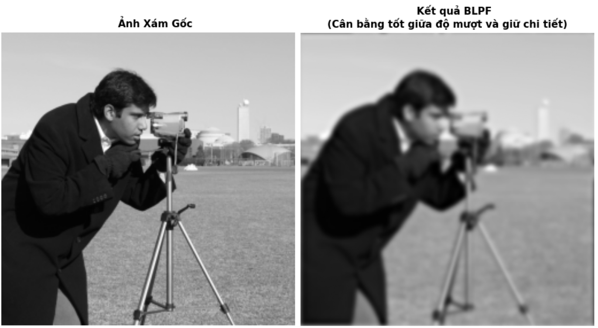

</div>
</div>

- Chuyển tiếp giữa vùng cho qua và vùng chặn **có thể điều chỉnh**.
- $n$ càng lớn → chuyển tiếp càng dốc.
- Nằm giữa Gaussian và Ideal về độ sắc của vùng chuyển tiếp.

---

# SO SÁNH CÁC LOW-PASS FILTER

| Filter | Chuyển tiếp | Ringing | Điều chỉnh |
| --- | --- | --- | --- |
| **Ideal** | Đột ngột | Cao | $D_0$ |
| **Gaussian** | Mượt | Rất thấp | $\sigma$ |
| **Butterworth** | Điều chỉnh được | Trung gian | $D_0, n$ |

**Ghi nhớ:** Càng cắt tần số đột ngột → càng có nguy cơ ringing.

> **Ví dụ minh họa:** Khi làm mờ ảnh văn bản, Ideal LPF có thể tạo ra các gợn sóng quanh chữ, trong khi Gaussian LPF cho kết quả mượt mà hơn.

---
<!--_class: subsection-->

# LỌC THÔNG CAO (HIGH-PASS FILTER)

---

# KHÁI NIỆM HIGH-PASS FILTER

**Mục tiêu:** Giữ các thành phần **tần số cao** và loại bỏ/giảm các thành phần **tần số thấp**.

<div class="columns">
<div>

**Ứng dụng:**

- Làm nét ảnh.
- Tăng cường biên.
- Tăng cường chi tiết.

**Trong phổ đã dịch tâm:**

- Vùng trung tâm (tần số thấp, DC) bị loại bỏ.
- Vùng biên (tần số cao) được giữ lại.

</div>
<div class="col-2">

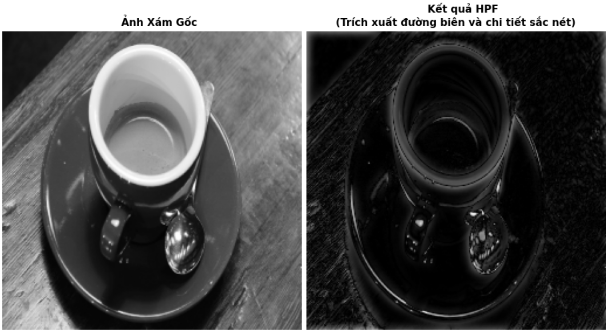

</div>
</div>

---

# HPF VÀ THÀNH PHẦN DC

**Thành phần DC** nằm tại trung tâm phổ, đại diện cho mức sáng trung bình.

**Với high-pass filter:** $H(0,0) \approx 0$

→ Thành phần liên quan đến mức sáng trung bình bị loại bỏ.

<div class="columns">
<div class="col-3">

**Kết quả sau IFFT có thể:**

- Tối.
- Mang giá trị âm.
- Cần chuẩn hóa để hiển thị.

**Khi cần giữ độ sáng:**

- Sử dụng Offset.
- High-frequency emphasis.

</div>
<div class="col-4">

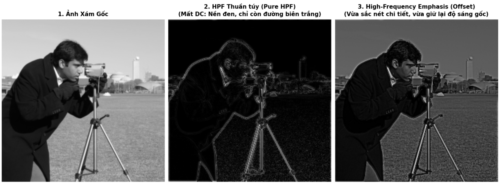

</div>
</div>

- Các phương pháp sharpening thích hợp.
> **Ví dụ:** Ảnh sau khi áp dụng HPF thuần túy thường có nền đen với các đường biên trắng. Để giữ độ sáng gốc, ta cần thêm thành phần DC trở lại.

---
<!--_class: text-sm-->

# Toán tử Laplacian trong miền tần số

**Bản chất:** Dựa trên đạo hàm bậc hai, chuyên dùng để phát hiện và làm nổi bật các biến đổi đột ngột về cường độ sáng (đường biên, cạnh, góc nhọn và chi tiết tinh vi) trong ảnh. Đạo hàm bậc hai trong miền không gian tương đương với việc nhân phổ của ảnh với hàm truyền $H(u,v)$ trong miền tần số: $H(u, v) = -4\pi^2 D^2(u, v)$.

<div class="columns">
<div class="col-3">

  - Tại tâm: $D = 0 \implies H = 0$.
  - Xa tâm: $D$ lớn $\implies H$ rất lớn: Laplacian tăng cường mạnh các thành phần tần số cao.

**Ứng dụng:** Làm sắc nét ảnh, quy trình:
  - $L(u, v) = H(u, v) F(u, v)$: Phổ Fourier của ảnh Laplace.

</div>
<div class="col-4">

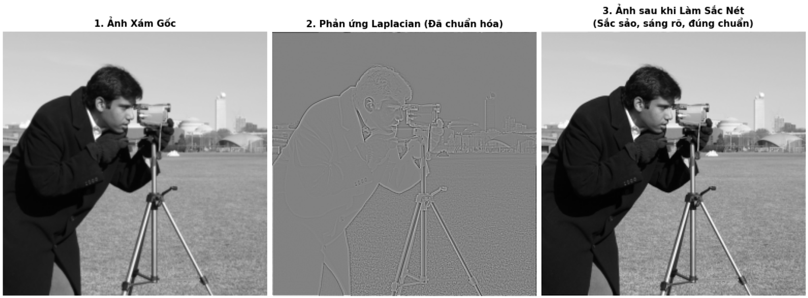

</div>
</div>

  - $l(x, y) = \text{IFFT}\{L(u, v)\}$: Ảnh biên.
  - Tạo ảnh sắc nét (trong miền không gian): $g(x, y) = f(x, y) + c \cdot l(x, y)$.

**Ưu điểm**: Bao quát toàn bộ ảnh, cho kết quả sắc nét hơn so với kernel Laplacian $3 \times 3$ trong miền không gian.

---

# Lọc tăng cường tần số (High-frequency-emphasis)

<div class="columns">
<div>

- **Vấn đề**:
  - Tần số thấp $\rightarrow$ vùng trơn, nền ảnh, ánh sáng tổng thể.
  - Tần số cao $\rightarrow$ biên, chi tiết, cạnh, texture.
  - Nếu chỉ dùng high-pass filter ($H_{HP}$), ta sẽ giữ chi tiết tốt nhưng làm mất độ sáng tổng thể (ảnh bị "tối/thiếu tự nhiên").

</div>
<div>

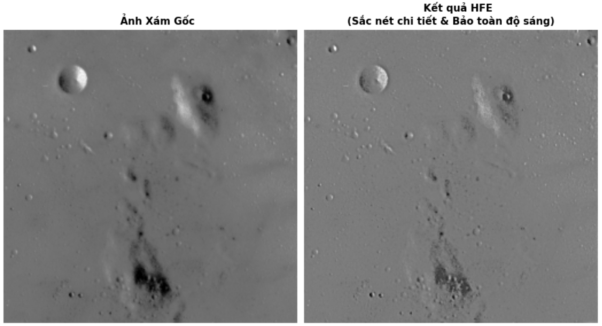

</div>
</div>

- **Giải pháp High-frequency-emphasis filter**:
  - Giúp vừa giữ thông tin nền (low frequency), vừa tăng cường chi tiết (high frequency).
  - Công thức: $H(u, v) = a + b \cdot H_{HP}(u, v)$, ($a \ge 0, b > 1$).
  - $a$: Thành phần giữ nền.
  - $b$: Hệ số khuếch đại chi tiết.

---
<!--_class: subsection-->

# LỌC CHỌN LỌC

---

# Lọc giải tần (BAND-PASS) VÀ Lọc chắn giải (BAND-REJECT)

**Band-pass Filter:** Tác động lên một vùng trung gian trong miền tần số, nằm giữa vùng tâm (tần số thấp) và vùng biên (tần số cao).

- Chỉ giữ một khoảng tần số: $D_1 \leq D \leq D_2$.
- **Ứng dụng:** Tách các cấu trúc theo scale, phân tích texture.

<div class="columns">
<div>

**Band-reject Filter:** Loại bỏ hoặc suy giảm một dải tần số cụ thể quanh một bán kính nhất định, giữ nguyên các tần số còn lại.

- Loại bỏ một khoảng tần số: $D_1 < D < D_2$.
- **Ứng dụng:** Loại bỏ một dải nhiễu cụ thể, xử lý nhiễu tuần hoàn.

</div>
<div>


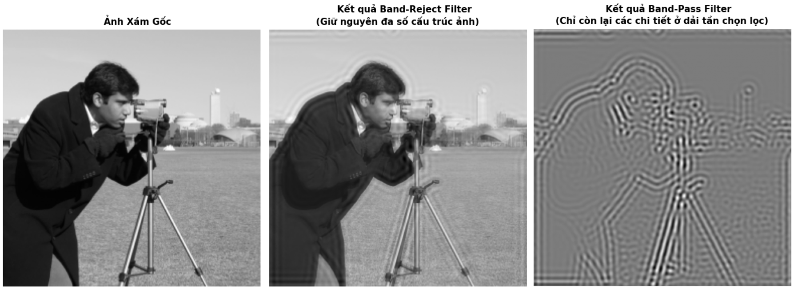

</div>
</div>

---

# NHIỄU TUẦN HOÀN TRONG MIỀN TẦN SỐ

**Đặc điểm:** Nhiễu tuần hoàn trong miền không gian thường tạo ra các **đỉnh sáng đối xứng** trong Fourier spectrum.

**Vị trí các đỉnh:** Đối xứng qua tâm phổ.

**Cách xử lý:**

- Tìm nhiễu trong miền tần số.
- Loại bỏ đúng vùng tần số tương ứng.
- Khôi phục ảnh.

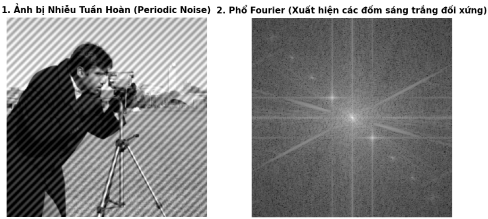

---

# Lọc khấc (NOTCH FILTER)

**Định nghĩa:** Notch filter tác động vào một hoặc một số **vùng tần số rất cụ thể**.

**Đặc biệt hữu ích với:** Periodic noise (nhiễu tuần hoàn).

<div class="columns">
<div>

**Quy trình:**

1. Ảnh có nhiễu tuần hoàn.
2. Biến đổi Fourier.
3. Phát hiện các đỉnh bất thường trong phổ.
4. Thiết kế Notch Filter tại các vị trí đỉnh.
5. Biến đổi Fourier ngược.
6. Ảnh giảm nhiễu.

</div>
<div>

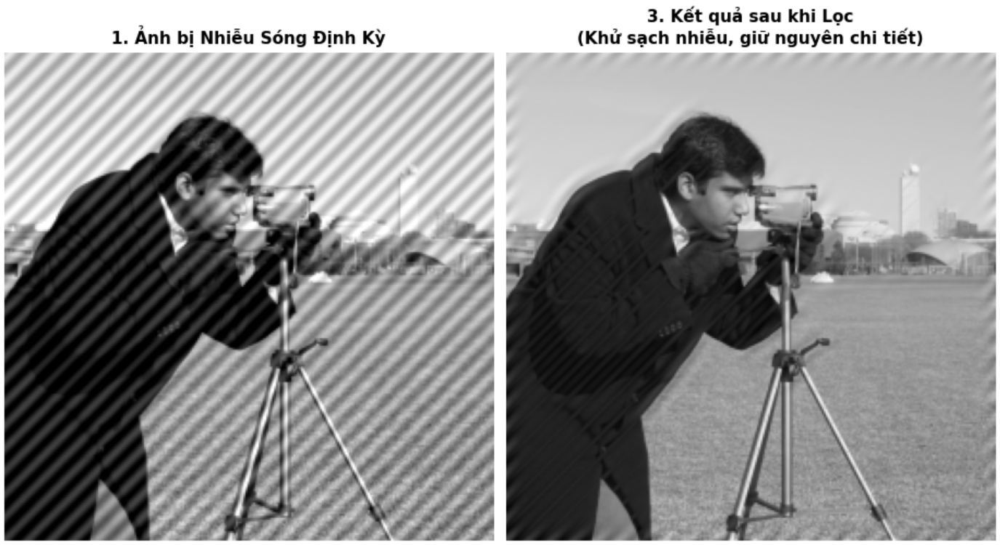

</div>
</div>

> **Ví dụ:** Ảnh chụp từ camera an ninh bị nhiễu vân (moiré pattern) do interference với màn hình. Các đỉnh nhiễu xuất hiện đối xứng trong phổ Fourier và có thể loại bỏ bằng Notch Filter.

---
<!--_class: subsection-->

# FAST FOURIER TRANSFORM (FFT)

---

# KHÁI NIỆM FFT

**Fast Fourier Transform (FFT)** là thuật toán hiệu quả để tính DFT.

**Độ phức tạp:**

- DFT trực tiếp: $O(N^2)$
- FFT: $O(N \log N)$

**Ý tưởng:** Sử dụng chiến lược **Divide and Conquer**:

1. Chia DFT lớn thành nhiều DFT nhỏ.
2. Tính toán các DFT nhỏ.
3. Kết hợp kết quả.

> **Ví dụ:** Với ảnh 1024x1024, DFT trực tiếp cần khoảng 1 tỷ phép tính, trong khi FFT chỉ cần khoảng 10 triệu phép tính - nhanh hơn 100 lần.

---

# FFT 2D CHO ẢNH

**2D FFT có thể thực hiện bằng:**

1. FFT từng hàng.
2. FFT từng cột.

Đây là hệ quả của **tính separability** của DFT.

**Trong Python:**
```python
F = np.fft.fft2(img)
F_shift = np.fft.fftshift(F)
```

> **Ví dụ:** Thay vì tính 2D DFT trực tiếp với độ phức tạp $O(N^4)$, ta thực hiện $2N$ phép FFT 1D kích thước $N$, giảm xuống còn $O(N^2 \log N)$.