<!-- _class: cover -->

<div class="middle">

# XỬ LÝ ẢNH& THỊ GIÁC MÁY TÍNH

## Chương 3: Nén ảnh

</div>

### Giảng viên: Nguyễn Phồn Lữa

---

<!-- _class: toc -->

# Nội dung

- Giới thiệu về nén dữ liệu
- Nén không tổn thất (Lossless)
- Nén có tổn thất (Lossy)

---

<!-- _class: section -->

# GIỚI THIỆU VỀ NÉN DỮ LIỆU

---
<!--_class: text-sm-->

# GIỚI THIỆU

- **Khái niệm:** Nén ảnh là quá trình giảm dung lượng (số bit) cần thiết để biểu diễn một bức ảnh, sao cho ảnh sau khi nén vẫn đảm bảo chất lượng chấp nhận được theo mục đích sử dụng.
- **Ví dụ:** Một bức ảnh màu 10 megapixel. Nếu lưu dạng thô, mỗi pixel gồm 3 kênh (R, G, B), mỗi kênh 8 bit.
  - Tổng dung lượng: $10M \times 3 \times 8 = 240.000.000$ bit $\approx 30$ MB.
  - Nén ảnh giúp giảm kích thước này xuống còn vài MB hoặc vài trăm KB mà mắt thường khó phân biệt được sự khác biệt.

- **Tại sao cần nén dữ liệu?**
  - **Tiết kiệm bộ nhớ lưu trữ:** Giảm dung lượng chiếm dụng trên ổ cứng, thẻ nhớ, hoặc cloud.
  - **Tăng tốc truyền tải:** Giúp việc gửi ảnh qua mạng, tải trang web, hoặc gọi video diễn ra nhanh chóng hơn.
  - **Giảm băng thông:** Yếu tố cực kỳ quan trọng trong các ứng dụng streaming video, hội nghị truyền hình thời gian thực.

---

# Dữ liệu, thông tin, tỷ lệ nén

- **Dữ liệu (Data):** Phương tiện mang thông tin.
- **Thông tin (Information):** Nội dung thực sự cần truyền tải.
- **Nén dữ liệu:** Giảm số bit dùng để biểu diễn dữ liệu nhưng vẫn giữ được thông tin quan trọng.
- **Dư thừa dữ liệu (Redundancy - R):** Đo phần dữ liệu không cần thiết. Nếu $C$ là tỷ lệ nén $\Rightarrow R = 1 - \frac{1}{C}$. $R$ càng lớn, dữ liệu càng có nhiều phần có thể loại bỏ hoặc mã hóa hiệu quả.
- **Tỷ lệ nén (Compression Ratio - C):** $C = \frac{b}{b'}$, với: 
  - $b$ là số bit gốc, 
  - $b'$ là số bit sau nén.
- _Ví dụ:_ $C = 10:1 \Rightarrow R = 0.9$ (90% dữ liệu là dư thừa).

---

# Các loại dư thừa dữ liệu trong ảnh số

- **Dư thừa mã hóa (Coding Redundancy):** Sử dụng nhiều bit hơn mức cần thiết để biểu diễn các mức xám do phân bố xác suất không đều.
- **Dư thừa không gian (Spatial Redundancy):** Các pixel lân cận có giá trị rất giống nhau hoặc phụ thuộc lẫn nhau mạnh. Thường được khai thác bởi RLE, DCT, hoặc các bộ lọc không gian/tần số.
- **Thông tin không liên quan (Irrelevant Information):** Thông tin bị hệ thống thị giác con người (HVS) bỏ qua hoặc không cần thiết cho ứng dụng cụ thể. Thường bị loại bỏ trong nén mất mát (lossy).

---

# Đo lường thông tin ảnh (Entropy)

- **Entropy:** Lượng tin trung bình trên mỗi pixel, đo mức độ không chắc chắn của phân bố mức xám.
- **Lượng tin của sự kiện E:** $I(E) = \log_2 \frac{1}{P(E)}$ (bit). Sự kiện càng ít xảy ra thì lượng tin càng cao.
- **Entropy của nguồn:** $H = -\sum_{k=0}^{L-1} p(r_k) \log_2 p(r_k)$ (với $L$ là số mức cường độ).
- **Ý nghĩa:** Ảnh càng đồng đều, ít quy luật thì entropy càng cao. Ảnh có nhiều vùng lặp lại thì entropy thấp.
- **Định lý Shannon 1:** Không thể mã hóa nguồn với số bit trung bình nhỏ hơn entropy $H$.
---

# Thực hành Tính Entropy của ảnh.

```python
import math

def calculate_entropy(probabilities):
    entropy = 0
    for p in probabilities:
        if p > 0:
            entropy -= p * math.log2(p)
    return entropy

# Ví dụ: Ảnh có 3 mức xám với xác suất xuất hiện lần lượt là 0.5, 0.3, 0.2
probs = [0.5, 0.3, 0.2]
print(f"Entropy của ảnh: {calculate_entropy(probs):.4f} bits/pixel")
```

---

# Tiêu chuẩn đánh giá chất lượng (Fidelity Criteria)

- **Đánh giá khách quan:** Dựa trên công thức đo lường.
  - **RMSE (Root Mean Square Error):** Đo mức sai khác trung bình. $e_{rms} = \sqrt{\frac{1}{MN} \sum \sum (f(x,y) - \hat{f}(x,y))^2}$. RMSE càng nhỏ, ảnh càng gần gốc.
  - **SNR (Signal-to-Noise Ratio):** Tỷ lệ tín hiệu trên nhiễu. SNR càng cao, chất lượng ảnh càng tốt.
- **Đánh giá chủ quan:** Đánh giá bằng mắt thường (Thang điểm 1-6: Excellent đến Unusable).
<gap></gap>

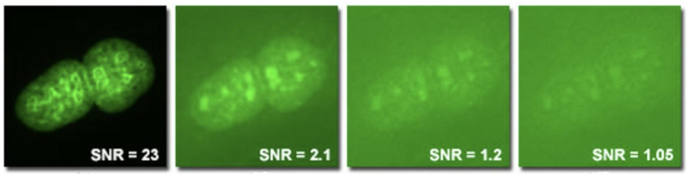

---

# Thực hành Tính RMSE và SNR.

<gap></gap>

```python
import numpy as np

def calculate_rmse(original, compressed):
    return np.sqrt(np.mean((original - compressed) ** 2))

def calculate_snr(original, compressed):
    signal_power = np.mean(original ** 2)
    noise_power = np.mean((original - compressed) ** 2)
    return 10 * np.log10(signal_power / noise_power)

# Ví dụ
original = np.array([[100, 150], [200, 250]])
compressed = np.array([[105, 145], [195, 255]])
print(f"RMSE: {calculate_rmse(original, compressed):.4f}")
print(f"SNR: {calculate_snr(original, compressed):.2f} dB")
```

---

# Các loại nén ảnh

- **Nén không tổn hao (Lossless):**
  - _Nguyên lý:_ Tìm và loại bỏ sự dư thừa mà không làm mất thông tin.
  - _Đặc điểm:_ Ảnh khôi phục giống hệt ảnh gốc. Tỷ lệ nén thấp (thường 2:1 đến 4:1).
  - _Ứng dụng:_ Ảnh y tế, văn bản, ảnh đồ họa (logo).
- **Nén có tổn hao (Lossy):**
  - _Nguyên lý:_ Loại bỏ những thông tin mà mắt người khó nhận ra.
  - _Đặc điểm:_ Ảnh khôi phục gần giống, mất một số chi tiết nhỏ. Tỷ lệ nén cao (10:1, 20:1 hoặc hơn).
  - _Ứng dụng:_ Ảnh chụp, video, web (JPEG).

---

# Mô hình hệ thống nén ảnh tổng quát

- Hệ thống nén ảnh thường được chia thành hai khối chính: bộ mã hóa và bộ giải mã. Bộ mã hóa biến ảnh gốc thành dạng dữ liệu ngắn gọn hơn để lưu trữ hoặc truyền đi, còn bộ giải mã khôi phục lại ảnh từ dữ liệu đã nén.
- **Bộ mã hóa (Encoder):**
  - **Mapper:** Giảm dư thừa không gian/thời gian (biến đổi ảnh sang dạng thuận lợi hơn).
  - **Quantizer:** Giảm thông tin không liên quan (chỉ có trong nén lossy). Làm tròn/gộp giá trị để giảm số mức biểu diễn.
  - **Symbol Coder:** Giảm dư thừa mã hóa (sử dụng mã độ dài biến đổi, mã loạt dài...).
- **Bộ giải mã (Decoder):** Thực hiện quá trình ngược lại.
  - **Symbol Decoder:** Giải mã ký hiệu.
  - **Inverse Quantizer:** Giải lượng tử hóa (chỉ có trong lossy).
  - **Inverse Mapper:** Biến đổi ngược để khôi phục ảnh.

---
<!--_class: section-->

# NÉN KHÔNG TỔN THẤT (LOSSLESS)

---

# Định nghĩa

- Các thuật toán và kỹ thuật nén ảnh bảo toàn toàn vẹn dữ liệu gốc.
- Đảm bảo ảnh giải nén giống hệt 100% so với ảnh trước khi nén.

---

# Mã Huffman

<div class="columns">
<div class="col-2">

- **Khái niệm:** Phương pháp mã hóa độ dài thay đổi. Ký tự xuất hiện càng nhiều thì mã càng ngắn, ký tự hiếm mã càng dài. Giúp giảm số bit trung bình cần dùng.
- **Quy trình xây dựng cây Huffman:**
  1. Sắp xếp các ký tự theo xác suất (tần suất).
  2. Gộp 2 xác suất nhỏ nhất thành một nút mới có giá trị bằng tổng 2 nút con.
  3. Lặp lại cho đến khi còn lại 1 cây duy nhất.
  4. Gán bit cho các nhánh (ví dụ: trái = 0, phải = 1).
- **Ứng dụng:** Mã hóa các pixel theo giá trị mức xám (0-255).

</div>
<div>

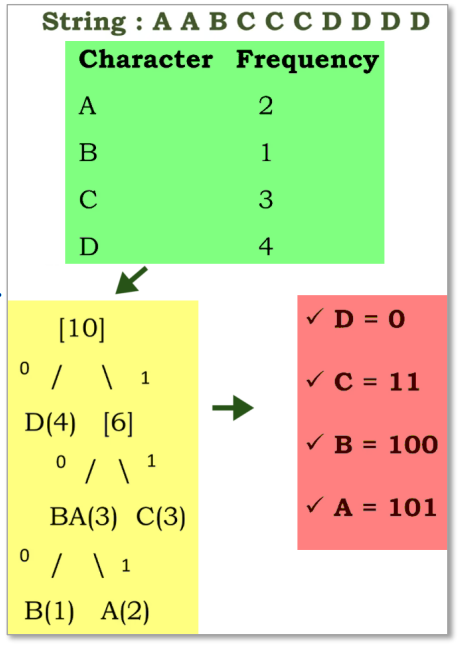
</div>
</div>

---

# Ví dụ mã Huffman (1)

- **Chuỗi cần mã hoá:** "Cộng hoà xã hội chủ nghĩa"
- **Trước mã hoá:** Chuỗi ký tự ASCII tiêu chuẩn (mỗi ký tự 8 bit).
- **Sau mã hoá:** Chuỗi bit được rút gọn đáng kể nhờ các ký tự xuất hiện nhiều (như dấu cách, chữ 'a', 'o', 'h') được gán mã ngắn.

<gap></gap>

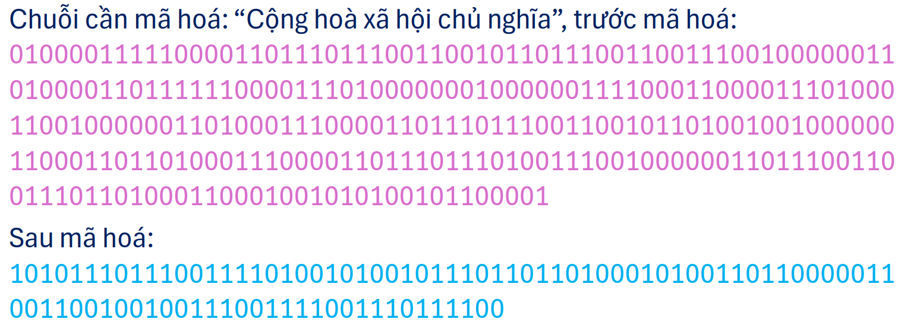

<gap></gap>

- _Lưu ý:_ Cây Huffman hoặc bảng mã cần được lưu kèm hoặc gửi kèm ở phần đầu file nén để bộ giải mã có thể hiểu được.

---

# Ví dụ mã Huffman (2)

<div class="columns">
<div class="col-2">

- **Các bước thực hiện:**
  1. Tính tần suất xuất hiện của từng ký tự.
  2. Sắp xếp theo xác suất giảm dần.
  3. Xây dựng cây Huffman bằng cách gộp 2 nút có tần suất nhỏ nhất.

</div>
<div class="col-5">

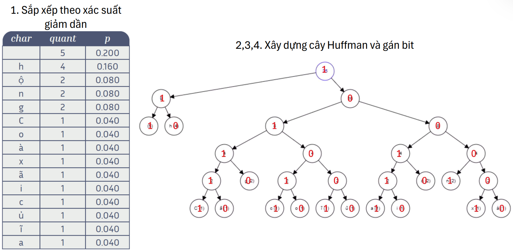

</div>
</div>
<ul>

4. Gán bit 0 cho nhánh trái, 1 cho nhánh phải.
5. Đọc đường đi từ gốc đến lá để ra mã của từng ký tự.

</ul>

---

# Thực hành Xây dựng cây Huffman và mã hóa chuỗi.
<gap></gap>
```python
import heapq

class Node:
    def __init__(self, char, freq):
        self.char = char
        self.freq = freq
        self.left = None
        self.right = None
    def __lt__(self, other):
        return self.freq < other.freq

def build_huffman_tree(text):
    freq = {}
    for char in text:
        freq[char] = freq.get(char, 0) + 1
    heap = [Node(char, f) for char, f in freq.items()]
    heapq.heapify(heap)
    while len(heap) > 1:
        left = heapq.heappop(heap)
        right = heapq.heappop(heap)
        merged = Node(None, left.freq + right.freq)
        merged.left = left
        merged.right = right
        heapq.heappush(heap, merged)
    return heap[0]

def generate_codes(node, prefix="", code_map={}):
    if node is not None:
        if node.char is not None:
            code_map[node.char] = prefix
        generate_codes(node.left, prefix + "0", code_map)
        generate_codes(node.right, prefix + "1", code_map)
    return code_map

text = "aabbc"
tree = build_huffman_tree(text)
codes = generate_codes(tree)
print("Mã Huffman:", codes)
```

---

# Giải mã Huffman

- **Nguyên lý:** Dựa vào cây Huffman đã được xây dựng để dịch ngược chuỗi bit về ký tự.
- **Quy trình:**
  1. Đọc lần lượt từng bit từ luồng dữ liệu nén.
  2. Bắt đầu từ nút gốc (root) của cây Huffman.
  3. Gặp bit 0 rẽ trái, gặp bit 1 rẽ phải.
  4. Khi đến nút lá (leaf), ta được một ký tự gốc. Xuất ký tự này ra.
  5. Quay lại nút gốc và tiếp tục đọc bit tiếp theo cho đến hết luồng dữ liệu.

---

# Mã Golomb & Golomb-Rice

<div class="columns">
<div>

- **Mã Golomb:**
  - _Ý tưởng:_ Mã hóa số nguyên $N$ bằng cách chia cho $M$.
  - Thương (Quotient) mã hóa phần đầu, Số dư (Remainder) mã hóa phần sau.
  - Hiệu quả khi các số nhỏ xuất hiện nhiều hơn số lớn (phân bố mũ).
- **Mã Golomb-Rice:**
  - Trường hợp đặc biệt khi $M = 2^k$.
  - Phép chia trở thành phép dịch bit (rất nhanh).
  - Thương = dịch phải $k$ bit. Số dư = $k$ bit thấp hơn.

</div>
<div>
<gap style="--size:20px"></gap>

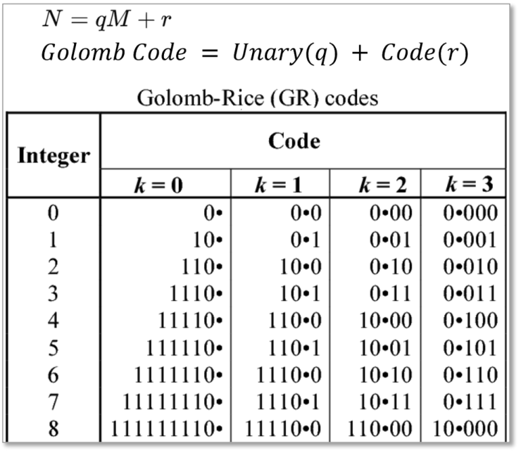

</div>
</div>


---

# Giải mã Golomb & Golomb-Rice

- **Nguyên lý:** Tách lại phần Thương và phần Dư để tính ra số nguyên ban đầu $N$.
- **Quy trình (với Golomb-Rice):**
  1. Đọc các bit cho đến khi gặp bit 1 đầu tiên. Số lượng bit 0 đếm được chính là Thương ($q$).
  2. Đọc tiếp $k$ bit tiếp theo để lấy Số dư ($r$).
  3. Khôi phục giá trị gốc: $N = q \times 2^k + r$.
---

# Thực hành Mã hóa và giải mã Golomb-Rice.
<gap></gap>
```python
def golomb_rice_encode(n, k):
    M = 2 ** k
    q = n // M
    r = n % M
    quotient_bits = '0' * q + '1'
    remainder_bits = f"{r:0{k}b}"
    return quotient_bits + remainder_bits

def golomb_rice_decode(bits, k):
    q = 0
    for bit in bits:
        if bit == '0': q += 1
        else: break
    r_bits = bits[q+1 : q+1+k]
    r = int(r_bits, 2)
    return q * (2 ** k) + r

n = 13
k = 2
encoded = golomb_rice_encode(n, k)
print(f"Mã hóa {n} với k={k}: {encoded}")
print(f"Giải mã: {golomb_rice_decode(encoded, k)}")
```

---

# Mã số học (Arithmetic Coding)

<div class="columns">
<div class="col-2">

- **Khác biệt với Huffman:** Không ánh xạ 1-1 giữa ký tự và mã. Một chuỗi ký tự dài được ánh xạ vào một khoảng số thực duy nhất trong $[0, 1)$.
- **Ý tưởng:** Mỗi ký tự làm thu hẹp dần một khoảng. Sau khi xử lý hết chuỗi, chỉ cần chọn một số nằm trong khoảng cuối cùng.
- **Ưu điểm:** Vượt qua giới hạn 1 bit/ký tự của Huffman, tiệm cận giới hạn Entropy của Shannon.

</div>
<div>

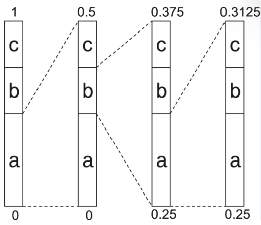
</div>
</div>

- **Mở rộng:** Mô hình xác suất thích nghi theo ngữ cảnh (Adaptive Context-Dependent), xác suất thay đổi theo ngữ cảnh trước đó giúp tăng hiệu quả nén.

---

# Ví dụ mã số học

<div class="columns">
<div class="col-2">

- **Giả sử bảng xác suất:** A = 0.5, B = 0.3, C = 0.2.
- **Các khoảng tương ứng:**
  - A: $[0.0, 0.5)$
  - B: $[0.5, 0.8)$
  - C: $[0.8, 1.0)$
- **Mã hóa chuỗi "AB":**

</div>
<div class="col-5">

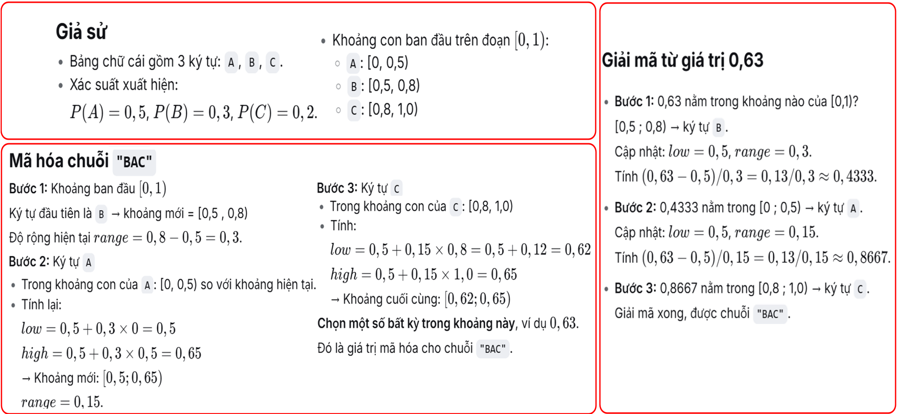

</div>
</div>
<ul>

  1. Ký tự 'A' (khoảng $[0.0, 0.5)$): Thu hẹp khoảng hiện tại thành $[0.0, 0.5)$.
  2. Ký tự 'B' (chiếm 30% khoảng): Chia khoảng $[0.0, 0.5)$ thành 3 phần. 'B' nằm ở khoảng $[0.5 \times 0.5, 0.8 \times 0.5) = [0.25, 0.4)$.

</ul>

- **Kết quả:** Bất kỳ số nào trong khoảng $[0.25, 0.4)$ (ví dụ: 0.3) đều đại diện cho chuỗi "AB".

---

# Giải mã Số học (Arithmetic Decoding)

- **Nguyên lý:** Xác định xem con số thực nằm trong khoảng con của ký tự nào để suy ra ký tự đó.
- **Quy trình:**
  1. Khởi tạo khoảng hiện tại là $[0, 1)$.
  2. Dựa vào bảng xác suất, chia khoảng hiện tại thành các khoảng con.
  3. Kiểm tra xem con số giải mã nằm trong khoảng con của ký tự nào $\rightarrow$ Xuất ký tự đó.
  4. Thu hẹp khoảng hiện tại thành đúng khoảng con vừa tìm được.
  5. Lặp lại cho đến khi giải mã đủ số lượng ký tự.
---

# Thực hành Mã hóa số học.
<gap></gap>

```python
def arithmetic_encode(message, probs):
    low, high = 0.0, 1.0
    for char in message:
        range_size = high - low
        cum_prob = 0
        for c, p in probs.items():
            if c == char:
                high = low + range_size * (cum_prob + p)
                low = low + range_size * cum_prob
                break
            cum_prob += p
    return (low + high) / 2

probs = {'A': 0.5, 'B': 0.3, 'C': 0.2}
message = "AB"
encoded_value = arithmetic_encode(message, probs)
print(f"Giá trị mã hóa số học của '{message}': {encoded_value}")
```

---

# Mã LZW (Lempel-Ziv-Welch)

- **Nguyên lý:** Thay thế các chuỗi lặp lại bằng một mã số ngắn hơn.
- **Từ điển động:** LZW xây dựng từ điển trong lúc nén. Khi gặp chuỗi đã xuất hiện, thay bằng mã cố định (thường 9-12 bit).
- **Cách hoạt động:**
  1. Khởi tạo từ điển ban đầu với các ký tự đơn.
  2. Đọc dữ liệu đầu vào để tạo chuỗi hiện tại.
  3. Nếu chuỗi mới đã có trong từ điển, tiếp tục mở rộng.
  4. Nếu chưa có, xuất mã của chuỗi cũ và thêm chuỗi mới vào từ điển.
- **Điểm hay:** Cả bộ nén và giải nén đều tự xây dựng lại cùng một từ điển mà không cần gửi kèm.

---

# Ví dụ mã hoá với LZW

<div class="columns">
<div>

- **Mã hoá chuỗi:** "ABAABABA"
- **Từ điển ban đầu:** A: 65, B: 66 (Mã ASCII)
- **Các mã mới bắt đầu từ 256.**
- **Quá trình:**
  - Đọc 'A': có trong từ điển.
  - Đọc 'AB': chưa có $\rightarrow$ Xuất mã của 'A' (65), thêm 'AB' vào từ điển (mã 256).
  - Đọc 'B': có.

</div>
<div>

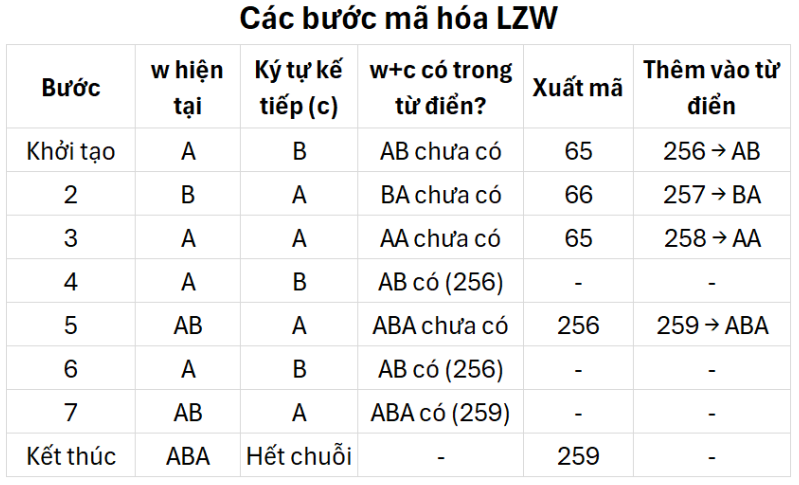

</div>
</div>
<ul>

  - Đọc 'BA': chưa có $\rightarrow$ Xuất mã 'B' (66), thêm 'BA' (257).
  - Đọc 'AAB': chưa có $\rightarrow$ Xuất mã 'A' (65), thêm 'AA' (258).
  - ... Tiếp tục cho đến hết chuỗi.

</ul>

---

# Giải mã LZW

- **Nguyên lý:** Bộ giải nén tự động xây dựng lại từ điển y hệt bộ nén.
- **Quy trình:**
  1. Khởi tạo từ điển với các ký tự đơn.
  2. Đọc mã đầu tiên, xuất chuỗi tương ứng, lưu làm `Chuỗi_trước`.
  3. Đọc mã tiếp theo:
     - _TH1:_ Mã đã có $\rightarrow$ Xuất chuỗi. Thêm vào từ điển `Chuỗi_trước` + Ký tự đầu của chuỗi hiện tại.
     - _TH2 (Đặc biệt):_ Mã chưa có $\rightarrow$ Thêm `Chuỗi_trước` + Ký tự đầu của `Chuỗi_trước`, sau đó xuất chuỗi này.
  4. Cập nhật `Chuỗi_trước` = chuỗi vừa xuất. Lặp lại.
---

# Thực hành Nén LZW.
<gap></gap>

```python
def lzw_compress(text):
    dict_size = 256
    dictionary = {chr(i): i for i in range(dict_size)}
    w = ""
    compressed = []
    for c in text:
        wc = w + c
        if wc in dictionary:
            w = wc
        else:
            compressed.append(dictionary[w])
            dictionary[wc] = dict_size
            dict_size += 1
            w = c
    if w:
        compressed.append(dictionary[w])
    return compressed

text = "ABAABABA"
print("Mã LZW:", lzw_compress(text))
```

---

# Mã hóa độ dài Run (Run-Length Encoding - RLE)

<div class="columns">
<div>

- **Nguyên lý:** Thay thế chuỗi các pixel giống hệt nhau bằng cặp (Giá trị, Độ dài).
- **Chuẩn CCITT Group 3 & 4:** Dùng cho ảnh nhị phân (Fax).
  - Group 4 sử dụng mã hóa 2D (READ) tham chiếu dòng trước đó để nén tốt hơn.

</div>
<div>
<gap></gap>

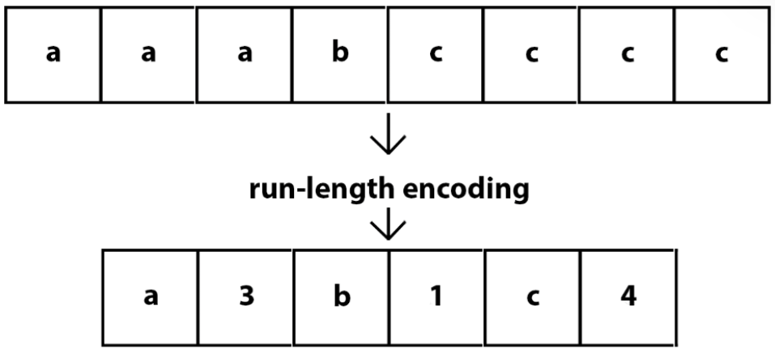

</div>
</div>

- **Giải mã:** Đọc từng cặp (Giá trị, Độ dài) và ghi liên tiếp Giá trị đó vào ảnh với số lượng bằng Độ dài.

<gap></gap>

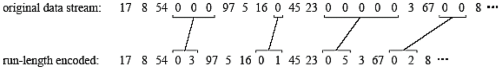

---

# Mã hóa Symbol-based (JBIG2)

- **Nguyên lý:** Tạo từ điển các ký hiệu (ví dụ: ký tự 'a', 'b', hoặc các mẫu lặp lại).
- **Cách hoạt động:** Thay thế các vùng giống nhau trong ảnh bằng tọa độ và token tham chiếu đến từ điển.
- **Ví dụ:** Dữ liệu đầu vào là ảnh quét của chuỗi "banana".
<gap></gap>

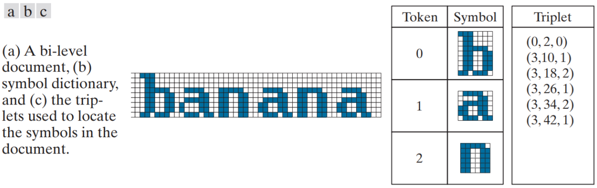

<gap></gap>

- **Giải mã:** Giải nén từ điển ký hiệu và luồng tọa độ, sau đó "dán" (paste) các mẫu ký hiệu lên đúng vị trí (X, Y) trên nền trang trắng. Rất hiệu quả cho tài liệu văn bản quét.

---

# Mã hoá bit-plane

<div class="columns">
<div class="col-4">

- **Khái niệm:** Biểu diễn một ảnh $m$-bit bằng cách tách nó thành $m$ ảnh nhị phân riêng biệt. Mỗi mặt phẳng bit chứa một bit tại cùng vị trí của tất cả pixel.
- **Ví dụ:** Với ảnh 8 bit, bit cao nhất chứa cấu trúc cường độ chính, các bit thấp hơn mô tả chi tiết tinh và dễ bị nhiễu hơn.

</div>
<div class="col-5">

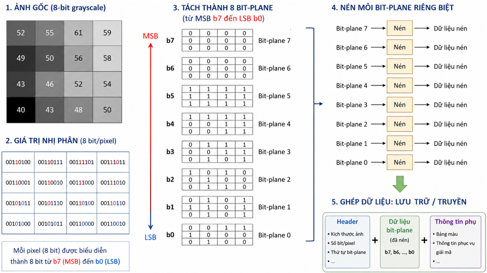

</div>
</div>

- **Xử lý:** Các bit-plane có thể được nén hoặc xử lý riêng tùy theo mức độ quan trọng.
- **Giải mã:** Dịch chuyển (shift) các bit của từng mặt phẳng nhị phân về lại đúng vị trí, thực hiện phép toán OR (|) để ghép $m$ mặt phẳng thành ảnh gốc.

---
<!--_class: section-->

# NÉN CÓ TỔN THẤT (LOSSY)

---

# Định nghĩa

- Các phương pháp nén chấp nhận loại bỏ một phần thông tin để đạt tỷ lệ nén cao.
- Tận dụng các đặc điểm của hệ thống thị giác con người (HVS) để loại bỏ thông tin ít nhạy cảm.

---

# Mã hóa biến đổi khối (Block Transform Coding)

- **Mục tiêu:** Loại bỏ dư thừa dữ liệu để giảm dung lượng mà vẫn giữ chất lượng ảnh ở mức chấp nhận được.
- **Quy trình chi tiết:**
  1. **Chia khối (Blocking):** Chia ảnh thành các khối pixel nhỏ (thường 8x8).
  2. **Biến đổi (Transform):** Chuyển đổi giá trị pixel thành hệ số tần số (phổ biến nhất là DCT - Discrete Cosine Transform).
  3. **Lượng tử hóa (Quantization):** Làm tròn các hệ số, loại bỏ thông tin ít quan trọng.
  4. **Mã hóa (Coding):** Mã hóa các hệ số đã lượng tử hóa (thường dùng Zigzag + RLE + Huffman).

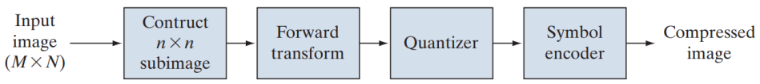

- **Phân bổ Bit:** Zonal Coding (giữ hệ số có phương sai lớn nhất) hoặc Threshold Coding (giữ N hệ số có độ lớn tuyệt đối lớn nhất).

---

# Minh hoạ mã hoá khối

<div class="columns">
<div class="col-3">

- **Đầu vào:** Một khối pixel 8x8.
- **Biến đổi DCT:** Chuyển từ miền không gian sang miền tần số. Hệ số DC (góc trái trên) đại diện cho thành phần tần số thấp (thông tin nền), các hệ số AC đại diện cho tần số cao (chi tiết, biên).

</div>
<div class="col-5">

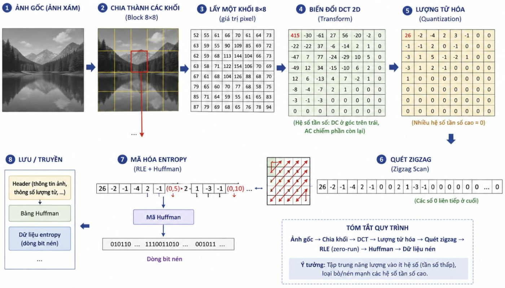
</div>
</div>

- **Lượng tử hóa:** Chia các hệ số cho ma trận lượng tử hóa (Q-table) và làm tròn. Nhiều hệ số tần số cao trở thành 0.
- **Mã hóa:** Quét zigzag để gom các số 0 lại, sau đó dùng RLE và Huffman để mã hóa.

---

# Giải mã Biến đổi khối

- **Quy trình:**
  1. **Giải mã Entropy:** Dùng Huffman/Arithmetic để giải mã luồng bit, khôi phục các hệ số DCT.
  2. **Giải lượng tử hóa (Inverse Quantization):** Nhân từng hệ số với giá trị tương ứng trong Ma trận lượng tử. (Lưu ý: Bước này gây tổn thất vĩnh viễn, các số 0 không thể khôi phục chính xác).
  3. **Biến đổi ngược DCT (IDCT):** Áp dụng IDCT lên khối $8\times8$ để chuyển ngược về miền không gian.
  4. **Ghép khối:** Đặt các khối $8\times8$ về đúng vị trí để tạo thành bức ảnh hoàn chỉnh.

---

# Mã hóa dự đoán (Predictive Coding/DPCM)

- **Ý tưởng:** Các pixel lân cận thường giống nhau. Thay vì gửi giá trị tuyệt đối, ta chỉ gửi phần chênh lệch (sai số) giữa pixel thật và pixel dự đoán.
- **Nguyên lý:** $e(n) = f(n) - \hat{f}(n)$. Chỉ mã hóa sai số dự đoán $e(n)$.
  - $f(n)$: dữ liệu thực tế.
  - $\hat{f}(n)$: dữ liệu dự đoán.
  - $e(n)$: sai số dự đoán.
- **Phân loại:**
  - _Lossless:_ $\hat{f}(n)$ là tổ hợp tuyến tính các pixel lân cận.
  - _Lossy:_ Thêm bộ lượng tử hóa cho $e(n)$ để giảm số bit. Bộ lượng tử hóa tối ưu: Lloyd-Max.

---

# Ví dụ mã hoá dự đoán

- **Giả sử cần truyền dãy pixel:** 150, 152, 149, 151.
- **Mã hóa trực tiếp:** Mỗi số 8-bit $\rightarrow$ 32 bit.
- **Dùng dự đoán đơn giản:** $\hat{x}_n = x_{n-1}$
  - Truyền $x_1 = 150$ (8 bit)
  - $e_2 = 152 - 150 = 2$ (chỉ cần 2 bit)
  - $e_3 = 149 - 152 = -3$ (2 bit)
  - $e_4 = 151 - 149 = 2$ (2 bit)
- **Tổng:** $\approx 8 + 2 + 2 + 2 = 14$ bit. Tiết kiệm hơn rất nhiều so với 32 bit.

---

# Giải mã Dự đoán

- **Nguyên lý:** Cộng phần sai số nhận được với giá trị dự đoán.
- **Quy trình:**
  1. Nhận sai số $e(n)$ từ luồng bit.
  2. Tính giá trị dự đoán $\hat{f}(n)$ từ các pixel đã giải nén trước đó.
  3. Khôi phục pixel gốc: $f(n) = \hat{f}(n) + e(n)$.
  4. Lưu $f(n)$ vào bộ nhớ đệm để làm dữ liệu dự đoán cho pixel $n+1$.
---

# Thực hành mã hóa và giải mã DPCM.
<gap></gap>
```python
def dpcm_encode(signal):
    encoded = [signal[0]]
    for i in range(1, len(signal)):
        predicted = signal[i-1]
        error = signal[i] - predicted
        encoded.append(error)
    return encoded

def dpcm_decode(encoded):
    decoded = [encoded[0]]
    for i in range(1, len(encoded)):
        predicted = decoded[i-1]
        decoded.append(predicted + encoded[i])
    return decoded

signal = [150, 152, 149, 151]
encoded = dpcm_encode(signal)
print("Mã hóa DPCM:", encoded)
print("Giải mã DPCM:", dpcm_decode(encoded))
```

---

# Mã hóa Wavelet

- **Khái niệm:** Phương pháp nén ảnh dùng biến đổi wavelet rời rạc (DWT). Khắc phục nhược điểm artifact khối của DCT (JPEG) khi nén tỷ lệ cao.
- **Đặc trưng:**
  - Biến đổi toàn ảnh, không chia khối.
  - Biểu diễn đa phân giải (multiresolution).
  - Hỗ trợ cả nén lossless và lossy.
  - Cho phép truyền ảnh tiến triển (progressive).

<div class="columns">
<div>

- **Chuẩn tiêu biểu:** JPEG 2000.

</div>
<div class="col-3">
<gap></gap>

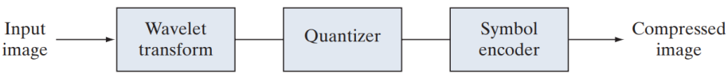

</div>
</div>

- **Các bước:**
  1. Biến đổi DWT: Ảnh $\rightarrow$ các băng con hệ số.
  2. Lượng tử hóa: Chia mỗi hệ số cho bước lượng tử.
  3. Mã hóa entropy: Dùng mã hóa bit-plane + mã hóa số học (EZW, SPIHT, EBCOT).

---

# Giải mã Wavelet

- **Quy trình:**
  1. **Giải mã Entropy:** Giải mã luồng bit (thường dùng Arithmetic Coding kết hợp EZW, SPIHT, EBCOT) để khôi phục các hệ số Wavelet.
  2. **Giải lượng tử hóa:** Nhân các hệ số với bước lượng tử (hoặc dùng bước = 1 nếu là lossless).
  3. **Biến đổi Wavelet ngược (IDWT):** Tổng hợp lại ảnh từ các băng con (sub-bands) tần số thấp và cao để tạo ra ảnh ở độ phân giải gốc.
- **Ưu điểm:** Quá trình này không gây ra hiệu ứng khối (blocking artifact) như JPEG thông thường, cho phép nén tỷ lệ cao mà vẫn giữ được độ mượt của ảnh.
