---

marp: true
theme: eaut
paginate: true
transition: fade
--------------

<!--_class: cover-->

<div class="middle">

# XỬ LÝ ẢNH & THỊ GIÁC MÁY TÍNH

## CHƯƠNG 3 - NÉN ẢNH

</div>

### Giảng viên: Nguyễn Phồn Lữa

---
<!--_class: toc-->

# NỘI DUNG CHƯƠNG

1. Giới thiệu về nén ảnh
2. Đo lường thông tin và chất lượng ảnh
3. Hệ thống nén ảnh
4. Nén không tổn thất (Lossless)
5. Nén có tổn thất (Lossy)
---
<!--_class: text-sm-->

# MỤC TIÊU HỌC TẬP

Sau khi hoàn thành chương này, sinh viên có thể:

**Kiến thức cơ bản:**
- Giải thích được tại sao cần nén ảnh
- Phân biệt được dữ liệu, thông tin và dư thừa dữ liệu
- Hiểu và tính được Entropy của một nguồn ảnh

**Phân loại và mô hình:**
- Giải thích được sự khác nhau giữa nén không tổn thất (Lossless) và nén có tổn thất (Lossy)
- Mô tả được mô hình tổng quát của một hệ thống nén ảnh

**Kỹ thuật nén:**
- Hiểu nguyên lý của các kỹ thuật: Huffman, Golomb/Golomb-Rice, Arithmetic Coding, LZW, RLE, DPCM, DCT và Block Transform Coding, Wavelet/DWT
- Giải thích được quy trình cơ bản của JPEG

**Đánh giá:**
- Đánh giá được ảnh sau nén bằng một số tiêu chí định lượng và định tính

---
<!--_class: section-->

# Giới thiệu về nén ảnh

---

# VÌ SAO CẦN NÉN ẢNH?

**Vấn đề:** Ảnh số thường có kích thước dữ liệu rất lớn

**Ví dụ minh họa:**
- Ảnh màu có kích thước 4000 × 3000 pixel
- Mỗi pixel gồm 3 kênh màu:
  - R (Red): 8 bit
  - G (Green): 8 bit
  - B (Blue): 8 bit

**Tính toán dung lượng dữ liệu thô:** $4000 \times 3000 \times 3 \times 8 = 288,000,000 \text{ bit}$

hay khoảng: $36,000,000 \text{ byte} \approx 34.3 \text{ MB}$. Đây mới chỉ là dữ liệu pixel, chưa tính các thông tin bổ sung của file (metadata, header, v.v.)

**Hệ quả:** Nếu lưu trữ hoặc truyền hàng triệu ảnh, lượng dữ liệu sẽ rất lớn, gây tốn kém về dung lượng lưu trữ và băng thông truyền tải.

---

# NÉN ẢNH LÀ GÌ?

**Định nghĩa:** Nén ảnh (Image Compression) là quá trình giảm số bit cần thiết để biểu diễn một ảnh.

**Mục tiêu:** Giảm dung lượng dữ liệu nhưng vẫn đáp ứng yêu cầu về khả năng khôi phục và chất lượng ảnh

**Phân loại theo khả năng khôi phục:**

<div class="columns">
<div>

**1. Nén không tổn thất (Lossless):**
- Ảnh sau giải nén giống hệt ảnh gốc
- Không mất bất kỳ thông tin nào

</div>
<div>

**2. Nén có tổn thất (Lossy):**
- Ảnh sau giải nén khác ảnh gốc
- Vẫn đạt chất lượng chấp nhận được
- Một phần thông tin bị loại bỏ

</div>
</div>

**Quy trình tổng quát:**

```
Ảnh gốc → [NÉN] → Dữ liệu nhỏ hơn → [GIẢI NÉN] → Ảnh khôi phục
```

---

# TẠI SAO DỮ LIỆU ẢNH CÓ THỂ NÉN?

**Nguyên lý cơ bản:** Một ảnh không phải là tập hợp các pixel hoàn toàn độc lập.

**Các đặc điểm tạo ra khả năng nén:**

<div class="columns">
<div>

**1. Sự lặp lại:**
- Các giá trị pixel lặp lại trong ảnh
- Ví dụ: Vùng trời xanh có nhiều pixel cùng giá trị

**2. Tương quan không gian:**
- Các pixel lân cận thường có giá trị tương tự nhau
- Ví dụ: Pixel ở giữa vùng da người có giá trị gần giống pixel xung quanh

</div>
<div>

**3. Phân bố không đều:**
- Một số giá trị xuất hiện thường xuyên hơn các giá trị khác
- Ví dụ: Trong ảnh văn bản, màu trắng xuất hiện nhiều hơn màu đen

**4. Giới hạn của thị giác:**
- Một số chi tiết ít quan trọng đối với thị giác con người
- Mắt người không nhận biết được mọi thay đổi nhỏ

</div>
</div>

**Kết luận:** Những đặc điểm này tạo ra **dư thừa dữ liệu (redundancy)**. Nén ảnh chủ yếu là quá trình khai thác và loại bỏ hoặc biểu diễn hiệu quả các dạng dư thừa này.

---
<!--_class: section-->

# Đo lường thông tin và chất lượng ảnh

---

# DỮ LIỆU VÀ THÔNG TIN


<div class="columns">
<div>

**Dữ liệu (Data):**
- Là phương tiện dùng để biểu diễn và lưu trữ thông tin
- Mang tính kỹ thuật, có thể đo đếm được

**Ví dụ về dữ liệu:**
```
128 129 130 130 131 131 131 ...
```
Đây là dãy giá trị pixel của một vùng ảnh.

**Thông tin (Information):**
- Là nội dung có ý nghĩa được truyền tải bởi dữ liệu
- Mang tính ngữ nghĩa, phụ thuộc vào ngữ cảnh

</div>
<div>

**Ví dụ về thông tin:**
- Một vùng ảnh có màu xanh
- Một đường biên giữa hai đối tượng
- Một ký tự trong văn bản
- Một khuôn mặt trong ảnh chân dung

**Ý tưởng cốt lõi của nén ảnh:**
- Giảm số bit dùng để biểu diễn dữ liệu
- Vẫn bảo toàn thông tin cần thiết theo mục đích sử dụng
- Có thể loại bỏ dữ liệu dư thừa mà không mất thông tin quan trọng

</div>
</div>


---

# TỶ LỆ NÉN

**Định nghĩa các đại lượng:**
- $B_o$: số bit của dữ liệu gốc
- $B_c$: số bit của dữ liệu sau nén

**Tỷ lệ nén (Compression Ratio - CR):** $CR = \frac{B_o}{B_c}$

<div class="columns">
<div>

**Ví dụ minh họa:**
- Ảnh gốc: 10 MB
- Ảnh sau nén: 2 MB

</div>
<div>

<gap></gap>
<gap></gap>

$$CR = \frac{10}{2} = 5:1$$

</div>
<div class="col-2">
</div>
</div>

**Ý nghĩa:** Dữ liệu được nén với tỷ lệ 5:1, tức là dung lượng giảm đi 5 lần.

**Tỷ lệ giảm dung lượng (Space Savings - R):** $R = 1 - \frac{B_c}{B_o}$

**Với ví dụ trên:** $R = 1 - \frac{2}{10} = 0.8 = 80\%$

**Ý nghĩa:** Dung lượng đã giảm 80% so với ban đầu.

---

# DƯ THỪA DỮ LIỆU

**Định nghĩa:** Dư thừa dữ liệu (Redundancy) là phần biểu diễn dữ liệu có thể được loại bỏ hoặc mã hóa hiệu quả hơn mà không làm mất thông tin cần thiết.

**Cấu trúc của dữ liệu ảnh:**

```
Dữ liệu ảnh
├── Thông tin cần thiết (giữ lại)
└── Dư thừa (có thể loại bỏ hoặc mã hóa hiệu quả)
    ├── Dư thừa mã hóa (Coding Redundancy)
    ├── Dư thừa không gian (Spatial Redundancy)
    └── Thông tin không liên quan (Irrelevant Information)
```

**Nguyên lý nén ảnh:**
- Khai thác các dạng dư thừa
- Biểu diễn dữ liệu hiệu quả hơn
- Giảm số bit cần thiết mà vẫn giữ được thông tin quan trọng

**Ví dụ:** Thay vì lưu từng pixel riêng lẻ, có thể lưu "100 pixel màu trắng liên tiếp" chỉ bằng một cặp giá trị (màu, số lượng).

---

# CÁC LOẠI DƯ THỪA TRONG ẢNH

<div class="columns">
<div>

**1. Dư thừa mã hóa (Coding Redundancy)**

**Định nghĩa:** Xảy ra khi dùng nhiều bit hơn mức cần thiết để biểu diễn các giá trị có xác suất xuất hiện khác nhau.

**Ví dụ:** Nếu giá trị "0" xuất hiện 80% thời gian nhưng vẫn được mã hóa bằng 8 bit như các giá trị khác.

**Kỹ thuật khai thác:**
- Huffman Coding
- Arithmetic Coding
- Golomb Coding

</div>
<div>

**2. Dư thừa không gian (Spatial Redundancy)**

**Định nghĩa:** Các pixel lân cận thường có quan hệ mạnh với nhau.

**Ví dụ:** Trong vùng trời xanh, các pixel liên tiếp có giá trị gần giống nhau.

**Kỹ thuật khai thác:**
- RLE (Run-Length Encoding)
- DPCM (Differential Pulse Code Modulation)
- Transform Coding

</div>
<div>

**3. Thông tin không liên quan (Irrelevant Information)**

**Định nghĩa:** Một số thông tin ít ảnh hưởng đến cảm nhận của con người hoặc không cần thiết cho ứng dụng.

**Ví dụ:** Các chi tiết rất nhỏ mà mắt người không nhận ra.

**Kỹ thuật khai thác:**
- Quantization (Lượng tử hóa)
- JPEG
- Wavelet compression

</div>
</div>

---

# BA HƯỚNG TIẾP CẬN CHÍNH

Có thể nhìn toàn bộ chương thông qua ba câu hỏi cốt lõi:

<div style="color:red">

**Câu hỏi 1: Có thể dùng ít bit hơn để biểu diễn cùng thông tin không?**

</div>

- **Hướng tiếp cận:** Coding (Mã hóa thống kê)
- **Ví dụ:** Huffman, Arithmetic Coding, Golomb
- **Nguyên lý:** Gán mã ngắn cho ký hiệu xuất hiện thường xuyên, mã dài cho ký hiệu hiếm.

<div style="color:red">

**Câu hỏi 2: Có thể biểu diễn phần thay đổi thay vì toàn bộ dữ liệu không?**

</div>

- **Hướng tiếp cận:** Prediction / Transform (Dự đoán / Biến đổi)
- **Ví dụ:** DPCM, DCT (Discrete Cosine Transform)
- **Nguyên lý:** Chỉ mã hóa sự khác biệt hoặc biến đổi, không mã hóa toàn bộ giá trị.

<div style="color:red">

**Câu hỏi 3: Có thông tin nào ít quan trọng có thể bỏ qua không?**

</div>

- **Hướng tiếp cận:** Quantization (Lượng tử hóa)
- **Ví dụ:** JPEG, JPEG 2000
- **Nguyên lý:** Loại bỏ hoặc làm mịn các chi tiết không quan trọng.

---

# PHÂN BỐ MỨC XÁM

**Định nghĩa:** Đối với ảnh mức xám, mỗi pixel có một giá trị trong khoảng từ 0 đến L-1.

**Ký hiệu:**
- $x \in \{0, 1, \ldots, L-1\}$
- $L$ là số mức xám

**Ví dụ:** Ảnh 8 bit có $L = 256$ mức xám (từ 0 đến 255).

**Xác suất xuất hiện:**
- Mỗi mức xám $x_i$ có xác suất xuất hiện $P(x_i)$
- Tổng xác suất: $\sum_i P(x_i) = 1$

**Ý nghĩa:**
- Phân bố xác suất này là cơ sở để đánh giá lượng thông tin
- Là nền tảng để thiết kế các mã nén hiệu quả
- Giúp xác định mức độ dư thừa trong ảnh

---

# LƯỢNG TIN CỦA MỘT SỰ KIỆN

**Định nghĩa:** Lượng tin (Information Content) đo lượng thông tin mà một sự kiện mang lại.

**Công thức:** Giả sử một sự kiện $x$ có xác suất $P(x)$, lượng tin của sự kiện là:

$$I(x) = -\log_2 P(x)$$

**Đơn vị:** bit

**Ý nghĩa:**
- Sự kiện thường gặp (xác suất cao) → lượng tin nhỏ
- Sự kiện hiếm gặp (xác suất thấp) → lượng tin lớn

**Ví dụ minh họa:**

- $P(x) = 0.5$, $I(x) = -\log_2 0.5 = 1 \text{ bit}$
- $P(x) = 0.125$, $I(x) = -\log_2 0.125 = 3 \text{ bit}$

Một sự kiện càng khó dự đoán (xác suất thấp) thì khi xảy ra, nó mang càng nhiều thông tin. Ngược lại, sự kiện dễ dự đoán mang ít thông tin hơn.

---

# ENTROPY

**Định nghĩa:** Entropy biểu diễn lượng thông tin trung bình của một nguồn dữ liệu.

**Công thức:** Với các giá trị $x_1, x_2, \ldots, x_L$:

$$H(X) = -\sum_{i=1}^{L} P(x_i) \log_2 P(x_i)$$

**Đơn vị:** bit/symbol (bit trên mỗi ký hiệu)

**Đối với ảnh:** Symbol có thể là một pixel hoặc một mức xám hoặc một ký hiệu sau biến đổi

**Ý nghĩa:**
- Entropy đo mức độ không chắc chắn của nguồn
- Là giới hạn lý thuyết cho việc nén dữ liệu
- Cho biết số bit trung bình tối thiểu cần thiết để mã hóa nguồn

**Ví dụ:** Nếu entropy là 2.5 bit/pixel, thì về lý thuyết, ta có thể nén ảnh xuống còn trung bình 2.5 bit cho mỗi pixel.

---

# Ý NGHĨA CỦA ENTROPY

Entropy phản ánh mức độ không chắc chắn / khó dự đoán của nguồn dữ liệu.

**Trường hợp 1: Entropy cao**

**Đặc điểm:**
- Các giá trị có xác suất tương đối đồng đều
- Khó dự đoán giá trị tiếp theo
- Khó nén bằng các phương pháp thống kê đơn giản

**Ví dụ:** Ảnh nhiễu ngẫu nhiên, các mức xám xuất hiện với xác suất gần bằng nhau.

**Trường hợp 2: Entropy thấp**

**Đặc điểm:**
- Một số giá trị xuất hiện áp đảo
- Dễ dự đoán giá trị tiếp theo
- Có khả năng mã hóa bằng ít bit hơn

**Ví dụ:** Ảnh văn bản, vùng ảnh đồng nhất, các pixel có giá trị tương tự nhau.

**Kết luận:** Entropy thấp thường tạo nhiều cơ hội cho nén thống kê.

---

# VÍ DỤ TÍNH ENTROPY

**Bài toán:** Giả sử ảnh chỉ có ba mức xám $x_1$, $x_2$, $x_3$ với xác suất: $P(x_1)=0.5, P(x_2)=0.3, P(x_3)=0.2$

**Tính entropy:**

$$H = -(0.5 \log_2 0.5 + 0.3 \log_2 0.3 + 0.2 \log_2 0.2)$$

**Tính toán từng thành phần:**
- $0.5 \log_2 0.5 = 0.5 \times (-1) = -0.5$
- $0.3 \log_2 0.3 = 0.3 \times (-1.737) = -0.521$
- $0.2 \log_2 0.2 = 0.2 \times (-2.322) = -0.464$

$$H = -(-0.5 - 0.521 - 0.464) = 1.485 \text{ bit/pixel}$$

**So sánh với phân bố đều:**
Nếu ba mức xám xuất hiện bằng nhau ($P(x_i) = \frac{1}{3}$): $H = \log_2 3 \approx 1.585 \text{ bit/pixel}$

**Nhận xét:** Phân bố đều hơn → entropy cao hơn. Khi một mức xám chiếm ưu thế (xác suất cao), entropy giảm xuống.

---
<!--_class: text-xs-->

# ĐÁNH GIÁ CHẤT LƯỢNG ẢNH SAU NÉN

**Vấn đề:** Khi nén Lossy, ảnh giải nén có thể khác ảnh gốc. Do đó cần đánh giá mức độ sai khác.

**Hai nhóm tiêu chí đánh giá:**

<div class="columns">
<div class="col-5">

**1. Đánh giá khách quan (Objective Assessment)**

**Đặc điểm:** Dựa trên các đại lượng tính toán được từ dữ liệu

**Các chỉ số phổ biến:**
- **MSE** (Mean Squared Error): Sai số bình phương trung bình
- **RMSE** (Root Mean Squared Error): Căn bậc hai của MSE
- **SNR** (Signal-to-Noise Ratio): Tỷ lệ tín hiệu trên nhiễu
- **PSNR** (Peak Signal-to-Noise Ratio): Tỷ lệ tín hiệu đỉnh trên nhiễu

**Ưu điểm:** Khách quan, có thể tự động tính toán
**Nhược điểm:** Không phải lúc nào cũng phản ánh chính xác cảm nhận thị giác

</div>
<div class="col-4">

**2. Đánh giá chủ quan (Subjective Assessment)**

**Đặc điểm:** Dựa trên quan sát và cảm nhận của con người

**Các yếu tố đánh giá:**
- Độ sắc nét của ảnh
- Chi tiết được giữ lại
- Mức độ nhiễu
- Artifact (các biến dạng do nén)
- Khả năng nhận biết nội dung

**Ưu điểm:** Phản ánh cảm nhận thực tế
**Nhược điểm:** Chủ quan, tốn thời gian, khó tự động hóa

</div>
</div>

---

# SAI SỐ BÌNH PHƯƠNG TRUNG BÌNH - MSE

**Định nghĩa:** MSE (Mean Squared Error) đo mức sai khác bình phương trung bình giữa hai ảnh.

**Công thức:** Với ảnh gốc $f$ và ảnh khôi phục $g$, có $N$ pixel: $MSE = \frac{1}{N} \sum_{i=1}^{N} (f_i - g_i)^2$

<div class="columns">
<div>

**Trong đó:**
- $f_i$: giá trị pixel thứ $i$ của ảnh gốc
- $g_i$: giá trị pixel thứ $i$ của ảnh khôi phục
- $N$: tổng số pixel

**Ý nghĩa:**
- $MSE = 0$: Hai ảnh giống hệt nhau
- MSE càng nhỏ: sai khác càng nhỏ, chất lượng càng cao
- MSE càng lớn: sai khác càng lớn, chất lượng càng thấp

</div>
<div>

**Ưu điểm:**
- Dễ tính toán
- Được sử dụng rộng rãi

**Nhược điểm:**
- Không phản ánh hoàn toàn cảm nhận của con người
- Hai ảnh có cùng MSE có thể có chất lượng thị giác khác nhau

</div>
</div>

---

# RMSE VÀ SNR

<span style="color:red">

**RMSE (Root Mean Squared Error):**

</span>

**Công thức:** $RMSE = \sqrt{MSE}$$

<div class="columns">
<div class="col-2">

**Đặc điểm:**
- Có cùng đơn vị với giá trị pixel
- RMSE càng nhỏ → ảnh khôi phục càng gần ảnh gốc
- Dễ hiểu hơn MSE vì cùng đơn vị với dữ liệu gốc

</div>
<div>

**Ví dụ:** Nếu RMSE = 5, nghĩa là sai số trung bình khoảng 5 đơn vị mức xám.

</div>
</div>
<span style="color:red">

**SNR (Signal-to-Noise Ratio):**

</span>
<div class="columns">
<div class="col-5">

**Công thức:** $SNR = 10 \log_{10} \left( \frac{P_{signal}}{P_{noise}} \right)$

**Trong đó:** $P_{noise} = \frac{1}{N} \sum_i (f_i - g_i)^2 = MSE$
**Ý nghĩa:**
- SNR càng cao → tỷ lệ tín hiệu so với sai số càng lớn

</div>
<div class="col-4">

- Chất lượng ảnh càng tốt
- Đơn vị: dB (decibel)

**So sánh:**
- MSE/RMSE: Đo sai số tuyệt đối
- SNR: Đo tỷ lệ giữa tín hiệu và nhiễu
- Cả hai đều là chỉ số khách quan

</div>
</div>

---

# PSNR

**Định nghĩa:** PSNR (Peak Signal-to-Noise Ratio) là một chỉ số rất phổ biến trong đánh giá nén ảnh.

**Công thức:** Với ảnh $B$ bit: $MAX_I = 2^B - 1$,  $PSNR = 10 \log_{10} \left( \frac{MAX_I^2}{MSE} \right)$

**Ví dụ:** Với ảnh 8 bit: $MAX_I = 2^8 - 1 = 255$

**Ý nghĩa:**
- MSE càng nhỏ → PSNR càng lớn
- PSNR lớn thường tương ứng với sai khác pixel nhỏ hơn
- Đơn vị: dB (decibel)

**Ngưỡng tham khảo:**
- PSNR > 40 dB: Chất lượng rất tốt, khó nhận biết sai khác
- PSNR 30-40 dB: Chất lượng tốt
- PSNR 20-30 dB: Chất lượng chấp nhận được
- PSNR < 20 dB: Chất lượng kém, có thể nhận biết rõ sai khác.

---
<!--_class: text-sm-->

# ĐÁNH GIÁ CHỦ QUAN

**Vấn đề:** Hai ảnh có thể có MSE hoặc PSNR tương tự nhau nhưng cảm nhận của con người khác nhau.

**Các yếu tố cần quan sát khi đánh giá trực quan:**

<div class="columns">
<div>

**1. Biên ảnh (Edges):**
- Biên có bị mờ không?
- Biên có bị răng cưa không?

**2. Chi tiết nhỏ:**
- Các chi tiết nhỏ có được giữ lại không?
- Texture có bị mất không?

**3. Vùng chuyển sắc:**
- Các vùng chuyển màu có mượt mà không?
- Có xuất hiện hiện tượng banding không?

</div>
<div>

**4. Nhiễu và Artifact:**
- **Blocking artifact:** Các khối 8×8 trở nên rõ rệt (trong JPEG)
- **Ringing artifact:** Dao động hoặc viền quanh các cạnh mạnh
- **Blurring:** Ảnh bị mờ, mất chi tiết

**5. Khả năng nhận biết:**
- Đối tượng chính có dễ nhận biết không?
- Nội dung ảnh có còn rõ ràng không?

</div>
</div>

**Kết luận:** Đánh giá chủ quan bổ sung cho đánh giá khách quan, giúp hiểu rõ hơn về chất lượng thực tế của ảnh nén.

---
<!--_class: section-->

# HỆ THỐNG NÉN DỮ ẢNH

---

# Hai nhóm phương pháp nén chính

<div class="columns">
<div>

**1. Lossless (Không tổn thất)**

**Định nghĩa:** Sau giải nén, ảnh khôi phục giống hệt ảnh gốc theo từng pixel.

**Công thức:** $\text{Ảnh}_{reconstructed} = \text{Ảnh}_{original}$

**Đặc điểm:**
- Không mất bất kỳ thông tin nào
- Tỷ lệ nén thường thấp hơn
- Phù hợp với dữ liệu cần bảo toàn tuyệt đối

</div>
<div>

**2. Lossy (Có tổn thất)**

**Định nghĩa:** Sau giải nén, ảnh khôi phục chỉ xấp xỉ ảnh gốc, một phần thông tin đã bị loại bỏ.

**Công thức:** $\text{Ảnh}_{reconstructed} \approx \text{Ảnh}_{original}$

**Đặc điểm:**
- Có mất thông tin
- Tỷ lệ nén cao hơn
- Chất lượng phụ thuộc vào mức độ nén

</div>
</div>

**Lựa chọn phương pháp:**
- Cần bảo toàn tuyệt đối → Lossless
- Chấp nhận mất một phần để đạt tỷ lệ nén cao → Lossy

---

# NÉN KHÔNG TỔN THẤT - LOSSLESS

<div class="columns">
<div class="col-3">

**Nguyên lý:** Loại bỏ dư thừa, không loại bỏ thông tin cần thiết, mọi thông tin đều được giữ lại

**Ưu điểm:**
- Khôi phục chính xác ảnh gốc
- Không tạo sai số do quá trình nén
- Có thể nén và giải nén nhiều lần mà không tích lũy sai số

**Nhược điểm:**
- Tỷ lệ nén thường thấp hơn Lossy
- Thường chỉ đạt 2:1 đến 5:1

</div>
<div class="col-4">

**Ứng dụng:**
- **Ảnh y tế:** Cần bảo toàn mọi chi tiết để chẩn đoán
- **Tài liệu:** Văn bản, hợp đồng cần giữ nguyên
- **Đồ họa:** Logo, icon cần biên sắc nét
- **Dữ liệu khoa học:** Cần độ chính xác tuyệt đối

**Ví dụ định dạng:**
- **PNG:** Phổ biến cho đồ họa web
- **Một số chế độ của JPEG 2000:** Hỗ trợ lossless
- **GIF:** Cho ảnh đơn giản
- **TIFF:** Cho ảnh chất lượng cao

</div>
</div>

---
<!--_class: text-xs-->
# NÉN CÓ TỔN THẤT - LOSSY

<div class="columns">
<div>

**Nguyên lý:** Chấp nhận loại bỏ một phần thông tin.

**Các nguồn thông tin có thể loại bỏ:**

**1. Đặc điểm của hệ thống thị giác:**
- Mắt người không nhạy với mọi thay đổi nhỏ
- Không nhận biết được một số chi tiết rất nhỏ

**2. Thành phần tần số:**
- Thành phần tần số cao ít quan trọng hơn tần số thấp
- Có thể loại bỏ hoặc làm mịn

**3. Chi tiết khó nhận biết:**
- Các chi tiết nhỏ trong vùng phức tạp
- Thay đổi màu sắc rất nhỏ

**Ưu điểm:**
- Tỷ lệ nén cao (có thể đạt 10:1, 20:1 hoặc hơn)
- Giảm đáng kể dung lượng lưu trữ

</div>
<div>

**Nhược điểm:**
- Ảnh khôi phục không hoàn toàn giống ảnh gốc
- Chất lượng phụ thuộc mức độ nén
- Nén nhiều lần có thể tích lũy sai số

**Ứng dụng:**
- Ảnh chụp (photography)
- Ảnh web, multimedia
- Streaming video
- Các ứng dụng không yêu cầu độ chính xác tuyệt đối

**Ví dụ định dạng:**
- **JPEG:** Phổ biến nhất cho ảnh chụp
- **JPEG 2000:** Chuẩn mới hơn
- **WebP:** Cho web hiện đại

</div>
</div>

---

# SO SÁNH LOSSLESS VÀ LOSSY

| Đặc điểm | Lossless | Lossy |
|----------|----------|-------|
| **Mất thông tin** | Không | Có |
| **Khôi phục chính xác** | Có | Không |
| **Tỷ lệ nén** | Thường thấp hơn (2:1 - 5:1) | Thường cao hơn (10:1 - 50:1) |
| **Chất lượng ảnh** | Giữ nguyên 100% | Có thể giảm tùy mức nén |
| **Ảnh y tế** | Phù hợp | Cần cân nhắc kỹ |
| **Ảnh web** | Có thể dùng | Rất phổ biến |
| **JPEG** | Không (thông thường) | Có |
| **PNG** | Có | Không |

Lựa chọn phụ thuộc vào mục đích sử dụng, yêu cầu chất lượng, giới hạn dung lượng.

---

# HỆ THỐNG NÉN NÉN ẢNH

**Một hệ thống nén ảnh gồm hai phần chính:**

<div class="columns">
<div>

**1. Encoder (Bộ mã hóa):**
- Biến dữ liệu ảnh thành biểu diễn ngắn gọn hơn
- Thực hiện quá trình nén

**2. Decoder (Bộ giải mã):**
- Khôi phục ảnh từ biểu diễn đã nén
- Thực hiện quá trình giải nén

</div>
<div>

**Các thành phần trong Encoder:**
- Mapper/Transform: Biến đổi dữ liệu
- Quantizer: Lượng tử hóa (chỉ trong Lossy)
- Symbol Coder: Mã hóa ký hiệu

**Các thành phần trong Decoder:**
- Symbol Decoder: Giải mã ký hiệu
- Inverse Quantizer: Lượng tử hóa ngược (chỉ trong Lossy)
- Inverse Mapper: Biến đổi ngược

</div>
</div>

---
<!--_class: section-->

# NÉN KHÔNG TỔN THẤT

---

# CÁC KỸ THUẬT TIÊU BIỂU

**Các kỹ thuật Lossless phổ biến:**

<div class="columns">
<div>

**1. Huffman Coding**
- Mã hóa độ dài thay đổi
- Gán mã ngắn cho ký hiệu phổ biến

**2. Golomb / Golomb-Rice**
- Phù hợp với số nguyên có phân bố lệch
- Hiệu quả với dữ liệu có nhiều giá trị nhỏ

**3. Arithmetic Coding**
- Mã hóa chuỗi bằng khoảng số thực
- Đạt hiệu quả gần giới hạn entropy

**4. LZW (Lempel-Ziv-Welch)**
- Sử dụng từ điển chuỗi
- Khai thác chuỗi lặp lại

</div>
<div>

**5. Run-Length Encoding (RLE)**
- Mã hóa chuỗi giá trị giống nhau
- Hiệu quả với vùng đồng nhất

**6. JBIG2**
- Chuyên cho ảnh nhị phân
- Phù hợp với tài liệu

**7. Bit-plane coding**
- Tách ảnh thành các mặt phẳng bit
- Xử lý từng mặt phẳng riêng

**Nguyên lý chung:** Tất cả các kỹ thuật này đều khai thác các dạng dư thừa khác nhau để giảm số bit mà không mất thông tin.

</div>
</div>

---

# HUFFMAN CODING

<div class="columns">
<div>

**Định nghĩa:** Huffman Coding là phương pháp mã hóa độ dài thay đổi.

**Nguyên tắc:**
- Ký hiệu xuất hiện càng thường xuyên → mã càng ngắn
- Ký hiệu hiếm → mã dài hơn

**Ví dụ minh họa:**

| Ký hiệu | Tần suất | Mã Huffman |
|---------|----------|------------|
| A       | Cao      | 0          |
| B       | Trung bình | 10       |
| C       | Thấp     | 110        |
| D       | Rất thấp | 111        |

</div>
<div>

**Lợi ích:**
- Giảm số bit trung bình cần thiết
- Tối ưu hóa theo phân bố xác suất

**Đặc điểm quan trọng:**
- Mã prefix: Không có mã nào là tiền tố của mã khác
- Có thể giải mã duy nhất
- Không cần dấu phân cách giữa các ký hiệu

**Ví dụ:** Chuỗi "ABCA" được mã hóa thành "0 10 110 0" và có thể giải mã ngược lại mà không cần biết ranh giới giữa các ký hiệu.

</div>
</div>

---

# XÂY DỰNG CÂY HUFFMAN

<div class="columns">
<div class="col-2">

**Quy trình xây dựng cây Huffman:**

**Bước 1: Tính tần suất**
- Đếm tần suất hoặc xác suất của các ký hiệu

**Bước 2: Sắp xếp**
- Sắp xếp các ký hiệu theo tần suất tăng dần

**Bước 3: Chọn hai nút nhỏ nhất**
- Chọn hai nút có tần suất nhỏ nhất

</div>
<div class="col-3">

**Bước 4: Gộp nút**
- Gộp hai nút thành một nút mới
- Tần suất nút mới = tổng tần suất hai nút con

**Bước 5: Lặp lại**
- Lặp lại bước 3-4 cho đến khi còn một nút gốc

**Bước 6: Gán mã**
- Nhánh trái → 0
- Nhánh phải → 1
- Mã của ký hiệu là đường đi từ gốc đến nút lá

</div>
</div>

<gap></gap>

**Ví dụ:** Với 4 ký hiệu A, B, C, D có tần suất khác nhau, ta xây dựng cây nhị phân từ dưới lên, gán mã 0/1 cho mỗi nhánh, và đọc mã từ gốc đến lá.

---

# HUFFMAN - MÃ HÓA VÀ GIẢI MÃ

<div class="columns">
<div>

**Quá trình mã hóa:**

```
Ký hiệu
   │
   ▼
Tra bảng mã
   │
   ▼
Chuỗi bit
```

**Ví dụ:**
- A → 0
- B → 10
- C → 110

Chuỗi "ABCA" được thay bằng: "0 10 110 0"

</div>
<div>

**Quá trình giải mã:** Sử dụng cây Huffman:
- Bắt đầu từ gốc cây
- Đọc từng bit:
  - Bit 0: đi sang nhánh trái
  - Bit 1: đi sang nhánh phải
- Khi đến nút lá → thu được một ký hiệu
- Quay lại gốc và tiếp tục

**Ưu điểm:** Giải mã duy nhất, không cần dấu phân cách

</div>
</div>

---

# Ví dụ mã Huffman (1)

- **Chuỗi cần mã hoá:** "Cộng hoà xã hội chủ nghĩa"
- **Trước mã hoá:** Chuỗi ký tự ASCII tiêu chuẩn (mỗi ký tự 8 bit).
- **Sau mã hoá:** Chuỗi bit được rút gọn đáng kể nhờ các ký tự xuất hiện nhiều (như dấu cách, chữ 'a', 'o', 'h') được gán mã ngắn.

<gap></gap>

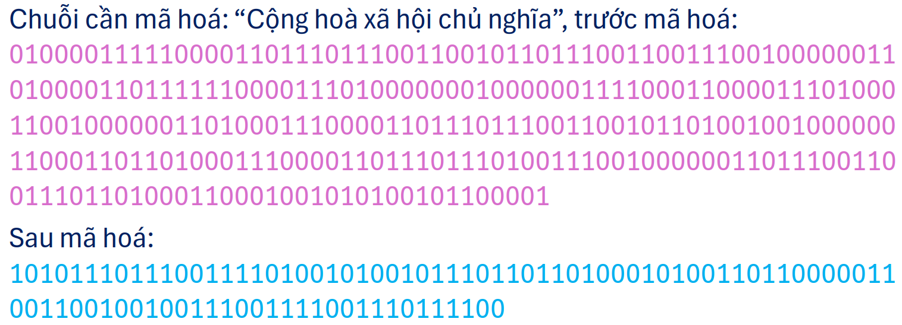

<gap></gap>

- _Lưu ý:_ Cây Huffman hoặc bảng mã cần được lưu kèm hoặc gửi kèm ở phần đầu file nén để bộ giải mã có thể hiểu được.

---

# Ví dụ mã Huffman (2)

<div class="columns">
<div class="col-2">

**Các bước thực hiện:**
1. Tính tần suất xuất hiện của từng ký tự (**bước 1**).
2. Sắp xếp theo xác suất giảm dần (**bước 2**).
3. Xây dựng cây Huffman bằng cách gộp 2 nút có tần suất nhỏ nhất (**bước 3,4,5**).

</div>
<div class="col-5">

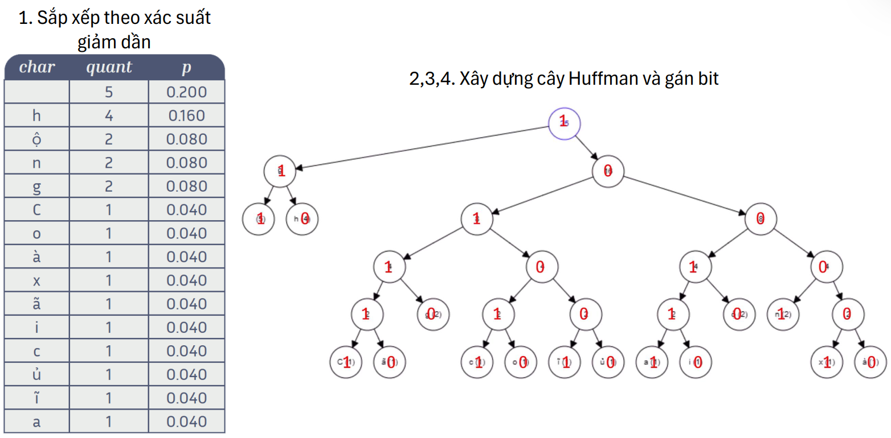

</div>
</div>

4. Gán bit 0 cho nhánh trái, 1 cho nhánh phải (**bước 6**).
5. Đọc đường đi từ gốc đến lá để ra mã của từng ký tự (**giải mã**).

---

# HUFFMAN TRONG NÉN ẢNH

**Áp dụng cho ảnh mức xám:**

<div class="columns">
<div>

**Quy trình:**

```
Ảnh
  │
  ▼
Phân tích tần suất mức xám
  │
  ▼
Xây dựng Huffman Tree
  │
  ▼
Tạo bảng mã
  │
  ▼
Mã hóa pixel
  │
  ▼
Bitstream
```

</div>
<div class="col-2">

**Hạn chế:**
- Nếu pixel được xem độc lập, hiệu quả có thể hạn chế
- Không khai thác được tương quan không gian

**Giải pháp trong thực tế:**
- Huffman thường được áp dụng sau các bước biến đổi hoặc dự đoán
- Tạo ra dữ liệu có phân bố thuận lợi hơn

**Ví dụ:**
- Ảnh có vùng đồng nhất → nhiều pixel cùng giá trị → Huffman hiệu quả
- Ảnh nhiễu ngẫu nhiên → phân bố đều → Huffman kém hiệu quả

</div>
</div>

---

# Mã Golomb & Golomb-Rice

<div class="columns">
<div>

- **Mã Golomb:**
  - _Ý tưởng:_ Mã hóa số nguyên $N$ bằng cách chia cho $M$.
  - Thương (Quotient) mã hóa phần đầu, Số dư (Remainder) mã hóa phần sau.
  - Hiệu quả khi các số nhỏ xuất hiện nhiều hơn số lớn (phân bố mũ).
- **Mã Golomb-Rice:**
  - Trường hợp đặc biệt khi $M = 2^k$.
  - Phép chia trở thành phép dịch bit (rất nhanh).
  - Thương = dịch phải $k$ bit. Số dư = $k$ bit thấp hơn.

</div>
<div>
<gap style="--size:20px"></gap>

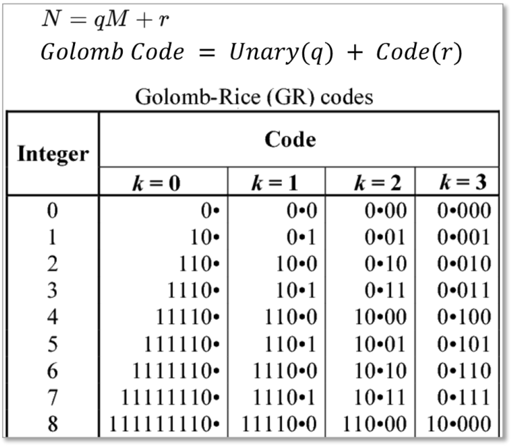

</div>
</div>

---

# Giải mã Golomb & Golomb-Rice

- **Nguyên lý:** Tách lại phần Thương và phần Dư để tính ra số nguyên ban đầu $N$.
- **Quy trình (với Golomb-Rice):**
  1. Đọc các bit cho đến khi gặp bit 1 đầu tiên. Số lượng bit 0 đếm được chính là Thương ($q$).
  2. Đọc tiếp $k$ bit tiếp theo để lấy Số dư ($r$).
  3. Khôi phục giá trị gốc: $N = q \times 2^k + r$.

---

# Mã số học (Arithmetic Coding)

<div class="columns">
<div class="col-2">

- **Khác biệt với Huffman:** Không ánh xạ 1-1 giữa ký tự và mã. Một chuỗi ký tự dài được ánh xạ vào một khoảng số thực duy nhất trong $[0, 1)$.
- **Ý tưởng:** Mỗi ký tự làm thu hẹp dần một khoảng. Sau khi xử lý hết chuỗi, chỉ cần chọn một số nằm trong khoảng cuối cùng.
- **Ưu điểm:** Vượt qua giới hạn 1 bit/ký tự của Huffman, tiệm cận giới hạn Entropy của Shannon.

</div>
<div>

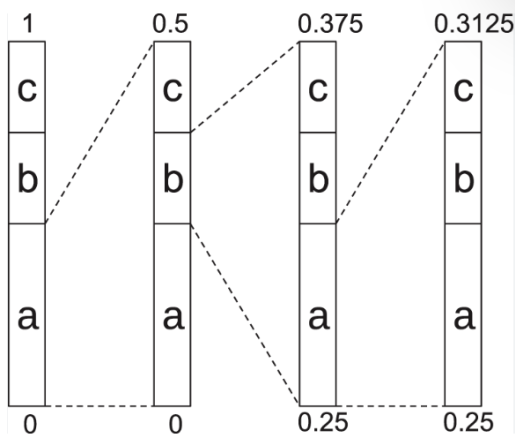
</div>
</div>

- **Mở rộng:** Mô hình xác suất thích nghi theo ngữ cảnh (Adaptive Context-Dependent), xác suất thay đổi theo ngữ cảnh trước đó giúp tăng hiệu quả nén.

---

# Ví dụ mã số học

<div class="columns">
<div class="col-2">

- **Giả sử bảng xác suất:** A = 0.5, B = 0.3, C = 0.2.
- **Các khoảng tương ứng:**
  - A: $[0.0, 0.5)$
  - B: $[0.5, 0.8)$
  - C: $[0.8, 1.0)$
- **Mã hóa chuỗi "AB":**

</div>
<div class="col-5">

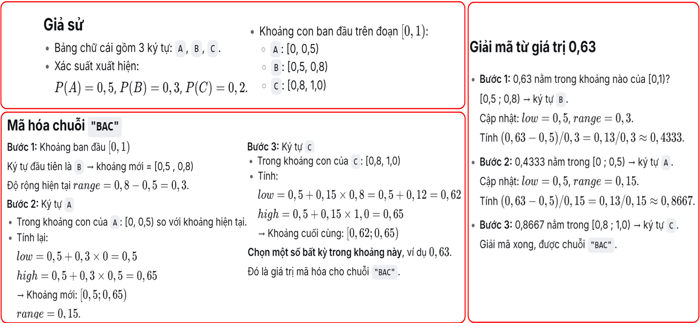

</div>
</div>
<ul>

  1. Ký tự 'A' (khoảng $[0.0, 0.5)$): Thu hẹp khoảng hiện tại thành $[0.0, 0.5)$.
  2. Ký tự 'B' (chiếm 30% khoảng): Chia khoảng $[0.0, 0.5)$ thành 3 phần. 'B' nằm ở khoảng $[0.5 \times 0.5, 0.8 \times 0.5) = [0.25, 0.4)$.

</ul>

- **Kết quả:** Bất kỳ số nào trong khoảng $[0.25, 0.4)$ (ví dụ: 0.3) đều đại diện cho chuỗi "AB".

---

# Giải mã Số học (Arithmetic Decoding)

- **Nguyên lý:** Xác định xem con số thực nằm trong khoảng con của ký tự nào để suy ra ký tự đó.
- **Quy trình:**
  1. Khởi tạo khoảng hiện tại là $[0, 1)$.
  2. Dựa vào bảng xác suất, chia khoảng hiện tại thành các khoảng con.
  3. Kiểm tra xem con số giải mã nằm trong khoảng con của ký tự nào $\rightarrow$ Xuất ký tự đó.
  4. Thu hẹp khoảng hiện tại thành đúng khoảng con vừa tìm được.
  5. Lặp lại cho đến khi giải mã đủ số lượng ký tự.

---

# Mã LZW (Lempel-Ziv-Welch)

- **Nguyên lý:** Thay thế các chuỗi lặp lại bằng một mã số ngắn hơn.
- **Từ điển động:** LZW xây dựng từ điển trong lúc nén. Khi gặp chuỗi đã xuất hiện, thay bằng mã cố định (thường 9-12 bit).
- **Cách hoạt động:**
  1. Khởi tạo từ điển ban đầu với các ký tự đơn.
  2. Đọc dữ liệu đầu vào để tạo chuỗi hiện tại.
  3. Nếu chuỗi mới đã có trong từ điển, tiếp tục mở rộng.
  4. Nếu chưa có, xuất mã của chuỗi cũ và thêm chuỗi mới vào từ điển.
- **Điểm hay:** Cả bộ nén và giải nén đều tự xây dựng lại cùng một từ điển mà không cần gửi kèm.

---

# Ví dụ mã hoá với LZW

<div class="columns">
<div>

- **Mã hoá chuỗi:** "ABAABABA"
- **Từ điển ban đầu:** A: 65, B: 66 (Mã ASCII)
- **Các mã mới bắt đầu từ 256.**
- **Quá trình:**
  - Đọc 'A': có trong từ điển.
  - Đọc 'AB': chưa có $\rightarrow$ Xuất mã của 'A' (65), thêm 'AB' vào từ điển (mã 256).
  - Đọc 'B': có.

</div>
<div>

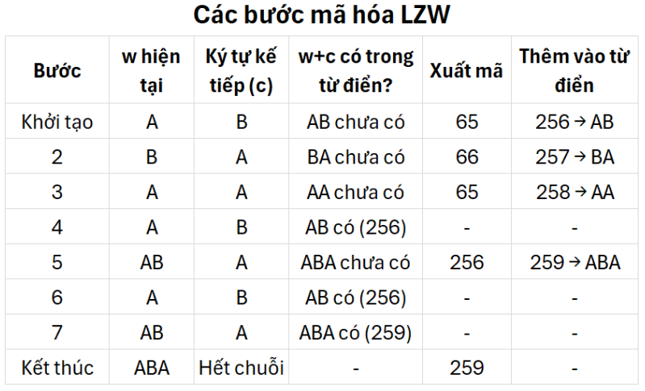

</div>
</div>
<ul>

  - Đọc 'BA': chưa có $\rightarrow$ Xuất mã 'B' (66), thêm 'BA' (257).
  - Đọc 'AAB': chưa có $\rightarrow$ Xuất mã 'A' (65), thêm 'AA' (258).
  - ... Tiếp tục cho đến hết chuỗi.

</ul>

---

# Giải mã LZW

- **Nguyên lý:** Bộ giải nén tự động xây dựng lại từ điển y hệt bộ nén.
- **Quy trình:**
  1. Khởi tạo từ điển với các ký tự đơn.
  2. Đọc mã đầu tiên, xuất chuỗi tương ứng, lưu làm `Chuỗi_trước`.
  3. Đọc mã tiếp theo:
     - _TH1:_ Mã đã có $\rightarrow$ Xuất chuỗi. Thêm vào từ điển `Chuỗi_trước` + Ký tự đầu của chuỗi hiện tại.
     - _TH2 (Đặc biệt):_ Mã chưa có $\rightarrow$ Thêm `Chuỗi_trước` + Ký tự đầu của `Chuỗi_trước`, sau đó xuất chuỗi này.
  4. Cập nhật `Chuỗi_trước` = chuỗi vừa xuất. Lặp lại.

---

# Mã hóa độ dài Run (Run-Length Encoding - RLE)

<div class="columns">
<div>

- **Nguyên lý:** Thay thế chuỗi các pixel giống hệt nhau bằng cặp (Giá trị, Độ dài).
- **Chuẩn CCITT Group 3 & 4:** Dùng cho ảnh nhị phân (Fax).
  - Group 4 sử dụng mã hóa 2D (READ) tham chiếu dòng trước đó để nén tốt hơn.

</div>
<div>
<gap></gap>

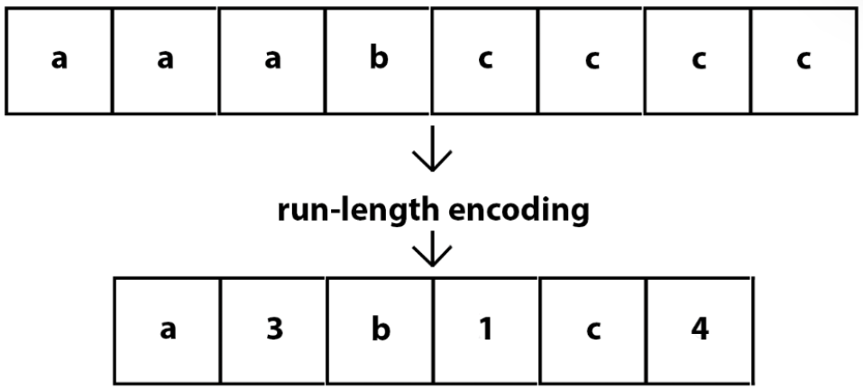

</div>
</div>

- **Giải mã:** Đọc từng cặp (Giá trị, Độ dài) và ghi liên tiếp Giá trị đó vào ảnh với số lượng bằng Độ dài.

<gap></gap>

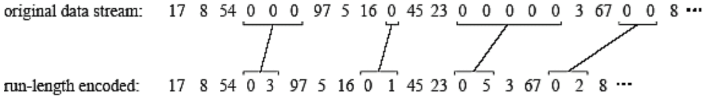

---

# RLE TRÊN ẢNH

**RLE đặc biệt hiệu quả khi ảnh có:**

<div class="columns">
<div>

**1. Vùng lớn cùng màu:**
- Bầu trời xanh
- Tường trắng
- Nền đồng nhất

**2. Nhiều pixel giống nhau liên tiếp:**
- Ảnh nhị phân (đen/trắng)
- Tài liệu scan
- Logo, icon

**Ví dụ:**

Ảnh có vùng trắng lớn:
```
████████████
████████████
████████████
```

</div>
<div>

Có thể biểu diễn rất ngắn bằng RLE:
```
(Trắng, 36)
```

**Ứng dụng thực tế:**
- Ảnh fax
- Tài liệu văn bản scan
- Ảnh đồ họa đơn giản
- Định dạng BMP (tùy chọn)

**Hạn chế:**

Nếu ảnh chứa nhiều thay đổi:
```
101101001011010...
```

</div>
<div>

**Kết quả:**
- RLE không giúp giảm kích thước
- Thậm chí làm dữ liệu lớn hơn
- Mỗi pixel cần 2 giá trị (giá trị + độ dài)

**Kết luận:** RLE chỉ hiệu quả với dữ liệu có nhiều chuỗi lặp dài.

</div>
</div>

---

# Mã hóa Symbol-based (JBIG2)

- **Nguyên lý:** Tạo từ điển các ký hiệu (ví dụ: ký tự 'a', 'b', hoặc các mẫu lặp lại).
- **Cách hoạt động:** Thay thế các vùng giống nhau trong ảnh bằng tọa độ và token tham chiếu đến từ điển.
- **Ví dụ:** Dữ liệu đầu vào là ảnh quét của chuỗi "banana".
<gap></gap>

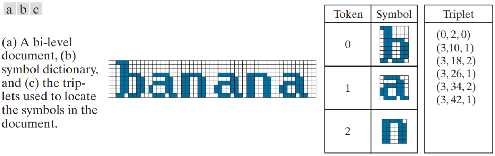

<gap></gap>

- **Giải mã:** Giải nén từ điển ký hiệu và luồng tọa độ, sau đó "dán" (paste) các mẫu ký hiệu lên đúng vị trí (X, Y) trên nền trang trắng. Rất hiệu quả cho tài liệu văn bản quét.

---

# Mã hoá bit-plane

<div class="columns">
<div class="col-4">

- **Khái niệm:** Biểu diễn một ảnh $m$-bit bằng cách tách nó thành $m$ ảnh nhị phân riêng biệt. Mỗi mặt phẳng bit chứa một bit tại cùng vị trí của tất cả pixel.
- **Ví dụ:** Với ảnh 8 bit, bit cao nhất chứa cấu trúc cường độ chính, các bit thấp hơn mô tả chi tiết tinh và dễ bị nhiễu hơn.

</div>
<div class="col-5">

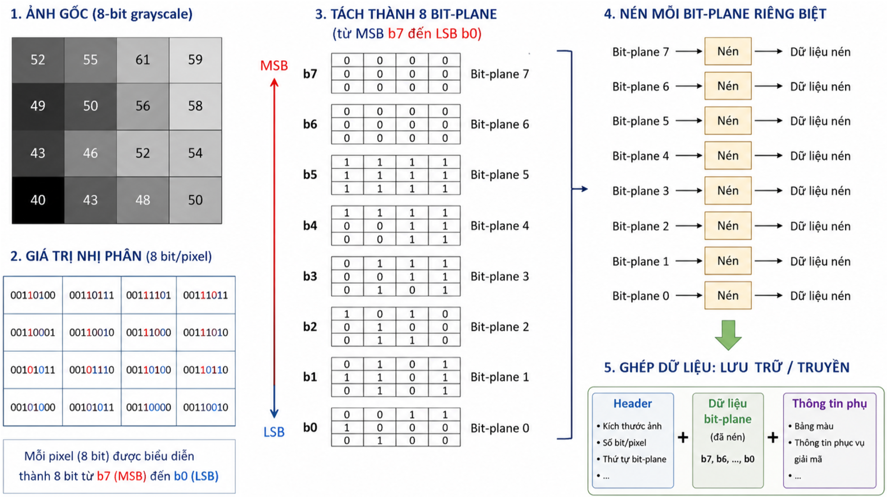

</div>
</div>

- **Xử lý:** Các bit-plane có thể được nén hoặc xử lý riêng tùy theo mức độ quan trọng.
- **Giải mã:** Dịch chuyển (shift) các bit của từng mặt phẳng nhị phân về lại đúng vị trí, thực hiện phép toán OR (|) để ghép $m$ mặt phẳng thành ảnh gốc.

---
<!--_class: section-->

# NÉN CÓ TỔN THẤT

---

# NÉN CÓ TỔN THẤT - LOSSY

**Mục tiêu:** Đạt tỷ lệ nén cao bằng cách loại bỏ những thông tin ít quan trọng hoặc khó nhận biết.

**Các hướng tiếp cận chính:**

<div class="columns">
<div>

**1. Transform Coding (Mã hóa biến đổi):**
- Biến đổi dữ liệu sang miền khác
- Tập trung năng lượng vào ít hệ số
- Ví dụ: DCT, DWT

**2. Quantization (Lượng tử hóa):**
- Giảm số mức biểu diễn
- Loại bỏ chi tiết nhỏ
- Là bước chính gây mất mát

**3. Predictive Coding (Mã hóa dự đoán):**
- Dự đoán giá trị pixel
- Chỉ mã hóa sai số

</div>
<div>

**4. Wavelet Coding (Mã hóa wavelet):**
- Phân tích đa phân giải
- Biểu diễn ở nhiều mức chi tiết
- Ví dụ: JPEG 2000

**Nguyên lý chung:**
- Khai thác giới hạn của thị giác con người
- Loại bỏ thông tin không quan trọng
- Đánh đổi chất lượng để đạt tỷ lệ nén cao

</div>
</div>

---

# TẠI SAO CÓ THỂ LOẠI BỎ THÔNG TIN?

**Cơ sở sinh học:** Hệ thống thị giác con người không nhạy như nhau với mọi loại thông tin.

**Các giới hạn của thị giác:**

<div class="columns">
<div>


**1. Nhạy cảm với thay đổi màu sắc:**
- Khó nhận ra một số thay đổi rất nhỏ về màu sắc
- Đặc biệt trong vùng tối hoặc vùng quá sáng

**2. Thành phần tần số:**
- Thành phần tần số cao (chi tiết nhỏ) ít quan trọng hơn tần số thấp (cấu trúc lớn)
- Mắt người nhạy với tần số trung bình hơn

</div>
<div>

**3. Độ phân giải:**
- Một số chi tiết nhỏ có thể bị bỏ qua trong ảnh có độ phân giải thấp
- Không nhận biết được chi tiết nhỏ hơn ngưỡng

**4. Vùng quan tâm:**
- Mắt tập trung vào vùng trung tâm
- Vùng ngoại vi ít được chú ý

⇒ Có thể giữ lại các thông tin quan trọng trong ảnh và bỏ đi các thông tin ít quan trọng.

</div>
</div>

---

# Mã hóa biến đổi khối (Block Transform Coding)

- **Mục tiêu:** Loại bỏ dư thừa dữ liệu để giảm dung lượng mà vẫn giữ chất lượng ảnh ở mức chấp nhận được.
- **Quy trình chi tiết:**
  1. **Chia khối (Blocking):** Chia ảnh thành các khối pixel nhỏ (thường 8x8).
  2. **Biến đổi (Transform):** Chuyển đổi giá trị pixel thành hệ số tần số (phổ biến nhất là DCT - Discrete Cosine Transform).
  3. **Lượng tử hóa (Quantization):** Làm tròn các hệ số, loại bỏ thông tin ít quan trọng.
  4. **Mã hóa (Coding):** Mã hóa các hệ số đã lượng tử hóa (thường dùng Zigzag + RLE + Huffman).

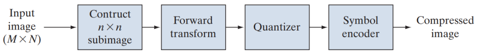

- **Phân bổ Bit:** Zonal Coding (giữ hệ số có phương sai lớn nhất) hoặc Threshold Coding (giữ N hệ số có độ lớn tuyệt đối lớn nhất).

---

# Minh hoạ mã hoá khối

<div class="columns">
<div class="col-3">

- **Đầu vào:** Một khối pixel 8x8.
- **Biến đổi DCT:** Chuyển từ miền không gian sang miền tần số. Hệ số DC (góc trái trên) đại diện cho thành phần tần số thấp (thông tin nền), các hệ số AC đại diện cho tần số cao (chi tiết, biên).

</div>
<div class="col-5">

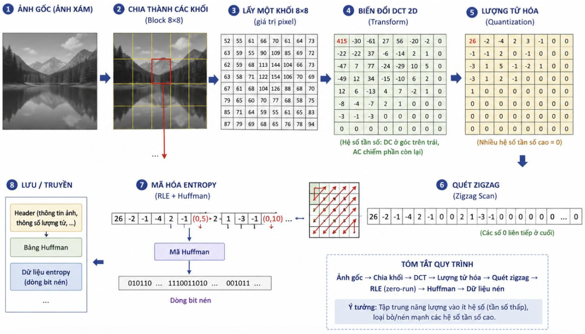
</div>
</div>

- **Lượng tử hóa:** Chia các hệ số cho ma trận lượng tử hóa (Q-table) và làm tròn. Nhiều hệ số tần số cao trở thành 0.
- **Mã hóa:** Quét zigzag để gom các số 0 lại, sau đó dùng RLE và Huffman để mã hóa.

---

# Giải mã Biến đổi khối

- **Quy trình:**
  1. **Giải mã Entropy:** Dùng Huffman/Arithmetic để giải mã luồng bit, khôi phục các hệ số DCT.
  2. **Giải lượng tử hóa (Inverse Quantization):** Nhân từng hệ số với giá trị tương ứng trong Ma trận lượng tử. (Lưu ý: Bước này gây tổn thất vĩnh viễn, các số 0 không thể khôi phục chính xác).
  3. **Biến đổi ngược DCT (IDCT):** Áp dụng IDCT lên khối $8\times8$ để chuyển ngược về miền không gian.
  4. **Ghép khối:** Đặt các khối $8\times8$ về đúng vị trí để tạo thành bức ảnh hoàn chỉnh.

---

# Mã hóa dự đoán (Predictive Coding/DPCM)

- **Ý tưởng:** Các pixel lân cận thường giống nhau. Thay vì gửi giá trị tuyệt đối, ta chỉ gửi phần chênh lệch (sai số) giữa pixel thật và pixel dự đoán.
- **Nguyên lý:** $e(n) = f(n) - \hat{f}(n)$. Chỉ mã hóa sai số dự đoán $e(n)$.
  - $f(n)$: dữ liệu thực tế.
  - $\hat{f}(n)$: dữ liệu dự đoán.
  - $e(n)$: sai số dự đoán.
- **Phân loại:**
  - _Lossless:_ $\hat{f}(n)$ là tổ hợp tuyến tính các pixel lân cận.
  - _Lossy:_ Thêm bộ lượng tử hóa cho $e(n)$ để giảm số bit. Bộ lượng tử hóa tối ưu: Lloyd-Max.

---

# Ví dụ mã hoá dự đoán

- **Giả sử cần truyền dãy pixel:** 150, 152, 149, 151.
- **Mã hóa trực tiếp:** Mỗi số 8-bit $\rightarrow$ 32 bit.
- **Dùng dự đoán đơn giản:** $\hat{x}_n = x_{n-1}$
  - Truyền $x_1 = 150$ (8 bit)
  - $e_2 = 152 - 150 = 2$ (chỉ cần 2 bit)
  - $e_3 = 149 - 152 = -3$ (2 bit)
  - $e_4 = 151 - 149 = 2$ (2 bit)
- **Tổng:** $\approx 8 + 2 + 2 + 2 = 14$ bit. Tiết kiệm hơn rất nhiều so với 32 bit.

---

# Giải mã Dự đoán

- **Nguyên lý:** Cộng phần sai số nhận được với giá trị dự đoán.
- **Quy trình:**
  1. Nhận sai số $e(n)$ từ luồng bit.
  2. Tính giá trị dự đoán $\hat{f}(n)$ từ các pixel đã giải nén trước đó.
  3. Khôi phục pixel gốc: $f(n) = \hat{f}(n) + e(n)$.
  4. Lưu $f(n)$ vào bộ nhớ đệm để làm dữ liệu dự đoán cho pixel $n+1$.

---

# Mã hóa Wavelet

- **Khái niệm:** Phương pháp nén ảnh dùng biến đổi wavelet rời rạc (DWT). Khắc phục nhược điểm artifact khối của DCT (JPEG) khi nén tỷ lệ cao.
- **Đặc trưng:**
  - Biến đổi toàn ảnh, không chia khối.
  - Biểu diễn đa phân giải (multiresolution).
  - Hỗ trợ cả nén lossless và lossy.
  - Cho phép truyền ảnh tiến triển (progressive).

<div class="columns">
<div>

- **Chuẩn tiêu biểu:** JPEG 2000.

</div>
<div class="col-3">
<gap></gap>

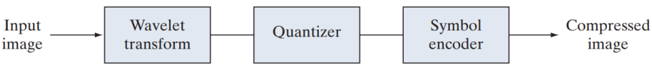

</div>
</div>

- **Các bước:**
  1. Biến đổi DWT: Ảnh $\rightarrow$ các băng con hệ số.
  2. Lượng tử hóa: Chia mỗi hệ số cho bước lượng tử.
  3. Mã hóa entropy: Dùng mã hóa bit-plane + mã hóa số học (EZW, SPIHT, EBCOT).

---

# Giải mã Wavelet

- **Quy trình:**
  1. **Giải mã Entropy:** Giải mã luồng bit (thường dùng Arithmetic Coding kết hợp EZW, SPIHT, EBCOT) để khôi phục các hệ số Wavelet.
  2. **Giải lượng tử hóa:** Nhân các hệ số với bước lượng tử (hoặc dùng bước = 1 nếu là lossless).
  3. **Biến đổi Wavelet ngược (IDWT):** Tổng hợp lại ảnh từ các băng con (sub-bands) tần số thấp và cao để tạo ra ảnh ở độ phân giải gốc.
- **Ưu điểm:** Quá trình này không gây ra hiệu ứng khối (blocking artifact) như JPEG thông thường, cho phép nén tỷ lệ cao mà vẫn giữ được độ mượt của ảnh.

---

# BỨC TRANH TỔNG THỂ CỦA NÉN ẢNH

**Ba ý tưởng nền tảng:**

<div class="columns">
<div>

**1. Coding Redundancy (Dư thừa mã hóa):**
- Khai thác phân bố xác suất không đều
- Phương pháp: Statistical coding (Huffman, Arithmetic, Golomb)
- Nguyên lý: Gán mã ngắn cho ký hiệu phổ biến

</div>
<div>

**2. Spatial Redundancy (Dư thừa không gian):**
- Khai thác tương quan giữa các pixel lân cận
- Phương pháp: Prediction / RLE (DPCM, RLE)
- Nguyên lý: Chỉ mã hóa sự khác biệt

</div>
<div>

**3. Irrelevant Information (Thông tin không liên quan):**
- Loại bỏ thông tin ít quan trọng
- Phương pháp: Quantization (JPEG, JPEG 2000)
- Nguyên lý: Đánh đổi chất lượng để đạt tỷ lệ nén cao

</div>
</div>

**Kết luận:** Mọi kỹ thuật nén đều dựa trên ba ý tưởng này, kết hợp theo cách khác nhau.

---

# SO SÁNH CÁC KỸ THUẬT TIÊU BIỂU

| Kỹ thuật | Lossless | Lossy | Ý tưởng chính |
|----------|----------|-------|---------------|
| **Huffman** | ✓ | | Mã độ dài biến đổi theo tần suất |
| **Arithmetic** | ✓ | | Mã hóa chuỗi bằng khoảng số thực |
| **Golomb-Rice** | ✓ | | Mã hóa số nguyên nhỏ hiệu quả |
| **LZW** | ✓ | | Từ điển chuỗi lặp lại |
| **RLE** | ✓ | | Chuỗi giá trị giống nhau liên tiếp |
| **DPCM** | ✓ | ✓ | Mã hóa sai số dự đoán |
| **DCT** | | ✓ | Biến đổi sang miền tần số |
| **DWT** | ✓* | ✓ | Biến đổi wavelet đa phân giải |