<!-- _class: cover -->

<div class="middle">

# XỬ LÝ ẢNH& THỊ GIÁC MÁY TÍNH

## Chương 4: Phát hiện biên & phân vùng

</div>

### Giảng viên: Nguyễn Phồn Lữa

---

<!-- _class: toc -->

# Nội dung

- Giới thiệu tổng quan
- Phát hiện điểm, đường và biên
- Phân ngưỡng (Thresholding)
- Phân đoạn bằng phát triển, chia tách/hợp nhất vùng
- Phân đoạn sử dụng phân cụm và superpixels

---

<!-- _class: section -->

# GIỚI THIỆU TỔNG QUAN

---

# Khái niệm
- **Vùng ảnh (Region):** Tập hợp các điểm ảnh (pixel) có cùng chung các thuộc tính về một đối tượng trong ảnh (ví dụ: cùng màu sắc, độ sáng, kết cấu).
- **Phân đoạn ảnh (Image Segmentation):** Chia một bức ảnh thành các phần hoặc vùng riêng biệt dựa trên các đặc điểm đặc trưng.
- **Định nghĩa toán học:** Chia không gian ảnh R thành n vùng con $R_1, R_2,..., R_n$ thỏa mãn 5 điều kiện:

<div class="columns">
<div class="col-3">
<ul>

  1. $\bigcup_{i=1}^{n} R_i = R$ (Phân đoạn phải đầy đủ).
  2. Mỗi $R_i$ là một tập hợp liên thông.
  3. $R_i ∩ R_j = ∅$ với mọi $i ≠ j$ (Các vùng phải rời rạc).
  4. $Q(R_i) = TRUE$ (Các pixel trong cùng một vùng thỏa mãn một vị từ $Q$).
  5. $Q(R_i ∪ R_j) = FALSE$ với hai vùng lân cận (Hai vùng kề nhau phải khác biệt).

</ul>
</div>
<div class="col-2">

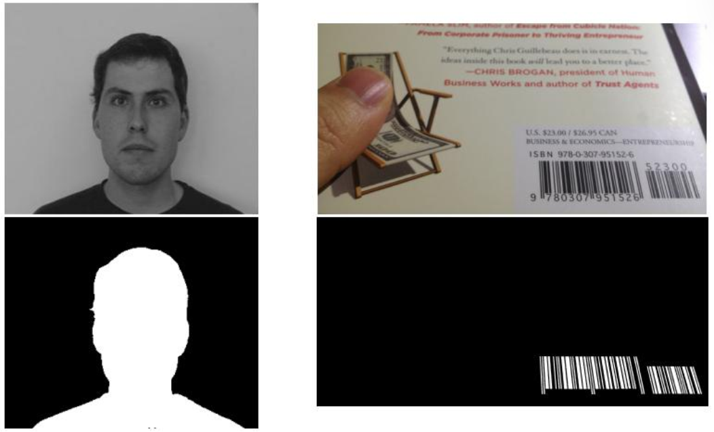

</div>
</div>


---

# Ứng dụng thực tiễn

- **Y tế:** Phân vùng khối u, tế bào, mạch máu trong ảnh MRI, CT, X-quang.
- **Xe tự hành:** Phân vùng làn đường, vỉa hè, người đi bộ, biển báo.
- **Thị giác máy tính:** Tiền xử lý cho Nhận diện đối tượng, Phân đoạn ngữ nghĩa.
- **Công nghiệp:** Phát hiện lỗi trên dây chuyền sản xuất vi mạch, dệt may.
<gap></gap>

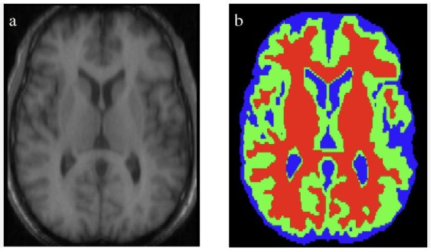

---

# Các hướng tiếp cận chính

- **Dựa trên Biên:** Phát hiện nơi có sự thay đổi đột ngột về cường độ sáng.
- **Dựa trên Ngưỡng:** Dựa vào cường độ sáng để tách nền và đối tượng.
- **Dựa trên Vùng:** Nhóm các pixel lân cận có đặc điểm tương đồng.
- **Deep Learning:** Sử dụng các mô hình CNN/Transformer (U-Net, Mask R-CNN, SAM).

---
<!--_class: section-->

# PHÁT HIỆN ĐIỂM, ĐƯỜNG VÀ BIÊN

---

# Khái niệm
<div class="columns">
<div class="col-2">

- **Điểm (Point):** Một pixel có cường độ khác biệt rõ rệt so với các pixel lân cận.
  - Thường xuất hiện như một "đốm" sáng/tối nổi bật trên nền xung quanh.
- **Đường (Line):** Một dãy điểm có xu hướng thẳng hàng theo một hướng nhất định.
  - Cho thấy cấu trúc kéo dài theo một hướng, như mép vật thể hoặc vệt sáng.

</div>
<div>
<gap></gap>

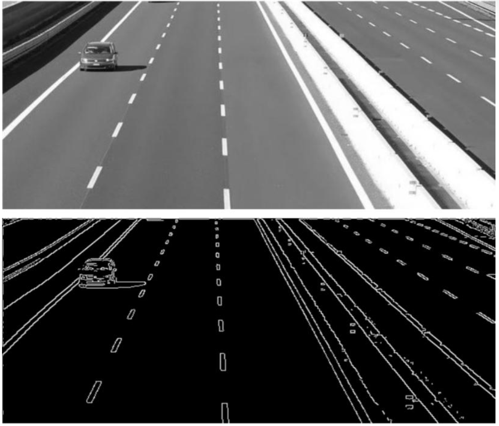

</div>
</div>

- **Biên (Edge):** Vị trí có sự thay đổi đột ngột về cường độ ảnh.
  - Dấu hiệu quan trọng nhất vì nó biểu thị ranh giới giữa hai vùng ảnh khác nhau.

---

# PHÁT HIỆN ĐIỂM BIỆT LẬP

**Mục tiêu**

- Phát hiện pixel khác thường so với nền xung quanh.

**Phương pháp**

- Dùng mặt nạ Laplacian để đo độ thay đổi cục bộ quanh mỗi pixel.
- **Mặt nạ Laplacian:** Hệ số trung tâm dương lớn (8), các lân cận mang giá trị âm (-1).
<gap></gap>
$$L(x) = \begin{bmatrix} -1 & -1 & -1 \\ -1 & 8 & -1 \\ -1 & -1 & -1 \end{bmatrix}$$
<gap></gap>
- Khi pixel trung tâm khác hẳn xung quanh, đáp ứng R sẽ lớn.

**Điều kiện phát hiện**

- Điểm biệt lập được phát hiện khi: R > T, trong đó T là ngưỡng phát hiện.
- Đây là một phép phát hiện dựa trên biến đổi cục bộ nên rất nhạy với chi tiết nhỏ.

---

# PHÁT HIỆN ĐƯỜNG

**Mục tiêu**

- Tìm các đường có hướng xác định như ngang, dọc, chéo trong ảnh.

**Phương pháp**

- Dùng các mặt nạ đạo hàm riêng tương ứng cho từng hướng để làm nổi bật vùng có cường độ thay đổi theo hướng đó.
- Mỗi mặt nạ được thiết kế để phản ứng mạnh với một hướng đường nhất định.
- Sau khi tích chập ảnh với mặt nạ, đường được phát hiện khi đáp ứng vượt ngưỡng T.

**Ví dụ**

- Để phát hiện đường ngang, dùng mặt nạ nhấn mạnh sự thay đổi theo chiều dọc:
<span>
  $$
  L(x) = \begin{bmatrix}
  -1 & -1 & -1 \\
  2 & 2 & 2 \\
  -1 & -1 & -1
  \end{bmatrix}
$$
</span>

- Ngoài ra còn có các mặt nạ tương tự cho đường dọc, đường chéo +45°, -45°.

---

# PHÁT HIỆN BIÊN

**Khái niệm**

- Biên là nơi cường độ ảnh thay đổi đột ngột giữa hai vùng lân cận.

**Hai phương pháp toán học cơ bản**

1. **Dựa trên Gradient (Đạo hàm bậc nhất):**
   - Biên xuất hiện tại nơi độ lớn gradient đạt cực đại cục bộ.
   - Gradient cho biết mức thay đổi cường độ theo hướng lớn nhất.
2. **Dựa trên Laplacian (Đạo hàm bậc hai):**
   - Biên thường được xác định tại nơi đi qua không (zero-crossing).
   - Khi dấu của đáp ứng đổi từ dương sang âm hoặc ngược lại, đó là vị trí biên.
   - Cách này cho biên mỏng hơn nhưng nhạy hơn với nhiễu.

---

# GRADIENT ẢNH VÀ CÁC TÍNH CHẤT

**Định nghĩa**

- Gradient của ảnh $f(x, y)$ được biểu diễn bởi vector: $\nabla f(x, y) = \left[ \frac{\partial f}{\partial x}, \frac{\partial f}{\partial y} \right]$
- Gradient cho biết mức thay đổi cường độ mạnh nhất tại mỗi điểm ảnh.

**Các tính chất quan trọng**

- **Biên độ của gradient (Magnitude):** $M(x, y) = \sqrt{\left( \frac{\partial f}{\partial x} \right)^2 + \left( \frac{\partial f}{\partial y} \right)^2}$
  Giá trị này càng lớn thì khả năng tại đó càng gần biên.
- **Hướng của gradient (Direction):** $\alpha(x, y) = \arctan \left( \frac{\partial f / \partial y}{\partial f / \partial x} \right)$
  Hướng này cho biết chiều biến thiên mạnh nhất của cường độ ảnh.

**Ý nghĩa trong phát hiện biên**

- Biên thường nằm ở nơi gradient đạt cực đại cục bộ.
- Vì vậy, cả độ lớn lẫn hướng gradient đều rất quan trọng trong phát hiện biên.

---

# CÁC TOÁN TỬ GRADIENT

<div class="columns">
<div class="col-3">

**Các toán tử phổ biến**

- **Toán tử Roberts:** Dùng mặt nạ $2 × 2$, phát hiện biên rất nhanh nhưng nhạy với nhiễu.
- **Toán tử Prewitt:** Dùng mặt nạ $3 × 3$, lấy đạo hàm theo hai hướng $x, y$.
- **Toán tử Sobel:** Tương tự Prewitt nhưng trọng số lớn hơn ở tâm, nên ổn định hơn và giảm nhiễu tốt hơn.

**Nguyên lý hoạt động**

</div>
<div class="col-2">

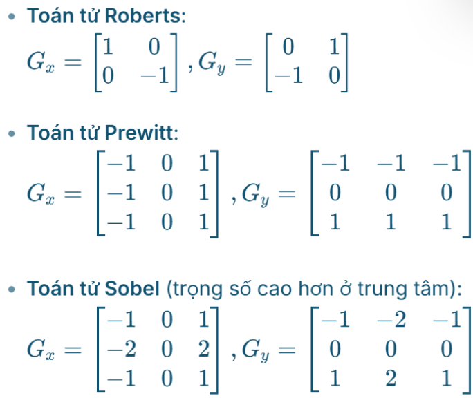

</div>
</div>

- $G_x$ phát hiện thay đổi theo chiều ngang, $G_y$ phát hiện thay đổi theo chiều dọc.
- Độ lớn gradient thường được tính từ $G_x$ và $G_y$, từ đó xác định vị trí biên.

---

# KẾT HỢP GRADIENT VỚI PHÂN NGƯỠNG

**Quy trình**

- Sau khi tính biên độ gradient $M(x, y)$, dùng ngưỡng để giữ lại các điểm biên mạnh.
- Công thức: $g(x, y) = \begin{cases} 
1, & M(x, y) > T \\ 
0, & \text{ngược lại} 
\end{cases}$.

**Ý nghĩa**

- Các điểm có gradient lớn thường nằm tại vị trí đổi sáng mạnh, tức là biên.
- Phân ngưỡng giúp loại bỏ những đáp ứng yếu do nhiễu hoặc biến thiên nhỏ.
- Kết quả ảnh biên rõ hơn và gọn hơn.

**Cách chọn ngưỡng $T$**

- **Thủ công:** Chọn theo kinh nghiệm, phù hợp khi ảnh khá ổn định.
- **Tự động:** Dùng các phương pháp như Otsu, dựa trên histogram của $M(x, y)$ để tìm ngưỡng tách hai nhóm giá trị tốt nhất.
---

# Thực hành: Phát hiện biên với toán tử Sobel và phân ngưỡng

```python
import cv2
import numpy as np
import matplotlib.pyplot as plt

img = cv2.imread('sample.jpg', cv2.IMREAD_GRAYSCALE)

# Tính toán Sobel
sobelx = cv2.Sobel(img, cv2.CV_64F, 1, 0, ksize=5)
sobely = cv2.Sobel(img, cv2.CV_64F, 0, 1, ksize=5)

# Tính biên độ gradient
magnitude = np.sqrt(sobelx**2 + sobely**2)
magnitude = np.uint8(magnitude / np.max(magnitude) * 255)

# Phân ngưỡng để lấy biên mạnh
_, edges = cv2.threshold(magnitude, 50, 255, cv2.THRESH_BINARY)

plt.subplot(121), plt.imshow(magnitude, cmap='gray'), plt.title('Magnitude')
plt.subplot(122), plt.imshow(edges, cmap='gray'), plt.title('Thresholded Edges')
plt.show()
```

---
<!--_class: text-sm-->

# KỸ THUẬT PHÁT HIỆN BIÊN NÂNG CAO

**Khắc phục nhạy cảm với nhiễu**: Làm mịn ảnh trước khi lấy đạo hàm (ví dụ: dùng bộ lọc Gauss).

**Bộ phát hiện biên Marr-Hildreth (LoG)**

1. Làm mịn ảnh bằng bộ lọc Gauss.
2. Tính Laplacian của ảnh đã làm mịn.
3. Tìm các điểm đi qua không (zero-crossing) của kết quả.

**Bộ phát hiện biên Canny**

1. **Làm mịn:** Dùng bộ lọc Gauss để giảm nhiễu.
2. **Tính Gradient:** Tính biên độ và hướng gradient.
3. **Nén không cực đại (Non-maximum Suppression):** Chỉ giữ lại các pixel là cực đại địa phương theo hướng gradient.
4. **Ngưỡng kép (Double Thresholding):** Phân loại pixel thành biên mạnh, biên yếu và không phải biên.
5. **Nối biên theo dõi độ trễ (Hysteresis):** Nối các biên yếu với biên mạnh nếu chúng liên kết với nhau.

---

# Bài tập thực hành: Phát hiện biên Canny
<gap></gap>

```python
import cv2
import matplotlib.pyplot as plt

img = cv2.imread('sample.jpg', cv2.IMREAD_GRAYSCALE)

# Áp dụng Canny Edge Detection
edges = cv2.Canny(img, threshold1=100, threshold2=200)

plt.subplot(121), plt.imshow(img, cmap='gray'), plt.title('Original')
plt.subplot(122), plt.imshow(edges, cmap='gray'), plt.title('Canny Edges')
plt.show()
```

---

# NỐI CÁC ĐIỂM BIÊN

**Mục tiêu**

- Kết quả phát hiện biên thường bị đứt đoạn. Cần nối các đoạn rời thành đường biên hoàn chỉnh dựa trên tính liên tục về vị trí và hướng.

**Xử lý cục bộ**

- Dựa trên lân cận của từng điểm biên.
- Nếu các điểm gần nhau và có đặc trưng gradient/hướng tương tự, chúng được xem là thuộc cùng một đường biên.
- Phù hợp khi biên chỉ bị đứt nhẹ hoặc có nhiễu nhỏ.

**Xử lý toàn cục (Hough Transform)**

- Dùng để tìm các cấu trúc hình học lớn như đường thẳng trong toàn ảnh.
- Chuyển các điểm biên sang không gian tham số [ρ, θ], tìm các đỉnh tích lũy lớn để suy ra đường thẳng.
- Rất hữu ích khi biên bị đứt đoạn nhưng vẫn cùng thuộc một đường thẳng.

**Vai trò của gradient và hướng**

- Các điểm có gradient và hướng gần giống nhau thường được ưu tiên liên kết với nhau, giúp đường biên sau khi nối mượt và hợp lý hơn.

---
<!--_class: section-->

# PHÂN NGƯỠNG

---

# Khái niệm

- Phân ngưỡng là kỹ thuật chuyển ảnh đa cấp xám thành ảnh nhị phân.
- Mỗi pixel được so sánh với ngưỡng $T$ để quyết định thuộc đối tượng (1) hay nền (0).

<div class="columns">
<div class="col-5">

**Nền tảng**

- Giả sử ảnh có vật thể sáng trên nền tối.
- Histogram thường có hai đỉnh: một đỉnh cho nền tối, một đỉnh cho vật thể sáng.
- Ta chọn ngưỡng $T$ nằm giữa hai đỉnh để tách hai lớp ảnh.

**Các yếu tố ảnh hưởng**

- **Nhiễu:** Làm xuất hiện các giá trị cường độ không mong muốn, làm mất tính hai đỉnh của histogram. Giải pháp: làm mịn ảnh trước khi phân ngưỡng.
- **Chiếu sáng và phản xạ:** Chiếu sáng không đều làm biến dạng histogram. Giải pháp: hiệu chỉnh chiếu sáng hoặc dùng phân ngưỡng thích nghi.
</div>
<div>

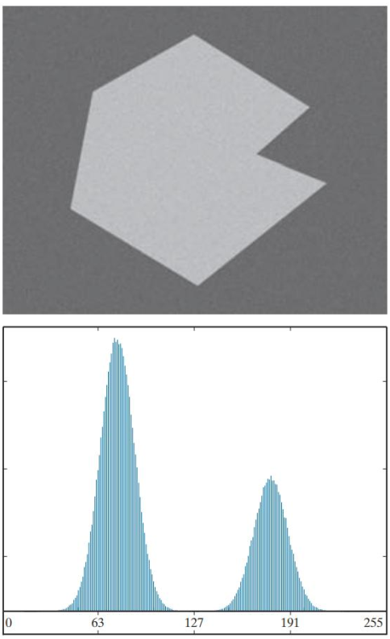

</div>

<div>

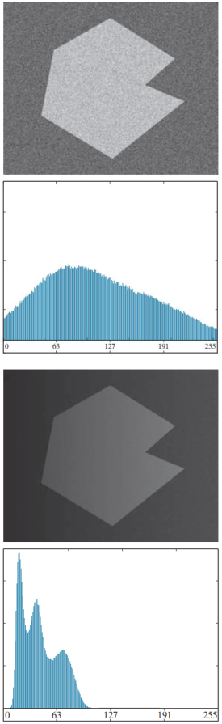

</div>
</div>


---

# PHÂN NGƯỠNG TOÀN CỤC VÀ CỤC BỘ

<div class="columns">
<div class="col-4">

**Phân ngưỡng toàn cục**

- Dùng một ngưỡng duy nhất T cho toàn bộ ảnh.
- Công thức: $g(x, y) = \begin{cases} 
1, & f(x, y) > T \\ 
0, & \text{ngược lại} 
\end{cases}$
- Dễ cài đặt, nhưng kém hiệu quả khi ảnh có chiếu sáng không đồng đều.

**Phân ngưỡng cục bộ (Thích nghi)**

- Ngưỡng $T$ phụ thuộc vào vùng hoặc lân cận quanh điểm ảnh.
- Phù hợp với ảnh có nền sáng tối thay đổi, vì mỗi vùng sẽ có ngưỡng riêng.
- Thường được gọi là phân ngưỡng biến đổi hoặc phân ngưỡng thích nghi.

</div>
<div class="col-3">

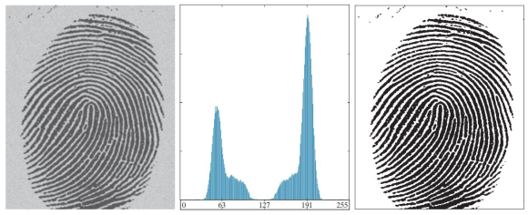
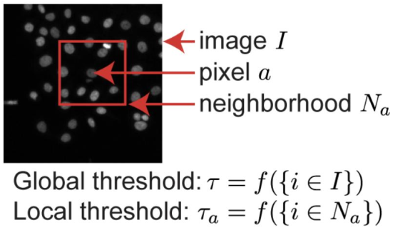


</div>
</div>

---

# Thực hành: So sánh phân ngưỡng toàn cục và cục bộ
<gap></gap>
```python
import cv2

img = cv2.imread('sample.jpg', cv2.IMREAD_GRAYSCALE)

# Phân ngưỡng toàn cục (Otsu)
ret, thresh_global = cv2.threshold(img, 0, 255, cv2.THRESH_BINARY + cv2.THRESH_OTSU)

# Phân ngưỡng cục bộ (Adaptive Thresholding)
thresh_adaptive = cv2.adaptiveThreshold(img, 255, cv2.ADAPTIVE_THRESH_GAUSSIAN_C,
                                        cv2.THRESH_BINARY, 11, 2)

cv2.imshow('Global', thresh_global)
cv2.imshow('Adaptive', thresh_adaptive)
cv2.waitKey(0)
```

---

# PHÂN NGƯỠNG TOÀN CỤC TỐI ƯU – OTSU

**Nguyên lý hoạt động**

- Otsu là phương pháp tự động tìm ngưỡng T tối ưu bằng cách tối đa hóa phương sai giữa các lớp (between-class variance).
- Ảnh được chia thành 2 lớp theo ngưỡng T: lớp nền và lớp đối tượng.
- Nếu hai lớp tách biệt tốt thì phương sai giữa các lớp sẽ lớn.

**Công thức**

- $σB^2(T) = w_1(T)w_2(T)(μ_1(T) - μ_2(T))^2$
- $w_1$, $w_2$: xác suất (tỷ lệ số pixel) của hai lớp ảnh.
- $μ_1$, $μ_2$: giá trị trung bình mức xám của từng lớp.
- Thuật toán thử mọi giá trị $T$ từ 0 đến 255 và chọn ngưỡng làm $σB^2(T)$ lớn nhất.

**Ưu điểm**

- Tự động chọn ngưỡng, không cần đặt thủ công.
- Phù hợp cho phân đoạn ảnh nhị phân nền–đối tượng có histogram phân bố rõ ràng.

---

# ĐA NGƯỠNG (MULTIPLE THRESHOLDS)

**Khái niệm**

- Khi ảnh có hơn hai đối tượng hoặc histogram có nhiều nhóm mức xám, cần dùng nhiều ngưỡng thay vì chỉ một.
- Ảnh được chia thành các khoảng: $g(x, y) = k$ nếu $T_{k-1} < f(x, y) ≤ T_k$.

<div class="columns">
<div class="col-4">

**Đặc điểm**

- Ngưỡng không còn là một số duy nhất mà là một vector ngưỡng.
- Có thể xem là mở rộng của Otsu cho bài toán nhiều lớp (Multi-class Otsu).

</div>
<div class="col-3">
<gap></gap>

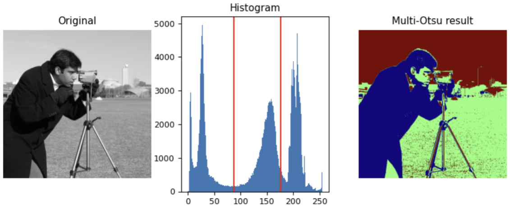

</div>
</div>

- Mục tiêu: tìm các ngưỡng sao cho các vùng sau khi tách ra khác nhau rõ nhất về mặt thống kê.

**Nhược điểm**

- Khi số ngưỡng tăng, số tổ hợp cần thử tăng rất nhanh (độ phức tạp tính toán cao).
- Thường tốn tài nguyên hơn đáng kể so với phân ngưỡng toàn cục đơn.

---
<!--_class: section-->

# PHÂN ĐOẠN BẰNG PHÁT TRIỂN, CHIA TÁCH/HỢP NHẤT VÙNG

---

# Tổng quan

- Các phương pháp dựa trên vùng (Region-based) tập trung vào tính đồng nhất của các vùng ảnh thay vì sự thay đổi đột ngột tại biên.
- Hai hướng tiếp cận chính:
  1. **Phát triển vùng (Region Growing):** Bắt đầu từ các điểm hạt giống và mở rộng ra các vùng lân cận.
  2. **Chia tách và hợp nhất (Split & Merge):** Chia ảnh thành các vùng nhỏ, sau đó hợp nhất các vùng lân cận có tính chất tương đồng.

  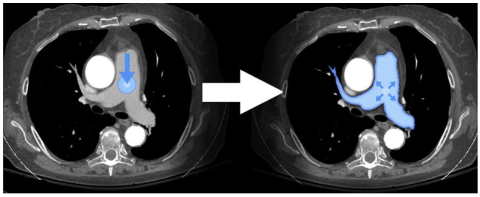

---

# PHÂN ĐOẠN BẰNG PHÁT TRIỂN VÙNG (REGION GROWING)

**Ý tưởng**

- Bắt đầu từ một tập hợp các điểm hạt giống (seed points).

<div class="columns">
<div class="col-3">

- Phát triển thành vùng bằng cách thêm vào các pixel lân cận có tính chất giống với hạt (cường độ sáng, màu sắc, kết cấu).

</div>
<div class="col-4">

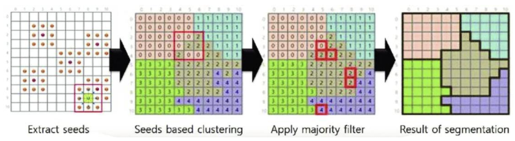

</div>
</div>

- Hữu ích khi đối tượng cần tách có sự đồng nhất cục bộ.

**Thuật toán**

1. **Xử lý seeds:** Tìm các thành phần liên thông trong S, rút gọn thành các điểm đại diện.
2. **Tạo ảnh điều kiện $f_Q$:** $f_Q(x, y) = \begin{cases} 
1, & \text{if } Q(x, y) = TRUE \\ 
0, & \text{if } Q(x, y) = FALSE 
\end{cases}$.
3. **Phát triển vùng:** Với mỗi seed, thêm tất cả pixel có giá trị 1 trong $f_Q$ và 8-liên thông với hạt đó.
4. **Gán nhãn:** Mỗi thành phần liên thông được gán một nhãn khác nhau.
---

# Thực hành: Thuật toán Region Growing đơn giản
<gap></gap>
```python
import numpy as np
import cv2

def region_growing(img, seed, threshold=10):
    height, width = img.shape
    segmented = np.zeros_like(img)
    seed_value = img[seed[1], seed[0]]

    queue = [seed]
    segmented[seed[1], seed[0]] = 255

    while queue:
        current = queue.pop(0)
        x, y = current

        for i in range(-1, 2):
            for j in range(-1, 2):
                nx, ny = x + i, y + j
                if 0 <= nx < width and 0 <= ny < height:
                    if segmented[ny, nx] == 0:
                        if abs(int(img[ny, nx]) - int(seed_value)) <= threshold:
                            segmented[ny, nx] = 255
                            queue.append((nx, ny))

    return segmented

img = cv2.imread('sample.jpg', cv2.IMREAD_GRAYSCALE)
result = region_growing(img, seed=(100, 100), threshold=15)
cv2.imshow('Region Growing', result)
cv2.waitKey(0)
```

---

# CHIA TÁCH VÀ HỢP NHẤT VÙNG (SPLIT & MERGE)

**Ý tưởng**

- Dựa trên tính đồng nhất của vùng. Chia ảnh thành các vùng nhỏ nếu vùng còn không đồng nhất, rồi hợp các vùng lân cận có tính chất giống nhau.

**Chia vùng (Split)**

- Biểu diễn bằng cây tứ phân (quadtree).
- Bắt đầu từ toàn bộ ảnh. Kiểm tra độ đồng nhất (dựa trên phương sai, mức xám).
- Nếu không đồng nhất, chia thành 4 phần con và lặp lại đệ quy.

**Hợp nhất vùng (Merge)**

- Sau khi chia, các vùng lân cận có đặc trưng tương tự được hợp nhất để tránh phân đoạn quá mức.
- Giúp giảm số vùng nhỏ rời rạc và tạo kết quả ổn định hơn.

**Điều kiện dừng**

- Khi một vùng đã đủ đồng nhất.
- Khi không thể chia nhỏ thêm hoặc không còn vùng lân cận nào đủ giống để hợp nhất.

---
<!--_class: section-->

# PHÂN ĐOẠN SỬ DỤNG PHÂN CỤM VÀ SUPERPIXELS

---

# PHÂN ĐOẠN VÙNG BẰNG PHÂN CỤM K-MEANS

<div class="columns">
<div class="col-2">

**Nguyên lý**

- Mỗi pixel được xem như một điểm trong không gian đặc trưng (cường độ, màu sắc, tọa độ không gian).
- K-Means gom các pixel giống nhau vào cùng một vùng dựa trên khoảng cách đến tâm cụm.

**Thuật toán**

1. Chọn ngẫu nhiên K tâm cụm ban đầu.

</div>
<div>

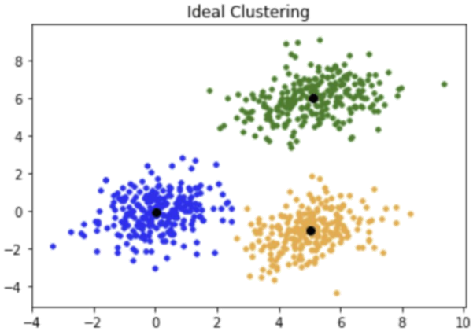

</div>
</div>

2. Gán mỗi pixel vào tâm gần nhất (thường theo khoảng cách Euclid).
3. Cập nhật tâm cụm bằng trung bình các pixel trong cụm.
4. Lặp lại cho đến khi hội tụ.
---

# Bài tập thực hành: Phân đoạn ảnh bằng K-Means
<gap></gap>
```python
import cv2
import numpy as np

img = cv2.imread('sample.jpg')
img = cv2.cvtColor(img, cv2.COLOR_BGR2RGB)

pixel_values = img.reshape((-1, 3))
pixel_values = np.float32(pixel_values)

criteria = (cv2.TERM_CRITERIA_EPS + cv2.TERM_CRITERIA_MAX_ITER, 100, 0.2)
K = 3
_, labels, centers = cv2.kmeans(pixel_values, K, None, criteria, 10, cv2.KMEANS_RANDOM_CENTERS)

labels = labels.reshape((img.shape[0], img.shape[1]))
segmented_img = np.uint8(centers)[labels]

cv2.imshow('K-Means Segmentation', segmented_img)
cv2.waitKey(0)
```

---

# PHÂN ĐOẠN BẰNG SUPERPIXELS

**Khái niệm**

- Superpixel là cách gom các pixel lân cận có đặc trưng giống nhau (màu sắc, độ sáng, vị trí) thành một vùng lớn hơn.
- Các vùng này bám biên tốt hơn so với việc xét từng pixel riêng lẻ hoặc chia theo ô chữ nhật cố định.

<div class="columns">
<div class="col-3">

**Lợi ích**

- Giảm số lượng phần tử cần xử lý (từ hàng trăm nghìn pixel xuống còn vài trăm superpixels).
- Giữ được thông tin biên quan trọng, giúp thuật toán phía sau chạy nhanh hơn.

**Ứng dụng**

- Tiền xử lý cho phân đoạn ảnh, tách nền, theo dõi video và nhận dạng đối tượng.

</div>
<div class="col-2">

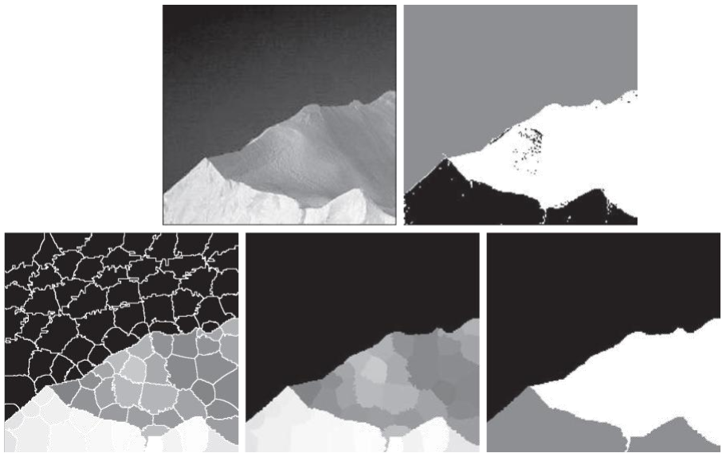

</div>
</div>

---

# THUẬT TOÁN SUPERPIXEL SLIC

**Giới thiệu**

- SLIC (Simple Linear Iterative Clustering) là thuật toán tạo superpixel phổ biến, dựa trên K-Means.

**Không gian đặc trưng**

- Với ảnh màu, SLIC dùng vector $[l, a, b, x, y]$ (màu trong không gian CIELAB + tọa độ không gian).
- Giúp xét sự giống nhau về màu và giữ tính liên tục hình học.

**Thước đo khoảng cách**

- Kết hợp khác biệt màu ($d_{lab}$) và khác biệt vị trí ($d_{xy}$): $D = \sqrt{(d_{lab}/S)^2 + (d_{xy}/m)^2}$
- $S$: kích thước ô lưới khởi tạo.
- $m$: hệ số cân bằng giữa màu và không gian (m lớn: ưu tiên không gian; m nhỏ: ưu tiên màu sắc).
---

# Bài tập thực hành: Tạo Superpixels với SLIC
<gap></gap>

```python
from skimage.segmentation import slic
from skimage import io
import matplotlib.pyplot as plt

img = io.imread('sample.jpg')

# Áp dụng SLIC
segments = slic(img, n_segments=100, compactness=10, sigma=1)

plt.imshow(segments, cmap='nipy_spectral')
plt.title('SLIC Superpixels')
plt.axis('off')
plt.show()
```
