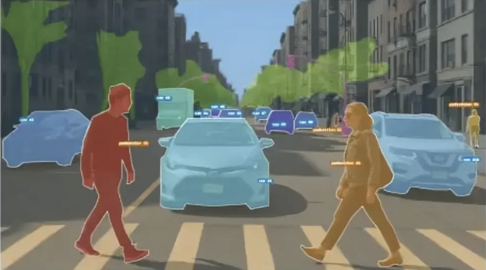
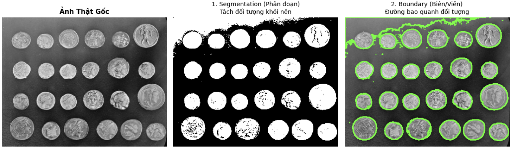
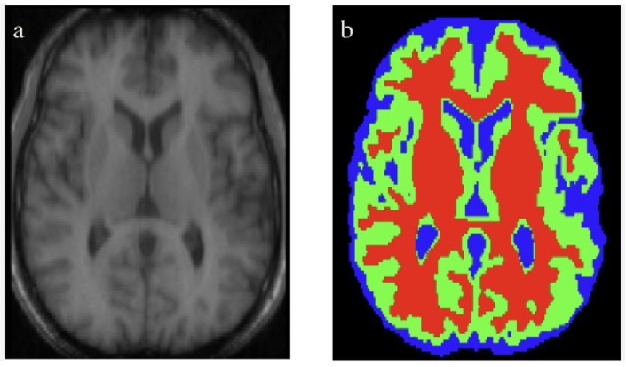
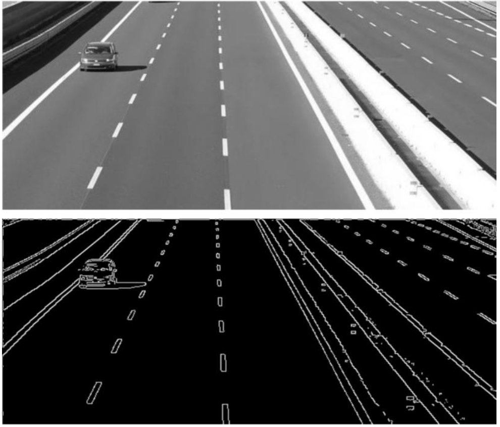
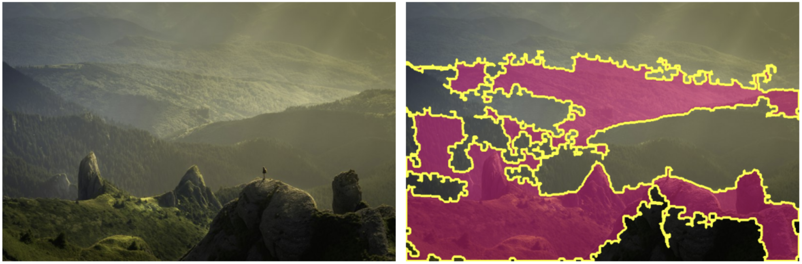
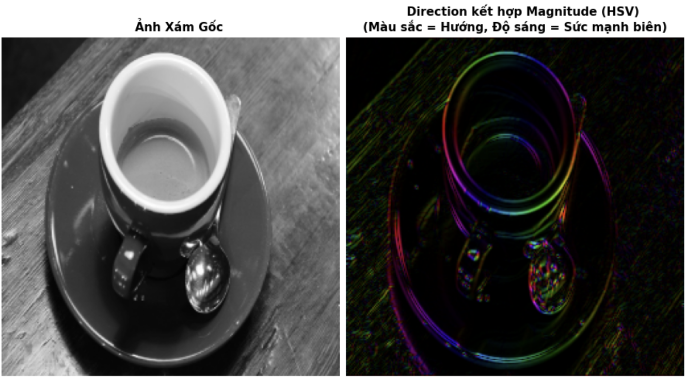
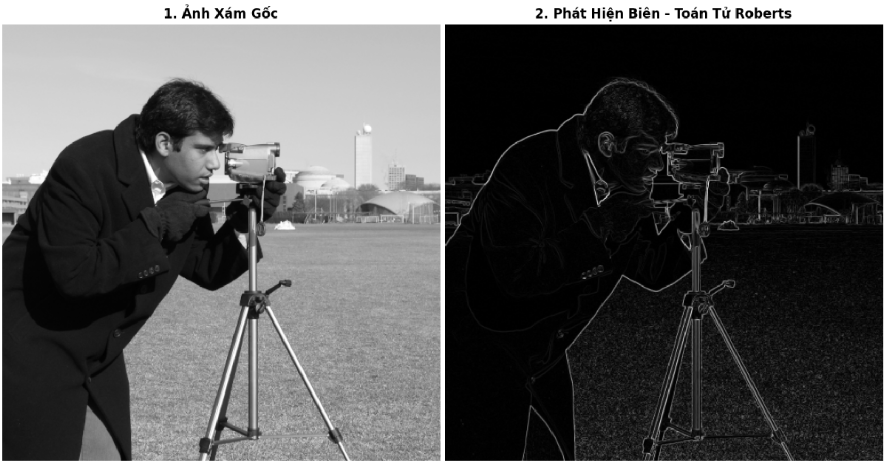
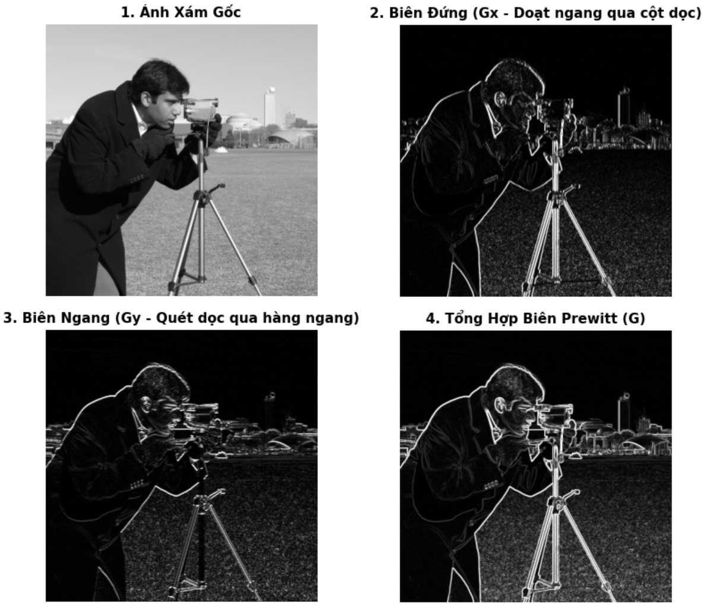
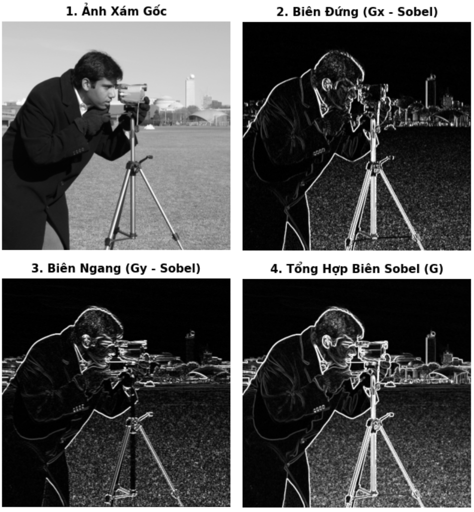

<!-- _class: cover -->

<div class="middle">

# XỬ LÝ ẢNH& THỊ GIÁC MÁY TÍNH

## Chương 4: Phát hiện biên & phân vùng

</div>

### Giảng viên: Nguyễn Phồn Lữa

---
<!--_class: toc-->

# Nội dung

1. Giới thiệu tổng quan về bài toán phân đoạn ảnh
2. Phát hiện điểm, đường và biên
3. Kỹ thuật phân ngưỡng (Thresholding)
4. Phân đoạn dựa trên vùng: Region Growing, Split & Merge
5. Phân đoạn dựa trên phân cụm: K-Means, Superpixels, SLIC
6. Ứng dụng thực tế với OpenCV

---

# Mục tiêu học tập
Sau khi hoàn thành chương này sinh viên có thể
- Giải thích được khái niệm biên, vùng và phân đoạn ảnh
- Trình bày nguyên lý các phương pháp phát hiện biên
- Sử dụng thành thạo các toán tử Roberts, Prewitt, Sobel và Canny
- Phân đoạn ảnh bằng phương pháp thresholding
- Cài đặt Region Growing và Split & Merge ở mức cơ bản
- Ứng dụng K-Means và SLIC để phân đoạn ảnh

---
<!--_class: section-->

# TỔNG QUAN BÀI TOÁN PHÂN ĐOẠN ẢNH

---

# BÀI TOÁN PHÂN ĐOẠN ẢNH

**Định nghĩa:**
- **Phân đoạn ảnh (Image Segmentation)** là quá trình chia một ảnh thành các vùng có ý nghĩa, sao cho các pixel trong cùng một vùng có đặc điểm tương đồng

<div class="columns">
<div>

**Ví dụ minh họa:**
- Ảnh giao thông: phân tách thành đường, xe, người, cây cối, bầu trời
- Ảnh y tế: phân tách mô, cơ quan, khối u
- Ảnh sản phẩm: tách sản phẩm và nền
- Ảnh tài liệu: tách chữ và nền

</div>
<div>



</div>
</div>

**Mục tiêu cốt lõi:**
- Thay vì xử lý từng pixel riêng lẻ, hệ thống chuyển ảnh thành tập hợp các vùng hoặc đối tượng có ý nghĩa
- Trả lời câu hỏi: *"Pixel nào thuộc cùng một vùng/đối tượng?"*

---

# KHÁI NIỆM REGION, BOUNDARY VÀ SEGMENTATION

**Region (Vùng ảnh):**
- Là tập hợp các pixel có những đặc điểm tương đồng
- Các đặc điểm có thể bao gồm: cường độ sáng, màu sắc, kết cấu (texture), đặc trưng hình học

<div class="columns">
<div>

**Boundary (Biên):**
- Là ranh giới giữa hai vùng có đặc tính khác nhau
- Ví dụ: ranh giới phân cách giữa Vùng A và Vùng B trong ảnh

</div>
<div class="col-2">



</div>
</div>

**Segmentation (Phân đoạn):**
- Là quá trình xác định các region và/hoặc boundary trong ảnh
- Kết quả: ảnh được chia thành các vùng có ý nghĩa ngữ nghĩa (semantic)

---

# ĐIỀU KIỆN PHÂN ĐOẠN ẢNH

Cho không gian ảnh $R$, một phân đoạn gồm $n$ vùng: $R_1, R_2, \ldots, R_n$ thỏa mãn 5 điều kiện:

1. **Phân đoạn đầy đủ:** $\bigcup_{i=1}^{n}R_i = R$
   - *Giải thích:* Mọi pixel trong ảnh đều thuộc về một vùng nào đó
2. **Mỗi vùng liên thông:**
   - *Giải thích:* Mỗi $R_i$ là tập hợp liên thông theo quy tắc lân cận đã chọn (4-liên thông hoặc 8-liên thông)
3. **Các vùng đôi một rời nhau:** $R_i \cap R_j = \varnothing, \quad i \neq j$
   - *Giải thích:* Một pixel không thể đồng thời thuộc hai vùng khác nhau
4. **Pixel trong cùng vùng thỏa mãn predicate:** $P(R_i) = TRUE, \quad i = 1, \ldots, n$
   - *Giải thích:* Các pixel trong cùng một vùng phải có tính chất tương đồng
5. **Hai vùng kề nhau không thể hợp nhất:** $P(R_i \cup R_j) = FALSE$
   - *Giải thích:* Nếu $R_i$ và $R_j$ kề nhau, việc hợp nhất chúng sẽ vi phạm tính đồng nhất

---

# TẠI SAO CẦN PHÂN ĐOẠN ẢNH?

**Vai trò trong quy trình xử lý:**
- Phân đoạn là bước trung gian quan trọng giữa ảnh thô và đối tượng có ý nghĩa

**Quy trình xử lý ảnh điển hình:**
- Ảnh đầu vào $\rightarrow$ Tiền xử lý $\rightarrow$ **Phân đoạn** $\rightarrow$ Các vùng/đối tượng $\rightarrow$ Trích xuất đặc trưng $\rightarrow$ Nhận dạng/Phân tích

<div class="columns">
<div>

**Ví dụ minh họa (Ảnh CT y tế):**
- Sau khi phân đoạn, ta thu được: nền, mô, cơ quan, vùng bất thường
- Hệ thống mới có thể thực hiện: đo kích thước, xác định hình dạng, phát hiện bất thường, hỗ trợ chẩn đoán

</div>
<div>



</div>
</div>

---

# ỨNG DỤNG CỦA PHÂN ĐOẠN ẢNH

**Lĩnh vực Y tế:**
- Phân vùng khối u, cơ quan, mạch máu, phân tích tế bào

**Xe tự hành:**
- Nhận diện đường giao thông, làn đường, người đi bộ, phương tiện, vỉa hè

**Công nghiệp:**
- Phát hiện lỗi sản phẩm, phân vùng linh kiện, kiểm tra bề mặt

**Thị giác máy tính:**
- Object detection, Semantic segmentation, Instance segmentation, Tracking đối tượng

---

# CÁC HƯỚNG TIẾP CẬN CHÍNH

**1. Dựa trên biên:** Tìm nơi cường độ ảnh thay đổi mạnh (Ví dụ: Sobel, Canny, LoG)
**2. Dựa trên ngưỡng:** Tách pixel dựa trên cường độ hoặc màu sắc (Ví dụ: Global Thresholding, Otsu, Adaptive Thresholding)
**3. Dựa trên vùng:** Nhóm các pixel lân cận có tính chất tương đồng (Ví dụ: Region Growing, Split & Merge)
**4. Dựa trên phân cụm:** Nhóm các pixel có đặc trưng gần nhau (Ví dụ: K-Means, Gaussian Mixture Model)
**5. Dựa trên Deep Learning:** Học trực tiếp từ dữ liệu (Ví dụ: U-Net, Mask R-CNN, SAM)

---
<!--_class: section-->

# Phát hiện điểm, đường và biên

---

# KHÁI NIỆM ĐIỂM, ĐƯỜNG VÀ BIÊN

**Điểm (Point):**
- Một pixel có giá trị khác biệt rõ rệt so với các pixel lân cận
- *Ví dụ:* điểm sáng trên nền tối, điểm tối trên nền sáng, nhiễu dạng đốm

<div class="columns">
<div>

**Đường (Line):**
- Một chuỗi pixel tạo thành cấu trúc kéo dài theo một hướng
- *Ví dụ:* đường kẻ, dây điện, cạnh dài của vật thể

**Biên (Edge):**
- Vị trí có sự thay đổi đáng kể về cường độ hoặc màu sắc
- *Ví dụ:* ranh giới vật thể, ranh giới giữa hai vùng, sự thay đổi cấu trúc trong ảnh

</div>
<div>



</div>
</div>

---

# TỪ CƯỜNG ĐỘ ẢNH ĐẾN BIÊN

**Quan sát trên ảnh một chiều:**
- Ở vùng phẳng (đồng nhất): đạo hàm $\frac{\partial I}{\partial x} \approx 0$
- Tại biên: $\left|\frac{\partial I}{\partial x}\right|$ có giá trị lớn

<div class="columns">
<div>

**Ý tưởng cốt lõi:**
- Biên có thể được phát hiện bằng cách tìm nơi cường độ ảnh thay đổi mạnh
- Đây là cơ sở toán học của các phương pháp dựa trên gradient

**Minh họa:**
- Khi cường độ ảnh thay đổi đột ngột từ giá trị thấp sang cao (hoặc ngược lại), đó chính là vị trí biên

</div>
<div>


</div>
</div>

---

# PHÁT HIỆN ĐIỂM BIỆT LẬP

**Mục tiêu:** Phát hiện pixel có giá trị khác biệt rõ rệt so với vùng lân cận

**Phương pháp:** Sử dụng mặt nạ Laplacian để đo sự thay đổi cục bộ

**Mặt nạ Laplacian 3×3:**
$$W = \begin{bmatrix} -1 & -1 & -1 \\ -1 & 8 & -1 \\ -1 & -1 & -1 \end{bmatrix}$$

**Đáp ứng tại pixel $(x,y)$:**
$$R(x,y) = (W * I)(x,y)$$
(trong đó $*$ là phép tích chập, $I$ là ảnh mức xám)

**Quy tắc phát hiện:**
- Một điểm biệt lập được phát hiện nếu: $|R(x,y)| > T$
- Với $T$ là ngưỡng phát hiện

---

# TRỰC QUAN HÓA PHÁT HIỆN ĐIỂM

**Ví dụ minh họa:**
- Nền đồng nhất với một điểm sáng ở giữa:
```text
0   0   0   0   0
0   0   0   0   0
0   0  255  0   0
0   0   0   0   0
0   0   0   0   0
```

**Kết quả sau tích chập:**
- Pixel trung tâm (255) khác biệt mạnh so với các pixel xung quanh (0)
- Đáp ứng $R(x,y)$ tại vị trí này sẽ rất lớn
- Nếu $|R(x,y)| > T$ $\rightarrow$ điểm được phát hiện

**Lưu ý quan trọng:**
- Phương pháp rất nhạy với nhiễu và các chi tiết nhỏ không mong muốn
- Cần chọn ngưỡng $T$ phù hợp

---

# PHÁT HIỆN ĐƯỜNG

**Mục tiêu:** Phát hiện các đường có hướng xác định (ngang, dọc, chéo +45°, chéo -45°)

**Phương pháp:** Mỗi hướng sử dụng một mặt nạ riêng

**Ví dụ - Mặt nạ phát hiện đường ngang, dọc, chéo:**

<div class="columns">
<div>

$$W_h = \begin{bmatrix} -1 & -1 & -1 \\ 2 & 2 & 2 \\ -1 & -1 & -1 \end{bmatrix}$$

</div>
<div>

$$W_v = \begin{bmatrix} -1 & 2 & -1 \\ -1 & 2 & -1 \\ -1 & 2 & -1 \end{bmatrix}$$

</div>
<div>

$$W_{d_1} = \begin{bmatrix} 2 & -1 & -1 \\ -1 & 2 & -1 \\ -1 & -1 & 2 \end{bmatrix}$$

</div>
<div>

$$W_{d_2} = \begin{bmatrix} -1 & -1 & 2 \\ -1 & 2 & -1 \\ 2 & -1 & -1 \end{bmatrix}$$

</div>
</div>

**Đáp ứng đường ngang:**
$$R_h(x,y) = (W_h * I)(x,y)$$

**Quy tắc phát hiện:**
- Điểm thuộc đường ngang được phát hiện khi: $|R_h(x,y)| > T$
- Tương tự, có thể xây dựng các mặt nạ cho đường dọc, đường chéo +45°, đường chéo -45°

---

# TẠI SAO MẶT NẠ CÓ THỂ PHÁT HIỆN ĐƯỜNG?

**Nguyên lý hoạt động:**
- Khi tích chập mặt nạ với ảnh:
  - Pixel phù hợp với cấu trúc đường $\rightarrow$ đóng góp lớn vào kết quả
  - Pixel không phù hợp $\rightarrow$ các thành phần dương và âm triệt tiêu nhau

**Ý nghĩa:**
- Mặt nạ hoạt động giống một bộ lọc chuyên biệt cho một hướng cụ thể
- Chỉ khi cấu trúc ảnh khớp với hướng của mặt nạ, đáp ứng mới đủ lớn để phát hiện

---

# BIÊN

**Định nghĩa:**
- Biên là vùng trong ảnh tại đó cường độ thay đổi nhanh trong một khoảng không gian nhỏ

<div class="columns">
<div>

**Biên thường xuất hiện tại:**
- Ranh giới giữa vật thể và nền
- Ranh giới giữa hai vật thể
- Vị trí thay đổi bề mặt, độ sâu, hoặc chiếu sáng

</div>
<div>



</div>
</div>

**Hai cách tiếp cận toán học chính:**
1. **Đạo hàm bậc nhất $\rightarrow$ Gradient:** Đo tốc độ thay đổi của cường độ, cho biết độ mạnh và hướng của biên
2. **Đạo hàm bậc hai $\rightarrow$ Laplacian:** Đo tốc độ thay đổi của gradient, phát hiện biên qua zero-crossing

---

# GRADIENT CỦA ẢNH

**Định nghĩa gradient:**
Với ảnh mức xám $I(x,y)$, gradient là:
$$\nabla I(x,y) = \begin{bmatrix} G_x(x,y) \\ G_y(x,y) \end{bmatrix}$$

**Trong đó:**
$$G_x(x,y) = \frac{\partial I(x,y)}{\partial x}, G_y(x,y) = \frac{\partial I(x,y)}{\partial y}$$

**Độ lớn gradient:**
$$M(x,y) = |\nabla I(x,y)| = \sqrt{G_x^2(x,y) + G_y^2(x,y)}$$

**Hướng gradient:**
$$\theta(x,y) = \operatorname{atan2}(G_y(x,y), G_x(x,y))$$

<gap></gap>

>**Lưu ý**: Dùng $\operatorname{atan2}$ thay cho $\tan^{-1}(G_y/G_x)$ để xác định hướng đúng trong cả bốn góc phần tư và tránh trường hợp $G_x = 0$

---

# HƯỚNG CỦA GRADIENT

**Ý nghĩa của gradient:**

<div class="columns">
<div>

- **Magnitude (độ lớn $M$):** Cho biết biên mạnh hay yếu
- **Direction (hướng $\theta$):** Cho biết hướng thay đổi mạnh nhất

**Quan trọng:**
- Gradient luôn **vuông góc** với hướng của biên
- Ví dụ: Nếu biên chạy ngang, gradient sẽ hướng dọc

</div>
<div>



</div>
</div>

**Ứng dụng:**
- Thông tin này rất quan trọng trong các thuật toán như Canny, giúp làm mỏng biên (non-maximum suppression)

---

# TOÁN TỬ ROBERTS

**Đặc điểm:**
- Sử dụng các mặt nạ 2×2 để xấp xỉ gradient
- Là toán tử đơn giản nhất trong các toán tử phát hiện biên

<div class="columns">
<div>

**Hai mặt nạ Roberts:**
$$G_x = \begin{bmatrix} 1 & 0 \\ 0 & -1 \end{bmatrix} * I$$
$$G_y = \begin{bmatrix} 0 & 1 \\ -1 & 0 \end{bmatrix} * I$$

**Độ lớn gradient:**
$$M = \sqrt{G_x^2 + G_y^2}$$

</div>
<div>



</div>
</div>

**Ưu điểm:** Đơn giản, tính toán nhanh
**Nhược điểm:** Nhạy với nhiễu, khả năng ổn định kém hơn Sobel

---

# TOÁN TỬ PREWITT

<div class="columns">
<div>

**Đặc điểm:**
- Sử dụng mặt nạ 3×3
- Vừa xấp xỉ đạo hàm vừa có khả năng làm trơn nhẹ

**Hai mặt nạ Prewitt:**
$$G_x = \begin{bmatrix} -1 & 0 & 1 \\ -1 & 0 & 1 \\ -1 & 0 & 1 \end{bmatrix} * I$$
$$G_y = \begin{bmatrix} -1 & -1 & -1 \\ 0 & 0 & 0 \\ 1 & 1 & 1 \end{bmatrix} * I$$

**Độ lớn gradient:** $M = \sqrt{G_x^2 + G_y^2}$

</div>
<div>



</div>
</div>

**Ứng dụng:** Phù hợp cho ảnh có ít nhiễu, cần tính toán nhanh

---

# TOÁN TỬ SOBEL

<div class="columns">
<div>

**Đặc điểm:**
- Tương tự Prewitt nhưng tăng trọng số ở hàng/cột trung tâm
- Kết hợp cả đạo hàm và làm trơn theo một hướng

**Hai mặt nạ Sobel:**
$$G_x = \begin{bmatrix} -1 & 0 & 1 \\ -2 & 0 & 2 \\ -1 & 0 & 1 \end{bmatrix} * I, G_y = \begin{bmatrix} -1 & -2 & -1 \\ 0 & 0 & 0 \\ 1 & 2 & 1 \end{bmatrix} * I$$

<gap></gap>

<gap></gap>

**Độ lớn gradient:** $M = \sqrt{G_x^2 + G_y^2}$$

<gap></gap>

**Xấp xỉ trong thực tế:** $M \approx |G_x| + |G_y|$

</div>
<div>



</div>
</div>

*Ưu điểm:* Ổn định hơn Prewitt khi ảnh có nhiễu

---

# SLIDE 20. SO SÁNH ROBERTS – PREWITT – SOBEL (here)

**Bảng so sánh:**

| Toán tử | Kích thước | Đặc điểm |
|---------|-----------|----------|
| Roberts | 2×2 | Nhanh, đơn giản, nhạy nhiễu |
| Prewitt | 3×3 | Đạo hàm + làm trơn nhẹ |
| Sobel | 3×3 | Trọng số trung tâm lớn hơn, ổn định hơn |
| Canny | Nhiều bước | Biên mảnh, liên tục, mạnh hơn |

**Ghi nhớ:**
- Không có toán tử nào luôn tốt nhất cho mọi trường hợp
- Lựa chọn phụ thuộc vào: mức nhiễu, yêu cầu tốc độ, chất lượng biên mong muốn, đặc điểm ảnh

---

# SLIDE 21. ĐỘ LỚN GRADIENT

**Công thức tính:**
Sau khi tính $G_x$ và $G_y$:
$$M(x,y) = \sqrt{G_x^2(x,y) + G_y^2(x,y)}$$

**Ý nghĩa:**
- $M(x,y)$ **lớn** $\rightarrow$ khả năng xuất hiện biên cao
- $M(x,y)$ **nhỏ** $\rightarrow$ vùng ảnh tương đối đồng nhất

**Ứng dụng:**
- $M(x,y)$ được sử dụng để xác định độ mạnh của biên
- Là đầu vào cho bước phân ngưỡng để tạo ảnh biên nhị phân

---

# SLIDE 22. KẾT HỢP GRADIENT VỚI PHÂN NGƯỠNG

**Mục tiêu:** Chuyển ảnh gradient $M(x,y)$ thành ảnh biên nhị phân

**Công thức:**
$$E(x,y) = \begin{cases} 1, & M(x,y) > T \\ 0, & M(x,y) \leq T \end{cases}$$

**Trong đó:**
- $E(x,y) = 1$: pixel được xem là biên
- $E(x,y) = 0$: pixel không được xem là biên
- $T$: ngưỡng biên

**Lưu ý khi hiển thị với OpenCV:**
- Ảnh nhị phân thường được biểu diễn bằng: $0 \rightarrow 0$ (nền), $1 \rightarrow 255$ (biên)

---

# SLIDE 23. THỰC HÀNH: SOBEL + THRESHOLD

**Code mẫu:**
```python
import cv2
import numpy as np
import matplotlib.pyplot as plt

img = cv2.imread("sample.jpg", cv2.IMREAD_GRAYSCALE)

sobelx = cv2.Sobel(img, cv2.CV_64F, 1, 0, ksize=5)
sobely = cv2.Sobel(img, cv2.CV_64F, 0, 1, ksize=5)

magnitude = np.sqrt(sobelx**2 + sobely**2)
magnitude = np.uint8(magnitude / magnitude.max() * 255)

_, edges = cv2.threshold(magnitude, 50, 255, cv2.THRESH_BINARY)
```

**Yêu cầu thực hành:**
- Hiển thị: Ảnh gốc, Gradient $G_x$, Gradient $G_y$, Magnitude, Ảnh biên sau threshold

---

# SLIDE 24. LAPLACIAN VÀ PHÁT HIỆN BIÊN

**Định nghĩa:**
Laplacian của ảnh $I(x,y)$ là đạo hàm bậc hai:
$$\nabla^2 I = \frac{\partial^2 I}{\partial x^2} + \frac{\partial^2 I}{\partial y^2}$$

**Đặc điểm:**
- Laplacian không có hướng như gradient
- Biên thường được xác định tại vị trí **zero-crossing** (nơi đáp ứng Laplacian đổi dấu)

**Ví dụ:**
- Nếu $\nabla^2 I(x_1, y_1) > 0$ và $\nabla^2 I(x_2, y_2) < 0$ trong vùng lân cận
- $\rightarrow$ Có khả năng xuất hiện zero-crossing giữa hai vị trí

**Nhược điểm:**
- Đạo hàm bậc hai rất nhạy với nhiễu
- Do đó thường cần: Làm trơn $\rightarrow$ Laplacian $\rightarrow$ tìm zero-crossing

---

# SLIDE 25. LOG – LAPLACIAN OF GAUSSIAN

**Vấn đề:** Laplacian nhạy với nhiễu

**Giải pháp - LoG (Laplacian of Gaussian):**
1. Làm trơn ảnh bằng Gaussian: $I_s = G_\sigma * I$
2. Tính Laplacian: $L = \nabla^2 I_s = \nabla^2 (G_\sigma * I)$
3. Tìm các zero-crossing của $L$

**Quy trình:**
$$I \rightarrow G_\sigma * I \rightarrow \nabla^2 I_s \rightarrow \text{Zero-crossing} \rightarrow \text{Edge}$$

**Ý nghĩa:**
- Gaussian giúp giảm nhiễu trước khi áp dụng đạo hàm bậc hai
- Kết hợp ưu điểm của cả hai phương pháp

---

# SLIDE 26. CANNY EDGE DETECTOR

**Mục tiêu:** Tạo ra biên mảnh, rõ, ít nhiễu, liên tục

**Canny là một quy trình gồm nhiều bước:**

**Quy trình 5 bước:**
1. Làm trơn Gaussian (Gaussian Blur)
2. Tính Gradient
3. Non-Maximum Suppression
4. Double Threshold
5. Hysteresis

**Kết quả:** Biên cuối cùng chất lượng cao

---

# SLIDE 27. BƯỚC 1 – GAUSSIAN BLUR

**Mục đích:**
- Giảm nhiễu, chi tiết rất nhỏ, biến thiên không mong muốn

**Công thức:**
Ảnh sau khi làm trơn:
$$I_s(x,y) = G_\sigma(x,y) * I(x,y)$$

**Trong đó:**
- $G_\sigma$: Gaussian kernel
- $\sigma$: tham số điều khiển mức độ làm trơn

**Ảnh hưởng của $\sigma$:**
- $\sigma$ nhỏ $\rightarrow$ giữ nhiều chi tiết
- $\sigma$ lớn $\rightarrow$ ảnh mượt hơn nhưng có thể mất biên nhỏ

---

# SLIDE 28. BƯỚC 2 – TÍNH GRADIENT

**Từ ảnh đã làm trơn $I_s$:**

**Tính gradient theo hai hướng:**
$$G_x = \frac{\partial I_s}{\partial x}$$
$$G_y = \frac{\partial I_s}{\partial y}$$

**Độ lớn gradient:**
$$M = \sqrt{G_x^2 + G_y^2}$$

**Hướng gradient:**
$$\theta = \operatorname{atan2}(G_y, G_x)$$

**Kết quả:**
- Mỗi pixel có độ mạnh của biên ($M$) và hướng gradient ($\theta$)
- Thông tin này được sử dụng ở bước tiếp theo

---

# SLIDE 29. BƯỚC 3 – NON-MAXIMUM SUPPRESSION

**Vấn đề:** Gradient thường tạo ra một vùng biên dày vài pixel

**Mục tiêu:** Biến các vùng biên dày thành các đường biên mảnh, thường gần một pixel

**Ý tưởng:**
- Với mỗi pixel, xét theo hướng gradient $\theta$
- Chỉ giữ pixel nếu $M(x,y)$ là **cực đại cục bộ** theo hướng gradient
- Các pixel không phải cực đại: $M(x,y) \rightarrow 0$

**Minh họa:**
```text
      x
      ↑ (hướng gradient)
   x  X  x
```
- Nếu X lớn nhất $\rightarrow$ giữ X
- Nếu không $\rightarrow$ loại X

---

# SLIDE 30. BƯỚC 4 – DOUBLE THRESHOLD

**Sử dụng hai ngưỡng:** $T_L < T_H$

**Phân loại pixel:**

1. **Biên mạnh:** $M > T_H$
   - Chắc chắn là biên
2. **Biên yếu:** $T_L \leq M \leq T_H$
   - Có khả năng là biên
3. **Không phải biên:** $M < T_L$
   - Loại bỏ

**Ý nghĩa:** Phân loại pixel thành ba nhóm để xử lý khác nhau ở bước tiếp theo

---

# SLIDE 31. BƯỚC 5 – HYSTERESIS

**Vấn đề:** Biên yếu có thể là biên thật hoặc là nhiễu

**Nguyên tắc:**
- Biên mạnh được giữ lại
- Biên yếu chỉ được giữ nếu có liên kết với một biên mạnh thông qua các pixel biên lân cận

**Công thức:**
$$E(x,y) = \begin{cases} 1, & M(x,y) > T_H \\ 1, & T_L \leq M(x,y) \leq T_H \text{ và liên thông với biên mạnh} \\ 0, & M(x,y) < T_L \\ 0, & \text{biên yếu không liên thông với biên mạnh} \end{cases}$$

**Kết quả:** Biên cuối cùng rõ hơn, ít nhiễu hơn, liên tục hơn

---

# SLIDE 32. THỰC HÀNH: CANNY

**Code mẫu:**
```python
import cv2
import matplotlib.pyplot as plt

img = cv2.imread("sample.jpg", cv2.IMREAD_GRAYSCALE)

edges = cv2.Canny(img, threshold1=100, threshold2=200)

plt.figure(figsize=(10, 4))
plt.subplot(1, 2, 1)
plt.imshow(img, cmap="gray")
plt.title("Original")
plt.axis("off")

plt.subplot(1, 2, 2)
plt.imshow(edges, cmap="gray")
plt.title("Canny Edges")
plt.axis("off")
plt.show()
```

**Thử nghiệm:**
- Thay đổi threshold1, threshold2 và quan sát: số lượng biên, mức nhiễu, tính liên tục của biên

---

# SLIDE 33. NỐI CÁC ĐIỂM BIÊN

**Vấn đề:**
- Sau khi phát hiện biên, các đoạn biên có thể bị đứt, nhiễu, thiếu pixel

**Ý tưởng:**
- Nối các điểm biên có: vị trí gần nhau, hướng gradient tương tự, đặc điểm tương đồng

**Hai hướng xử lý:**
1. **Cục bộ:** Dựa vào các pixel lân cận
2. **Toàn cục:** Tìm cấu trúc hình học trong toàn ảnh (Ví dụ: Hough Transform)

---

# SLIDE 34. HOUGH TRANSFORM

**Ứng dụng:** Đặc biệt hiệu quả để phát hiện đường thẳng

**Biểu diễn đường thẳng:**
$$\rho = x\cos\theta + y\sin\theta$$

**Trong đó:**
- $\rho$: khoảng cách từ gốc tọa độ đến đường thẳng
- $\theta$: góc của pháp tuyến

**Ý tưởng:**
- Mỗi điểm biên bỏ phiếu cho các đường có thể đi qua nó
- Các đường thực sự tồn tại $\rightarrow$ nhận được nhiều phiếu

**Quy trình:**
Edge Image $\rightarrow$ Các điểm biên $\rightarrow$ Hough Space $(\rho, \theta)$ $\rightarrow$ Accumulator $\rightarrow$ Peak $\rightarrow$ Đường thẳng

---
<!--_class: section-->

# Kỹ thuật phân ngưỡng (Thresholding)

---

# SLIDE 35. KHÁI NIỆM PHÂN NGƯỠNG

**Định nghĩa:**
- Thresholding là kỹ thuật phân loại pixel dựa trên giá trị cường độ

**Công thức:**
Với ảnh mức xám $I(x,y)$, ảnh nhị phân:
$$B(x,y) = \begin{cases} 1, & I(x,y) > T \\ 0, & I(x,y) \leq T \end{cases}$$

**Trong đó:**
- $T$: ngưỡng
- $B(x,y) = 1$: foreground (đối tượng)
- $B(x,y) = 0$: background (nền)

**Nếu sử dụng quy ước OpenCV:**
$$B(x,y) = \begin{cases} 255, & I(x,y) > T \\ 0, & I(x,y) \leq T \end{cases}$$

---

# SLIDE 36. HISTOGRAM VÀ PHÂN NGƯỠNG

**Quan sát:**
- Nếu ảnh gồm nền tối và vật thể sáng, histogram có thể có hai đỉnh

**Ý tưởng:**
- Chọn $T$ nằm giữa hai nhóm

**Thực tế:**
- Histogram có thể bị ảnh hưởng bởi: nhiễu, chiếu sáng không đều, bóng, phản xạ, vật thể có nhiều mức sáng

**Thách thức:**
- Không phải lúc nào cũng dễ dàng chọn ngưỡng $T$ thủ công

---

# SLIDE 37. PHÂN NGƯỠNG TOÀN CỤC

**Định nghĩa:**
- Sử dụng một ngưỡng duy nhất cho toàn bộ ảnh: $T(x,y) = T$

**Kết quả:**
$$B(x,y) = \begin{cases} 1, & I(x,y) > T \\ 0, & I(x,y) \leq T \end{cases}$$

**Ưu điểm:** Đơn giản, nhanh, dễ cài đặt

**Phù hợp khi:** Nền tương đối đồng nhất, ánh sáng đồng đều, histogram có sự phân tách rõ

**Không phù hợp khi:** Ảnh có bóng, ánh sáng không đều, nền thay đổi mạnh

---

# SLIDE 38. PHÂN NGƯỠNG CỤC BỘ (ADAPTIVE)

**Định nghĩa:**
- Ngưỡng được tính riêng cho từng vùng lân cận: $T = T(x,y)$

**Công thức tổng quát:**
$$B(x,y) = \begin{cases} 1, & I(x,y) > T(x,y) \\ 0, & I(x,y) \leq T(x,y) \end{cases}$$

**Ví dụ Gaussian adaptive threshold trong OpenCV:**
$$T(x,y) = \text{WeightedMean}(N(x,y)) - C$$

**Trong đó:**
- $N(x,y)$: vùng lân cận
- $C$: hằng số điều chỉnh

**Phù hợp cho:** Ảnh tài liệu, ảnh có ánh sáng không đồng đều, ảnh có nền thay đổi

---

# SLIDE 39. OTSU THRESHOLDING

**Mục tiêu:** Tự động tìm ngưỡng $T$ sao cho hai lớp (Background và Foreground) được phân tách tốt nhất

**Phương pháp:**
Với một ngưỡng $T$, histogram được chia thành hai lớp:
- $C_0 = \{I(x,y) \leq T\}$
- $C_1 = \{I(x,y) > T\}$

**Các đại lượng:**
- $\omega_0(T)$: xác suất lớp $C_0$
- $\omega_1(T)$: xác suất lớp $C_1$
- $\mu_0(T)$: trung bình lớp $C_0$
- $\mu_1(T)$: trung bình lớp $C_1$

**Phương sai giữa hai lớp:**
$$\sigma_B^2(T) = \omega_0(T)\omega_1(T)[\mu_0(T) - \mu_1(T)]^2$$

**Ngưỡng Otsu:**
$$T^* = \arg\max_T \sigma_B^2(T)$$

*Ý nghĩa:* Chọn ngưỡng làm cho hai lớp có sự khác biệt thống kê lớn nhất

---

# SLIDE 40. ĐIỀU KIỆN CỦA OTSU

**Otsu hoạt động tốt khi:**
- Histogram có hai lớp tương đối rõ
- Có sự phân tách rõ về mức xám giữa Background và Object

**Có thể kém hiệu quả khi:**
- Histogram không có hai đỉnh rõ ràng
- Chiếu sáng không đồng đều
- Các lớp có mức xám chồng lấn mạnh

**Ghi nhớ:**
- Otsu là phương pháp tự động chọn $T$, không phải phương pháp bảo đảm phân đoạn tối ưu cho mọi ảnh

---

# SLIDE 41. THỰC HÀNH: OTSU VÀ ADAPTIVE THRESHOLD

**Code mẫu:**
```python
import cv2
import matplotlib.pyplot as plt

img = cv2.imread("sample.jpg", cv2.IMREAD_GRAYSCALE)

# Otsu thresholding
_, otsu = cv2.threshold(img, 0, 255, cv2.THRESH_BINARY + cv2.THRESH_OTSU)

# Adaptive thresholding
adaptive = cv2.adaptiveThreshold(
    img, 255, cv2.ADAPTIVE_THRESH_GAUSSIAN_C,
    cv2.THRESH_BINARY, 11, 2
)
```

**So sánh:**
- Hiển thị: Ảnh gốc, Global/Otsu, Adaptive

**Câu hỏi thảo luận:**
- Phương pháp nào tốt hơn khi ánh sáng không đồng đều?
- Điều gì xảy ra khi thay đổi kích thước vùng lân cận?
- Điều gì xảy ra khi thay đổi $C$?

---

# SLIDE 42. ĐA NGƯỠNG (MULTI-THRESHOLDING)

**Khi nào cần:**
- Khi ảnh chứa nhiều nhóm mức xám, một ngưỡng duy nhất có thể không đủ

**Công thức:**
Với $K$ mức phân đoạn, cần $K-1$ ngưỡng:
$$T_1 < T_2 < \cdots < T_{K-1}$$

**Ảnh được chia thành:**
- $R_1 = \{I \leq T_1\}$
- $R_2 = \{T_1 < I \leq T_2\}$
- $\vdots$
- $R_K = \{I > T_{K-1}\}$

**Lưu ý:**
- Vector các ngưỡng được ký hiệu là: $\mathbf{T} = (T_1, T_2, \ldots, T_{K-1})$

**Hạn chế:**
- Số ngưỡng tăng $\rightarrow$ số khả năng cần xem xét tăng $\rightarrow$ chi phí tính toán tăng

---
<!--_class: section-->

# Phân đoạn dựa trên vùng

---

# SLIDE 43. PHƯƠNG PHÁP DỰA TRÊN VÙNG

**Đặc điểm:**
- Không tập trung trực tiếp vào sự thay đổi tại biên
- Thay vào đó, tìm các vùng có tính đồng nhất về một hoặc nhiều đặc trưng

**Hai hướng chính:**
1. **Region Growing:** Bắt đầu từ một hoặc nhiều seed và phát triển vùng
2. **Split & Merge:** Chia vùng lớn thành các vùng nhỏ, sau đó hợp nhất các vùng tương đồng

---

# SLIDE 44. REGION GROWING – Ý TƯỞNG

**Seed (Điểm khởi tạo):**
- Một hoặc nhiều pixel được chọn làm điểm bắt đầu

**Phát triển:**
- Xét các pixel lân cận
- Nếu pixel đủ giống vùng hiện tại $\rightarrow$ thêm vào vùng
- Tiếp tục cho đến khi không còn pixel phù hợp

**Minh họa:**
```text
┌───────────────┐
│               │
│       ●       │ ← Seed
│               │
│               │
└───────────────┘
```

---

# SLIDE 45. TIÊU CHÍ PHÁT TRIỂN VÙNG

**Các tiêu chí có thể sử dụng:**

1. **Cường độ:**
   - So sánh với seed ban đầu: $|I(p) - I(S)| \leq T$
   - Hoặc so sánh với trung bình vùng hiện tại: $|I(p) - \mu_R| \leq T$
2. **Màu sắc:** $d(C_p, C_{region}) < T$
3. **Texture:** So sánh đặc trưng kết cấu của vùng
4. **Kết nối:** Chỉ xem xét các pixel 4-lân cận hoặc 8-lân cận

**Lưu ý:**
- Hai cách so sánh (với seed hoặc với $\mu_R$) cho kết quả khác nhau
- Cần ghi rõ đang sử dụng cách nào trong thuật toán

---

# SLIDE 46. 4-CONNECTIVITY VÀ 8-CONNECTIVITY

**4-lân cận:**
```text
    N
    |
W --P-- E
    |
    S
```

**8-lân cận:**
```text
NW  N  NE
 W  P  E
SW  S  SE
```

**Ý nghĩa:**
- 8-connectivity cho phép vùng phát triển theo đường chéo
- 8-lân cận thường tạo vùng liên kết mạnh hơn 4-lân cận
- Lựa chọn phụ thuộc vào yêu cầu của bài toán

---

# SLIDE 47. THUẬT TOÁN REGION GROWING

**Quy ước:**
- $I(x,y)$: ảnh đầu vào
- $S$: seed
- $R$: vùng kết quả
- $T$: ngưỡng tương đồng

**Thuật toán:**
1. **Khởi tạo:** $R = \{S\}$
2. **Đưa các pixel lân cận của $R$ vào tập ứng viên**
3. **Với mỗi pixel ứng viên $p$, kiểm tra:** $|I(p) - I(S)| \leq T$
4. **Nếu đúng:** $R \leftarrow R \cup \{p\}$
5. **Tiếp tục xét các pixel lân cận mới**
6. **Dừng khi không còn pixel nào thỏa điều kiện**

---

# SLIDE 48. THỰC HÀNH: REGION GROWING

**Code mẫu:**
```python
import cv2
import numpy as np

def region_growing(img, seed, threshold=10):
    height, width = img.shape
    segmented = np.zeros_like(img)
    seed_value = img[seed[1], seed[0]]
    
    queue = [seed]
    segmented[seed[1], seed[0]] = 255
    
    while queue:
        x, y = queue.pop(0)
        for dx in range(-1, 2):
            for dy in range(-1, 2):
                nx = x + dx
                ny = y + dy
                if 0 <= nx < width and 0 <= ny < height:
                    if segmented[ny, nx] == 0:
                        difference = abs(int(img[ny, nx]) - int(seed_value))
                        if difference <= threshold:
                            segmented[ny, nx] = 255
                            queue.append((nx, ny))
    
    return segmented
```

**Thử nghiệm:** Thay đổi seed, threshold và quan sát kích thước vùng

---

# SLIDE 49. ƯU VÀ NHƯỢC ĐIỂM REGION GROWING

**Ưu điểm:**
- Dễ hiểu, dễ cài đặt
- Có thể tạo vùng liên thông
- Phù hợp khi vùng có tính đồng nhất cao

**Nhược điểm:**
- Phụ thuộc vào seed
- Phụ thuộc vào tiêu chí tương đồng
- Nhạy với nhiễu
- Có thể phát triển sai sang vùng khác

**Vấn đề quan trọng:**
- Chọn seed và tiêu chí dừng quyết định mạnh đến kết quả

---

# SLIDE 50. SPLIT & MERGE

**Ý tưởng:**
- Thay vì bắt đầu từ seed, xét toàn bộ ảnh
- Nếu vùng không đồng nhất $\rightarrow$ Split (chia)
- Sau khi chia $\rightarrow$ tìm các vùng tương đồng
- Hợp nhất chúng $\rightarrow$ Merge (gộp)

**Quy trình:**
```text
       Toàn ảnh
          │
      Không đồng nhất?
       /          \
     Yes           No
      ↓             ↓
    Split          Giữ
      ↓
 Các vùng nhỏ
      ↓
   Merge vùng tương đồng
```

---

# SLIDE 51. SPLIT – CHIA VÙNG

**Phương pháp:**
- Sử dụng cấu trúc quadtree

**Quy trình:**
```text
┌──────────────┐
│              │
│   Ảnh        │
│              │
└──────────────┘
        ↓
┌───────┬───────┐
│       │       │
├───────┼───────┤
│       │       │
└───────┴───────┘
```

**Nếu một vùng chưa đồng nhất:**
- Chia thành 4 vùng con
- Tiếp tục đệ quy

**Tiêu chí đồng nhất có thể sử dụng:**
- Phương sai, độ lệch chuẩn, khoảng cường độ, đặc trưng màu

---

# SLIDE 52. MERGE – HỢP NHẤT VÙNG

**Sau khi Split:**
```text
┌───┬───┐
│ A │ B │
├───┼───┤
│ C │ D │
└───┴───┘
```

**Nếu:** $P(A \cup B) = TRUE$ $\rightarrow$ hợp nhất A và B

**Mục tiêu:**
- Tránh quá nhiều vùng nhỏ
- Tránh phân đoạn quá mức
- Tránh các vùng tương đồng bị tách rời không cần thiết

---

# SLIDE 53. REGION GROWING VS SPLIT & MERGE

**Bảng so sánh:**

| Đặc điểm | Region Growing | Split & Merge |
|----------|---------------|---------------|
| Điểm bắt đầu | Seed | Toàn ảnh |
| Hướng xử lý | Từ nhỏ $\rightarrow$ lớn | Lớn $\rightarrow$ nhỏ $\rightarrow$ hợp lại |
| Phụ thuộc seed | Có | Không trực tiếp |
| Cấu trúc | Phát triển vùng | Quadtree |
| Tiêu chí | Tương đồng với vùng | Đồng nhất / tương đồng |
| Nhược điểm | Seed-sensitive | Có thể tốn tính toán |

**Ghi nhớ:**
- Hai phương pháp đều dựa trên tính đồng nhất của vùng
- Nhưng bắt đầu và tổ chức quá trình phân đoạn khác nhau

---

# SLIDE 54. BIỂU DIỄN PIXEL TRONG KHÔNG GIAN ĐẶC TRƯNG

**Ý tưởng:**
- Thay vì xác định vùng trực tiếp trên ảnh, xem mỗi pixel là một điểm trong không gian đặc trưng

**Quy ước:**
- Pixel thứ $i$ được biểu diễn bởi vector đặc trưng: $\mathbf{x}_i \in \mathbb{R}^d$

**Ví dụ ảnh màu:**
$$\mathbf{x}_i = [R_i, G_i, B_i]^T$$

**Nếu bổ sung tọa độ:**
$$\mathbf{x}_i = [R_i, G_i, B_i, x_i, y_i]^T$$

**Trong đó:**
- $R_i, G_i, B_i$: thành phần màu
- $x_i, y_i$: tọa độ không gian

---

# SLIDE 55. K-MEANS CHO PHÂN ĐOẠN ẢNH

**Cho $K$ cụm và các centroid:** $\boldsymbol{\mu}_1, \boldsymbol{\mu}_2, \ldots, \boldsymbol{\mu}_K$

**Bước 1 – Assignment:**
Mỗi vector $\mathbf{x}_i$ được gán vào cụm gần nhất:
$$c_i = \arg\min_{k} |\mathbf{x}_i - \boldsymbol{\mu}_k|^2$$

**Bước 2 – Update:**
Cập nhật centroid:
$$\boldsymbol{\mu}_k = \frac{1}{|C_k|} \sum_{\mathbf{x}_i \in C_k} \mathbf{x}_i$$

**Bước 3:**
- Lặp Assignment $\rightarrow$ Update cho đến khi hội tụ

---

# SLIDE 56. HÀM MỤC TIÊU K-MEANS

**K-Means tối thiểu hóa:**
$$J = \sum_{k=1}^{K} \sum_{\mathbf{x}_i \in C_k} |\mathbf{x}_i - \boldsymbol{\mu}_k|^2$$

**Trong đó:**
- $C_k$: tập các điểm thuộc cụm $k$
- $\boldsymbol{\mu}_k$: centroid của cụm $k$
- $K$: số cụm
- $\mathbf{x}_i$: vector đặc trưng của pixel $i$

**Ý nghĩa:**
- Pixel càng gần centroid $\rightarrow$ càng có khả năng thuộc cụm đó
- Dùng chữ đậm cho vector giúp phân biệt rõ $\mathbf{x}_i$, $\boldsymbol{\mu}_k$ với các đại lượng vô hướng

---

# SLIDE 57. K-MEANS VỚI ẢNH MÀU

**Chuẩn bị dữ liệu:**
```python
pixel_values = img.reshape((-1, 3))
pixel_values = np.float32(pixel_values)
```

**Biến đổi:**
- Từ: $H \times W \times 3$
- Thành: $(H \times W) \times 3$

**Mỗi hàng tương ứng với một pixel:**
```text
[R, G, B]
[R, G, B]
[R, G, B]
...
```

**Sau khi phân cụm:**
- Đưa nhãn trở lại kích thước ảnh ban đầu

---

# SLIDE 58. THỰC HÀNH: PHÂN ĐOẠN ẢNH BẰNG K-MEANS

**Code mẫu:**
```python
import cv2
import numpy as np

img = cv2.imread("sample.jpg")
img = cv2.cvtColor(img, cv2.COLOR_BGR2RGB)

pixels = img.reshape((-1, 3))
pixels = np.float32(pixels)

criteria = (cv2.TERM_CRITERIA_EPS + cv2.TERM_CRITERIA_MAX_ITER, 100, 0.2)
K = 3

_, labels, centers = cv2.kmeans(
    pixels, K, None, criteria, 10, cv2.KMEANS_RANDOM_CENTERS
)

labels = labels.reshape(img.shape[:2])
segmented = np.uint8(centers)[labels]
```

**Thử nghiệm:** Thay đổi $K = 2, 3, 5, 8$ và so sánh kết quả

---

# SLIDE 59. ẢNH HƯỞNG CỦA K

**$K$ nhỏ (ví dụ $K = 2$):**
- Ít vùng màu
- Phân đoạn thô

**$K$ lớn (ví dụ $K = 8$):**
- Nhiều vùng màu hơn
- Phân đoạn chi tiết hơn

**Quan sát:**
- $K$ lớn không đồng nghĩa với phân đoạn tốt hơn
- Cần lựa chọn $K$ phù hợp với mục tiêu bài toán

---

# SLIDE 60. HẠN CHẾ CỦA K-MEANS

**K-Means cơ bản:**
- Không hiểu rõ cấu trúc không gian của ảnh
- Có thể gom hai vùng xa nhau nhưng có màu giống nhau vào cùng cluster
- Nhạy với centroid khởi tạo
- Cần xác định $K$ trước
- Có thể bị ảnh hưởng bởi nhiễu và outlier

**Ví dụ:**
```text
Vùng A                 Vùng B
██████                 ██████
██████                 ██████
Cùng màu → K-Means có thể xem chúng là cùng cluster
```

**Hệ quả:**
- Điều này dẫn đến ý tưởng superpixel

---

# SLIDE 61. SUPERPIXEL LÀ GÌ?

**Định nghĩa:**
- Superpixel là một nhóm pixel lân cận có đặc trưng tương đồng

**Ý tưởng:**
- Thay vì xử lý $H \times W$ pixel riêng biệt, ảnh được biểu diễn bằng một số lượng nhỏ các superpixel

**Ví dụ:**
- Ảnh $640 \times 480$ = 307,200 pixel
- $\downarrow$
- ~500 superpixels

**Đặc điểm của một superpixel:**
- Chứa các pixel lân cận
- Có màu sắc tương đồng
- Bám tương đối tốt theo biên vật thể

---

# SLIDE 62. TẠI SAO DÙNG SUPERPIXEL?

**Giảm độ phức tạp:**
- Thay vì xử lý hàng trăm nghìn pixel $\rightarrow$ xử lý vài trăm hoặc vài nghìn superpixel

**Giữ thông tin cấu trúc:**
- Superpixel thường bám theo: biên, hình dạng, vùng màu

**Ứng dụng:**
- Tiền xử lý segmentation
- Object recognition
- Tracking
- Image analysis
- Graph-based vision

---

# SLIDE 63. K-MEANS VS SUPERPIXEL

**K-Means:**
- Tập trung vào độ tương đồng của đặc trưng
- Pixel giống màu $\rightarrow$ có thể ở xa nhau $\rightarrow$ cùng cluster

**Superpixel:**
- Tập trung đồng thời vào: Đặc trưng + tính lân cận không gian
- Giống màu + Gần nhau + Bám cấu trúc không gian $\rightarrow$ Superpixel

**So sánh:**
```text
K-Means: Pixel giống màu → Có thể ở xa nhau → Cùng cluster
Superpixel: Giống màu + Gần nhau + Bám cấu trúc không gian → Superpixel
```

---

# SLIDE 64. SLIC – BIỂU DIỄN ĐẶC TRƯNG

**SLIC (Simple Linear Iterative Clustering):**
- Thuật toán phổ biến để tạo superpixel
- Dựa trên tư tưởng của K-Means nhưng thêm thông tin vị trí không gian

**Với ảnh màu, SLIC thường sử dụng không gian CIELAB:**

**Pixel $i$ được biểu diễn:**
$$\mathbf{z}_i = [L_i, a_i, b_i, x_i, y_i]$$

**Trong đó:**
- $L_i, a_i, b_i$: thành phần màu
- $x_i, y_i$: tọa độ không gian

**Khoảng cách màu:**
$$d_c = \sqrt{(L_i - L_j)^2 + (a_i - a_j)^2 + (b_i - b_j)^2}$$

**Khoảng cách không gian:**
$$d_s = \sqrt{(x_i - x_j)^2 + (y_i - y_j)^2}$$

---

# SLIDE 65. KHOẢNG CÁCH SLIC

**Khoảng cách tổng hợp được chuẩn hóa:**
$$D = \sqrt{d_c^2 + \left(\frac{m}{S}\right)^2 d_s^2}$$

**Trong đó:**
- $d_c$: khoảng cách màu
- $d_s$: khoảng cách không gian
- $S$: khoảng cách giữa các centroid khởi tạo
- $m$: tham số compactness

**Ý nghĩa:**
- $m \uparrow$ $\rightarrow$ tăng ảnh hưởng của khoảng cách không gian
- $m \downarrow$ $\rightarrow$ tăng ảnh hưởng tương đối của màu sắc

---

# SLIDE 66. Ý NGHĨA CỦA COMPACTNESS

**Với công thức:**
$$D = \sqrt{d_c^2 + \left(\frac{m}{S}\right)^2 d_s^2}$$

**$m$ nhỏ:**
- Khoảng cách màu đóng vai trò tương đối lớn
- Superpixel có xu hướng bám theo thay đổi màu/biên tốt hơn

**$m$ lớn:**
- Khoảng cách không gian có trọng số lớn hơn
- Superpixel có xu hướng compact và đều hơn

**Ứng dụng:**
- Điều chỉnh $m$ tùy theo yêu cầu của bài toán

---

# SLIDE 67. QUY TRÌNH SLIC

**Các bước:**
1. Ảnh màu $\rightarrow$ Chuyển sang CIELAB
2. Khởi tạo các centroid
3. Xét vùng lân cận centroid
4. Tính khoảng cách màu + không gian
5. Gán pixel
6. Cập nhật centroid
7. Lặp lại
8. Superpixels

**Điểm quan trọng:**
- SLIC không cần so sánh mỗi pixel với mọi centroid
- Nó chỉ tìm kiếm trong vùng không gian lân cận
- $\rightarrow$ Giúp thuật toán hiệu quả hơn

---

# SLIDE 68. THỰC HÀNH: SLIC SUPERPIXELS

**Code mẫu:**
```python
from skimage.segmentation import slic
from skimage import io
import matplotlib.pyplot as plt

img = io.imread("sample.jpg")

segments = slic(img, n_segments=100, compactness=10, sigma=1)

plt.imshow(segments, cmap="nipy_spectral")
plt.title("SLIC Superpixels")
plt.axis("off")
plt.show()
```

**Thử nghiệm:**
- Thay đổi: n_segments, compactness, sigma
- Quan sát: số lượng superpixel, kích thước superpixel, khả năng bám biên

---

# SLIDE 69. BẢN ĐỒ KIẾN THỨC

**Cấu trúc chương:**
```text
                 PHÂN ĐOẠN ẢNH
                        │
         ┌──────────────┼──────────────┐
         │              │              │
       Biên          Ngưỡng          Vùng
         │              │              │
   ┌─────┼─────┐    ┌───┼────┐    ┌───┴────┐
   │     │     │    │   │    │    │        │
 Sobel Canny LoG Global Otsu Adaptive Growing
                                       │
                                  Split & Merge
         │
         └──────────────┐
                        │
                     Phân cụm
                        │
                    K-Means
                        │
                    Superpixel
                        │
                      SLIC
```

---

# SLIDE 70. SO SÁNH CÁC PHƯƠNG PHÁP

**Bảng tổng hợp:**

| Nhóm | Ý tưởng chính | Ví dụ |
|------|---------------|-------|
| Dựa trên điểm/đường | Phát hiện cấu trúc cục bộ | Point, Line |
| Dựa trên gradient | Tìm thay đổi cường độ | Sobel, Prewitt |
| Dựa trên đạo hàm bậc hai | Zero-crossing | LoG |
| Dựa trên biên nâng cao | Kết hợp nhiều bước | Canny |
| Thresholding | Phân loại theo mức xám | Otsu |
| Region-based | Tính đồng nhất vùng | Region Growing |
| Split & Merge | Chia và hợp nhất vùng | Quadtree |
| Clustering | Nhóm pixel theo đặc trưng | K-Means |
| Superpixel | Nhóm pixel lân cận | SLIC |

---

# SLIDE 71. LỰA CHỌN PHƯƠNG PHÁP

**Hướng dẫn lựa chọn:**

**Nếu cần tìm ranh giới vật thể:**
$\rightarrow$ Edge Detection (ví dụ: Canny)

**Nếu foreground/background khác nhau rõ về cường độ:**
$\rightarrow$ Thresholding (ví dụ: Otsu)

**Nếu vùng có tính đồng nhất cao:**
$\rightarrow$ Region Growing

**Nếu muốn phân nhóm theo màu:**
$\rightarrow$ K-Means

**Nếu muốn giảm số lượng pixel nhưng giữ cấu trúc không gian:**
$\rightarrow$ Superpixel / SLIC

**Ghi nhớ:**
- Không có phương pháp duy nhất phù hợp cho mọi ảnh
- Việc lựa chọn phụ thuộc vào: đặc điểm ảnh, nhiễu, chiếu sáng, mục tiêu phân đoạn, tài nguyên tính toán

---

# SLIDE 72. KẾT NỐI VỚI COMPUTER VISION

**Vai trò:**
- Các kỹ thuật trong chương này thường là bước tiền xử lý hoặc bước trung gian trong hệ thống Computer Vision

**Quy trình truyền thống:**
```text
Image → Preprocessing → Edge/Threshold/Segmentation → Region/Object → Feature Extraction → Recognition
```

**Trong các hệ thống hiện đại:**
```text
Image → Deep Learning → Detection/Segmentation
```

**Tuy nhiên, các kỹ thuật truyền thống vẫn quan trọng vì:**
- Giúp hiểu ảnh được cấu tạo như thế nào
- Biên hình thành như thế nào
- Vùng được xác định như thế nào
- Đặc trưng ảnh có thể được sử dụng ra sao

---

# SLIDE 73. CÂU HỎI ÔN TẬP

**Câu 1:** Biên ảnh là gì? Tại sao gradient có thể được sử dụng để phát hiện biên?
**Câu 2:** So sánh Roberts, Prewitt và Sobel.
**Câu 3:** Tại sao Canny cần bước Non-Maximum Suppression?
**Câu 4:** Tại sao Canny sử dụng hai ngưỡng thay vì một ngưỡng?
**Câu 5:** Otsu lựa chọn ngưỡng dựa trên nguyên tắc nào?
**Câu 6:** Global Thresholding khác Adaptive Thresholding như thế nào?
**Câu 7:** Region Growing phụ thuộc vào những yếu tố nào?
**Câu 8:** Split & Merge khác Region Growing ở đâu?
**Câu 9:** Tại sao K-Means có thể gom hai vùng xa nhau vào cùng một cluster?
**Câu 10:** SLIC cải thiện ý tưởng K-Means cho ảnh như thế nào?

---

# SLIDE 74. BÀI TẬP TỔNG HỢP

**Cho một ảnh màu bất kỳ, thực hiện:**

**Bài 1 – Edge Detection:**
- So sánh: Sobel, Canny

**Bài 2 – Thresholding:**
- So sánh: Otsu, Adaptive Thresholding

**Bài 3 – Clustering:**
- Phân đoạn ảnh bằng: K-Means với $K=2$, $K=4$, $K=6$

**Bài 4 – Superpixel:**
- Tạo: 50 superpixels, 100 superpixels, 200 superpixels

**Bài 5 – Phân tích:**
- Phương pháp nào giữ biên tốt nhất?
- Phương pháp nào nhạy với nhiễu?
- Khi nào thresholding thất bại?
- K-Means có giữ được cấu trúc không gian không?
- SLIC giải quyết vấn đề gì?

---

# SLIDE 75. KẾT LUẬN CHƯƠNG

**Ba ý tưởng quan trọng nhất:**

1. **Biên:** Tìm nơi ảnh thay đổi mạnh
2. **Vùng:** Tìm các pixel có tính chất tương đồng
3. **Phân cụm / Superpixel:** Nhóm các pixel dựa trên đặc trưng và/hoặc vị trí

**Chuỗi tư duy:**
```text
Thay đổi cường độ → Biên
Tương đồng cường độ → Threshold
Tương đồng vùng → Region Growing, Split & Merge
Tương đồng đặc trưng → K-Means
Tương đồng + lân cận không gian → SLIC
```

**Kết thúc chương:**
- Phát hiện biên và phân vùng là nền tảng để chuyển từ "ảnh" sang "cấu trúc có ý nghĩa"
- Tạo tiền đề cho các bài toán nhận dạng, phát hiện và phân tích đối tượng trong Computer Vision