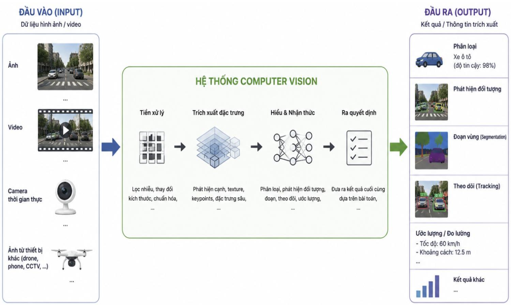
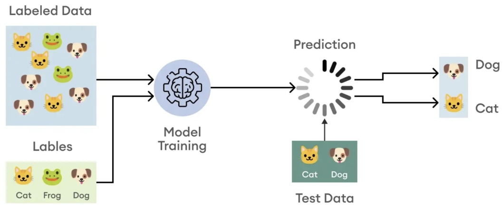
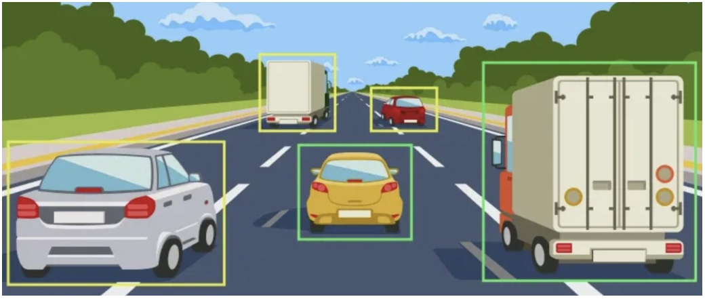
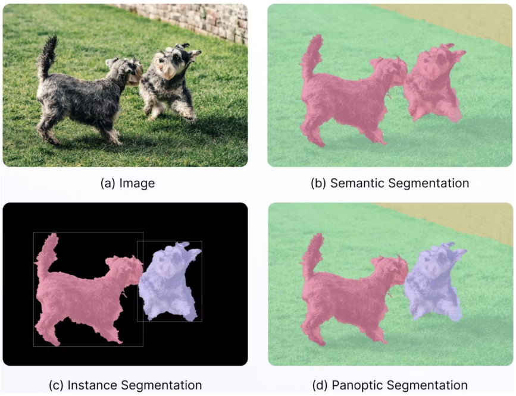
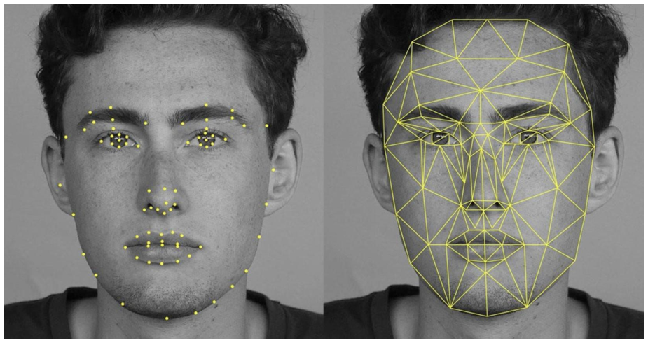
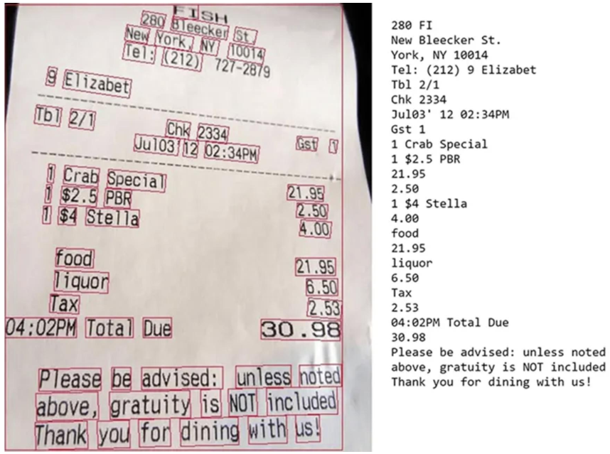
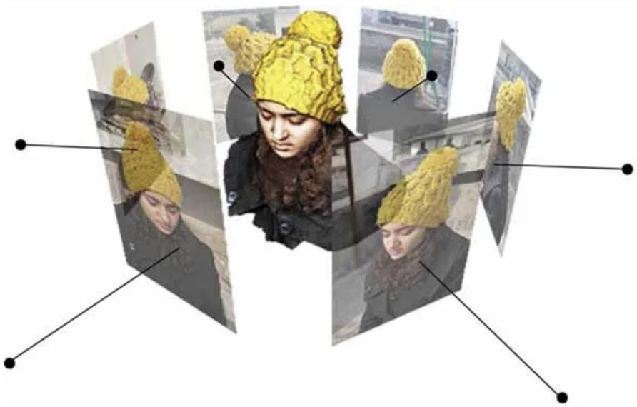

<!-- _class: cover -->

# XỬ LÝ ẢNH& THỊ GIÁC MÁY TÍNH

## Chương 5: Thị giác máy tính

### Giảng viên: Nguyễn Phồn Lữa

---

# Định nghĩa Thị giác máy tính(Computer Vision- CV)

- **Khái niệm:** Computer Vision (CV) là khoa học giúp máy tính "nhìn" và hiểu thế giới từ ảnh/video.
- **Đầu vào:** Pixel (ma trận số).
- **Đầu ra:** Thông tin có nghĩa (nhãn, vị trí, mô tả).
- **Mục tiêu tổng quát:** "Xây dựng hệ thống thị giác nhân tạo mạnh mẽ như con người".

---

# Mục tiêu của CV

- **Hiểu nội dung ảnh:** Xác định các đối tượng, cảnh, hành động, mối quan hệ không gian.
- **Trích xuất thông tin:** Chuyển dữ liệu thô (pixel) thành cấu trúc dữ liệu có nghĩa (tọa độ, nhãn, mô tả).
- **Ra quyết định dựa trên hình ảnh:** Ví dụ: Nhận diện biển báo để tự lái xe, phát hiện khối u trong ảnh y tế.
- **Khái quát hóa:** Hoạt động tốt trên nhiều điều kiện đầu vào khác nhau (thay đổi ánh sáng, góc nhìn, độ phân giải).

---

# Ví dụ ứng dụng CV

- **Đời sống hàng ngày:** Mở khóa khuôn mặt, tìm kiếm ảnh theo nội dung, lọc ảo (AR filter).
- **Y tế:** Phát hiện ung thư vú, phân loại bệnh võng mạc, hỗ trợ phẫu thuật robot.
- **Phương tiện tự hành:** Xe tự lái (phát hiện làn đường, người đi bộ), drone giao hàng.
- **Sản xuất:** Phát hiện lỗi sản phẩm, đọc mã vạch tốc độ cao.
- **An ninh:** Phát hiện hành vi bất thường, đếm người, phân tích dòng người.
- **Nông nghiệp:** Phát hiện sâu bệnh, đếm trái cây, ước tính sản lượng.
- **Thương mại điện tử:** Thử đồ ảo, tìm kiếm sản phẩm bằng ảnh chụp.

---
<!--_class: text-2xs-->

# So sánh Thị giác máy tính& Xử lý ảnh

| Khía cạnh          | Thị giác máy tính (Computer Vision)                          | Xử lý ảnh (Image Processing)                             |
| :----------------- | :----------------------------------------------------------- | :------------------------------------------------------- |
| **Mục đích**       | Suy luận về hình ảnh và hiểu nội dung.                       | Cải thiện chất lượng hình ảnh và thêm hiệu ứng.          |
| **Trọng tâm**      | Làm quen, phân loại và đưa ra phán đoán.                     | Khử nhiễu, tăng cường hình ảnh, phát hiện đặc trưng.     |
| **Kỹ thuật**       | Nhận dạng mẫu, học sâu (Deep Learning), phát hiện đối tượng. | Lọc, ngưỡng hóa (thresholding), các phép toán hình thái. |
| **Sự phụ thuộc**   | Phụ thuộc vào các hình ảnh đã được xử lý.                    | Có thể hoạt động độc lập hoặc đóng vai trò tiền xử lý.   |
| **Kết quả đầu ra** | Các phán đoán, phân loại, hành vi.                           | Hình ảnh đã được lọc và cải thiện để phân tích.          |
| **Độ phức tạp**    | Rất phức tạp, đòi hỏi huấn luyện trên tập dữ liệu lớn.       | Trung bình, dựa trên quy tắc hoặc thuật toán.            |

---

# Các bài toán cơ bản (1)

**1. Phân loại ảnh (Image Classification)**

- **Đầu vào:** Một ảnh.
- **Đầu ra:** Một nhãn duy nhất (từ tập các lớp xác định trước).
- **Ví dụ:** Ảnh chó → "Chó"; Ảnh mèo → "Mèo".

---

# Các bài toán cơ bản (2)

**2. Phát hiện đối tượng (Object Detection)**

- **Đầu vào:** Một ảnh.
- **Đầu ra:** Danh sách các đối tượng kèm vị trí (thường là bounding box) và nhãn.
- **Ví dụ:** Phát hiện người, xe đạp, ô tô trong ảnh giao thông.

<gap></gap>

---

# Các bài toán cơ bản (3)

**3. Phân đoạn ảnh (Image Segmentation)**

- **Phân đoạn ngữ nghĩa (Semantic Segmentation):** Gán nhãn cho từng pixel theo lớp đối tượng (ví dụ: pixel thuộc "đường", "vỉa hè").
- **Phân đoạn thể hiện (Instance Segmentation):** Phân biệt các thể hiện khác nhau của cùng một lớp (ví dụ: người A khác người B).
- **Phân đoạn toàn cảnh (Panoptic Segmentation):** Mở rộng của Instance Segmentation, bao gồm cả vật vô định hình (background).

---

# Các bài toán cơ bản (4)

**4. Phát hiện và mô tả điểm đặc trưng (Keypoint Detection & Description)**

- **Khái niệm:** Phát hiện các điểm đặc biệt (góc, cạnh, chấm) và xây dựng "dấu vân tay" (descriptor) cho điểm đó.
- **Ứng dụng:** Ghép ảnh (panorama), tái tạo 3D, theo dõi đối tượng.

<gap></gap>

---

# Các bài toán cơ bản (5)

**5. Nhận dạng và đọc chữ (OCR - Optical Character Recognition)**

- **Khái niệm:** Chuyển đổi văn bản trong ảnh thành mã ký tự có thể chỉnh sửa.
- **Ví dụ:** Đọc biển số xe, số hóa tài liệu, trích xuất thông tin từ hóa đơn.
<gap></gap>

---

# Các bài toán cơ bản (6)

**6. Tái tạo 3D từ ảnh (3D Reconstruction)**

- **Khái niệm:** Xây dựng mô hình 3D của vật thể/cảnh từ nhiều ảnh chụp từ các góc khác nhau.
- **Kỹ thuật chính:** Structure from Motion (SfM), Multi-view Stereo (MVS).
- **Ứng dụng:** Lập bản đồ 3D, di sản số (số hóa di tích), phim ảnh, thực tế ảo (VR/AR).
<gap></gap>

---
<!--_class: text-sm-->

# Machine Learning và Deep Learning trong CV

- **Cách tiếp cận cổ điển (trước 2012):**
  - Sử dụng kỹ thuật xử lý ảnh thủ công (SIFT, HOG, LBP) để trích xuất đặc trưng.
  - Sử dụng bộ phân loại cổ điển (SVM, Random Forest, AdaBoost).
  - **Hạn chế:** Đặc trưng do con người thiết kế không đủ tổng quát, khó mở rộng.
- **Machine Learning trong CV truyền thống:**
  - **Học có giám sát:** Cần ảnh có nhãn để huấn luyện.
  - **Kỹ thuật:** PCA, k-NN, HOG+SVM (phát hiện người đi bộ), Haar cascade (phát hiện mặt).
- **Deep Learning – Cuộc cách mạng CV (2012 đến nay):**
  - **Mạng nơ-ron tích chập (CNN):** Tự động học các đặc trưng từ thấp đến cao (cạnh → kết cấu → bộ phận → đối tượng).
  - **Kiến trúc tiêu biểu:** AlexNet, VGG, ResNet, YOLO, Mask R-CNN, Transformer (ViT).
  - **Điểm mạnh:** Độ chính xác vượt trội, không cần thiết kế đặc trưng thủ công, hoạt động tốt trên dữ liệu lớn.
  - **Yêu cầu:** Dữ liệu gán nhãn lớn, GPU mạnh, thời gian huấn luyện lâu.

---

# Một số mô hình Deep Learning

| Bài toán                       | Mô hình Deep Learning điển hình                |
| :----------------------------- | :--------------------------------------------- |
| **Classification** (Phân loại) | ResNet, EfficientNet, Vision Transformer (ViT) |
| **Detection** (Phát hiện)      | YOLO (v8, v9, v10), Faster R-CNN, DETR         |
| **Segmentation** (Phân đoạn)   | U-Net (y tế), Mask R-CNN, DeepLab              |
| **Keypoint** (Điểm đặc trưng)  | OpenPose, HRNet                                |
| **OCR** (Nhận dạng chữ)        | CRNN + CTC, TrOCR (Transformer)                |

---

# Ứng dụng thực tiễn

- **Đời sống hàng ngày:** Mở khóa khuôn mặt, tìm kiếm ảnh theo nội dung, lọc ảo (AR filter) trên Instagram, TikTok.
- **Y tế và chăm sóc sức khỏe:** Phát hiện ung thư vú từ ảnh X-quang, phân loại bệnh võng mạc, hỗ trợ phẫu thuật robot.
- **Phương tiện tự hành:** Xe tự lái (Tesla, Waymo) phát hiện làn đường, biển báo; Drone giao hàng tránh va chạm.
- **Sản xuất công nghiệp:** Phát hiện lỗi sản phẩm (vết xước, lắp ráp sai) trên băng chuyền, đọc mã vạch tốc độ cao.
- **An ninh và giám sát:** Phát hiện hành vi bất thường (ngã, xâm nhập), đếm người, phân tích dòng người.
- **Nông nghiệp:** Phát hiện sâu bệnh trên lá cây qua ảnh drone, đếm trái cây, ước tính sản lượng.
- **Thương mại điện tử:** Thử đồ ảo (kính mắt, giày dép), tìm kiếm sản phẩm bằng ảnh chụp.

---

# Quy trình xây dựng hệ thống CV

**1. Xác định bài toán**

- **Mô tả:** Mục tiêu kinh doanh/kỹ thuật, đầu vào và đầu ra mong muốn.
- **Ví dụ:** Phân loại sản phẩm (tốt/lỗi) từ ảnh chụp trên băng chuyền.

**2. Thu thập dữ liệu**
- **Mô tả:** Lấy ảnh từ camera, cảm biến, nguồn có sẵn. Chú ý đa dạng (góc, sáng, nhiễu).
- **Ví dụ:** Chụp 10.000 ảnh sản phẩm từ 3 camera khác nhau.

**3. Gán nhãn dữ liệu**
- **Mô tả:** Tạo ground truth (công cụ: LabelImg, CVAT, hoặc thuê dịch vụ).
- **Ví dụ:** Gán nhãn "tốt"/"lỗi" cho từng ảnh, vẽ bounding box vết lỗi nếu cần.

**4. Tiền xử lý**
- **Mô tả:** Resize, chuẩn hóa, augment (xoay, lật, thay đổi độ sáng).
- **Ví dụ:** Resize về 224x224, chuẩn hóa pixel về [0,1], thêm nhiễu Gaussian.
---

# Quy trình xây dựng hệ thống CV (tiếp)

**5. Xây dựng mô hình**
- **Mô tả:** Chọn kiến trúc, huấn luyện, tối ưu siêu tham số.
- **Ví dụ:** Dùng CNN pretrained ResNet50, fine-tune trên dữ liệu của mình.

**6. Đánh giá**
- **Mô tả:** Dùng tập kiểm tra, tính độ chính xác, precision, recall, F1, ROC.
- **Ví dụ:** Đạt độ chính xác 98% trên tập test, thời gian suy luận 20ms/ảnh.

**7. Triển khai & bảo trì**
- **Mô tả:** Đưa lên thiết bị nhúng/cloud, giám sát drift, cập nhật dữ liệu mới.
- **Ví dụ:** Triển khai trên Raspberry Pi + camera, kiểm tra định kỳ mỗi tháng.
---

# Công cụ và thư viện phổ biến

| Giai đoạn                    | Công cụ                          |
| :--------------------------- | :------------------------------- |
| **Xử lý ảnh**                | OpenCV, PIL, scikit-image        |
| **Machine learning cổ điển** | scikit-learn, XGBoost            |
| **Deep learning**            | TensorFlow, PyTorch, Keras       |
| **Gán nhãn**                 | LabelImg, CVAT, Makesense.ai     |
| **Triển khai**               | ONNX, TensorRT, OpenVINO, TFLite |
