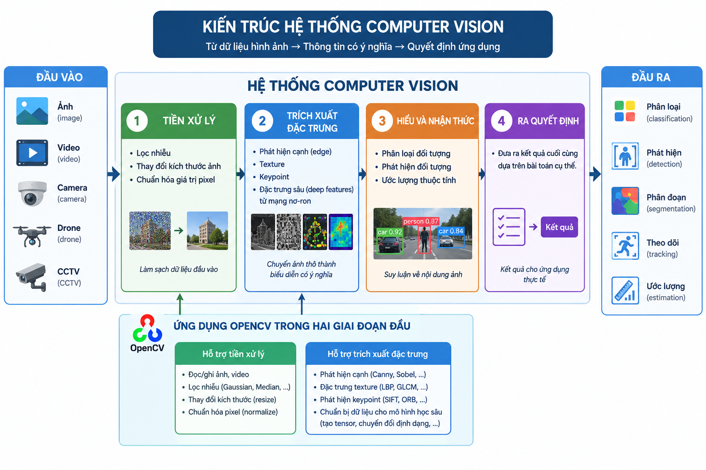
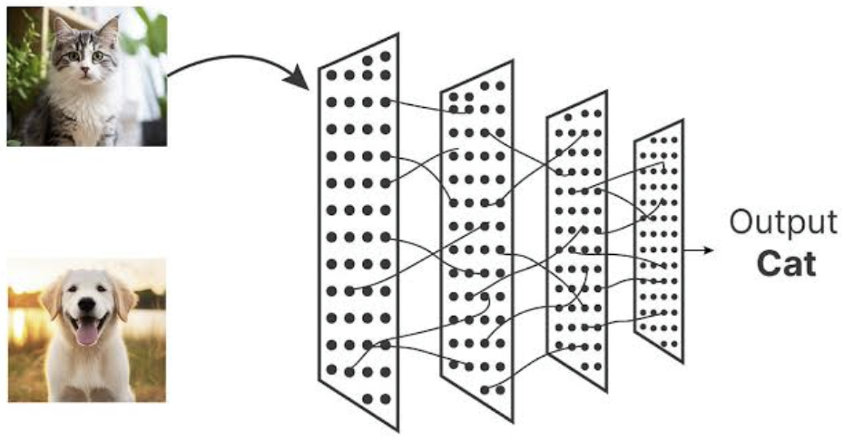
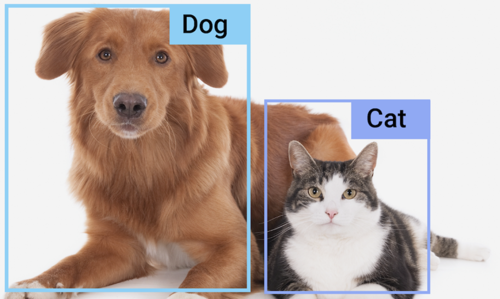
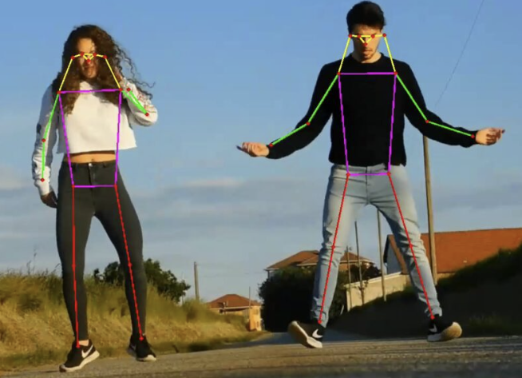
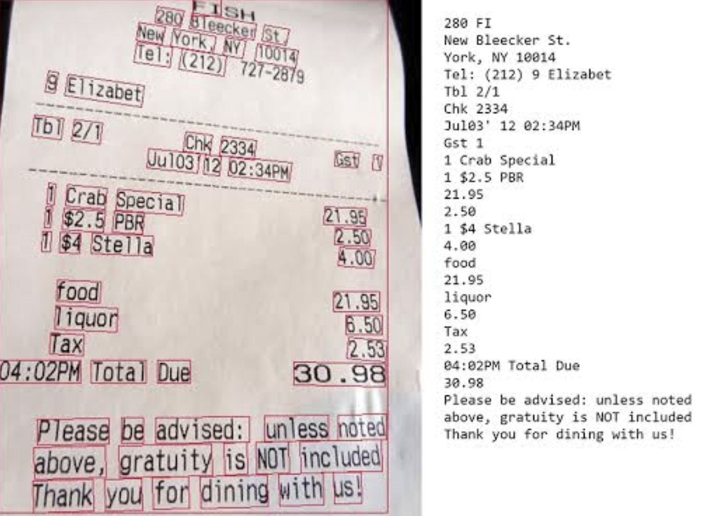
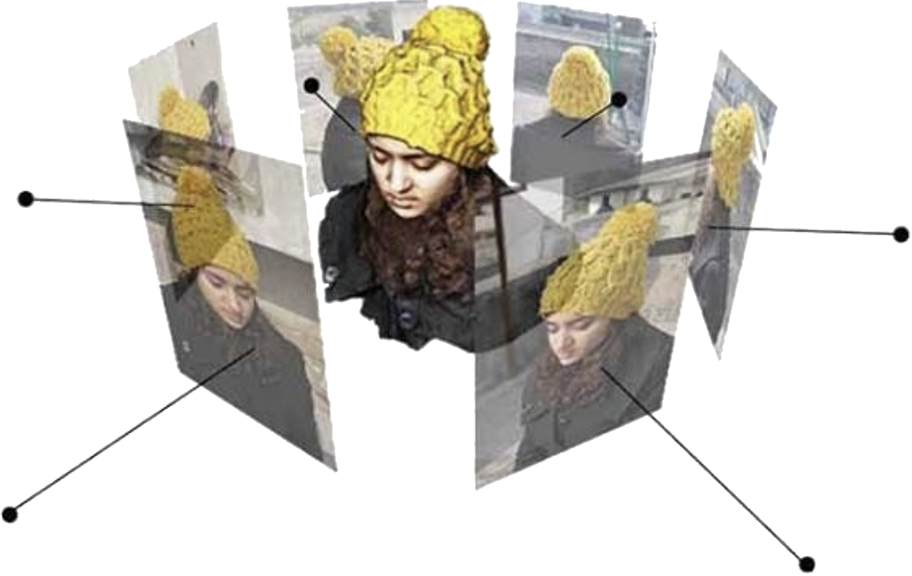

<!-- _class: cover -->

# XỬ LÝ ẢNH& THỊ GIÁC MÁY TÍNH

## Chương 5: Thị giác máy tính

### Giảng viên: Nguyễn Phồn Lữa

---
<!-- _class: toc -->

# Slide 2: Nội dung chương

- Tổng quan về Thị giác máy tính
- Các bài toán trong Thị giác máy tính
- Quy trình và công cụ
- Ứng dụng mô hình AI trong Thị giác máy tính

---
<!--_class: section-->

# Tổng quan về Thị giác máy tính

---
<!--_class: text-xs-->

# Định nghĩa Thị giác máy tính

- **Khái niệm**
  - **Computer Vision** (viết tắt **CV**) là khoa học giúp máy tính **"nhìn"** và **"hiểu"** thế giới từ ảnh hoặc video.
  - Mục tiêu là xây dựng hệ thống thị giác nhân tạo có khả năng cảm nhận và suy luận tương tự con người.

- **Đầu vào**
  - **Ảnh tĩnh:** ảnh JPG, PNG, ảnh y tế, ảnh vệ tinh.
  - **Video:** chuỗi frame từ camera, phim, nguồn trực tuyến.
  - **Camera thời gian thực:** webcam, camera an ninh, camera xe hơi.
  - **Cảm biến khác:** drone, điện thoại, CCTV, ảnh siêu âm.

- **Đầu ra**
  - **Nhãn (label):** phân loại đối tượng, ví dụ "đây là mèo" hoặc "đây là xe ô tô".
  - **Vị trí (location):** tọa độ, bounding box, mask phân đoạn.
  - **Mô tả (description):** văn bản mô tả nội dung ảnh.
  - **Số liệu đo lường:** khoảng cách, tốc độ, kích thước đối tượng.
- **Nguyên lý cốt lõi**
  - Đầu vào là **pixel**, tức ma trận số.
  - Đầu ra là **thông tin có nghĩa**, tức nhãn, vị trí, mô tả.
  - Computer Vision là cầu nối chuyển đổi từ **dữ liệu thô** sang **tri thức**.

---
<!--_class: text-2xs-->

# Kiến trúc hệ thống Computer Vision

- **Sơ đồ tổng quát**
  - Đầu vào gồm ảnh, video, camera, drone, CCTV.
  - Hệ thống Computer Vision xử lý qua **bốn giai đoạn**.
  - Đầu ra là phân loại, phát hiện, phân đoạn, theo dõi, ước lượng.
- **Giai đoạn 1 - Tiền xử lý**
  - Lọc nhiễu, thay đổi kích thước ảnh, chuẩn hóa giá trị pixel.
  - Đây là bước làm sạch dữ liệu đầu vào.
- **Giai đoạn 2 - Trích xuất đặc trưng**
  - Phát hiện **cạnh**, **texture**, **keypoint**, hoặc **đặc trưng sâu** từ mạng nơ-ron.
  - Đây là bước chuyển ảnh thô thành biểu diễn có ý nghĩa.

- **Giai đoạn 3 - Hiểu và nhận thức**
  - Phân loại đối tượng, phát hiện đối tượng, ước lượng thuộc tính.
  - Đây là bước suy luận về nội dung ảnh.

- **Giai đoạn 4 - Ra quyết định**
  - Đưa ra kết quả cuối cùng dựa trên bài toán cụ thể.

---
<!--_class: text-xs-->

# Mục tiêu của Thị giác máy tính

- **Hiểu nội dung ảnh**
  - **Nhận dạng đối tượng:** xe, người, động vật, đồ vật.
  - **Nhận dạng cảnh:** đường phố, bãi biển, văn phòng.
  - **Nhận dạng hành động:** đi bộ, chạy, nhảy.
  - **Mối quan hệ không gian:** "người đứng trên xe", "mèo nằm dưới ghế".
- **Trích xuất thông tin**
  - Chuyển dữ liệu thô dạng **pixel** thành **cấu trúc dữ liệu có nghĩa**.
  - Đầu ra gồm **tọa độ**, **nhãn**, **mô tả**, và **số liệu đo lường**.

- **Ra quyết định dựa trên hình ảnh**
  - **Y tế:** nhận diện khối u để hỗ trợ chẩn đoán.
  - **Giao thông:** nhận diện biến báo để tự động lái xe.
  - **An ninh:** phát hiện xâm nhập để đưa ra cảnh báo.
- **Khái quát hóa**
  - Hoạt động tốt trên **nhiều điều kiện đầu vào khác nhau**.
  - **Ánh sáng thay đổi:** ngày và đêm.
  - **Góc nhìn khác nhau:** trên, xuống, ngang.
  - **Độ phân giải khác nhau:** ảnh nhỏ và ảnh lớn.
  - **Thời tiết:** mưa, nắng, sương mù.

---
<!--_class: text-sm-->
# Ứng dụng Computer Vision

- **Đời sống hàng ngày**
  - Mở khóa khuôn mặt **Face ID** trên điện thoại.
  - Tìm kiếm ảnh theo nội dung trong Google Photos.
- **Mạng xã hội**
  - Lọc ảo **AR** trên Instagram, TikTok.
  - Gợi ý ảnh dựa trên sở thích người dùng.
- **Y tế**
  - Phát hiện **ung thư vú** từ ảnh X-quang.
  - Phân loại **bệnh võng mạc** từ ảnh đáy mắt.
  - Hỗ trợ **phẫu thuật robot**.
- **Xe tự hành**
  - Phát hiện làn đường, người đi bộ, biển báo.
  - Drone giao hàng tự động tránh vật cản.

- **Sản xuất công nghiệp**
  - Phát hiện **lỗi sản phẩm** trên dây chuyền.
  - Đọc **mã vạch** tốc độ cao.
- **An ninh và giám sát**
  - Phát hiện **hành vi bất thường**.
  - Đếm người, phân tích dòng người.
- **Nông nghiệp**
  - Phát hiện **sâu bệnh** trên lá cây qua ảnh drone.
  - Đếm trái cây, ước tính sản lượng.
- **Thương mại điện tử**
  - **Thử đồ ảo:** kính mắt, giày dép.
  - Tìm kiếm sản phẩm bằng ảnh chụp.

---
<!--_class: text-2xs-->

# So sánh Computer Vision và Xử lý ảnh

| Khía cạnh | Computer Vision | Xử lý ảnh (Image Processing) |
|---|---|---|
| **Mục đích** | Suy luận, hiểu nội dung ảnh | Cải thiện chất lượng ảnh và thêm hiệu ứng |
| **Trọng tâm** | Nhận dạng, phân loại, đưa ra phán đoán | Khử nhiễu, tăng cường, phát hiện đặc trưng |
| **Kỹ thuật sử dụng** | Nhận dạng mẫu, học sâu, deep learning | Lọc, ngưỡng hóa, các phép toán hình thái học |
| **Sự phụ thuộc** | Phụ thuộc vào ảnh đã được xử lý | Có thể hoạt động độc lập hoặc đóng vai trò tiền xử lý |
| **Kết quả đầu ra** | Nhãn, phân loại, hành vi | Ảnh đã được lọc và cải thiện |
| **Độ phức tạp** | Rất phức tạp, đòi hỏi huấn luyện trên tập dữ liệu lớn | Trung bình, dựa trên quy tắc hoặc thuật toán |
| **Ví dụ tiêu biểu** | Face ID, xe tự hành, chẩn đoán y tế | Khử nhiễu, cân bằng histogram, phát hiện biên |

---
<!--_class: section-->

# Các bài toán trong Thị giác máy tính

---
<!--_class: text-sm-->

# Bài toán 1 - Phân loại ảnh (Classification)

- **Định nghĩa**
  - **Đầu vào:** một ảnh.
  - **Đầu ra:** một **nhãn duy nhất** từ tập lớp xác định trước.
- **Ví dụ minh họa**
  - Ảnh con chó cho ra nhãn **"Chó"**.
  - Ảnh con mèo cho ra nhãn **"Mèo"**.
  - Ảnh xe hơi cho ra nhãn **"Xe ô tô"**.
- **Đặc điểm của bài toán**
  - **Không quan tâm vị trí** đối tượng trong ảnh.
  - Chỉ cần biết ảnh này **thuộc lớp nào**.
  - Một ảnh cho ra **một nhãn duy nhất**, không có bounding box.

- **Ứng dụng thực tế**
  - Phân loại ảnh sản phẩm tốt hoặc lỗi.
  - Lọc ảnh không phù hợp.
  - Phân loại bệnh từ ảnh X-quang.
  - Nhận diện chữ số viết tay.

---
<!--_class: text-sm-->

# Bài toán 2 - Phát hiện đối tượng (Object Detection)

  

  

- **Định nghĩa**
  - **Đầu vào:** một ảnh.
  - **Đầu ra:** danh sách các đối tượng, mỗi đối tượng gồm **vị trí bounding box** và **nhãn lớp**.
- **Ví dụ minh họa**
  - Ảnh giao thông cho ra danh sách gồm người, xe đạp, ô tô, xe tải.
  - Mỗi đối tượng có **bounding box riêng biệt**.
- **Đặc điểm của bài toán**
  - Có thể có **nhiều đối tượng** trong cùng một ảnh.
  - Mỗi đối tượng có **bounding box riêng**.
  - Có thể có **nhiều lớp đối tượng** khác nhau.

  

  

  
  

- **Ứng dụng thực tế**
  - Xe tự hành phát hiện xe, người, biển báo.
  - An ninh đếm người, phát hiện xâm nhập.
  - Bán lẻ kiểm kê hàng hóa trên kệ.
  - Y tế phát hiện khối u và tổn thương.
  

  

---
<!--_class: text-2xs-->

# Bài toán 3 - Phân đoạn ảnh (Segmentation)

- **Định nghĩa**
  - **Đầu vào:** một ảnh.
  - **Đầu ra:** **mask cùng kích thước** với ảnh gốc, mỗi pixel được gán một nhãn.
- **Ba loại phân đoạn**
  - **Semantic Segmentation:** gán nhãn cho từng pixel theo **lớp**. Ví dụ pixel thuộc "đường" hoặc "vỉa hè".
  - **Instance Segmentation:** phân biệt các **thể hiện khác nhau** của cùng một lớp. Ví dụ người A khác người B.
  - **Panoptic Segmentation:** mở rộng của Instance, bao gồm cả **vật vô định hình** như background.

- **Đặc điểm của bài toán**
  - Đầu ra có **cùng kích thước** với đầu vào.
  - Mỗi pixel đều có **nhãn lớp**.
  - **Phức tạp hơn** Classification và Detection.
- **Ứng dụng thực tế**
  - Y tế phân đoạn khối u, tế bào, mạch máu.
  - Xe tự hành phân đoạn làn đường, vỉa hè, người.
  - Vệ tinh phân đoạn đường, sông, rừng.
  - Nhiếp ảnh xóa phông và tách nền tự động.

---
<!--_class: text-xs-->

# Bài toán 4 - Phát hiện điểm đặc trưng

- **Định nghĩa**
  - Phát hiện điểm đặc trưng là tìm các **điểm đặc biệt** trong ảnh như **góc, cạnh, điểm chấm**.
  - Xây dựng **descriptor** (dấu vân tay) cho mỗi điểm.

- **Đặc điểm của điểm đặc trưng**
  - Có tính **bất biến** với scale, rotation, và ánh sáng.
  - Có thể **match** giữa các ảnh khác nhau.
  - Mỗi keypoint có một **descriptor** là vector mô tả vùng xung quanh.
- **Ứng dụng thực tế**
  - **Ghép ảnh panorama:** ghép nhiều ảnh thành một ảnh rộng.
  - **Tái tạo 3D:** xây dựng mô hình 3D từ nhiều ảnh.
  - **Object tracking:** theo dõi đối tượng qua các frame video.

---

# Bài toán 5 - Nhận dạng chữ (OCR)

- **Định nghĩa**
  - **OCR** (Optical Character Recognition) là bài toán chuyển **văn bản trong ảnh** thành **mã ký tự** có thể chỉnh sửa được.
- **Ví dụ minh họa**
  - Ảnh chụp biển số xe "29A-12345" cho ra chuỗi ký tự **"29A-12345"**.

- **Ứng dụng thực tế**
  - **Đọc biển số xe:** camera giao thông tự động ghi nhận.
  - **Số hóa tài liệu:** scan sách, hóa đơn thành văn bản.
  - **Trích xuất hóa đơn:** tự động nhập liệu kế toán.
  - **Hỗ trợ người khiếm thị:** đọc văn bản thành giọng nói.

---
<!--_class: text-sm-->

# Bài toán 6 - Tái tạo 3D

- **Định nghĩa**
  - Tái tạo 3D là bài toán xây dựng **mô hình 3D** của vật thể hoặc cảnh từ **nhiều ảnh** chụp từ các góc khác nhau.
- **Kỹ thuật chính**
  - **Structure from Motion (SfM):** tìm cấu trúc 3D của cảnh từ **chuyển động của camera**. Ứng dụng trong xây dựng bản đồ 3D và số hóa di tích.
  - **Multi-view Stereo (MVS):** từ nhiều ảnh chụp cùng vật thể để tạo **point cloud 3D**. Ứng dụng trong số hóa vật thể và hiệu ứng phim ảnh.

- **Ứng dụng thực tế**
  - Lập bản đồ 3D cho **Google Maps 3D**, bản đồ đô thị.
  - **Di sản số:** số hóa di tích, bảo tàng ảo.
  - **Phim ảnh:** tạo hiệu ứng CGI.
  - **VR/AR:** xây dựng môi trường ảo.

---
<!--_class: section-->

# Quy trình và công cụ

---

# Pipeline xây dựng hệ thống Computer Vision (1)

- **Bước 1 - Xác định bài toán**
  - Mô tả **mục tiêu kinh doanh hoặc kỹ thuật**.
  - Xác định **đầu vào** và **đầu ra mong muốn**.
  - Ví dụ: phân loại sản phẩm tốt hay lỗi từ ảnh chụp trên băng chuyền.
- **Bước 2 - Thu thập dữ liệu**
  - Lấy ảnh từ camera, cảm biến, hoặc nguồn có sẵn.
  - Chú ý tính **đa dạng** về góc, ánh sáng, nhiễu.
  - Ví dụ: chụp 10.000 ảnh sản phẩm từ 3 camera khác nhau.
- **Bước 3 - Gán nhãn dữ liệu**
  - Tạo **ground truth** bằng công cụ như LabelImg, CVAT, hoặc thuê dịch vụ.
  - Ví dụ: gán nhãn "tốt" hoặc "lỗi" cho từng ảnh, vẽ bounding box vết lỗi.
- **Bước 4 - Tiền xử lý**
  - Resize, chuẩn hóa, **augment** dữ liệu như xoay, lật, thay đổi độ sáng.
  - Ví dụ: resize về 224×224, chuẩn hóa pixel về khoảng 0 đến 1.
---

# Pipeline xây dựng hệ thống Computer Vision (2)

- **Bước 5 - Xây dựng mô hình**
  - Chọn kiến trúc, huấn luyện, tối ưu siêu tham số.
  - Ví dụ: dùng CNN pretrained **ResNet50** và fine-tune.
- **Bước 6 - Đánh giá**
  - Dùng tập kiểm tra, tính **accuracy, precision, recall, F1, ROC**.
  - Ví dụ: đạt độ chính xác 98% trên tập test, thời gian suy luận 20ms mỗi ảnh.
- **Bước 7 - Triển khai và bảo trì**
  - Đưa lên thiết bị nhúng hoặc cloud, giám sát **drift**, cập nhật dữ liệu mới.
  - Ví dụ: triển khai trên Raspberry Pi kèm camera, kiểm tra định kỳ mỗi tháng.
- **Lưu ý quan trọng**
  - **Bước 1 đến 4 chiếm khoảng 70% thời gian** của dự án.
  - **Dữ liệu quan trọng hơn mô hình**.

---

# Công cụ và thư viện phổ biến (1)

- **Xử lý ảnh**
  - **OpenCV:** thư viện đa năng cho xử lý ảnh và Computer Vision.
  - **PIL (Pillow):** xử lý ảnh cơ bản, thân thiện với người dùng.
  - **scikit-image:** thuật toán học thuật, dễ sử dụng cho nghiên cứu.
- **Machine Learning cổ điển**
  - **scikit-learn:** SVM, k-NN, decision tree, random forest.
  - **XGBoost:** gradient boosting cho phân loại và hồi quy.
- **Deep Learning**
  - **TensorFlow:** framework của Google, hỗ trợ triển khai production.
  - **PyTorch:** framework của Facebook, linh hoạt cho nghiên cứu.
  - **Keras:** API cấp cao, dễ sử dụng, chạy trên TensorFlow.

---

# Công cụ và thư viện phổ biến (2)

- **Gán nhãn dữ liệu**
  - **LabelImg:** gán nhãn bounding box cho detection.
  - **CVAT:** công cụ gán nhãn đa năng cho detection và segmentation.
  - **Makesense.ai:** công cụ trực tuyến, không cần cài đặt.
- **Triển khai**
  - **ONNX:** định dạng trung gian giữa các framework.
  - **TensorRT:** tối ưu cho GPU NVIDIA.
  - **OpenVINO:** tối ưu cho CPU và VPU Intel.
  - **TFLite:** tối ưu cho thiết bị di động.

---
<!--_class: section-->

# <!--fit--> Ứng dụng mô hình AI trong Thị giác máy tính

---
<!--_class: text-sm-->

# Mô hình AI là gì?

- **Định nghĩa**
  - **Mô hình AI** là một chương trình máy tính được **huấn luyện từ dữ liệu** để tự động đưa ra **dự đoán** hoặc **quyết định**.
- **Quy trình cơ bản**
  - **Dữ liệu huấn luyện** gồm các cặp ảnh và nhãn như "ảnh mèo" đi kèm nhãn "mèo", "ảnh chó" đi kèm nhãn "chó".
  - **Mô hình AI** học quy luật từ dữ liệu này.
  - Sau khi huấn luyện, mô hình có thể **dự đoán nhãn** cho ảnh mới.
- **So sánh với lập trình truyền thống**
  - **Lập trình truyền thống:** Con người **viết quy tắc**, máy **thực thi quy tắc**.
  - **Mô hình AI:** Con người **cung cấp dữ liệu**, máy **học quy tắc** từ dữ liệu.
- **Ba loại mô hình AI phổ biến trong Computer Vision**
  - **Classification:** phân loại ảnh thành một nhãn.
  - **Detection:** tìm đối tượng và vị trí trong ảnh. 
  - **Segmentation:** gán nhãn cho từng pixel trong ảnh.

---

# Ứng dụng AI trong Computer Vision theo lĩnh vực

- **Y tế**: Mô hình **U-Net** và **nnU-Net** dùng để phân đoạn khối u, mạch máu từ ảnh MRI và CT.
- **Xe tự hành**: Mô hình **YOLO** dùng để phát hiện làn đường, xe, người đi bộ theo thời gian thực.
- **An ninh**: Mô hình **RetinaFace** và **ArcFace** dùng cho nhận dạng khuôn mặt như Face ID.
- **Sản xuất**: Mô hình **EfficientNet** dùng để phát hiện lỗi sản phẩm trên dây chuyền.
- **Nông nghiệp**: Mô hình **YOLOv8** dùng để đếm trái cây và phát hiện sâu bệnh.
- **Thương mại điện tử**: Mô hình **CLIP** và **SAM** dùng để tìm kiếm ảnh theo văn bản và tách nền sản phẩm.
- **Giải trí**: Mô hình **OpenPose** và **MediaPipe** dùng cho AR filter và game điều khiển bằng cử chỉ.
- **Nhận dạng chữ**: Mô hình **TrOCR** dùng để đọc biển số xe và số hóa tài liệu.

---

# Mô hình Classification - AlexNet

- **Sự ra đời**
  - Công bố năm **2012** bởi Alex Krizhevsky, Ilya Sutskever và Geoffrey Hinton.
  - Thắng cuộc thi **ImageNet 2012** với độ chính xác vượt trội so với phương pháp truyền thống (85% so với 72% Top-5).
  - Đánh dấu **kỷ nguyên Học sâu** trong Thị giác máy tính.
- **Đặc điểm**
  - Mạng CNN **8 lớp** gồm 5 lớp convolution và 3 lớp fully-connected.
  - Sử dụng **ReLU** thay vì sigmoid để huấn luyện nhanh hơn.
  - Sử dụng **Dropout** để giảm overfitting.
  - Huấn luyện trên **2 GPU** song song, là đột phá về phần cứng thời bấy giờ.
- **Ứng dụng**
  - Phân loại ảnh trên tập dữ liệu lớn như ImageNet.
  - Là nền tảng cho các kiến trúc CNN hiện đại sau này.
  - Được dùng trong nghiên cứu lịch sử phát triển của Deep Learning.

---

# Mô hình Classification - VGG

- **Sự ra đời**
  - Công bố năm **2014** bởi nhóm Visual Geometry Group tại Đại học Oxford.
  - Đạt vị trí á quân trong cuộc thi **ImageNet 2014**.
  - Nổi tiếng với triết lý thiết kế **đơn giản mà hiệu quả**.
- **Đặc điểm**
  - Chỉ dùng **kernel 3×3** duy nhất, xếp chồng nhiều lớp.
  - Mạng rất sâu với hai phiên bản chính là **VGG-16** và **VGG-19**.
  - Kiến trúc **đối xứng**, dễ hiểu và dễ triển khai.
  - **Nhược điểm:** khoảng 140 triệu tham số, nặng và chậm.
- **Ứng dụng**
  - Trích xuất đặc trưng cho các bài toán detection và segmentation.
  - Làm nền cho các mô hình như **SSD**, **Faster R-CNN** phiên bản đầu.
  - Được dùng nhiều trong nghiên cứu và giảng dạy.

---

# Mô hình Classification - ResNet

- **Sự ra đời**
  - Công bố năm **2015** bởi nhóm Microsoft Research.
  - Thắng cuộc thi **ImageNet 2015** với độ chính xác vượt qua con người.
  - Giải quyết vấn đề **vanishing gradient** khi huấn luyện mạng rất sâu.
- **Đặc điểm**
  - Ý tưởng chính là **Skip Connection**, tức thêm đường tắt cho tín hiệu: `y = F(x) + x`.
  - Huấn luyện được mạng **rất sâu** với hơn 100 lớp.
  - Các phiên bản chính: **ResNet-18, ResNet-50, ResNet-101, ResNet-152**.
  - ResNet-50 có 25.6 triệu tham số, đạt **76.1%** ImageNet Top-1.
- **Ứng dụng**
  - Phân loại ảnh trên ImageNet, CIFAR, ảnh y tế.
  - **Trích xuất đặc trưng** làm nền cho detection và segmentation.
  - **Transfer Learning** với ResNet-50 là lựa chọn phổ biến nhất cho sinh viên.

---
<!--_class: text-sm-->

# Mô hình Classification - MobileNet

- **Sự ra đời**
  - Công bố năm **2017** bởi nhóm Google.
  - Thiết kế chuyên biệt cho **thiết bị di động** và **edge device**.
  - Giải quyết bài toán chạy mô hình AI trên thiết bị có tài nguyên hạn chế.
- **Đặc điểm**
  - Ý tưởng chính là **Depthwise Separable Convolution**, tách phép tích chập thành hai bước nhỏ.
  - Giảm **8 đến 9 lần** số phép tính so với convolution thông thường.
  - Các phiên bản: **MobileNetV1 năm 2017**, **MobileNetV2 năm 2018**, **MobileNetV3 năm 2019**.
  - Kích thước nhỏ, độ chính xác chấp nhận được.
- **Ứng dụng**
  - **Face ID** trên điện thoại di động.
  - **Google Lens** tìm kiếm bằng hình ảnh.
  - Các ứng dụng di động có tích hợp AI.
  - Thiết bị IoT, drone, camera an ninh thông minh.

---
<!--_class: text-sm-->

# Mô hình Classification - EfficientNet

- **Sự ra đời**
  - Công bố năm **2019** bởi nhóm Google Brain.
  - Đạt độ chính xác cao nhất trên ImageNet tại thời điểm công bố.
  - Giải quyết vấn đề mở rộng mạng một cách **cân bằng**.
- **Đặc điểm**
  - Ý tưởng chính là **Compound Scaling**, mở rộng mạng theo ba chiều: **độ sâu**, **độ rộng**, **độ phân giải**.
  - Các phiên bản: **EfficientNet-B0 đến EfficientNet-B7**.
  - EfficientNet-B0 có **5.3 triệu tham số**, đạt **77.1%** ImageNet Top-1.
  - EfficientNet-B7 có 66 triệu tham số, đạt **84.3%**.
- **Ứng dụng**
  - Phân loại ảnh với **ít tham số** nhưng chính xác cao.
  - Phù hợp triển khai trên **mobile** và **edge device**.
  - Phát hiện lỗi sản phẩm trong sản xuất công nghiệp.
  - Trích xuất đặc trưng cho các bài toán detection.

---
<!--_class: text-sm-->

# Mô hình Classification - Vision Transformer (ViT)

- **Sự ra đời**
  - Công bố năm **2020** bởi nhóm Google Research.
  - Đưa **Transformer** từ xử lý ngôn ngữ tự nhiên sang Computer Vision.
  - Mở ra kỷ nguyên mới cho các mô hình thị giác dựa trên attention.
- **Đặc điểm**
  - Ý tưởng chính là chia ảnh thành các **patch** nhỏ ví dụ 16×16.
  - Đưa các patch vào **Transformer** giống như xử lý từ trong câu văn.
  - Nhìn ảnh **toàn cục** qua tất cả patch, khác với CNN nhìn cục bộ.
  - Cần **dữ liệu rất lớn** để huấn luyện từ đầu nhưng đạt độ chính xác vượt trội khi đủ dữ liệu.
- **Ứng dụng**
  - Phân loại ảnh với các biến thể **ViT, DeiT, Swin Transformer**.
  - Phát hiện đối tượng với **DETR, DINO**.
  - Phân đoạn ảnh với **SegFormer, Mask2Former**.
  - Là nền tảng cho các Foundation Models hiện đại.

---
<!--_class: text-sm-->

# Mô hình Detection - Faster R-CNN

- **Sự ra đời**
  - Công bố năm **2015** bởi nhóm Microsoft Research.
  - Là bước tiến lớn sau R-CNN và Fast R-CNN.
  - Đặt nền móng cho các mô hình detection hiện đại.
- **Đặc điểm**
  - Ý tưởng chính là **Region Proposal Network (RPN)** đề xuất vùng có đối tượng.
  - Quy trình **hai giai đoạn**: ảnh đầu vào, RPN đề xuất khoảng 2000 vùng, classifier phân loại từng vùng.
  - Chính xác cao nhưng **chậm**, chỉ đạt 5 đến 7 FPS.
  - Phù hợp cho các bài toán cần độ chính xác hơn tốc độ.
- **Ứng dụng**
  - Phát hiện đối tượng trên server hoặc hệ thống offline.
  - Phát hiện khối u và tổn thương trong ảnh y tế.
  - Là thành phần cơ sở cho **Mask R-CNN** sau này.
  - Kiểm kê hàng hóa và phát hiện lỗi trong sản xuất.

---

# Mô hình Detection - YOLO

- **Sự ra đời**
  - Công bố năm **2015** bởi Joseph Redmon và cộng sự.
  - Tên đầy đủ là **You Only Look Once**, thể hiện triết lý xử lý một lần.
  - Là mô hình detection **một giai đoạn** đầu tiên đạt tốc độ real-time.
- **Đặc điểm**
  - Ý tưởng chính là chia ảnh thành **lưới S×S**, mỗi ô dự đoán bounding box và class.
  - Xử lý ảnh **một lần duy nhất** để phát hiện tất cả đối tượng.
  - Tốc độ **45+ FPS**, đủ nhanh cho các ứng dụng real-time.
  - Các phiên bản chính: **YOLOv1, YOLOv5, YOLOv8, YOLOv10**.
- **Ứng dụng**
  - Xe tự hành phát hiện làn đường, xe, người đi bộ.
  - Hệ thống an ninh đếm người và phát hiện xâm nhập.
  - Drone giao hàng tự động tránh vật cản.
  - Kiểm kê hàng hóa trong bán lẻ và sản xuất.

---

# Mô hình Detection và Segmentation - Mask R-CNN

- **Sự ra đời**
  - Công bố năm **2017** bởi nhóm Facebook AI Research (FAIR).
  - Được xem là "vua" của bài toán **Instance Segmentation**.
  - Mở rộng từ Faster R-CNN để giải quyết bài toán phân đoạn từng cá thể.
- **Đặc điểm**
  - Ý tưởng chính là **thêm một nhánh** dự đoán mask cho từng đối tượng.
  - Cho ra **ba đầu ra cùng lúc**: nhãn class, bounding box, và mask pixel-wise.
  - Phân biệt được **các cá thể riêng biệt** trong cùng một lớp.
  - Kết hợp ưu điểm của detection và segmentation.
- **Ứng dụng**
  - Đếm và tách từng cá thể, ví dụ người A khác người B.
  - Phân đoạn tế bào và mô trong ảnh y tế.
  - Chỉnh sửa ảnh: tách nền, xóa vật thể, thay nền.
  - Phân tích ảnh vệ tinh và ảnh nông nghiệp.

---

# Mô hình Segmentation - U-Net

- **Sự ra đời**
  - Công bố năm **2015** bởi Olaf Ronneberger và cộng sự tại Đại học Freiburg.
  - Được thiết kế ban đầu cho bài toán **phân đoạn ảnh y tế**.
  - Giành chiến thắng trong nhiều cuộc thi phân đoạn tế bào quốc tế.
- **Đặc điểm**
  - Kiến trúc hình chữ U gồm **encoder**, **bottleneck**, và **decoder**.
  - **Skip Connection** giữa encoder và decoder để chuyển chi tiết.
  - Đầu ra có **cùng kích thước** với ảnh gốc, mỗi pixel có một nhãn.
  - Hoạt động tốt với **ít dữ liệu huấn luyện**.
- **Ứng dụng**
  - Phân đoạn khối u, tế bào, mạch máu trong ảnh MRI và CT.
  - Phân đoạn đường, sông, rừng trong ảnh vệ tinh.
  - Phân đoạn làn đường và vỉa hè cho xe tự hành.
  - Xóa phông và tách nền tự động trong nhiếp ảnh.

---

# Mô hình Keypoint - OpenPose

- **Sự ra đời**
  - Công bố năm **2017** bởi nhóm Đại học Carnegie Mellon (CMU).
  - Là mô hình đầu tiên đạt **real-time multi-person pose estimation**.
  - Mở ra kỷ nguyên phân tích tư thế người trong Computer Vision.
- **Đặc điểm**
  - Phát hiện **tư thế người** bằng cách xác định vị trí các **khớp** trên cơ thể.
  - Số keypoint từ **17 đến 135** tùy phiên bản, bao gồm cơ thể, mặt, tay.
  - Xử lý được **nhiều người** trong cùng một khung hình.
  - Hoạt động real-time trên GPU phổ thông.
- **Ứng dụng**
  - **AR filter** trên Instagram, TikTok và các ứng dụng làm đẹp.
  - Phân tích động tác thể thao để huấn luyện vận động viên.
  - Game điều khiển bằng **cử chỉ cơ thể**.
  - Theo dõi tư thế trong y tế phục hồi chức năng.

---

# Mô hình OCR - TrOCR

- **Sự ra đời**
  - Công bố năm **2021** bởi nhóm Microsoft Research.
  - Tên đầy đủ là **Transformer-based OCR**.
  - Là mô hình OCR đầu tiên áp dụng **Transformer** thay vì CNN truyền thống.
- **Đặc điểm**
  - Kiến trúc **end-to-end**, không cần chia bước như OCR cổ điển.
  - Kết hợp **Vision Transformer** cho ảnh và **Text Transformer** cho văn bản.
  - Xử lý được **chữ viết tay**, chữ xoay, chữ nghiêng.
  - Hỗ trợ **đa ngôn ngữ** mà không cần template matching.
- **Ứng dụng**
  - Số hóa tài liệu, sách, và hóa đơn giấy.
  - Đọc **biển số xe** trong hệ thống giao thông thông minh.
  - Trích xuất thông tin từ hóa đơn và chứng từ kế toán.
  - Hỗ trợ người khiếm thị đọc văn bản.

---
<!--_class: text-xs-->

# Foundation Models - CLIP và SAM

- **CLIP - Contrastive Language-Image Pretraining**
  - **Sự ra đời:** công bố năm **2021** bởi OpenAI.
  - **Đặc điểm:** kết nối **ảnh và văn bản** trong cùng không gian vector. Hỗ trợ **zero-shot classification**, phân loại ảnh không cần huấn luyện. Chỉ cần mô tả bằng văn bản như "a photo of a cat" thì mô hình phân loại được.
  - **Ứng dụng:** tìm kiếm ảnh theo văn bản, tạo ảnh với DALL-E, gợi ý nội dung, lọc ảnh tự động.
- **SAM - Segment Anything Model**
  - **Sự ra đời:** công bố năm **2023** bởi Meta AI.
  - **Đặc điểm:** phân đoạn **mọi đối tượng** trong ảnh với **một click chuột** hoặc một điểm gợi ý. Huấn luyện trên **một tỷ mask**, dataset segmentation lớn nhất từ trước đến nay. Hoạt động **zero-shot** trên nhiều loại ảnh khác nhau.
  - **Ứng dụng:** chỉnh sửa ảnh chuyên nghiệp, tách nền tự động, phân đoạn ảnh y tế, robot tương tác với vật thể.
- **Xu hướng chung của Foundation Models**
  - Một mô hình **dùng cho nhiều bài toán** khác nhau mà không cần huấn luyện lại.
  - Được huấn luyện trên **dữ liệu khổng lồ** từ Internet.
  - Mở ra kỷ nguyên **AI tổng quát** cho Computer Vision.

---

# Hướng dẫn chọn mô hình

- **Bài toán đơn giản, ít dữ liệu**: Dùng Transfer Learning với **ResNet-50** hoặc **EfficientNet-B0**.
- **Cần chạy trên điện thoại**: Dùng **MobileNetV3** hoặc **EfficientNet-Lite**.
- **Cần phát hiện đối tượng real-time**: Dùng **YOLOv8** hoặc **YOLOv10**.
- **Cần chính xác cao, chạy offline**: Dùng **Faster R-CNN** hoặc **DETR**.
- **Bài toán ảnh y tế**: Dùng **U-Net** hoặc **nnU-Net**.
- **Bài toán instance segmentation**: Dùng **Mask R-CNN** hoặc **Mask2Former**.
- **Không có dữ liệu để huấn luyện**: Dùng **CLIP** với zero-shot hoặc **SAM**.
- **Nghiên cứu mới nhất**: Dùng **ViT** hoặc **Swin Transformer**.
- **Lời khuyên chọn mô hình**:
  - Bắt đầu với **ResNet-50 kết hợp Transfer Learning** vì dễ nhất và hiệu quả cao.
  - Thử **YOLOv8** nếu cần detection real-time.
  - Dùng **U-Net** cho bài toán phân đoạn y tế.
  - **Đừng cố huấn luyện từ đầu**, hãy dùng mô hình pretrained.

---
<!--_class: text-sm-->

# Transfer Learning - chiến lược thực tế

- **Vấn đề**
  - Huấn luyện mô hình AI từ đầu cần ba nguồn lực lớn:
  - **Triệu ảnh có nhãn** với chi phí rất tốn kém.
  - **GPU mạnh** với chi phí hàng nghìn USD.
  - **Nhiều ngày huấn luyện**.
  - Sinh viên, cá nhân, và doanh nghiệp nhỏ **không đủ nguồn lực**.
- **Giải pháp Transfer Learning**
  - Ý tưởng là **tận dụng kiến thức** mà mô hình đã học từ dataset khổng lồ ImageNet.
- **Quy trình bốn bước**
  - **Bước 1:** tải mô hình pretrained như ResNet50 đã học 1.2 triệu ảnh.
  - **Bước 2:** đóng băng các lớp đầu để giữ nguyên **kiến thức chung**.
  - **Bước 3:** thay lớp cuối bằng **lớp mới** cho bài toán của mình.
  - **Bước 4:** huấn luyện **chỉ lớp mới** trên dataset nhỏ của mình.
